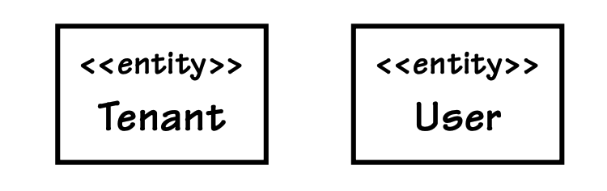
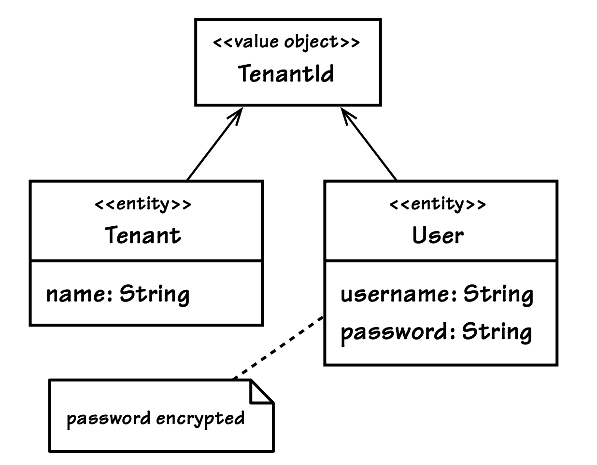
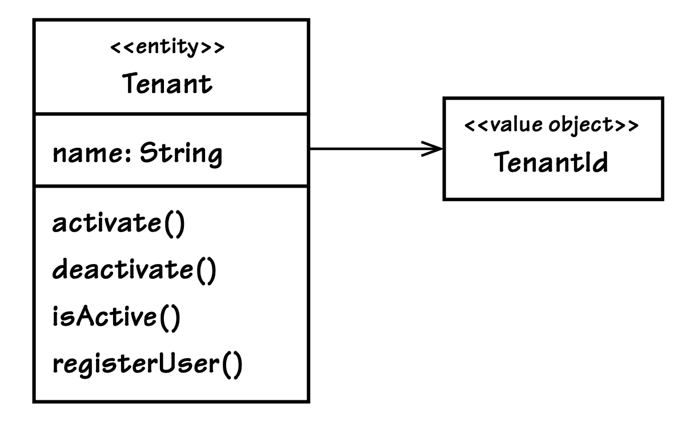
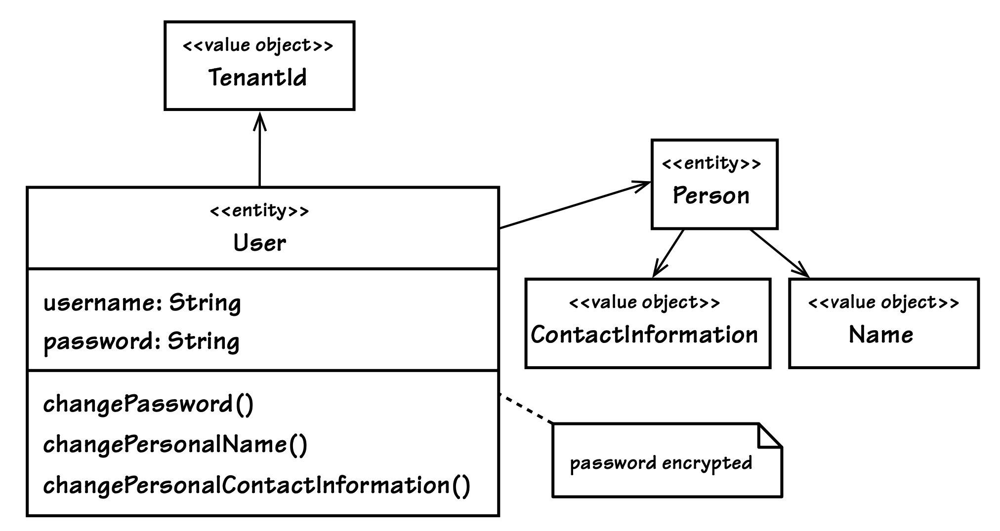
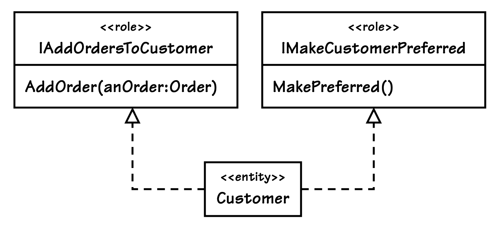
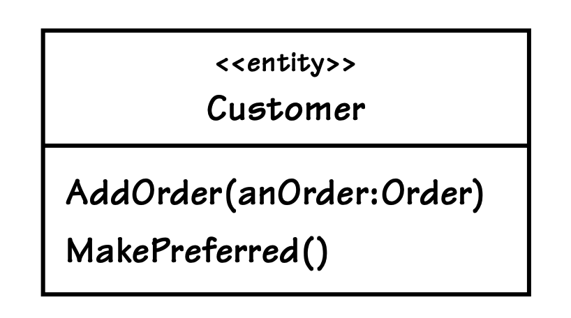

## 发现`Entities`及其内在特征

#### ▶[上一节](2.md)

现在，让我们看看 SaaSOvation 团队从实践中获得的一些经验教训……

---
</br>
起初，CollabOvation 团队陷入了在 Java 代码中大量进行实体–关系（ER）建模的陷阱。他们把过多的注意力放在数据库、表和列上，以及这些如何映射到对象中。这导致他们得到了一个在很大程度上是**贫血领域模型（Anemic Domain Model）** [[Fowler, Anemic](../bibli.md#fowler-anemic) 的设计，其中充斥着大量的 getter 和 setter 方法。他们本应该更多地从 DDD 的角度去思考。到了需要把安全相关的复杂逻辑从原有模型中拆分出来的时候（正如在 [Bounded Contexts (2)](../ch2/0.md) 中所描述的那样），他们已经学会了更加专注于对`Ubiquitous Language`进行建模。这带来了很好的结果。在本节中，我们将看到较新的`Identity and Access Context`团队是如何从这些经验教训中受益的。

---

在一个清晰划分的`Bounded Context`中，`Ubiquitous Language`为我们提供了设计领域模型所需的概念和术语。这种语言不会凭空出现，而是必须通过与领域专家的仔细讨论以及对需求的深入挖掘来逐步形成。在这个过程中，我们会发现一些作为事物名称的名词、描述事物特征的形容词，以及表示事物行为的动词。如果认为领域对象只能提炼为一组表示类名的名词和表示主要操作的动词，而忽略其他语言元素，那就错了。仅仅依靠这些有限的元素，无法捕捉到深层的领域洞察，也会限制模型应有的流畅性和丰富度。投入足够的讨论和对规格说明的反复审视，有助于形成一种体现了大量思考、努力、共识与折中方案的语言。最终，团队能够用完整的句子来表达这种语言，而模型也能清晰地反映出这种口头表达。

如果这些特殊的领域场景很重要，需要在团队讨论之外继续存在，就把它们记录在一份轻量级文档中。在早期阶段，你的`Ubiquitous Language`可以以术语表和一组简单的使用场景的形式呈现。然而，如果认为语言只由术语表和场景构成，那就又错了。最终，`Ubiquitous Language`是由你的代码来建模的，而文档往往很难（甚至不可能）与代码保持同步。

### 发现`Entities`与属性

让我们从一个非常基础的例子开始。在`Identity and Access Context`中，SaaSOvation 团队知道需要为一个 User 进行建模。诚然，这个建模示例并非来自 [Core Domain (2)](../ch2/0.md) ，但我们稍后会过渡到`Core Domain`的示例。现在，我希望先排除`Core Domain`固有的额外复杂性，只关注一个更基础的`Entity`。它本身就具有足够的建模挑战，足以作为一个有效的教学工具。

---
| ||
|---|---|
|以下是团队在简洁的软件需求中所了解到的关于 User 的内容（不是用例或用户故事），这些需求大致反映了`Ubiquitous Language`中的表述，但仍需要进一步细化：||

- 用户存在于某个租户的关联中，并受该租户控制。
- 系统用户必须经过身份验证。
- 用户拥有个人信息，包括姓名和联系方式。
- 用户的个人信息可以由用户本人或管理员修改。
- 用户的安全凭证（密码）可以被修改。

团队必须仔细阅读并认真聆听。他们一看到或听到 “change” 这个词的不同用法，就相当确定自己至少在处理一个`Entity`。当然，“change” 也可能意味着 “替换一个`Value`” ，而不是 “修改一个`Entity`”。那么，还有什么因素最终让团队确定应该使用哪种构建块呢？有的。关键术语是 *身份验证* ，这向团队强烈暗示，需要提供某种搜索解析机制。如果你有一堆对象，而需要从其中找到某一个，你就需要唯一标识来区分它和其他所有对象。一次搜索需要从与某个租户相关联的众多用户中，最终定位到单一的一个用户。

---

但是，关于 “租户控制用户” 的说法又该如何理解呢？这是否意味着真正的`Entity`是 Tenant（租户）而不是 User（用户）？这引出了关于 [Aggregates (10)](../ch10/0.md) 的讨论，我们将在那一章再详细展开。简而言之，答案是 “既是又不是”。是的，确实存在一个 Tenant `Entity`；但这并不意味着就不存在 User `Entity`。它们都是`Entities`。至于为什么 Tenant 和 User 是两个不同`Aggregates`的 [Roots (10)](../ch10/0.md) ，请参考那一章的内容。当然，User 和 Tenant 最终都是`Aggregates`类型，但团队在一开始会暂时避免这些问题。

这里的理由是：每个 User 都必须被唯一标识，能够清楚地区分于其他所有用户。同时，User 还必须支持随时间发生变化，因此它显然是一个`Entity`。此时，我们如何在 User 内部对个人信息进行建模并不重要。

---
团队需要花些精力来澄清第一条需求的含义：

- 用户存在于某个租户的关联中，并受该租户的控制。

起初，团队本可以只是添加一条注释，或以某种方式修改表述，以表明租户拥有用户，但 *并不收集并包含用户* 。团队必须小心，因为他们不想陷入技术和战术建模的细节中。这些表述需要让整个团队都能理解。他们最终确定为：

• 租户可以通过邀请方式注册多个用户。
• 租户可以处于激活状态，也可以被停用。
• 系统用户必须经过身份验证，但只有在租户处于激活状态时才能进行身份验证。
• …

嗯，这真是个惊喜！经过进一步讨论，团队不仅巧妙地解决了措辞问题，还让需求本身变得更有意义。他们发现，最初关于 “用户受租户控制” 的表述并不完整。事实是，用户是在某个租户内注册的，而且只能通过邀请注册。同样重要的是要说明：租户可以是激活的或停用的，并且用户只有在其所属租户处于激活状态时才能被认证。对一条需求的完整重述、另一条需求的补充，以及第三条需求的澄清，共同揭示了一个更准确的、符合实际业务流程的定义。

这项工作消除了任何关于“谁管理用户生命周期”的可能暗示，但清楚地表明：无论谁拥有用户，在特定情况下某些用户可能不可用。这些都是当时需要捕捉的重要场景。

在这一点上，他们似乎已经有了`Ubiquitous Language`术语表的雏形。不过，他们还没有足够的信息来充实这些定义。团队将再等待一段时间，再在术语表中填写具体内容。

他们已经确定了几个已知的`Entities`，如 [图 5.5](#figure-55) 所示。接下来重要的是要弄清楚他们将如何被唯一标识，以及在众多同类型对象中查找它们时可能还需要哪些附加属性。

#### Figure 5.5
</br>
*两个`Entities`：Tenant（租户）和 User（用户）这是在早期发现阶段得出的结果。*

团队决定使用完整的 UUID 来唯一标识每个租户（Tenant），这种情况下由应用程序自行生成该标识。使用这种较长的文本值是完全合理的，不仅因为它能保证唯一性，还因为它为每个订阅者增加了良好的安全性。任何人都很难通过随机生成 UUID 来作为访问专有数据的一级入口。

他们还意识到，有必要明确区分属于不同租户的`Entities`，把每个租户下的`Entities`与其他所有租户的`Entities`隔离开来。之所以要提出这样的需求，是为了解决租户订阅者（通常是相互竞争的企业）在使用托管应用和服务时存在的额外安全问题。因此，所有系统中的每个`Entity`都将被这个唯一标识 “标记”，并且无论查询什么`Entity`，都必须提供该唯一标识才能进行查找。

唯一的租户标识并不是一个`Entity`。它是某种类型的`Value`。问题在于：这个标识是否应该拥有一个专门的类型，还是可以继续作为一个简单的字符串（String）存在？

似乎没有必要在这个标识上建模 [Side-Effect-Free Functions (6)](../ch6/0.md) 。它只不过是一个大数的十六进制文本表示。但这个标识会被广泛使用，它将被设置在每个上下文中所有其他`Entities`上。在这种情况下，强类型可能更有利。通过定义一个 TenantId `Value Object`，团队可以更有信心地确保所有订阅者拥有的`Entities`都被正确的标识所标记。[图 5.6](#figure-56) 展示了这一建模方式，其中同时包含了 Tenant 和 User 两个`Entities`。

租户必须有一个名称。名称可以是一个简单的字符串属性，因为它没有特殊行为。名称有助于查询的解析。客服人员在提供帮助之前，需要通过名称找到对应的租户。这是一个必要的属性，也是一种 “内在特征”。名称也可能被约束为在所有订阅者中唯一，但这一点现在并不重要。

其他属性也可能与每个订阅者相关联，例如支持合同和呼叫激活 PIN、账单和支付信息，以及可能的业务地址和客户联系人。但这些都属于业务层面的关注点，不属于安全范畴。如果试图将`Identity and Access Context`扩展得太广，反而会适得其反。

#### Figure 5.6
</br>
*在发现并命名一个`Entity`之后，需要找出那些能够唯一标识它并使其可以被查找的属性/特性。*

支持（Support）将由另一个上下文管理。在通过名称找到租户之后，软件就可以使用其唯一的 TenantId。然后，这个 TenantId 可用于访问`Support Context`、`Billing Context`或`Customer Relationship Management Context`等。支持合同、业务地址和客户联系人等信息与安全几乎没有关系。尽管如此，将订阅者的名称与租户关联起来，仍能帮助支持人员快速提供所需的支持。因此，名称属于租户这一`Entity`。

在完成了 Tenant（租户）的核心部分之后，团队将注意力转向了 User（用户）`Entity`。什么应该作为它的唯一标识呢？大多数身份系统都支持唯一的用户名。只要用户名在租户内部是唯一的，它由什么组成并不重要。（用户名不需要跨租户唯一。）用户名可以由用户自行决定。如果订阅企业对用户名有特定的策略要求，或者用户名将由联邦安全集成来决定，那么由注册用户自行遵守即可。团队只是在 User 类上简单地声明了一个 username 属性。

有一条需求指出存在一种安全凭证（security credential），并说明这是一个密码（password）。团队采纳了这一术语，并在 User 类上声明了一个 password 属性。他们的结论是：密码绝不能以明文形式存储。团队还做了一个说明：密码必须加密。由于在将密码与 User 关联之前需要一种加密方式，这似乎需要某种 [Domain Service (7)](../ch7/0.md) 。于是，团队在`Ubiquitous Language`的术语表中创建了一个占位符，而这个术语表现在也可以正式启用了。虽然术语表的内容还很有限，但已经开始发挥作用：

- Tenant（租户）：一个具有名称的组织订阅者，可使用身份与访问服务以及其他在线服务。支持通过邀请方式进行用户注册。  
- User（用户）：租户内的注册安全主体，包含个人姓名和联系信息。用户拥有唯一的用户名和加密密码。  
- Encryption Service（加密服务）：提供对密码及其他不能以明文形式存储和使用的数据进行加密的手段。

还有一个问题：密码是否应被视为 User 唯一标识的一部分？毕竟，它也被用来查找 User。如果是这样，我们可能需要将这两个属性合并成一个`Whole Value`，并将其命名为类似 SecurityPrincipal 的概念。这会让这个概念更加明确。这是一个有趣的想法，但它忽略了一个重要的需求：密码是可以被修改的。此外，有些情况下服务需要在不提供密码的情况下查找 User。这并不是为了身份验证。（例如，当我们需要检查某个 User 是否拥有某个安全角色时，我们不能每次检查访问权限都要求提供密码。）因此，密码并不是身份的一部分。我们仍然可以在一次身份验证查询中同时包含用户名和密码。

创建一个 SecurityPrincipal 值类型的想法产生了一个值得考虑的建模方案，团队将其记录下来留待以后讨论。此外，还有一些其他概念尚未深入探讨，例如注册邀请将如何发送，以及个人姓名和联系信息的具体细节。团队将在下一次快速迭代中处理这些内容。

---

### 挖掘核心行为  

在识别出核心属性之后，团队可以开始研究必不可少的行为……  

---
在回顾了最初给出的基本需求之后，他们现在开始寻找 Tenant 和 User 的行为：  

- 租户可以处于激活状态，也可以被停用。

---

当我们考虑激活和停用租户（Tenant）时，很可能会联想到一个布尔值的开关。虽然事实确实如此，但它的具体实现方式在这里并不重要。如果我们在类图中将 active 放在 Tenant 的属性区域，这是否必然能向读者传达任何有用的信息？在 Tenant.java 中，下面这样的属性声明是否能清晰地表达意图？

```java
public class Tenant extends Entity {
    ...
    private boolean active;
    ...
```

可能并不完全能。而且一开始我们只想关注那些提供标识并支持查询匹配的属性/特性。这类支持性的细节我们会在之后再补充。

---
| ||
|---|---|
| 团队本可以决定声明一个 setActive(boolean) 方法，但这并不能真正体现需求中的术语。并不是说公共的 setter 方法永远不合适，而是只有在领域语言允许的情况下，并且通常只有在你不需要调用多个 setter 来完成一个单一请求时，才应该使用它们。多个 setter 会让意图变得模糊，也会让发布一个单一、有意义的`Domain Event`变得复杂，而这个事件本应该是某个单一逻辑命令的结果。||

为了符合领域语言，团队注意到领域专家会说 “激活”（activating）和 “停用”（deactivating）。为了融入这些术语，他们会改为定义 activate() 和 deactivate() 这样的操作。

下面的代码示例是一个`Intention Revealing Interface` [[Evans](../bibli.md#evans)] ，并且与团队正在形成的`Ubiquitous Language`保持一致：

```java
public class Tenant extends Entity {
    ...
    public void activate() {
         // TODO: implement
    }
    public void deactivate() {
        // TODO: implement
    }
    ...
```

为了让他们的想法更具体、可操作，团队首先编写了一个测试，来感受使用这些新行为时的体验：

```java
public class TenantTest ... {
    public void testActivateDeactivate() throws Exception {
        Tenant tenant = this.tenantFixture();
        assertTrue(tenant.isActive());

        tenant.deactivate();
        assertFalse(tenant.isActive());

        tenant.activate();
        assertTrue(tenant.isActive());
    }
}
```

在完成这个测试之后，团队对该接口的质量感到有信心。编写测试的过程让他们意识到还需要另一个方法 isActive()。最终他们确定了这三个新方法，如 [图 5.7](#figure-57) 所示。`Ubiquitous Language`术语表也随之扩展：

- 激活租户（Activate tenant）：通过此操作激活租户，并可确认当前状态。  
- 停用租户（Deactivate tenant）：通过此操作停用租户。当租户处于停用状态时，用户将无法进行身份验证。
- AuthenticationService（认证服务）：协调用户的认证过程，首先确保其所属租户处于激活状态。

#### Figure 5.7
</br>
*在第一次快速迭代中为 Tenant 分配了必不可少的行为。由于复杂性，有些行为被省略，但很快可以补充。*

这里新增的最后一个术语表条目表明又发现了一个`Domain Service`。在尝试匹配 User 实例之前，必须先检查 Tenant 的 isActive()。这一理解是在同时考虑以下需求时获得的：

- 系统用户必须经过身份验证，但只有在租户处于激活状态时才能进行身份验证。

由于身份验证不仅仅是查找与特定用户名和密码匹配的用户，因此需要一个更高级别的协调者。`Domain Services`非常适合承担这种职责。细节可以稍后再补充。目前，重要的是团队已经以 AuthenticationService 为名捕获了这一概念，并将其加入`Ubiquitous Language`。测试优先的方法确实带来了回报。

团队还考虑了以下需求：

- 租户允许通过邀请方式注册多个用户。

当他们开始仔细分析这一点时，发现它比他们在第一次快速迭代中想要处理的要复杂一些。似乎涉及某种 Invitation 对象，但需求并没有提供足够清晰的信息。管理邀请的行为也不够明确。因此，团队决定推迟对这部分的建模，直到能够从早期领域专家和客户那里获得更多输入。不过，他们确实定义了 registerUser() 方法，因为它对于创建 User 实例至关重要（参见本章后面的 [构造](#构造construction) 部分）。

于是，他们又回到了 User 类的设计上：

- 用户拥有个人信息，包括姓名和联系信息。  
- 用户的个人信息可以由用户本人或管理员修改。  
- 用户的安全凭证（密码）可以被修改。

User（用户）以及 Fundamental Identity（基本身份）这两种常用的安全模式被结合应用。<sup>[1](#1)</sup> 从 “personal”（个人）这一术语的使用可以看出，User 伴随有一个个人概念。团队根据前面的描述设计了它的组成和行为。

Person 被建模为一个独立的类，以避免将过多职责放在 User 上。“personal” 这个词促使团队将 Person 添加到`Ubiquitous Language`中：

- Person：包含并管理用户的个人数据，包括姓名和联系信息。

Person 是一个`Entity`还是一个`Value Object`？这里，“change”（变化）这个词再次成为关键。仅仅因为个人的工作电话号码可能发生变化，就替换整个 Person 对象似乎没有必要。因此，团队将其建模为一个`Entity`，如 [图 5.8](#figure-58) 所示。它包含两个`Values`：ContactInformation 和 Name 。这两个概念目前还比较模糊，随着时间的推移还需要进行重构。

在处理用户个人姓名和联系信息的变更时，团队进行了进一步的思考。是否应该让客户端直接访问 User 内部的 Person 对象？有开发人员提出疑问：User 是否一定是一个人？如果是外部系统怎么办？虽然当前情况并非如此，而且这可能是在为未知的未来需求提前做准备，但这种担忧是有价值的。如果让客户端直接访问 User 的结构，并通过导航到 Person 来执行行为，那么以后可能需要对客户端进行重构。

相反，如果他们将个人相关行为建模在 User 上，使其更适用于一般的安全主体，那么以后可能会避免一些连锁变更。在编写了一些示例测试来探索这个想法之后，他们认为这是正确的做法。于是，他们按照 [图 5.8](#figure-58) 所示的方式对 User 进行了建模。

#### Figure 5.8

*User 的基础行为引出了更多的关联。在不过度具体化的前提下，团队又建模了一些额外的对象及其操作。*

还有一些其他的考虑。团队是否应该完全暴露 Person，还是对所有客户端隐藏它？目前，他们决定暂时将 Person 暴露出来，以便查询信息。以后可以将这个访问器重新设计为服务于一个 Principal 接口，而 Person 和 System 都将成为专门的 Principal。随着理解的深入，团队将能够对这部分进行重构。

保持着他们的节奏，团队很快识别出当前正在考虑的最后一条需求所强调的`Ubiquitous Language`：

- 用户的安全凭证（密码）可以被修改。

User 拥有一个 changePassword() 行为。这反映了需求中使用的术语，并能让领域专家满意。即使是加密后的密码，也绝不会向客户端提供访问权限。一旦密码在 User 上设置完成，它就不会暴露到`Aggregate`边界之外。任何需要进行身份验证的操作都只能通过一种方式实现，即使用 AuthenticationService。

团队还决定：所有可能导致修改的行为，在成功执行后，都要发布一个特定的`Domain Event`作为结果。这一点同样属于团队在早期阶段并不想深入处理的细节。但他们确实意识到了事件的必要性。事件至少能实现两件事：第一，它们可以在所有对象的生命周期中支持变更追踪（后文将详细讨论）；第二，它们可以让外部订阅者与这些变更保持同步，从而使外部组件有可能实现更高的自治性。

---

这些主题将在 [Event (8)](../ch8/0.md) 和 [Integrating Bounded Contexts (13)](../ch13/0.md) 中讨论。

### 角色与职责

<ins>建模的一个方面是发现对象的角色和职责。角色与职责分析通常适用于所有领域对象</ins>。这里我们专门关注`Entities`的角色和职责。

我们需要为 *角色* 这个术语提供一些上下文。在讨论`Identity and Access Context`时，Role 是一个`Entity`和`Aggregate Root`，用于处理广泛的系统安全关注点。客户端可以询问某个用户是否属于或承担某个安全角色。这与我现在要讨论的内容完全不同。我在本节中讨论的是：模型中的对象如何角色。

#### 领域对象扮演多个角色

<ins>在面向对象编程中，通常由接口来决定实现类所承担的角色。设计正确时，一个类每实现一个接口，就承担一个角色。如果一个类没有显式声明任何角色 ——即它没有实现任何显式接口—— 那么默认情况下，它的角色就是它的类本身。也就是说，该类拥有由其所有公共方法构成的隐式接口</ins>。前面示例中的 User 类虽然没有实现任何显式接口，但它仍然扮演着一个角色：User。

我们可以让一个对象同时扮演 User 和 Person 这两个角色。并不是说我们建议这样做，只是现在先假设我们认为这是个好主意。如果真的这样设计，就没有必要再把一个独立的 Person 对象作为 User 对象的引用关联聚合进来。相反，只需要一个对象，它同时扮演两个角色。

我们为什么要这样做？通常是因为我们在两个或多个对象中既看到了相似之处，也看到了不同之处。这些重叠的特征可以通过在单个对象上融合多个接口来解决。例如，我们可以让一个对象同时是 User 和 Person，并将这个实现类命名为 HumanUser：

```java
public interface User {
    ...
}
public interface Person {
    ...
}
public class HumanUser implements User, Person {
    ...
}
```

这是否合理？有可能，但也可能让事情变得复杂。如果两个接口都很复杂，那么在一个对象中同时实现它们可能会很困难。此外，User 也可能是一个系统，这会把需要的接口增加到三个。设计一个同时扮演 User、Person 和 System 角色的单一对象会更加困难。或许我们可以通过创建一个通用的 Principal 来简化这种情况：

```java
public interface User {
    ...
}
public interface Principal {
    ...
}
public class UserPrincipal implements User, Principal {
    ...
}
```

采用这种设计时，我们试图在运行时确定实际的主体类型（晚期绑定）。人员主体（person principal）和系统主体（system principal）有不同的实现。系统并不需要与人员相同类型的联系信息。尽管如此，我们仍然可以尝试设计一个转发委托（forwarding delegation）实现。为此，我们会在运行时检查某种类型是否存在，并将调用委托给已存在的对象：

```java
public interface User {
    ...
}
public interface Principal {
    public Name principalName();
    ...
}
public class PersonPrincipal implements Principal {
    ...
}
public class SystemPrincipal implements Principal {
    ...
}
public class UserPrincipal implements User, Principal {
    private Principal personPrincipal;
    private Principal systemPrincipal;
    ...
    public Name principalName() {
        if (personPrincipal != null) {
            return personPrincipal.principalName();
        } else if (systemPrincipal != null) {
            return systemPrincipal.principalName();
        } else {
            throw new IllegalStateException(
                    "The principal is unknown.");
        }
    }
    ...
}
```

这种设计会带来各种问题。首先，它会遭受一种被称为 *对象精神分裂症（object schizophrenia）* 的困扰。<sup>[2](#2)</sup> 行为是通过一种叫做转发（forwarding）或调度（dispatching）的技术来委托的。无论是 personPrincipal 还是 systemPrincipal，都不会携带最初执行行为的那个`Entity` UserPrincipal 的身份标识。对象精神分裂症描述的是：被委托的对象并不知道它们来自哪个原始对象。在这些委托对象内部，会出现我到底是谁的困惑。并不是说这两个具体类中的每一个委托方法都需要获得基对象的身份，但有些方法确实可能需要。我们可以把 UserPrincipal 的引用传递进去，但这会让设计变得复杂，而且实际上还需要修改 Principal 接口。这可不是什么好事。正如 [[Gamma et al.](../bibli.md#gamma-et-al)] 中所说：“只有当委托带来的简化大于它所造成的复杂性时，它才是一个好的设计选择。”

我们不会在这里尝试解决这个建模难题。它只是用来说明在使用对象角色时有时会遇到的挑战，并强调这是一种我们需要谨慎使用的建模方式。借助合适的工具，例如 Qi4j [[Öberg](../bibli.md##öberg)] ，我们可以改善这种情况。

正如 Udi Dahan 在 [[Dahan, Roles](../bibli.md#dahan-roles)] 中所倡导的，将角色接口设计得更细粒度可能会对这种情况有所帮助。下面是两条需求，它们使我们能够创建细粒度的接口：

- 为客户添加新订单。
- 将客户设为优先客户（达到此等级的条件未说明）。

Customer 类实现了两个细粒度的角色接口：IAddOrdersToCustomer 和 IMakeCustomerPreferred。正如在 [图 5.9](#figure-59) 中看到的，每个接口只定义了一个操作。我们甚至还可以实现其他接口，例如 IValidator。

正如在 [Aggregates (10)](../ch10/0.md) 中所讨论的，我们通常不会在 Customer 上聚合大量对象，例如它的所有订单。因此，我们将此视为一个合成 (synthetic) 示例，仅用于说明对象角色的使用方式。

#### Figure 5.9
</br>
*使用 C#.NET 命名约定，Customer `Entity`实现了两个对象角色：IAddOrdersToCustomer 和 IMakeCustomerPreferred。*

I 作为接口名称前缀是 .NET 编程中广泛使用的一种风格。除了总体上遵循 .NET 的命名方式之外，有些人认为它还能提升可读性，例如：“I add orders to customer” 和 “I make customer preferred”。如果没有 I 前缀，这些以动词为基础的名称可能就不那么理想了，比如 AddOrdersToCustomer 和 MakeCustomerPreferred。我们可能更习惯用名词或形容词来命名接口，当然也完全可以在这里采用这种更标准的方式。

考虑一下这种风格所带来的一些优点。一个`Entity`的角色可能会随着用例的不同而变化。当客户端需要向 Customer 添加新的 Order 实例时，它所扮演的角色与将 Customer 设为优先客户时是不同的。这种设计还有一个技术上的优势：不同的用例可能需要专门的获取策略。

```Java
IMakeCustomerPreferred customer =
    session.Get<IMakeCustomerPreferred>(customerId);
customer.MakePreferred();
...
IAddOrdersToCustomer customer =
    session.Get<IAddOrdersToCustomer>(customerId);
customer.AddOrder(order);
```

持久化机制会检查 Get<T>() 方法的参数化类型名 T，并根据该类型查找在基础设施中注册的关联获取策略。如果该接口恰好没有特殊的获取策略，则使用默认策略。通过执行获取策略，被识别的 Customer 对象会以特定用例所需的形式被加载。

我们可能会看到其技术价值，因为角色标记接口有助于启用幕后钩子。其他特定于用例的行为也可以与任何给定角色相关联，例如验证，从而在`Entity`修改被持久化时执行特定的验证器。

细粒度接口让实现类（例如 Customer）更容易在自身上实现行为。不需要将实现委托给单独的类，这有助于防止对象精神分裂症。

我们有理由问：按角色分离 Customer 的行为是否真的带来了明显的 *领域建模优势* ？将前面的 Customer 与 [图 5.10](#figure-510) 中的 Customer 进行比较：哪一个更好？客户端会不会更容易在应该调用 MakePreferred() 的时候错误地调用 AddOrder()？可能不会。但我们不应该仅根据这一点来判断这种设计方法。

#### Figure 5.10
</br>
*这里的 Customer 被建模为：之前分布在不同接口上的操作，现在被合并到`Entity`类的单一接口中。*

<ins>角色接口最实际、也最简单的用途，或许就是隐藏实现细节，避免它们从模型泄漏到客户端</ins>。我们可以通过设计一个接口，只暴露希望客户端使用的部分，而不暴露任何多余内容。实现类可以比接口复杂得多：它可能包含各种带有 getter 和 setter 的支持属性，也可能包含客户端永远不会看到的实现行为。例如，某个工具或框架可能会强制生成一些我们不希望客户端使用的公共方法。即便如此，领域模型的接口也不会受到这些不必要且可能糟糕的技术实现细节的影响。这无疑是一个显著的领域建模优势。

在做出任何设计选择时，都要确保`Ubiquitous Language`主导一切技术偏好。在 DDD 中，最重要的是业务领域的模型，而不是技术实现。

### 构造（Construction）

<ins>当我们新实例化一个`Entity`时，我们希望使用一个能够捕获足够状态的构造函数，以便完全标识该`Entity`并让客户端能够找到它。如果使用的是早期身份生成（early identity generation），那么一个设计良好的构造函数至少会将唯一标识作为参数。如果该`Entity`还可以通过其他方式查询（例如通过名称或描述），那么我们也会将这些信息作为构造函数的参数。</ins>

有时一个`Entity`会维护一个或多个不变量（invariant）。不变量是指在`Entity`的整个生命周期中，必须在事务上保持一致的状态。不变量是`Aggregate`需要关注的内容，但由于`Aggregate Root`始终是一个`Entity`，因此在这里提及。<ins>如果一个`Entity`的某个不变量需要依赖于某个被包含对象的非空状态，或者需要通过其他状态计算得出，那么这些状态都必须通过一个或多个构造函数参数来提供。</ins>

每个 User 对象都必须包含 tenantId、username、password 和 person。换句话说，在构造成功之后，这些声明的实例变量的引用绝不能为 null。User 的构造函数及其实例变量的 setter 方法会确保这一点：

```java
public class User extends Entity {
    ...
    protected User(TenantId aTenantId, String aUsername,
            String aPassword, Person aPerson) {
        this();
        this.setPassword(aPassword);
        this.setPerson(aPerson);
        this.setTenantId(aTenantId);
        this.setUsername(aUsername);
        this.initialize();
    }
    ...
    protected void setPassword(String aPassword) {
        if (aPassword == null) {
            throw new IllegalArgumentException(
                   "The password may not be set to null.");
}
        this.password = aPassword;
    }

    protected void setPerson(Person aPerson) {
        if (aPerson == null) {
            throw new IllegalArgumentException(
                    "The person may not be set to null.");
}
        this.person = aPerson;
    }

    protected void setTenantId(TenantId aTenantId) {
        if (aTenantId == null) {
            throw new IllegalArgumentException(
                    "The tenantId may not be set to null.");
}
        this.tenantId = aTenantId;
    }

    protected void setUsername(String aUsername) {
        if (this.username != null) {
            throw new IllegalStateException(
                    "The username may not be changed.");
        }
        if (aUsername == null) {
            throw new IllegalArgumentException(
                    "The username may not be set to null.");
        }
        this.username = aUsername;
    }
    ...
}
```

<ins>User 类的设计展示了自封装（self-encapsulation）的强大能力。构造函数将实例变量的赋值委托给它自己内部的属性（attribute/property）setter 方法，这些方法为变量提供了自封装。自封装使每个 setter 能够为设置某一部分状态确定适当的契约条件。每个 setter 都会单独代表`Entity`断言一个非空约束，从而强制执行实例契约。这些断言被称为 *守卫（guards）* （见 [验证](#验证validation) 部分）。正如前面 [标识稳定性](2.md#标识稳定性identity-stability) 一节所指出的，这些 setter 方法的自封装技术可以根据需要变得更加复杂。</ins>

对于复杂的`Entity`实例化，应使用`Factory`。这一点在 [Factory (11)](../ch11/0.md) 中有更详细的介绍。在前面的示例中，你是否注意到 User 的构造函数具有 protected 可见性？Tenant `Entity`担任 User 实例的`Factory`，并且只有同一个`Module`中的类才能看到 User 的构造函数。这样一来，除了 Tenant 之外，任何对象都不能创建 User 实例：

```java
public class Tenant extends Entity  {
    ...
    public User registerUser(
            String aUsername,
            String aPassword,
            Person aPerson) {

        aPerson.setTenantId(this.tenantId());

        User user =
                new User(
                    this.tenantId(),
                    aUsername,
                    aPassword,
                    aPerson);
        return user;
    }
    ...
}
```

这里的 registerUser() 方法就是`Factory`。该`Factory`简化了 User 默认状态的构造，并确保 User 和 Person 两个`Entity`的 TenantId 始终正确。这一切都在一个符合`Ubiquitous Language`的工厂方法控制下完成。

### 验证（Validation）

<ins>在模型中使用验证的主要原因，是检查任何单个属性、整个对象或任何对象组合的正确性。我们在模型中考虑三个层次的验证</ins>。虽然有许多执行验证的方法，包括专门的框架和库，但这里不讨论这些。相反，我们会介绍一些通用的方法，而这些方法也可以进一步扩展为更复杂的实现方式。

验证所完成的事情是多方面的。仅仅因为一个领域对象的所有属性在单独检查时都是有效的，并不意味着整个对象就是有效的。有时两个各自正确的属性组合在一起，反而会使整个对象失效。同样，仅仅因为单个对象整体有效，也不意味着由多个对象组成的组合就是有效的。可能两个`Entities`各自都处于有效的状态，但当它们组合在一起时，却会导致整个组合无效。因此，我们可能需要使用一个或多个层次的验证来解决所有可能出现的问题。

#### 验证属性（Validating Attributes/Properties）

我们如何防止单个属性（attribute 或 property）被设置为无效值？（关于两者的区别，请参见 [Value Objects (6)](../ch6/0.md) 。）<ins>正如本章及本书其他地方所讨论的，我强烈建议使用自封装（self-encapsulation）。自封装有助于实现第一种解决方案。</ins>

引用 Martin Fowler 的话：“自封装是指设计类时，使所有对数据的访问，即使是来自同一个类内部，都通过访问器方法进行。” [[Fowler, Self Encap](../bibli.md#fowler-self-encap)] 使用这种技术有几个优点。它允许对对象的实例变量（以及类变量/静态变量）进行抽象。它提供了一种从对象持有的任意数量的其他属性中轻松派生属性的方式。而且，对于这里的特定讨论尤为重要的是，它支持一种简单形式的验证。

实际上，我并不一定喜欢把通过自封装来保护对象状态正确性的做法称为 “验证” 。这个名称会让一些开发人员产生反感，因为他们认为验证是一个独立的关注点，应该由验证类负责，而不是由领域对象负责。我同意这一点。不过，我这里讨论的是略有不同的东西。<ins>我所说的是遵循 “契约式设计”（design-by-contract）方法的断言</ins>。

根据定义，<ins>契约式设计使我们能够为所设计的组件指定前置条件（preconditions）、后置条件（postconditions）和不变量（invariants）</ins>。这一思想由 Bertrand Meyer 提出，并在他的 Eiffel 编程语言中得到了充分体现。Java 和 C# 也有一定程度的支持，并且有一本相关著作 *《Design Patterns and Contracts》* [[Jezequel et al.](../bibli.md#jezequel-et-al)] 。这里我们只关注前置条件，通过应用守卫（guards）来作为一种验证形式：

```java
public final class EmailAddress {

    private String address;

    public EmailAddress(String anAddress) {
        super();
        this.setAddress(anAddress);
    }
    ...
    private void setAddress(String anAddress) {
        if (anAddress == null) {
            throw new IllegalArgumentException(
                    "The address may not be set to null.");
        }
        if (anAddress.length() == 0) {
            throw new IllegalArgumentException(
                    "The email address is required.");
        }
        if (anAddress.length() > 100) {
            throw new IllegalArgumentException(
                    "Email address must be 100 characters or less.");
        }
        if (!java.util.regex.Pattern.matches(
            "\\w+([-+.']\\w+)*@\\w+([-.]\\w+)*\\.\\w+([-.]\\w+)*",
                anAddress)) {
            throw new IllegalArgumentException(
                    "Email address and/or its format is invalid.");
        }
        this.address = anAddress;
    }
    ...
}
```

setAddress() 方法契约包含四个前置条件。所有前置条件守卫都会对参数 anAddress 进行断言：

- 参数不得为 null。
- 参数不得为空字符串。
- 参数长度必须为 100 个字符或更少（但不能为零个字符）。
- 参数必须符合电子邮件地址的基本格式。

下面是简体中文翻译：

如果所有这些前置条件都通过，则 address 属性会被设置为 anAddress 的值。如果有任何一个条件不满足，就会抛出 IllegalArgumentException。

EmailAddress 类不是一个`Entity`，它是一个`Value Object`。我们在这里使用它有几个原因。首先，它是一个很好的示例，展示了如何实现不同程度的前置条件守卫，从 null 检查一直到值的格式验证（下一节会详细说明）。其次，这个值对象会被 Person `Entity`作为其属性之一持有，只不过是通过 ContactInformation `Value`间接持有。因此，实际上它是`Entity`的一部分，就像在`Entity`类上声明的简单属性也是`Entity`的一部分一样。在为简单属性实现 setter 时，我们会使用完全相同类型的前置条件守卫。当一个`Whole Value`被赋给`Entity`的属性时，如果不对`Value`内部的较小属性进行守卫，就无法防止设置不合理的状态。

|牛仔逻辑||
|---|---|
|LB：“我以为我和老婆的争论是个有效的参数（合理的理由），结果她突然朝我抛出了一个非法参数异常。”||

下面是这段文本的简体中文翻译，我保持了原意的清晰和自然语气：

一些开发人员将这类前置条件检查称为 *防御式编程（defensive programming）* 。在模型中防止完全无效的值进入，当然属于防御式编程。不过，并不是所有人都认同这种守卫检查的细化程度。有些防御式编程者只赞成检查 null，甚至检查空字符串，但会回避检查字符串长度、数值范围、值格式等更细的条件。例如，有些人认为把值的长度检查交给数据库是最好的做法，他们觉得像最大字符串长度这类事情不属于领域模型对象的职责。然而，这些前置条件也可以被视为合理的 “合理性检查”（sanity checks）。

在某些情况下，检查字符串长度可能是不必要的。例如，当使用的数据库其 NVARCHAR 列的最大长度永远不会被超过时，就没有必要进行此类检查。Microsoft SQL Server 的文本列可以使用 max 关键字来声明：

```SQL
CREATE TABLE PERSON (
    ...
    CONTACT_INFORMATION_EMAIL_ADDRESS_ADDRESS
            NVARCHAR(max) NOT NULL,
    ...
) ON PRIMARY
GO
```

并不是说我们真的希望一个电子邮件地址长达 1,073,741,822 个字符。我们只是想声明一个足够大的列宽度，大到我们永远不用担心会超出它。

在某些数据库中，这可能无法实现。例如 MySQL 的最大行宽度为 65,535 字节。这里要注意，这是 *行宽度* ，不是列宽度。如果我们在一个表中声明哪怕一个 VARCHAR 列并把它设为最大宽度 65,535，那么这一行就没有空间再容纳其他任何列了。因此，根据表中 VARCHAR 列的数量，我们需要为每个列设置一个合理的、实际可用的宽度限制，以便所有列都能容纳在一行中。在这种情况下，我们可以将字符列声明为 TEXT 类型，因为 TEXT 和 BLOB 列是存储在独立的段中的。因此，根据所使用的数据库不同，可能存在一些方法来规避列宽度限制，并减少在模型中进行字符串长度检查的必要性。

如果存在溢出列的潜在风险，那么在模型中进行一个简单的字符串长度检查是必要的。将下面这种数据库错误翻译成有意义的领域错误，会是多么不切实际呢？
```
ORA-01401: inserted value too large for column
```

我们甚至无法确定是哪一列发生了溢出。因此，最好通过在 setter 的前置条件中检查文本长度来完全避免这个问题。此外，长度检查并不一定只是为了数据库列约束。最终，领域本身也可能因为非常合理的原因限制文本长度，例如我们需要集成的遗留系统所施加的约束。

我们可能还需要考虑对高低范围进行检查，甚至可能需要其他类型的检查。即使是像电子邮件地址格式这样的简单格式检查，也有其意义，如果我们希望防止完全不合理的值与`Entity`关联的话。当然，如果单个`Entity`的基本值都是合理的，那么对整个对象以及对象组合执行粗粒度验证就会变得更加容易。

#### 验证整个对象  

即使一个`Entity`的所有属性都完全有效，也并不意味着整个`Entity`就是有效的。要验证整个`Entity`，我们需要访问整个对象的状态 —— 包括它的所有属性。同时，我们还需要一个用于验证的`Specification` [[Evans & Fowler, Spec](../bibli.md#evans--fowler-spec)] 或`Strategy` [[Gamma et al.](../bibli.md#gamma-et-al)] 。

<ins>在他的 *检查模式语言（Checks pattern language）* 中，Ward Cunningham [[Cunningham, Checks](../bibli.md#cunningham-checks)] 探讨了多种验证方法。其中一种适用于整个对象的有用方法是 *延迟验证（Deferred Validation）* 。Ward 说，这是 “一类应该推迟到最后可能时刻才进行的检查”。之所以要延迟，是因为它属于一种非常细致的验证，需要对至少一个复杂对象，甚至是对象组合进行全面检查。因此，我们稍后还会将延迟验证作为处理更大规模对象组合的一种手段来讨论。在本节中，我将验证限制在 Ward 所说的 “较简单操作的检查” 范围内。</ins>

因为`Entity`的整个状态都必须对验证可见，所以有些人会认为这是将验证处理逻辑直接嵌入`Entity`内部的好时机。但在这里要谨慎。很多时候，领域对象的验证逻辑比领域对象本身变化得更频繁。把验证逻辑嵌入`Entity`也会让它承担过多职责。`Entity`已经负责在维护自身状态的同时处理领域行为。

验证类可以实现 **Specification 模式** 或 **Strategy 模式**。如果它检测到无效状态，它会通知客户端，或者以其他方式记录结果，以便稍后查看（例如在批处理之后）。验证过程非常重要的一点是要收集完整的结果集，而不是在遇到第一个问题时就抛出异常。请考虑以下可复用的抽象验证器及其具体子类：

```java
public abstract class Validator {
    private ValidationNotificationHandler notificationHandler;
    ...
    public Validator(ValidationNotificationHandler aHandler) {
        super();
        this.setNotificationHandler(aHandler);
    }

    public abstract void validate();

    protected ValidationNotificationHandler notificationHandler() {
        return this.notificationHandler;
    }

    private void setNotificationHandler(
            ValidationNotificationHandler aHandler) {
        this.notificationHandler = aHandler;
    }
}

public class WarbleValidator extends Validator {

    private Warble warble;

    public Validator(
            Warble aWarble,
            ValidationNotificationHandler aHandler) {
        super(aHandler);
        this.setWarble(aWarble);
    }
    ...
    public void validate() {
        if (this.hasWarpedWarbleCondition(this.warble())) {
            this.notificationHandler().handleError(
                    "The warble is warped.");
        }
        if (this.hasWackyWarbleState(this.warble())) {
            this.notificationHandler().handleError(
                    "The warble has a wacky state.");
        }
        ... 
    }
}
```

WarbleValidator 是通过一个 ValidationNotificationHandler 实例化的。每当遇到无效条件时，就会请求 ValidationNotificationHandler 来处理该条件。ValidationNotificationHandler 是一个通用的实现，它具有一个 handleError() 方法，该方法接受一个字符串类型的通知消息。我们也可以创建专门的实现，为每种不同的无效条件提供不同的处理方法：

```java
class WarbleValidator extends Validator {
    ...
    public void validate() {
        if (this.hasWarpedWarbleCondition(this.warble())) {
            this.notificationHandler().handleWarpedWarble();
        }
        if (this.hasWackyWarbleState(this.warble())) {
            this.notificationHandler().handleWackyWarbleState();
        }
    }
    ... 
}
```

<ins>这样做的好处是，不会将错误消息、消息属性键或任何与通知相关的特定内容耦合到验证过程中。更好的做法是，将通知处理逻辑放在检查方法内部：</ins>

```java
class WarbleValidator extends Validator {
    ...
    public Validator(
            Warble aWarble,
            ValidationNotificationHandler aHandler) {
        super(aHandler);
        this.setWarble(aWarble);
    }
    ...
    public void validate() {
        this.checkForWarpedWarbleCondition();
        this.checkForWackyWarbleState();
        ...
    }
    ...
    protected checkForWarpedWarbleCondition() {
        if (this.warble()...) {
            this.warbleNotificationHandler().handleWarpedWarble();
        }
    }
    ...
    protected WarbleValidationNotificationHandler
          warbleNotificationHandler() {
        return (WarbleValidationNotificationHandler)
            this.notificationHandler();
    }
}
```

在这个例子中，我们使用了一个 Warble 专用的 ValidationNotificationHandler。它以标准类型传入，但在内部使用时会被强制转换为特定类型。模型需要自行确定它与客户端之间的契约，以确保客户端提供正确的类型。

客户端如何确保`Entity`验证被执行？验证处理又从哪里开始？

一种方法是在所有需要验证的`Entity`上放置一个 validate() 方法，这可以通过`Layer Supertype`来实现：

```java
public abstract class Entity
        extends IdentifiedDomainObject  {

    public Entity() {
        super();
    }

    public void validate(
        ValidationNotificationHandler aHandler) {
    }
}
```

任何`Entity`的子类都可以安全地调用其 validate() 方法。如果具体的`Entity`支持专门的验证，则会执行该验证；如果不支持，则该方法不会产生任何效果（no‑op）。如果只有部分`Entity`需要验证，那么最好只在那些需要的`Entity`上声明 validate() 方法。

然而，`Entities`真的应该自己验证自己吗？拥有自己的 validate() 方法并不意味着`Entity`本身要执行验证逻辑。但它确实允许`Entity`决定由验证 *什么* ，从而将这一关注点从客户端中解放出来：

```java
public class Warble extends Entity {
    ...
    @Override
    public void validate(ValidationNotificationHandler aHandler) {
        (new  WarbleValidator(this, aHandler)).validate();
    }
    ...
}
```

每个专门化的 Validator 子类都会根据需要执行任意数量的细粒度验证。`Entity`无需了解自身是如何被验证的，只需知道它可以被验证即可。独立的 Validator 子类还允许验证过程以与`Entity`不同的节奏变化，并使复杂的验证能够得到充分测试。

#### 验证对象组合  

我们可以将延迟验证（Deferred Validation）用于 Ward Cunningham 所说的 “更复杂的操作，这些操作不仅需要所有较简单活动的检查，还需要更多额外检查” 。在这里，我们不仅要确定单个`Entity`是否有效，还要确定一组或一个组合的`Entities`是否全部有效，包括一个或多个`Aggregate`实例。为了做到这一点，我们可以用适当数量的实例来实例化具体的 Validator 子类。但更好的做法可能是使用`Domain Service`来管理这类验证。`Domain Service`可以使用`Repositories`读取需要验证的`Aggregate`实例，然后分别或与其他实例组合对每个实例进行全面检查。

请判断验证是否在任何时候都是合适的。有时，一个`Aggregate`或一组`Aggregates`可能处于临时的、中间的状态。也许我们可以在聚合上建模一个状态（status）来表示这一点，从而避免在不适当的时机执行验证。当验证条件成熟时，模型可以通过发布一个`Domain Event`来通知客户端：

```java
public class SomeApplicationService ... {
    ...
    public void doWarbleUseCaseTask(...) {
        Warble warble =
            this.warbleRepository.warbleOfId(aWarbleId);
        DomainEventPublisher
            .instance()
            .subscribe(new DomainEventSubscriber<WarbleTransitioned>(){
                public void handleEvent(DomainEvent aDomainEvent) {
                     ValidationNotificationHandler handler = ...;
                     warble.validate(handler);
                     ...
                }
                public Class<WarbleTransitioned>
                        subscribedToEventType() {
                    return WarbleTransitioned.class;
                }
            });
    
        warble.performSomeMajorTransitioningBehavior();
    }
}
```

当客户端接收到 WarbleTransitioned 事件时，就表明现在可以进行验证了。在这之前，客户端应避免执行验证。

### 变更跟踪  

根据`Entity`的定义，并不需要跟踪其在生命周期内发生的所有状态变化。我们只需要支持它不断变化的状态即可。然而，有时领域专家会关心模型随时间推移而发生的重要事件。在这种情况下，跟踪`Entity`的特定变更会很有帮助。

实现准确且有用的变更跟踪，最实用的方式是使用`Domain Events`和`Event Store`。我们为领域专家关心的每个`Aggregate`上执行的每一个重要状态变更命令，创建一个唯一的事件类型。事件名称及其属性的组合，使变更记录变得明确。事件在命令方法完成时发布。订阅者会注册接收模型产生的所有事件，并在收到事件后将其保存到`Event Store`中。

领域专家可能并不关心模型的每一次变更，但技术团队无论如何都可能需要关心。这通常是出于技术原因，使用一种名为 [Event Sourcing (4)](../ch4/0.md) 的模式。

<center></center>

#### ▶[下一节](4.md)

---

#### 1
查看我的已发布模式：http://vaughnvernon.co/

#### 2
这里描述的是一个对象具有多重人格，并不是医学上的精神分裂症定义。这个容易混淆的名称背后的真正问题是对象身份混淆。

