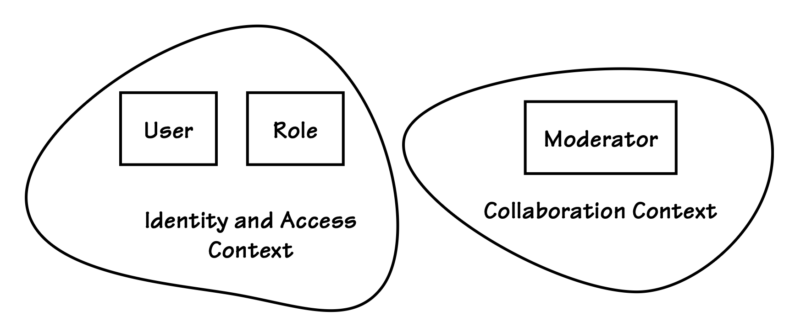
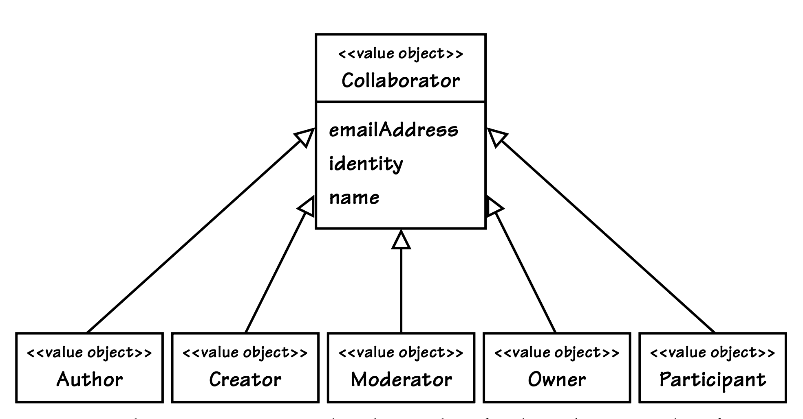

## 以极简方式集成

#### ▶[上一节](1.md)

在每个 DDD 项目中，总是存在多个`Bounded Contexts`，这意味着我们必须找到适当的方法来集成它们。<ins>在可能的情况下，当上游上下文的对象流入下游上下文时，应使用`Value`来建模下游上下文中的概念。通过这样做，你可以以极简方式简约为优先进行集成，也就是说，尽量减少你在下游模型中需要管理的 properties 数量。使用不可变`Values`可以减少你需要承担的责任。</ins>

---
➜**为什么要这样？**

使用不可变`Values`会让你承担更少的责任。

---

复用来自 [Bounded Contexts (2)](../ch2/0.md) 中的一个例子：回想一下，上游`Identity and Access Context`中的两个`Aggregates`会对下游`Collaboration Context`产生影响，如 [图 6.1](#figure-61) 所示。在`Identity and Access Context`中，这两个`Aggregates`是 User 和 Role。`Collaboration Context`关心的是某个特定 User 是否承担某个特定 Role，即 Moderator（版主）。`Collaboration Context`通过它的 [Anticorruption Layer (3)](../ch3/0.md) 来查询`Identity and Access Context`的 [Open Host Service (3)](../ch3/0.md) 。
如果基于集成的查询结果表明该特定用户确实承担 Moderator 角色，那么`Collaboration Context`就会创建一个代表对象，即 Moderator。

### Figure 6.1
 
*在其所在的上下文中，Moderator 对象是基于另一个上下文中 User 和 Role 的状态构建的。User 和 Role 是`Aggregates`，但 Moderator 却是一个`Value Object`。*

在 [图 6.2](#figure-62) 所示的 Collaborator 子类中，Moderator 被建模为一个`Value Object`。其实例是静态创建的，并与 Forum `Aggregate`相关联。重要的是，这最大限度地减少了上游`Identity and Access Context`中具有大量属性的多个`Aggregates`对`Collaboration Context`的影响。Moderator 只拥有少量自己的属性，却很好地表达了`Collaboration Context`中`Ubiquitous Language`的一个核心概念。此外，Moderator 类并不包含来自 Role `Aggregate`的任何属性；相反，类名本身就体现了用户所承担的 Moderator 角色。通过设计选择，Moderator 是一个静态创建的`Value`实例，并且不需要与远程的源上下文保持同步。这种经过谨慎选择的服务质量契约（quality-of-service contract），为消费它的上下文减轻了潜在的沉重负担。

当然，也存在这样的情况：下游上下文中的某个对象必须与远程上下文中一个或多个聚合的部分状态保持最终一致性（eventually consistent）。<ins>在这种情况下，我们就需要在下游消费上下文中设计一个`Aggregate`，因为`Entities`正是用来维护一条连续的变化线索的。但我们应该尽可能避免这种建模选择。只要可以，就应该选择`Value Objects`来为集成建模。这条建议在消费远程的标准类型（Standard Types）时同样适用。</ins>

#### Figure 6.2

*Collaborator 类层次结构由一系列`Value Objects`组成。它们只保留了来自上游上下文的少量 User 属性，而角色则通过类名本身明确表达出来。*

#### ▶[下一节](3.md)
