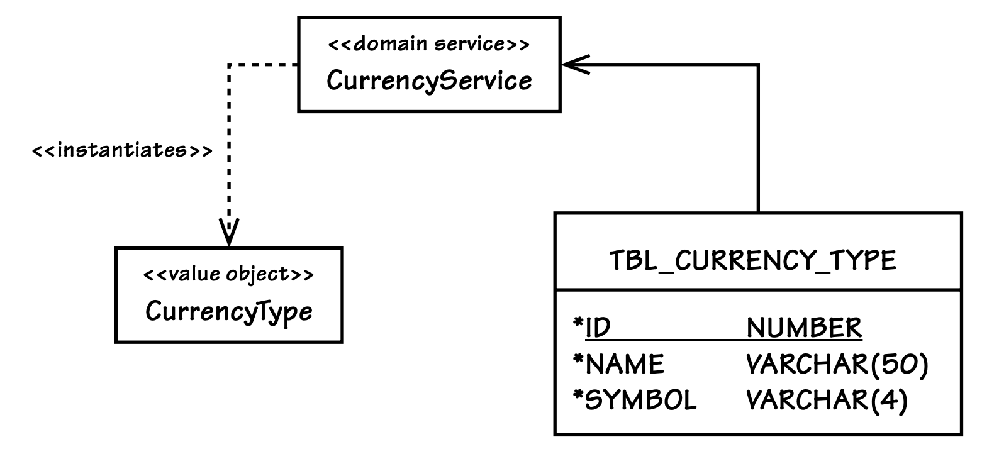

## 以`values`表达的标准类型

#### ▶[上一节](2.md)

在许多系统和应用中，都需要我所说的标准类型（Standard Types）。<ins>标准类型是一种描述性对象，用来表示事物的类型。系统中既有事物本身，可能是`Entity`，也可能是描述性的`Value`，也有用来区分它们的标准类型，以把它们和同类中的其他类型区分开</ins>。我不知道这个概念在行业里有没有标准名称，但我也听过有人把它叫作 *类型代码（type code）* 或 *查找表（lookup）* 。 *类型代码* 这个名字表达得并不清楚； *查找表* 又会让人疑惑：到底是在查找什么？我更喜欢标准类型这个名称，因为它更具描述性。为了让这个概念更清晰，我们来看几个用途。在某些情况下，它们会被建模为`Power Types`。

你的`Ubiquitous Language`定义了一个 PhoneNumber（`Value`），而每个电话号码还需要描述它的类型。“这个电话号码是家庭电话、移动电话、工作电话，还是其他类型？” 领域专家会这样问。那么，不同类型的电话号码应该被建模为一个类层次结构吗？如果为每种类型都创建一个单独的类，会让客户端在区分它们时变得更加困难。在这种情况下，你更可能希望使用一个标准类型（Standard Type）来描述电话的类型，例如 Home、Mobile、Work 或 Other。这些描述就代表了电话的标准类型。

正如我之前讨论的，在金融领域中，可能会有一个 Currency（`Value`）类型，用来约束 MonetaryValue 必须属于某个特定的世界货币。在这种情况下，标准类型（Standard Type）会为世界上的每种货币提供一个值，例如：AUD、CAD、CNY、EUR、GBP、JPY、USD 等等。在这里使用标准类型可以帮助你避免出现无效的货币类型。虽然仍然可能把错误的货币分配给 MonetaryValue，但至少不会出现不存在的货币。如果使用字符串属性，就可能把模型置于无效状态。例如，拼写错误的 “doolars” 就会引发一系列问题。

你可能正在制药领域工作，并为具有各种给药途径（administration routes）的药物进行建模。一种特定的药物（medication）是一个`Entity`，它具有很长的生命周期，其变化会随着时间被管理 —— 它会被概念化、研究、开发、测试、生产、改进，并最终停用。你可能会、也可能不会选择使用标准类型（Standard Types）来管理这些生命周期阶段。这些生命周期的转变完全可以在多个不同的`Bounded Contexts`中合理地进行管理。另一方面，每种药物针对患者的给药途径（directed patient administration route）可以通过标准类型描述来分类，例如：IV（静脉注射），Oral（口服）或 Topical（外用）

根据标准化程度的不同，这些类型可能只在应用程序内部维护，也可能被提升到企业共享数据库的重要级别，甚至可能通过国家或国际标准组织提供。标准化的程度有时会影响标准类型在模型内部的获取方式和使用方式。

我们可能会把这些对象看作`Entities`，因为它们在自己专属的、原生的`Bounded Context`中拥有独立的生命周期。<ins>但无论这些标准类型是由何种标准组织创建和维护的，只要有可能，我们都应该在消费它们的上下文中将其视为`Values`。这样做是合理的，因为它们的作用是度量和描述事物的类型，而度量与描述最适合建模为`Values`</ins>。此外，例如 {IV} 这个实例与其他任何 {IV} 实例都是完全相同的。它们显然是可互换的，这也意味着它们可以被替换，并且可以使用`Value`相等性。因此，如果你在自己的`Bounded Context`中不需要维护这些描述性类型的变化连续性，就应该将它们建模为`Values`。

为了便于维护，标准类型（Standard Types）通常会原生地驻留 (reside) 在一个与消费它们的模型不同的上下文中。在那个上下文中，它们是`Entities`，拥有带标识、名称和描述等属性的持久化生命周期。它们也可能还有其他属性，但在消费方上下文中最常用的就是上述这些。我们通常只使用其中之一。这是为了遵循以极简方式集成的目标。

举一个非常简单的例子，考虑对某组中的成员进行建模的标准类型（Standard Type），该组中存在两种类型。成员可能是用户，也可能本身就是组（即嵌套组）。下面这个 Java 枚举展示了支持这种标准类型的一种方式：

```Java
package com.saasovation.identityaccess.domain.model.identity;

public enum GroupMemberType {
    GROUP {
        public boolean isGroup() {
          return true;
        }
    },

    USER {
        public boolean isUser() {
          return true;
        }
    };

    public boolean isGroup() {
        return false;
    }

    public boolean isUser() {
        return false;
    }
}
```

一个 GroupMember `Value`实例是用一个特定的 GroupMemberType 来实例化的。举例来说，当一个 User 或 Group 被分配到某个 Group 时，被分配的`Aggregate`会被要求生成一个与自身对应的 GroupMember。下面是 User 类的 toGroupMember() 方法实现：

```Java
protected GroupMember toGroupMember() {
    GroupMember groupMember =
        new GroupMember(
            this.tenantId(),
            this.username(),
            GroupMemberType.USER); // enum standard type

    return groupMember;
}
```

<ins>使用 Java 枚举是支持标准类型（Standard Type）的一种非常简单的方式。枚举提供了一组定义良好的有限数量的`Values`（在本例中是两个），它非常轻量，并且按照约定具有`Side-Effect-Free Behavior`</ins>。但是，`Value`的文本描述在哪里呢？有两种可能的答案。通常情况下，并不需要为类型提供描述，只需要它的名称即可。为什么？因为文本描述通常只在 [User Interface Layer (14)](../ch14/0.md) 中有效，并且可以通过将类型名称与以视图为中心的属性（view-centric property）进行匹配来提供。很多时候，以视图为中心的 property 必须进行本地化（localized）（例如在多语言计算环境中），这使得在模型中支持它并不合适。<ins>因此，通常标准类型的名称本身就是在模型中使用的最佳属性</ins>。第二种答案是：有限的描述可以直接内置到枚举的状态名称中，例如 GROUP 和 USER。你可以使用每个类型的 toString() 方法来呈现这些描述性名称。但如果需要，也可以对每个类型的描述文本进行建模。

这个示例中的 Java 枚举标准类型，本质上也是一个优雅且无杂乱代码的`State`对象 [[Gamma et al.](../bibli.md#gamma-et-al)] 。在枚举声明的底部有两个方法，它们为所有状态实现了默认行为：`isGroup()` 和 `isUser()`。默认情况下，这两个方法都返回 `false`，这是合适的基本行为。然而，在每个状态定义中，这些方法都会被重写，以根据其特定状态返回相应的 `true`。当标准类型的状态为 `GROUP` 时，`isGroup()` 方法被重写为返回 `true`；当状态为 `USER` 时，`isUser()` 方法被重写为返回 `true`。状态的变更通过用另一个枚举值替换当前枚举值来实现。

这个枚举展示了一些非常基础的行为。根据领域的需要，`State`模式的实现可以更加复杂，例如添加更多由各个状态分别重写和特化的标准行为。就目前而言，它是一个`Value`类型的示例，其状态被限制在一组定义良好的常量中。一个重要的例子是 BacklogItemStatusType，它提供了 PLANNED、SCHEDULED、COMMITTED、DONE 和 REMOVED 等状态。我在三个示例`Bounded Contexts`中都使用了这种标准类型（Standard Type）的方式，因为我认为它能让这些上下文尽可能保持简单。

---

➜**State 模式被认为有害吗？**

有些人认为`State`模式并不那么理想。一个常见的抱怨是：需要为该类型所支持的每一种行为创建一个抽象实现（比如 `GroupMemberType` 底部的那两个方法），然后在某个`State`必须提供特殊实现时，再去重写这些行为。在 Java 中，这通常需要为抽象类型单独写一个类（通常放在单独的文件中），并且每个`State`也都要有一个类。不管你喜不喜欢，这就是`State`模式的常规做法。

我同意，当必须为每一个不同的`State`都开发一个独立的`State`类 ——再加上一个抽象类型时—— 这确实可能变成一团难以管理的乱麻。每个类中各自不同的行为，再加上可能从抽象类继承来的一些默认行为，容易导致子类之间紧耦合，并且类型之间的可读性变差。如果你有很多个`States`，这种负担会尤其沉重。<ins>然而，我认为使用 Java 枚举来实现`State`模式，是一种非常简单、甚至可能是更优的方式，可以用来产生一组标准类型。我觉得这种方式兼顾了两种思路的优点：你既得到了一个非常简单的标准类型，又有一种方式可以查询该标准当前所处的`State`。这让行为与类型保持内聚。对`State`行为加以限制，也让它更适合实际使用。</ins>

但即便如此，你仍然有可能连这种简单的`State`实现都不喜欢，这也只能说是各有所好。

---

如果你觉得不喜欢用 Java 枚举来支持标准类型（Standard Types），你完全可以为每种类型使用一个唯一的`Value`实例。不过，如果你主要是因为不喜欢使用`State`模式这个概念，那你也可以很轻松地把枚举当成一种优雅的标准类型支持方式，而不必把它看作`State`模式。毕竟，我可能是第一个把 “枚举即`State`” 这个想法灌输给你的人。话虽如此，除了枚举和`Values`这两种方式之外，实现标准类型还有其他一些替代方案。

作为一种替代方案，你可以把一个`Aggregate`当作标准类型（Standard Type）来使用，每种类型对应该聚合的一个实例。但在你真的这么做之前，请三思。标准类型通常不应该在消费它们的`Bounded Context`内部维护。被广泛使用的标准类型，通常应该放在一个单独的上下文里维护，并对各个消费方的更新进行非常谨慎的规划。或者，你也可以选择在消费方上下文中，把标准类型的`Aggregates`以不可变的形式暴露出来。但这时你要问问自己：一个不可变的`Entity`，按定义来说，还真的是`Entity`吗？如果你认为不是，那你就应该考虑把它建模为一个共享的不可变`Value Object`。

<ins>一个共享的不可变`Value Object`可以从一个隐藏的持久化存储中获取。如果它是通过标准类型 [Service (7)](../ch7/0.md) 或 [Factory (11)](../ch11/0.md) 获得的，那么这是一个可行的选择</ins>。如果采用这种方式，你很可能需要为每一组标准类型提供一个`Service`或`Factory`提供者（例如：一个用于电话号码类型，另一个用于邮政地址类型，还有一个用于货币类型），如 [图 6.3](#figure-63) 所示。在这两种情况下（无论是`Service`还是`Factory`），它们的具体实现都会在需要时访问持久化存储来获取这些共享`Values`，但客户端永远不会知道这些`Values`实际上存储在一个标准数据库中。使用`Service`或`Factory`来提供这些类型，还能让你轻松且安全地应用多种可行的缓存策略，因为这些`Values`从存储中读取后就是只读的，并且在系统中是不可变的。

<ins>归根结底，我认为在处理标准类型（Standard Types）时，最好倾向于使用枚举（enum），无论你是否真的把它看作一种`State`模式。如果你在同一个类别中有许多可能的标准类型实例，可以考虑通过代码生成来生成枚举</ins>。例如，代码生成方案可以读取它们在各自持久化存储（记录系统）中的所有现有标准类型，并为每一行创建一个唯一的类型/状态。

<ins>如果你决定使用传统的`Value Objects`作为标准类型（Standard Types），你可能会发现引入一个`Service`或`Factory`来根据需要静态创建实例是很有用的</ins>。这与前面讨论的动机类似，但在实现上会与那些产生共享`Values`的`Service`或`Factory`有所不同。在这种情况下，你的`Service`或`Factory`会为每一种独立的标准类型提供静态创建的不可变`Value`实例。记录系统中底层标准类型数据库实体的任何变化，都不会自动反映到已有的静态创建的表示实例中。如果你希望让这些静态创建的`Value`实例与记录系统保持同步，就需要提供一个自定义方案来在模型中搜索并更新它们的状态。这可能会削弱这种方式的潜在价值。<sup>[4](#4)</sup> <ins>因此，你可能需要在设计之初就确定：所有这类静态创建的标准类型值，在消费方`Bounded Context`中都永远不会被更新。必须权衡所有相互竞争的因素。</ins>

#### Figure 6.3
</br>
*可以使用一个`Domain Service`来提供标准类型（Standard Types）在这种情况下，该服务会访问数据库，读取所请求的 CurrencyType 的状态。*

#### ▶[下一节](4.md)

---

#### 4

这是一个很好的时机，可以将上游上下文中的某个`Aggregate`，在下游上下文中也建模为一个`Aggregate`。它们不会是同一个类，也不一定包含完全相同的属性，但将下游的概念同样建模为`Aggregate`，可以支持最终一致性和单点更新（single point updates）。
