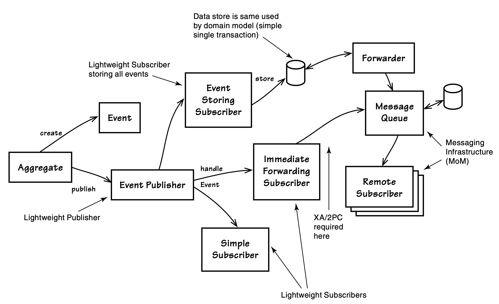

## 领域事件的时间与原因

#### ▶[上一节](0.md)

参考 [[Evans](../bibli.md#evans)] ，你不会找到`Domain Events`的正式定义。这个模式是在书出版之后的某个时间详细介绍的。为了开始讨论在 [Domain (2)](../ch2/0.md) 中实现事件，可以考虑以下当代定义：

 - 发生了某些领域专家关心的事情。
   
   将领域中的活动信息建模为一系列离散事件。将每个事件表示为领域对象......领域事件是领域模型的完整组成部分，是对领域中发生的某件事情的表示。 [[Evans, Ref, p. 20](../bibli.md#evans-ref)]

我们该如何判断领域中发生的某件事是否是领域专家所关注的重点？在与他们沟通的过程中，我们必须仔细捕捉各类线索。当领域专家交流时，不妨留意以下几类关键表述：

- “当…… 时”
- “如果那件事发生了……”
- “如果…… 请告知我” 以及 “如果…… 请通知我”
- “一旦出现…… 的情况”

当然，对于 “如果…… 请告知我” 和 “如果…… 请通知我” 这类表述，通知行为本身并不构成事件。这类表述仅仅说明：领域内的相关人员希望在某一重要事件发生后 *得到提醒* ，而这 *往往意味着* ，我们需要将这一重要事件显式地建模为事件。除此之外，领域专家还可能会说类似这样的话：“如果那件事发生了，无关紧要；但如果这件事发生了，就非常重要。”（你可以将其中的 “那件事” 和 “这件事” 替换为自身领域中有实际意义的业务场景。）根据你所在组织的沟通文化，还可能存在其他能够触发你识别的关键表述。

|牛仔逻辑||
|---|---|
|AJ：“要是我需要我的马，我只要喊一声：‘过来，Trigger！’它就会跑过来。当然，让它知道我揣着一块方糖，也绝对没坏处。”||

有些时候，即便领域专家的口头表述中，没有明确给出需要建模事件的清晰理由，实际业务场景依然可能存在这样的需求。领域专家自身或许并未意识到这类需求，这类需求往往只有在跨团队沟通的过程中才会被发掘。这种情况通常出现在事件需要广播至外部服务的场景：当企业内部系统已完成解耦，领域内发生的各类业务事实，必须在不同的 [Bounded Contexts (2)](../ch2/0.md) 之间进行传递时，就会产生这类需求。这类事件会被发布出去，并通知对应的订阅者。当订阅者处理这类事件时，它们可能会对本地及远程的`Bounded Contexts`产生深远的影响。

---
➜**领域专家与领域事件**

尽管领域专家起初未必能意识到所有类型事件的建模必要性，但在针对具体事件展开讨论的过程中，他们理应理解设计这些事件的背后原因。一旦团队就此达成清晰共识，新增的事件就会成为 [Ubiquitous Language (1)](../ch1/0.md) 的正式组成部分。

---

<ins>当事件被传递给相关方，无论是本地系统还是外部系统时，它们通常被用于实现最终一致性</ins>。这是经过深思熟虑、符合设计初衷的做法。它可以消除对两阶段提交（分布式全局事务）的依赖，同时契合 [Aggregates (10)](../ch10/0.md) 的相关规则。
`Aggregates`的其中一条规则规定：在单个事务中，只应修改一个实例，所有其他依赖的变更都必须在独立的事务中完成。因此，本地`Bounded Context`的其他`Aggregate`实例，可以通过这种方式（事件）实现状态同步。
我们也可以借助这种方式，在存在一定延迟的前提下，让远程依赖的系统达成一致状态。这种解耦方式有助于打造一组具备高可扩展性 (scalable)、高性能峰值的协作服务，同时也能实现系统之间的松耦合。

[图 8.1](#figure-81) 展示了领域事件的产生方式、存储与转发机制，以及它们的应用场景。事件可以被本地`Bounded Contexts`，以及外部的其他上下文所消费。

#### Figure 8.1

*`Aggregates`负责创建并发布事件（Event）。订阅者既可先存储事件，再将其转发给远程订阅者；也可直接转发事件，而不进行存储。除非消息中间件与领域模型的数据存储共用同一个数据源，否则即时转发操作需依赖 XA（两阶段提交）协议来保证一致性。*

同时，想一想你的系统通常执行批处理的场景。或许在非高峰时段（可能是夜间），你的系统会执行某种日常维护操作：删除过时对象，创建支持新业务场景所需的对象，使部分对象与其他对象保持一致，甚至通知某些用户重要事项已经发生。
执行这类批处理通常需要运行一些复杂查询，以确定需要关注的业务场景。处理这些场景的计算和流程开销很大，同步所有变更还需要大型事务。
如果那些烦人的批处理能够变得多余，情况又会如何？

现在不妨回想一下，在前一天当中发生的、导致后续需要进行补救处理的那些实际事件。如果每一个这样的独立事件都被封装成一个领域事件并捕获，同时发布给系统内的监听器，这是否会简化相关处理？事实上，这将消除那些复杂的查询，因为你能够确切知晓发生了什么、在何时发生，从而明确 *后续需要执行操作* 的上下文。你只需在接收到每个事件的通知时完成相应处理即可。当前那些占用大量I/O与处理器资源的批处理任务，将被分散到全天的短时间片段中执行，业务状态也能更快地保持一致，为用户开展后续操作做好准备。

是否每个`Aggregate`命令的执行都会产生一个事件？
识别出创建事件的必要性固然重要，但同样关键的是，要知道 *何时可以忽略* 领域中那些领域专家或整个业务都不关心的无关事件。不过，基于模型的 *技术* 实现层面考量，或是协作系统的目标要求，事件的产生数量仍有可能超出领域专家的直接需求。采用`Event Sourcing`时便会出现这种情况（详见 [第 4 章](../ch4/0.md) 及 [附录 A](../appendix.md)）。

其中部分内容我会放到 [Integrating Bounded Contexts (13)](../ch13/0.md) 中讲解，但本章我们将探讨基础的建模工具。

#### ▶[下一节](2.md)
