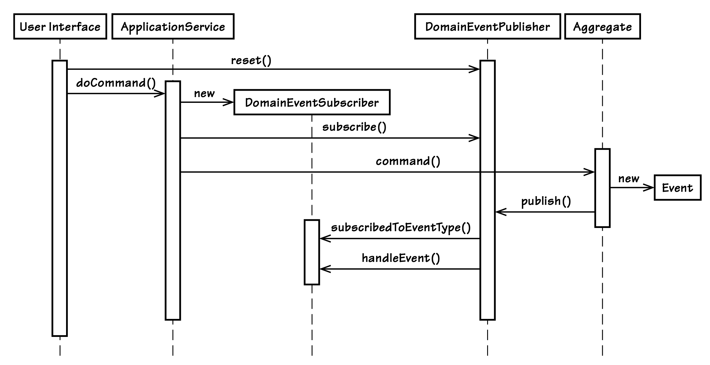

## 从领域模型发布事件

#### ▶[上一节](2.md)

应避免将领域模型暴露给任何类型的中间件消息传递基础设施。这类组件仅应存在于基础设施层中。尽管领域模型有时可能会间接使用此类基础设施，但绝不能与它产生显式耦合。我们将采用一种完全不依赖基础设施的实现思路。

在不与领域模型外部组件耦合的前提下发布`Domain Events`，最简单且最有效的方式之一是创建轻量级的`Observer` [[Gamma et al.](../bibli.md#gamma-et-al)] 。为了命名统一，我采用`Publish-Subscribe`这一叫法，该名称也被 [[Gamma et al.](../bibli.md#gamma-et-al)] 认可为同一设计模式的另一种名称。
<ins>该模式的示例实现，以及我对它的使用方式都属于轻量级范畴，原因在于事件的订阅和发布过程均不涉及网络交互：所有已注册的订阅方与发布方运行在同一进程空间内，且共用同一个线程。当事件发布时，每个订阅方会被逐一同步通知。这也意味着，所有订阅方的执行过程都处于同一个事务中（该事务或许由直接调用领域模型的`Application Service`管控）</ins>。

将`Publish-Subscribe`模式的两个组成部分分开考量，有助于在 DDD 的语境下对其进行阐释。

### 发布者

`Domain Events`最常见的使用场景或许是：由`Aggregate`创建一个事件并将其发布。发布者位于领域模型的某个 [Module (9)](../ch9/0.md) 中，但它并非对领域的某一方面进行建模，而是为需要向订阅方通知事件的`Aggregates`提供一项简单服务。以下是符合该定义的 DomainEventPublisher 。关于 DomainEventPublisher 的使用方式，可参考 [图 8.2](#figure-82) 中的抽象示意图。

```java
package com.saasovation.agilepm.domain.model;

import java.util.ArrayList;
import java.util.List;

public class DomainEventPublisher {

    @SuppressWarnings("unchecked")
    private static final ThreadLocal<List> subscribers =
            new ThreadLocal<List>();

    private static final ThreadLocal<Boolean> publishing =
            new ThreadLocal<Boolean>() {
        protected Boolean initialValue() {
            return Boolean.FALSE;
        }
    };

    public static DomainEventPublisher instance() {
        return new DomainEventPublisher();
    }

    public DomainEventPublisher() {
        super();
    }

    @SuppressWarnings("unchecked")
    public <T> void publish(final T aDomainEvent) {
        if (publishing.get()) {
            return;
        } try {
            publishing.set(Boolean.TRUE);
            List<DomainEventSubscriber<T>> registeredSubscribers =
                    subscribers.get();
            if (registeredSubscribers != null) {
                Class<?> eventType = aDomainEvent.getClass();
                for (DomainEventSubscriber<T> subscriber :
                      registeredSubscribers) {
                    Class<?> subscribedTo =
                          subscriber.subscribedToEventType();
                    if (subscribedTo == eventType ||
                        subscribedTo == DomainEvent.class) {
                        subscriber.handleEvent(aDomainEvent);
                    }
                }
            }
        } finally {
            publishing.set(Boolean.FALSE);
        }
    }

    public DomainEventPublisher reset() {
        if (!publishing.get()) {
            subscribers.set(null);
        }
        return this;
    }

    @SuppressWarnings("unchecked")
    public <T> void subscribe(DomainEventSubscriber<T> aSubscriber) {
        if (publishing.get()) {
            return;
        }
        List<DomainEventSubscriber<T>> registeredSubscribers =
                subscribers.get();
        if (registeredSubscribers == null) {
            registeredSubscribers =
                    new ArrayList<DomainEventSubscriber<T>>();
            subscribers.set(registeredSubscribers);
        }
        registeredSubscribers.add(aSubscriber);
    }
}
```

由于系统用户的每一个传入请求都在独立的专用线程上处理，因此我们按线程对订阅者进行划分。由此，subscribers 和 publishing 这两个 ThreadLocal 变量会为每个线程分别分配实例。当相关方调用 subscribe() 方法完成自身注册时，订阅者对象的引用会被添加到与当前线程绑定的列表中。每个线程均可注册任意数量的订阅者。

线程是否会被放入线程池并在请求之间复用，取决于所使用的应用服务器。我们不希望为上一个请求在该线程上注册的订阅者，在线程被复用于下一个请求时仍然保持注册状态。当系统接收到新的用户请求时，应当调用 reset() 方法清除所有之前的订阅者。这能确保后续只有在此之后注册的订阅者才会被纳入处理范围。例如，在表现层（ [图 8.2](#figure-82) 中的 “User Interface” ），我们可以使用过滤器拦截每一个请求，该拦截组件会通过某种方式调用 reset() 方法。

#### Figure 8.2

*这是轻量级`Observer`、[User Interface (14)](../ch14/0.md)、`Application Services`与 [Domain Model (1)](../ch1/0.md) 之间交互流程的抽象示意图。*

```java
// in a Web filter component when user request is received
DomainEventPublisher.instance().reset();
...
// later in an Application Service during same request
DomainEventPublisher.instance().subscribe(subscriber);
```

如你所见，在两个独立组件执行完这段代码后（见 [图 8.2](#figure-82) ），该线程将仅存在一个已注册的订阅者。从 subscribe() 方法的实现中可以看出，只有当发布者未处于发布过程中时，才能注册订阅者。这避免了诸如 List 并发修改异常之类的问题。如果订阅者在处理事件后，通过回调发布者来添加新的订阅者，该问题就会显现。

接下来，请注意`Aggregate`聚合是如何发布事件的。继续沿用当前示例，当 BacklogItem 的 commitTo() 方法执行成功后，BacklogItemCommitted 事件将被发布：

```java
public class BacklogItem extends ConcurrencySafeEntity {
    ...
    public void commitTo(Sprint aSprint) {
        ...
        DomainEventPublisher
            .instance()
            .publish(new BacklogItemCommitted(
                    this.tenantId(),
                    this.backlogItemId(),
                    this.sprintId()));
    }
    ... 
}
```

当在 DomainEventPublisher 上执行 publish() 方法时，它会遍历所有已注册的订阅者。通过对每个订阅者调用 subscribedToEventType() 方法，发布者可以筛选掉所有未订阅该特定事件类型的订阅者。若订阅者在该筛选查询中返回 DomainEvent.class ，则会接收所有类型的事件。所有符合条件的订阅者，都会通过其 handleEvent() 方法收到已发布的事件。当所有订阅者要么被筛选排除，要么已收到通知后，发布者的本次发布流程即告完成。

与 subscribe() 方法类似， publish() 方法不允许嵌套发布事件的请求。方法执行时会检查与线程绑定的布尔值 publishing ，只有当该值为 false 时， publish() 才会遍历订阅者并分发事件。

事件发布如何扩展到远程`Bounded Contexts`，从而支持自治服务呢？我们很快就会探讨这一点，不过先让我们更深入地了解一下本地订阅者。

### 订阅者

哪些组件会注册成为领域事件的订阅者？一般来说，[Application Services (14)](../ch10/0.md) 会进行注册，`Domain Service`有时也会。<ins>订阅者可以是任何与发布事件的`Aggregate`运行在同一线程上，且能在事件发布前完成订阅的组件。这意味着，订阅者是在调用领域模型的方法执行流程中完成注册的。</ins>

|牛仔逻辑||
|---|---|
|LB：“我想订阅《篱笆邮报》，这样我就能在这本书里找到更多老套无聊的话来讲了。” ||

在采用`Hexagonal Architecture`时，`Application Services`是领域模型的直接调用方，因此它们处于一个理想的位置，能够在对`Aggregates`执行生成事件的操作之前，向发布者注册订阅者。以下是一个进行订阅操作的`Application Service`示例：

```java
public class BacklogItemApplicationService ... {
   public void commitBacklogItem(
           Tenant aTenant,
           BacklogItemId aBacklogItemId,
           SprintId aSprintId) {

       DomainEventSubscriber subscriber =
               new DomainEventSubscriber<BacklogItemCommitted>() {
           @Override
           public void handleEvent(BacklogItemCommitted aDomainEvent) {
               // handle event here ...
           }
           @Override
           public Class<BacklogItemCommitted> subscribedToEventType() {
               return BacklogItemCommitted.class;
           }
       }

       DomainEventPublisher.instance().subscribe(subscriber);

       BacklogItem backlogItem =
               backlogItemRepository
                       .backlogItemOfId(aTenant, aBacklogItemId);

       Sprint sprint = sprintRepository.sprintOfId(aTenant, aSprintId);

       backlogItem.commitTo(sprint);
   }
}
```

在这个（人为设计的）示例中， BacklogItemApplicationService  是一个`Application Service`，拥有一个服务方法 commitBacklogItem()。该方法实例化一个匿名的  DomainEventSubscriber 对象。随后，`Application Service`的任务协调器将该订阅者注册到 DomainEventPublisher。最后，服务方法通过`Repositories`获取 BacklogItem 和 Sprint 实例，并执行待办项的 commitTo() 行为。执行完成后，commitTo() 方法会发布一个 BacklogItemCommitted 类型的事件。

这个示例中并未展示订阅者如何处理该事件。如果合理的话，它可以发送一封电子邮件，告知 BacklogItemCommitted 这一事实。它也可以将该事件存储到`Event Store`中，或是通过消息传递基础设施转发该事件。通常在最后这两种场景下——即保存到`Event Store`和通过消息基础设施转发——我们不会创建一个特定于用例的`Application Service`来以这种方式处理事件。相反，我们会设计一个单独的订阅者组件来完成这项工作。关于一个负责将事件保存到`Event Store`的单一职责组件示例，可参见 [Event Store](#TODO) 一节。 *TODO fix link*

---
➜**事件处理器的使用注意事项**

<ins>要记住，`Application Service`管控着事务。切勿利用事件通知去修改第二个`Aggregate`实例。这违反了 “每个事务仅修改一个`Aggregate`实例” 的经验法则。</ins>

---

订阅者 *不应该做* 的一件事是获取另一个`Aggregate`实例，并对其执行具有修改性质的命令操作。这会违反 *“单个事务中仅修改单个`Aggregate`实例”* 的经验法则，这一点在 [Aggregates (10)](../ch10/0.md) 一节中已有探讨。正如 [[Evans](../bibli.md#evans)] 所指出的，对于除该单个事务中所使用的`Aggregate`实例之外的所有其他`Aggregate`实例，其一致性必须通过异步方式来保证。

<ins>通过消息传递基础设施转发事件，能够将事件异步推送给外部订阅者。这些异步订阅者中的每一个，都可以安排在一个或多个独立事务中修改额外的`Aggregate`实例。
这些额外的`Aggregate`实例既可以位于同一个`Bounded Context`内，也可以位于其他`Bounded Context`中。将事件对外发布到其他 [Subdomains (2)](../ch2/0.md) 的任意数量的`Bounded Contexts`，这一点凸显了 *Domain Event* 这一术语中 *Domain* 一词的含义。换句话说，事件是一个 *跨领域* 的概念，而非仅存在于单个`Bounded Context`内的概念。事件发布的契约 (contract)，其潜在覆盖范围至少应与企业相当，甚至可以更广泛。不过，大范围的广播并不妨碍同一`Bounded Context`内的消费者接收事件。可回头参考 [图 8.1](1.md#figure-81)。</ins>

有时，`Domain Service`也需要注册订阅者。这么做的动机与`Application Service`注册订阅者的理由类似，但在这种情况下，监听事件是出于特定的领域相关原因。

#### ▶[下一节](4.md)
