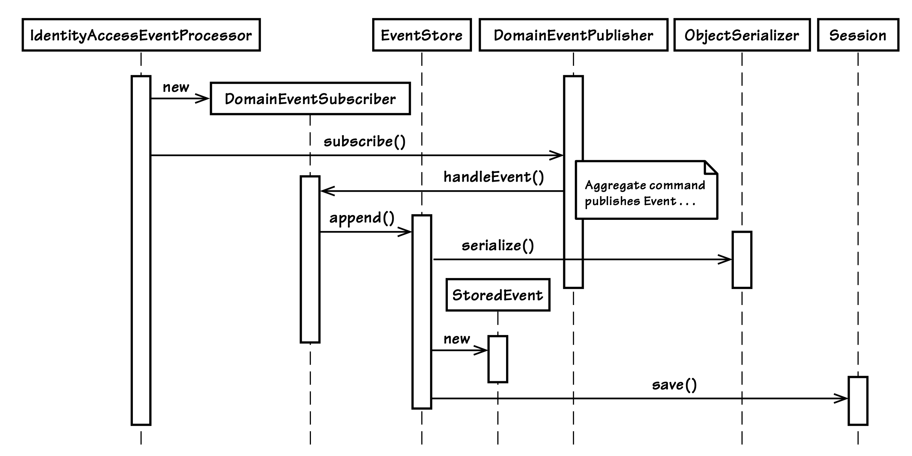

## 事件存储

#### ▶[上一节](4.md)

为单个`Bounded Context`维护所有`Domain Events`的存储，具有多项潜在优势。试想一下，如果你为每一次执行的模型命令行为都存储一个独立的事件，你将能够：

1. 将`Event Store`用作消息传递基础设施中发布所有`Domain Events`的队列。这是本书中该工具的主要用途之一。它支持`Bounded Contexts`之间的集成，远程订阅方可以根据自身上下文的需求对事件做出响应。（参见前文 [将事件通知传递至远程Bounded Contexts](4.md) 一节。）

2. 你可以使用同一个`Event Store`，向轮询客户端推送基于 REST 的事件通知。（这在逻辑上与 第 1 点相同，但实际使用场景有所区别。）

3. 查看模型上曾经执行过的每一条命令的结果历史记录。这不仅有助于排查模型中的漏洞，还能排查客户端中的漏洞。重要的是要理解，`Event Store`不仅仅是一份审计日志。审计日志或许对调试有帮助，但它们几乎不会包含每个`Aggregate`命令执行结果的完整信息。

4.  将这些数据用于趋势分析、预测以及其他商业分析工作。很多时候，企业在尚未意识到自身需要这类历史数据前，根本无从知晓其用途。除非从一开始就维护`Event Store`，否则当需求出现时，这些历史数据将无法获取。

5.  当从`Repository`中获取`Aggregate`实例时，使用这些事件重组 (reconstitute) 每个`Aggregate`实例。这是所谓的`Event Sourcing`中一项必要的组成部分。具体做法是按时间顺序将所有先前存储的事件应用到`Aggregate`实例上。你可以生成任意数量已存储事件的快照（例如，每 100 个事件为一组），以优化实例重组的效率。

6. 基于上一点的应用，可以撤销对`Aggregate`所做的批量变更。要实现这一点，可阻止（例如通过删除或标记为作废的方式）某些事件被用于重组特定的`Aggregate`实例。你也可以修补事件或插入额外的事件，以纠正事件流中的漏洞。

`Event Store`的具体特性取决于你创建它的初衷。由于本章呈现的示例主要是为了实现第 1 点和第 2 点所述的优势，因此我们的`Event Store`本质上只关注按事件发生的顺序存储序列化后的事件。这并不意味着我们无法利用这些事件来实现前四点所述的所有优势，因为基于我们正在记录领域中所有重大事件这一事实，第 3 点和第 4 点的优势同样可以实现。因此，实现第 3 点和第 4 点的优势，是对前两点所实现功能的进一步拓展应用。不过，本章我们不会尝试利用`Event Store`来实现第 5 点和第 6 点所述的功能。

要实现第 1 点和第 2 点的优势，需要完成若干步骤。这些步骤在 [图 8.3](#figure-83) 中进行了总结。首先，我们来讨论该序列图中涵盖的步骤以及涉及的组件。我们将通过 SaaSOvation 的项目实践来展开说明。

无论我们创建`Event Store`的初衷是什么，首先要做的事情之一就是创建一个订阅者，用于接收所有从模型中发布出来的事件。该团队决定通过一个面向切面的钩子（aspect-oriented hook）来实现这一点，这个钩子能够将自身插入到系统中每个`Application Service`的执行流程中。

#### Figure 8.3

*IdentityAccessEventProcessor 以匿名方式订阅模型的所有事件。它将任务委托给 EventStore ，后者会将每个事件序列化为 StoredEvent 并进行保存。*

----
| ||
|---|---|
|这是 SaaSOvation 团队为`Identity and Access Context`所做的实现。下面这个组件的单一职责就是确保所有`Domain Events`都能被妥善存储：||

```java
@Aspect
public class IdentityAccessEventProcessor {
    ...
    @Before(
    "execution(* com.saasovation.identityaccess.application.*.*(..))")
    public void listen() {
        DomainEventPublisher
            .instance()
            .subscribe(new DomainEventSubscriber<DomainEvent>() {
                public void handleEvent(DomainEvent aDomainEvent) {
                    store(aDomainEvent);
                }
                public Class<DomainEvent> subscribedToEventType() {
                    return DomainEvent.class; // all domain events
                }
            });
    }

    private void store(DomainEvent aDomainEvent) {
        EventStore.instance().append(aDomainEvent);
    }
}
```

这是一个简单的事件处理器，其他任何具有相同需求的`Bounded Context`都可以使用类似的实现。它被设计为一个切面（利用 Spring 的面向切面编程 AOP），用于拦截所有`Application Service`方法的调用。
当某个`Application Service`方法被执行时，该处理器会监听所有因`Application Service`与模型交互而发布的`Domain Events`。处理器会向线程绑定的 DomainEventPublisher 实例注册一个订阅者。该订阅者的过滤规则是完全开放的，这一点通过它在 subscribedToEventType() 方法中返回 DomainEvent.class 得以体现。返回这个类表明该订阅者希望接收所有事件。
当该订阅者的 handleEvent() 方法被调用时，它会将任务委托给 store() 方法，而 store() 方法又会进一步委托给`EventStore`类，将该事件追加到实际`Event Store`的末尾。

----

下面我们来看一下 `EventStore` 组件的 append() 方法：

```java
package com.saasovation.identityaccess.application.eventStore;
...
public class EventStore ... {
    ...
    public void append(DomainEvent aDomainEvent) {
        String eventSerialization =
            EventStore.objectSerializer().serialize(aDomainEvent);
        StoredEvent storedEvent =
                new StoredEvent(
                        aDomainEvent.getClass().getName(),
                        aDomainEvent.occurredOn(),
                        eventSerialization);
        this.session().save(storedEvent);
        this.setStoredEvent(storedEvent);
    }
}
```

store() 方法会序列化 DomainEvent 实例，将序列化后的数据存入一个新的 StoredEvent 实例中，随后将这个新对象写入`Event Store`。以下是 StoredEvent 类的部分代码，该类用于存储序列化后的 DomainEvent：

```java
package com.saasovation.identityaccess.application.eventStore;
...
public class StoredEvent {
    private String eventBody;
    private long eventId;
    private Date occurredOn;
    private String typeName;
    public StoredEvent(
            String aTypeName,
            Date anOccurredOn,
            String anEventBody) {
        this();
        this.setEventBody(anEventBody);
        this.setOccurredOn(anOccurredOn);
        this.setTypeName(aTypeName);
    }
    ...
}
```

每个 StoredEvent 实例都会获得一个由数据库自动生成的唯一序列值，并将其设置为自身的 eventId。其 eventBody 字段存放 DomainEvent 的序列化数据。此处采用基于 Gson 库的 JSON 序列化方式，也可使用其他序列化形式。typeName 字段保存对应 DomainEvent 的具体类名，occurredOn 字段则是 DomainEvent 中 occurredOn 字段的副本。

所有 StoredEvent 对象都被持久化到一张 MySQL 数据表中。我们为事件序列化数据预留了充足的存储空间，尽管 65,000 个字符的容量，无疑远远超过了单个事件实例所需的存储大小。

```sql
CREATE TABLE `tbl_stored_event` (
    `event_id` int(11) NOT NULL auto_increment,
    `event_body` varchar(65000) NOT NULL,
    `occurred_on` datetime NOT NULL,
    `type_name` varchar(100) NOT NULL,
    PRIMARY KEY (`event_id`)
) ENGINE=InnoDB;
```

至此，我们已从高层视角回顾了构建`Event Store`所需的几个核心组件，该`Event Store`用于存储领域模型中`Aggregates`发布的所有事件实例。后续我们会深入探讨更多细节。接下来，我们看看其他系统如何消费这些存储的模型事件记录。

#### ▶[下一节](6.md)
