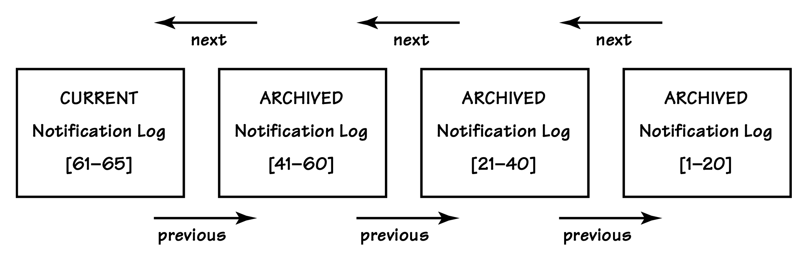

## 转发已存储事件的架构风格

#### ▶[上一节](5.md)

`Event Store`被填充完成后，即可用于提取事件并将其作为通知转发给相关方。我们将介绍两种提供这些事件的架构风格：第一种是通过客户端查询的 RESTful 资源，第二种是通过中间件消息产品的主题/交换器发送消息。

诚然，基于 REST 的方法并非真正意义上的转发技术。但它能实现与`Publish-Subscribe`风格相同的效果，这很像电子邮件客户端是电子邮件服务器 “发布” 的邮件消息的 “订阅者”。

### 以 RESTful 资源形式发布通知

当在遵循`Publish-Subscribe`模式基本前提的环境中使用时，基于 REST 风格的事件通知能发挥最佳效果。也就是说，多个消费者对单个生产者提供的同一批事件感兴趣。反之，若试图将基于 REST 的风格用作消息队列，这种方法往往会失效。以下是 RESTful 方法的优劣总结：

- 若有多个潜在客户端可通过单个知名 URI 请求同一组通知，RESTful 方法效果良好。本质上，通知会扩散至任意数量的轮询消费者。尽管该方法采用 *拉取模型* 而非 *推送模型* <sup>[2](#2)</sup> ，但它遵循了`Publish-Subscribe`模式的基本原理。
- 若要求一个或少数几个消费者从多个生产者处拉取资源，以获取需按特定顺序执行的单组任务，那么使用 RESTful 方法可能很快就会遇到问题。这描述的是一种队列 (Queue) 场景：多个潜在生产者需向一个或少数几个消费者推送通知，且接收顺序可能至关重要。轮询模型通常并非实现队列的理想选择。

以 RESTful 方式发布事件通知，与通过典型消息传递基础设施发布通知的方式截然相反。“发布者” 不会维护一组已注册的 “订阅者”，因为不会向相关方主动推送任何内容。相反，这种方法要求 REST 客户端通过一个知名 URI 拉取通知。

从高层视角来看待这种 RESTful 方法：如果你熟悉 Web 上 Atom feeds 的消费方式，就会发现该方法与之极为相似。它实际上是基于 Atom 的相关概念设计的。

客户端使用 HTTP GET 方法请求所谓的 *当前日志 (current log)* 。该当前日志包含已发布的最新通知。客户端接收的当前日志中，通知数量不会超过标准限制。我们的示例中，每份日志的最大通知数设为 20。客户端会遍历当前日志中的每一个事件，找出其所属`Bounded Context`尚未消费的所有事件。

客户端如何在本地消费事件通知？它会按类型解析序列化后的事件，将所有相关数据适当转换为本地`Bounded Context`适用的格式。这通常包括在自身模型中查找相关的`Aggregate`实例，并基于对适用事件的解析结果执行命令。当然，事件必须按时间顺序应用，因为最早的事件代表先于新事件发生的操作。除非按照事件发生的顺序优先应用最早的事件，否则对本地模型所做的变更很可能会引发漏洞。

在我们的实现方案中，当前日志最多包含 19 条通知，也可能少于 19 条，甚至为零。当当前日志的通知总数达到 20 条时，它会被自动归档。如果在前一份当前日志归档时没有新的通知可用，那么新的当前日志将不包含任何通知。

---
➜**归档日志是什么？**

归档日志并无神秘之处。它仅意味着该特定日志不再会被所属系统的任何操作修改，并且客户端可以确保，无论多少次请求某一特定归档日志，其内容始终保持一致。

另一方面，当前日志会不断变化，直至达到容量上限并最终被归档。不过，当前日志可能发生的唯一变化，就是在达到容量上限前持续添加新的通知。

添加到任何日志中的事件绝不能被修改。这是因为客户端必须得到保障：一旦它们在本地应用了某个特定事件，该事件就会被永久且唯一地应用。

---

因此，当前日志未必总包含本地尚未应用的最新或最早通知。这类最早的事件可能存在于当前日志的前一个日志中，甚至更早的日志里。这完全取决于事件填满特定有限日志（本例中仅含 20 条记录）的频率，以及客户端拉取日志的频率，均与时间节点相关。[图 8.4](#figure-84) 展示了通知日志如何相互串联，形成一个包含所有独立通知的虚拟数组。

假设日志状态如 [图 8.4](#figure-84) 所示，已知通知 1 至 58 已在本地应用，这意味着通知 59 至 65 尚未应用。如果客户端拉取以下统一 URI ，将会接收到当前日志：

```http
//iam/notifications
```

客户端从自身数据库中读取最近已应用通知的标识跟踪记录（本例中为 58 ）。跟踪下一个待应用通知的责任在于客户端而非服务器。客户端从上至下遍历当前日志，查找标识为 58 的通知，但未找到，因此继续回溯至前一个日志（即归档日志）。前一个日志可通过当前日志中的超媒体链接访问，其中一种方式是利用响应头实现超媒体导航：

```http
HTTP/1.1 200 OK
Content-Type: application/vnd.saasovation.idovation+json
...
Link: <http://iam/notifications/61,80>; rel=self
Link: <http://iam/notifications/41,60>; rel=previous
...
```

#### Figure 8.4

*当前日志与任意数量相互链接的归档日志，共同构成了一个包含所有事件的虚拟数组，从最新事件一直追溯到第一个事件。此处展示了编号 1 至 65 的通知，每份归档日志都包含满额的 20 条通知，而当前日志尚未填满，仅包含 5 条通知。*

---
➜**为何 URI 无法反映当前日志的实际内容？**

请注意，尽管当前日志目前仅包含标识为 61 至 65 的通知，但其 URI 却包含了完整的标识范围（例如 61 至 80）：

```
Link: <http://iam/notifications/61,80>; rel=self
```

这是因为该资源在其整个生命周期内必须保持稳定，这既能保证访问的一致性，也能让缓存机制正常工作。

---

客户端从包含 `rel=previous` 的 Link 中获取 URI，通过 GET 请求检索当前日志的前一份日志：

```
//iam/notifications/41,60
```

借助这份归档日志，客户端在逐个探查三条通知（60、59，随后是 58 ）后，找到了目标通知（标识为 58 的那条）。由于该客户端已经应用过这条通知（标识 58 ），因此不会再次应用它。取而代之的是，客户端此时转向相反方向遍历，查找所有更新的通知。
在这份归档日志中，它找到了标识 59 并应用了该通知，接着找到标识 60 并完成应用。此时客户端已到达这份归档日志的顶部，于是导航至 `rel=next` 对应的资源，也就是当前日志。

```http
HTTP/1.1 200 OK
Content-Type: application/vnd.saasovation.idovation+json
...
Link: <http://iam/notifications/61,80>; rel=next
Link: <http://iam/notifications/41,60>; rel=self
Link: <http://iam/notifications/21,40>; rel=previous
...
```

客户端在该日志中找到了标识为 61、62、63、64 和 65 的通知，并按时间顺序逐一应用。当它到达当前日志的末尾时，便暂停当前的处理流程，因为当前日志永远不会包含`rel=next`的链接头。

一段时间后，上述流程会重复执行。客户端通过 URI 请求当前日志，此时源`Bounded Context`中的活动可能已生成了大量新通知，进而形成了与之前截然不同的日志。当客户端此次请求当前日志时，日志中可能已包含若干新通知。客户端可能需要回溯 1 份、2 份甚至更多归档日志，才能找到最近一次已应用的通知（目前是标识为 65 的那条）。和之前一样，当客户端找到标识 65 的通知后，会按时间顺序应用所有更新的通知。

任意数量不同的客户端`Bounded Contexts`都可以请求通知日志。事实上，任何需要知晓其他提供此类通知发布功能的`Bounded Context`所产生事件的`Bounded Context`，都可以追溯获取 “从一开始” 的所有通知。当然，只有当客户端`Bounded Context`拥有访问源系统的适当权限（例如安全权限）时，它才能真正以客户端身份进行访问。

但客户端轮询通知资源会不会给 Web 服务器带来大量不必要的流量呢？如果你的 RESTful 资源能有效利用缓存机制，就不会出现这种情况。例如，客户端自身可以将当前日志缓存约一分钟：

```http
HTTP/1.1 200 OK
Content-Type: application/vnd.saasovation.idovation+json
...
Cache-Control: max-age=60
...
```

每当客户端的轮询操作发生在一分钟缓存有效期内时，客户端缓存会直接提供之前获取的当前日志。当缓存超时后，客户端才会从服务器资源中获取最新的当前日志。

由于归档日志的内容永远不会改变，其缓存时间可以设置得更长，如下所示，最大缓存时长可设为一小时：

```http
HTTP/1.1 200 OK
Content-Type: application/vnd.saasovation.idovation+json
...
Cache-Control: max-age=3600
...
```

客户端可以将当前日志的 `max-age` 值用作计时器/休眠阈值，因为没有必要对已缓存的资源持续发送 GET 请求。通过休眠减少轮询次数，既能降低客户端`Bounded Context`的处理负载，也能减轻源服务器的压力。只要缓存的 `max-age` 尚未过期，资源提供者就不会收到相关请求。因此，在合理使用客户端缓存的前提下，即使是行为不当的客户端，也不会影响通知生产者的性能或可用性。这凸显了利用万维网及其内置基础设施，能够带来卓越的性能和可扩展性优势。

服务器也可以配置自身的缓存。通知日志的服务器缓存效果十分显著，因为归档日志的内容永远不会改变。任何客户端请求某一份归档通知日志时，不仅自身会获取该资源，还会为其他需要这份资源的客户端预热缓存。由于归档日志的不可变性有保障，缓存无需对归档日志进行刷新操作。

哇！这部分内容的细节已经相当丰富了，而在 [Integrating Bounded Contexts (13)](../ch13/0.md) 中，还有更多相关内容有待探讨。我建议你参考文献 [[Parastatidis et al., RiP](../bibli.md#parastatidis-et-al-rip)] ，其中介绍了设计高效 RESTful 事件通知系统的多种策略。在这份文献中，你会看到关于基于标准媒体类型 Atom 的通知日志的优劣讨论，同时还包含若干参考实现。
此外，Jim Webber 在他的演讲 [[Webber, REST & DDD](../bibli.md#webber-rest--ddd)] 中，对这种方法提供了更深入的见解。关于该方法最早的参考文献之一，来自 Stefan Tilkov 发表在 InfoQ 上的文章 [[Tilkov, RESTful Doubts](../bibli.md#tilkov-restful-doubts)] 。你也可以观看我本人关于该方法的演讲 [[Vernon, RESTful DDD](../bibli.md#vernon-restful-ddd)]。

### 通过消息中间件发布通知

毫不意外，像 RabbitMQ 这样的消息中间件产品会为你处理诸多细节工作，而这些细节在 REST 风格中需要你自行解决。该消息系统还能让你相对轻松地同时支持`Publish-Subscribe`模式和队列 (Queue) 模式，可根据自身需求选择更合适的一种。在这两种模式下，消息系统均采用推送模型，将事件通知消息发送给已注册的订阅者或监听器。

我们来考虑通过消息中间件产品从`Event Store`中发布事件的需求。我们将沿用`Publish-Subscribe`模式，使用 RabbitMQ 中所谓的 *扇出交换器 (fanout exchange)* 。为此，我们需要一组组件，它们将按以下顺序协同完成各项操作：

1.  从`Event Store`中查询所有尚未发布至该特定交换器的`Domain Event`对象，并按这些对象的有序唯一标识进行升序排序。
2.  按升序遍历查询到的事件对象，将每个对象发送至该交换器。
3.  当消息系统反馈消息已成功发布时，记录该`Domain Event`已通过此交换器完成发布。

我们不会等待订阅者确认是否已接收消息。当发布者通过交换器发送消息时，订阅者系统甚至可能并未处于运行状态。每个订阅者都负责在自身的时间范围内处理消息，并确保在其自有模型上正确执行所有必要的领域业务逻辑。我们只需依靠消息传递机制来保障消息的投递即可。

---
**白板时间**

- 绘制你所处理的`Bounded Context`，以及与之需要集成的其他上下文的`Context Map`。务必清晰呈现所有存在交互的上下文之间的关联关系。

- 为这些上下文之间的关系添加标注，注明关系类型，例如 [Anti-Corruption Layer (3)](../ch3/0.md)。

- 接下来，标注你将采用何种方式集成这些上下文。是使用 RPC 、RESTful 通知，还是消息传递基础设施？并将这些整合方式绘制到图中。

需要记住的是，在与遗留系统进行整合时，你可选择的整合方案或许并不会太多。

---

#### ▶[下一节](7.md)

#### 2
有关`Observer`模式中推送模型与拉取模型的讨论，参见 http://c2.com/cgi/wiki?ObserverPattern 。

