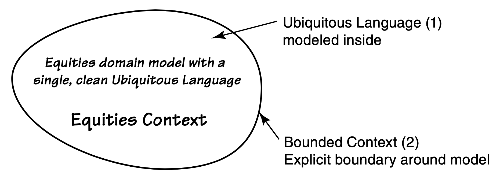
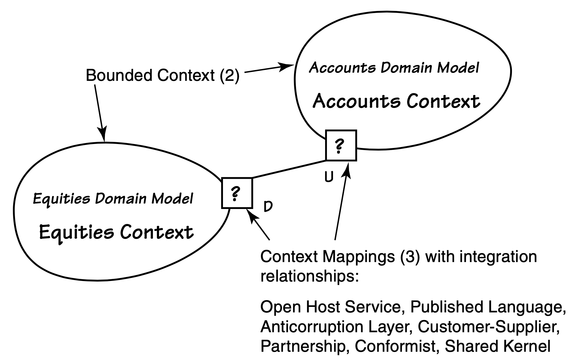
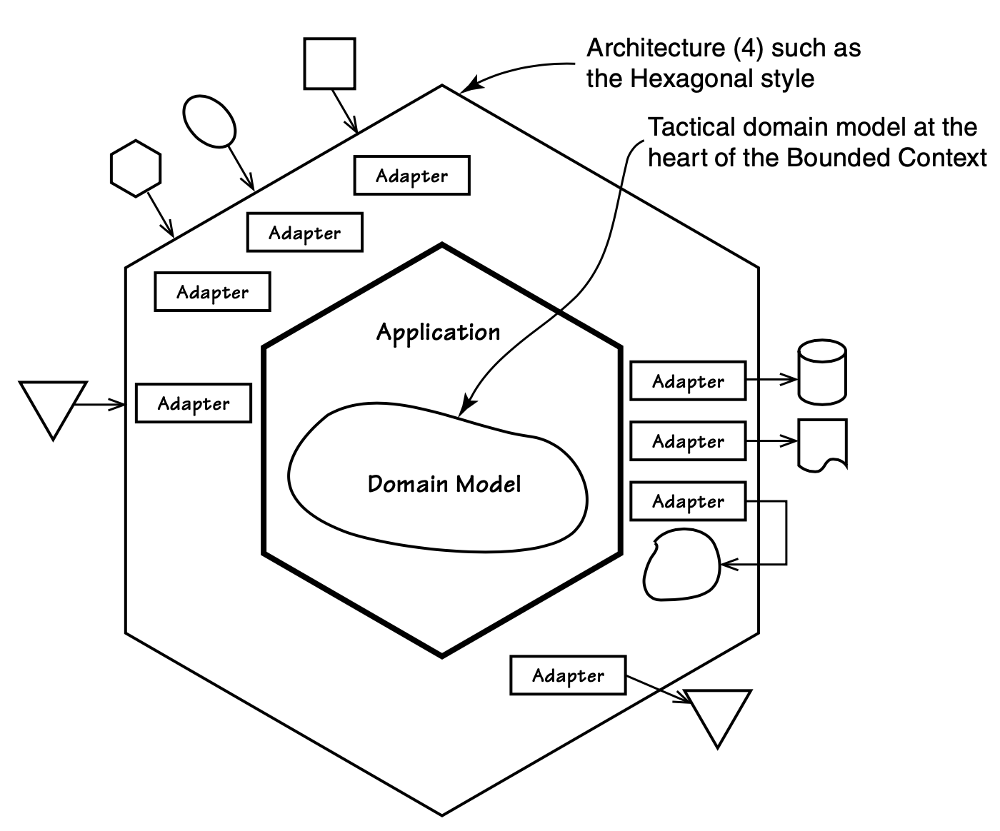
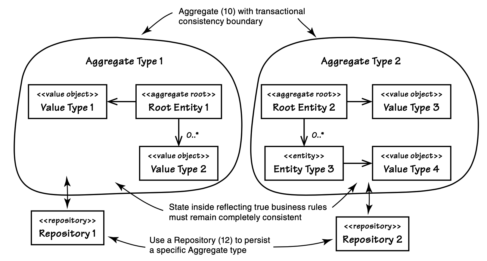
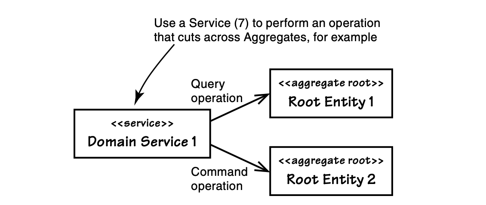
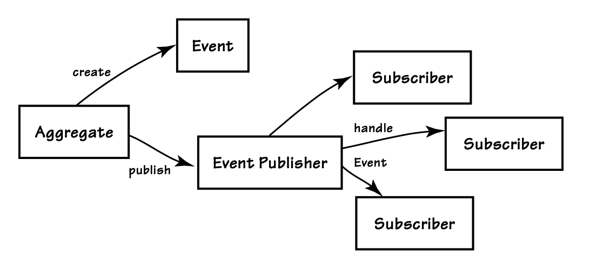
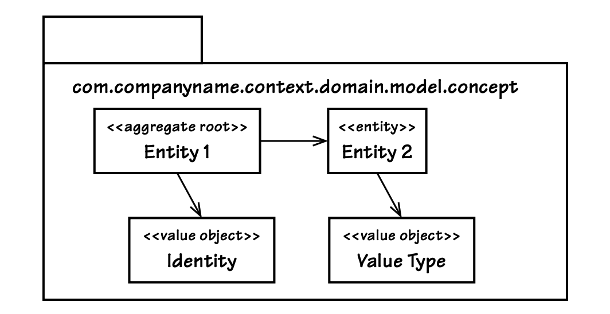

## 本书指南

#### ▶[上一节](author.md)

Eric Evans 所著的 *《Domain-Driven Design》* 本质上呈现了一套庞大的 *模式语言 (pattern Language)* 。模式语言是一组相互关联的软件模式，它们相互依赖。任何一个模式都会引用它所依赖的一个或多个其他模式，或者被其他模式所依赖。这对你意味着什么？

这意味着当你阅读本书的任何章节时，可能会遇到该章节未提及且你尚未了解的 DDD 模式。请不要惊慌，也请不要因困惑而停止阅读。书中其他章节很可能已对所引用的模式进行了详细说明。

为帮助解读模式语言，我采用了 [表 G.1](#table-g1) 中所示的语法规范。

#### Table G.1
|当你看到这个……|这意味着……|
|---|---|
|Pattern Name (#)|1. 这是该模式在本章中的首次出现，或 2. 这是对本章已提及模式的重要补充说明，但此时必须明确在文本中何处可查阅更多相关信息。|
|Bounded Context (2)|你正在阅读的这一章提到了第 2 章，供你深入了解 Bounded Context 的详细信息。|
|Bounded Context|这是我对同章内已提及模式的引用方式。为避免重复强调而造成阅读干扰，我未对所有模式引用添加粗体及章节编号标识。|
|\[REFERENCE\]|它是对另一部作品的书目引用。|
|\[Evans\] or \[Evans, Ref\]|我没有详细介绍具体提到的 DDD 模式，如果你想了解更多，需要阅读 Eric Evans 的这些作品。（它们总是推荐阅读的！）  \[Evans\] 指的是他经典的书 *《Domain-Driven Design》* 。  \[Evans, Ref\] 指的是第二本出版物，是对 \[Evans\] 中的模式进行更新和扩展后的简明参考。|
|\[Gamma et al.\] and \[Fowler, P of EAA\]|\[Gamma et al.\] 指的是经典书籍 *《Design Patterns》* 。  \[Fowler, P of EAA\] 指的是 Martin Fowler 的 *《Patterns of Enterprise Application Architecture》* 。  我经常引用这些著作。虽然我也会引用其他一些著作，但你会发现这些引用出现得比其他的稍多一些。具体细节请查看完整的参考文献目录。|

*本书中使用的语法*

若您从章节中间开始阅读，遇到诸如`Bounded Context`等术语时，请记住本书很可能有专门章节阐述该模式。只需快速查阅索引，即可获取更丰富的参考资料。

若你已阅读过 [[Evans](bibli.md#evans)] 著作并对其模式有所了解，本书将更适合用于深化对领域驱动设计的理解，并为现有模型设计提供优化思路。此时你或许无需立即掌握全局视角。但若您对 DDD 尚属新手，下文将帮助您理解模式间的关联性，并说明如何借助本书快速上手实践。请继续阅读。

### DDD 的宏观视角

一开始，我会带你了解 DDD 的支柱之一，[Ubiquitous Language (1)](ch1/3.md#ubiquitous-language) 。`Ubiquitous Language`适用于单一的 [Bounded Context (2)](ch2/0.md) 。你需要立即熟悉这一关键的领域建模思维方式。只要记住，无论你的软件模型在 *战术上 (tactically)* 如何设计，从 *战略上 (strategically)* 来看，你都希望它们能够体现以下内容：在一个明确的`Bounded Context`中建模的一套清晰的`Ubiquitous Language`。

#### 战略建模

`Bounded Context`是一个概念边界，在该边界内领域模型是适用的。它为团队使用的`Ubiquitous Language`提供了上下文，这种语言在团队精心设计的软件模型中得到了体现，如 [Fig G.1](#fig-g1) 所示。

#### Fig G.1

*`Bounded Context`与相关`Ubiquitous Language`示意图*

在实践战略设计时，你会发现 [Fig G.2](#fig-g2) 所示的 [Context Mapping (3)](ch3/0.md) 模式能协同运作。团队将借助`Context Maps`来理解项目环境。

我们刚刚审视了 DDD 战略设计的全局图景。理解它至关重要。

#### Fig G.2

*`Context Maps`展示了`Bounded Contexts`之间的关联关系*

#### 架构

有时，通过`Context Mapping`交互的新`Bounded Context`或现有的需要采用新的 [Architecture (4)](ch4/0.md) 风格。需要牢记的是，从战略和战术层面设计的领域模型应保持架构中立性。然而，每个模型周围和模型之间仍然需要一些架构。[Hexagonal](ch4/3.md) 是一种能承载`Bounded Context` 的一种强大的架构风格，可用来为 [Service-Oriented](ch4/4.md)、[REST](ch4/5.md)、[Event-Driven](ch4/7.md) 等其他架构风格提供基础支撑。 [Fig G.3](#fig-g3) 展示了`Hexagonal`架构，尽管结构略显复杂，但其实现方式其实相当简洁。

有时我们可能会过度关注架构，而忽视精心构建基于 DDD 的模型的重要性。<ins>架构固然重要，但架构的影响力会随时间消长。请牢记正确排序优先级，将更多精力投入领域模型，它具有更高的业务价值，且更具持久性。</ins>

#### Fig G.3

*以领域模型为核心的`Hexagonal`架构*

#### 战术建模

我们在`Bounded Context`中运用 DDD 的构建块模式集进行 *战术建模* 。如 [Fig G.4](#fig-g4) 所示，[Aggregate (10)](ch10/0.md) 是战术设计中最关键的模式之一。

`Aggregate`由单个 [Entity (5)](ch5/0.md) 或一组`Entities`与 [Value Objects (6)](ch6/0.md) 的构成，其在整个生命周期内必须保持事务一致性。掌握如何有效建模`Aggregates`至关重要，这也是 DDD 构建模块中最易被忽视的技术之一。既然`Aggregates`如此重要，你或许会疑惑为何本书将其置于后文阐述。首先，本书战术模式的编排顺序遵循 [[Evans](bibli.md#evans)] 的原著结构。此外，由于`Aggregates`模式需基于其他战术模式构建，我们选择先阐述`Entities`、`Value Objects`等基础构建块，再深入探讨更复杂的`Aggregate`模式。

`Aggregate`的实例通过其 [Repository (12)](ch12/0.md) 进行持久化存储，后续可在其中进行检索和获取。如 [Fig G.4](#fig-g4) 所示。

在领域模型内部使用无状态 [Services (7)](ch7/0.md)（如 [Fig G.5](#fig-g5) 所示），用于执行那些不适合作为`Entity`或`Value Object`操作的业务操作。

#### Fig G.4

*两种具有独立事务一致性边界的`Aggregate`类型*

#### Fig G.5

*领域服务执行特定于领域的操作，可能涉及多个领域对象。*

使用 [Domain Events (8)](ch8/0.md) 来标识领域中重要事件的发生。`Domain Events`可通过多种方式建模。当它们捕获由`Aggregate`命令操作引发的事件时，`Aggregate`本身会发布该事件，如 [Fig G.6](#fig-g6) 所示。

虽然人们往往对此不甚关注，但正确设计 [Modules (9)](ch9/0.md) 至关重要。最简单的理解方式是将模块视为 Java 中的包或 C# 中的命名空间。请谨记：若机械化设计模块而非遵循`Ubiquitous Language`，其弊大于利。 [Fig G.7](#fig-g7) 展示了`Modules`应包含有限且内聚的领域对象集合。

当然，DDD 的实践远不止于此，本文无法面面俱到。前方还有整本书将深入探讨这些内容。相信本指南能为你踏上实践 DDD 的旅程奠定良好基础。祝你旅途愉快！

#### Fig G.6

*`Aggregates`可发布`Domain Events`。*

#### Fig G.7

*`Module`包含并组织具有凝聚力的领域对象。*

哦，为了让你熟悉牛仔逻辑 (Cowboy Logic)，这里给你一个示例：

|牛仔逻辑||
|---|---|
|AJ：“别担心自己会咬下嚼不动的东西。你的嘴巴可能比你想象的要大得多。” ;-)  LB：“你想说的是 ‘头脑’ 吧，J。你的头脑比你想象的要大得多！”||

#### ▶[下一节](ch1/0.md)
