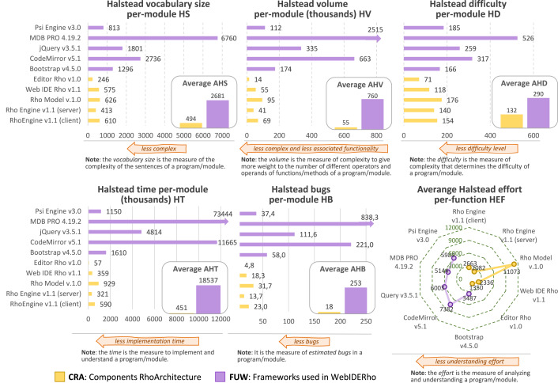

# 一种为 Web 应用构建基于 JSON 的 DSL 解决方案的方法
Enrique Chavarriaga, Francisco Jurado, Francy D. Rodríguez

----
## 摘要
由于其抽象程度，领域特定语言 (DSL) 能够构建简化软件实现的应用。在 Web 应用领域，我们可以找到许多用于服务器端应用的技术和编程语言，它们提供快速、稳健且灵活的解决方案，而用于客户端应用的技术和编程语言则有限，并且大多仅限于直接使用 JavaScript、HTML5、CSS3、JSON 和 XML。本文介绍了一种使用 JSON 语法 (JSON-DSL) 在服务器端和客户端创建基于 DSL 的 Web 应用的新方法。该方法包括一个评估引擎、一个编程模型和一个支持它的集成 Web 开发环境。评估引擎允许执行使用编程模型创建的元素。编程模型则允许定义和规范 JSON-DSL、实现 JavaScript 组件、使用引擎提供的JavaScript模板、使用链接连接器连接到异构信息源，以及与其他小部件、Web 组件和 JavaScript 框架的集成。为了验证我们方法的优势和能力，我们开发了四个案例研究，使用集成的 Web 开发环境来应用编程模型并检查评估引擎中的结果。

----
## 关键词
领域特定语言；JavaScript；JSON；JSON-DSL；Web 应用；模板引擎

----
## 1. 引言
领域特定语言 (DSL) 提供高级别的抽象，用于建模、指定和定义解决领域特定问题的结构、规范和功能。DSL 的目标是简化系统或部分系统的实现过程，使领域专家能够参与可靠、健壮和高质量系统的 开发过程，从而为特定问题提供解决方案 [1](#1)、[2](#2)。

DSL 部署意味着使用解析器、分析器和代码生成器来评估和执行 DSL 规范背后的代码。此外，为了方便 DSL 的部署，我们可以找到集成开发环境 (IDE)，例如 Visual Studio、Eclipse、NetBeans 和 WebStorm 等，它们提供了用于设计和实现 DSL 的工具，专用语言和框架。专注于 Web 应用开发，当我们必须定义易于集成到 Web 应用构建和部署中的语法时，有两种广泛采用的事实标准：基于 XML 的语法和基于 JSON 的语法。

因此，一方面，当 DSL 基于 XML 标准 [3](#3)、[4](#4) 时，即 DSL 遵循 XML 语法（XML-DSL），则可以使用文档对象模型（Document Object Model, DOM）[5](#5) 等通用解析器来指定特定领域的解决方案，评估和执行 DSL。此外，当这些方法使用 HTML5、SVG [6](#6)、MathML [7](#7) 和 XSLT [8](#8) 等语言时，解决方案在客户端会得到增强，无论是在视觉上还是功能上。作为示例，<ins>我们可以提到 [9](#9) 中的工作，在其中我们可以找到 PsiEngine，一个用于 Web 客户端的 XML-DSL 执行引擎，以及一组促进这些 DSL 开发和运行的工具。在 [9](#9)、[10](#10)中，作者展示了使用基于 XML 的解决方案的 DSL案例研究，这些解决方案使用 PsiEngine 来解决不同的特定领域问题。</ins>

另一方面，JSON 标准 [11](#11) 侧重于服务器端和客户端的信息交换。因此，我们可以提到用于链接数据的 JSON （JSON-LD） [12](#12)、[13](#13)，它允许交换可自动读取和共享的结构化信息。然而，当我们指定遵循 JSON 语法的 DSL（JSON-DSL）时会出现几个问题，即：如何定义 JSON-DSL 语法，我们可以使用哪些解析器、分析器和代码生成工具来运行 DSL，如何评估用 JSON-DSL 编写的程序，以及多个程序和多个 JSON-DSL 是否可以交互。本文提出了一种解决所有这些问题的方法。

尽管 Web 应用的相关性日益增长，并且科学界和工业界对使用此类应用表现出浓厚的兴趣，但文献中很少有研究涉及服务器端和客户端 Web 应用的 JSON-DSL 的规范和评估。关于这个主题的文献主要关注用于解决特定领域问题的 JSON-DSL，而不是用于实现 JSON-DSL 的工具和方法。大多数作品都涉及 JSON-DSL 的规范及其工作原理，无论桌面应用、服务器端还是客户端 Web 应用。因此，仅举几例，Canis [14](#14) 是一种允许 JSON 规范用于数据驱动的图形动画的高级语言，JSON-P [15](#15) 展示了一个关于开发简单人机对话播放器的案例研究，JS4Geo [16](#16) 是用于在 NoSQL 数据库中存储地理数据的规范 JSON schema，而 JSON-LS [17](#17) 促进与 BioThings API 的交叉链接以进行知识探索。

因此，在本文中，我们提出了一种构建 JSON-DSL 的架构，称为 RhoArchitecture，以我们之前的 PsiArchitecture [9](#9) 命名。该架构包括：
- （a）JSON-DSL Rho 评估引擎（简称 RhoEngine），它是能够运行用不同 JSON-DSL 编写的多个程序的 JavaScript 组件；
- （b）Rho 编程模型（简称 RhoModel），它建立一个编程模型来添加 JavaScript 功能并支持相应的代码生成和文档；
- （c）一个集成的 Web 开发环境，称为 Rho 的 Web 集成开发环境（简称 WebIDERho），允许指定、实现和部署基于 NodeJS 的服务器端和客户端项目，以及可视化类图。

我们的方法允许：
- （i）JSON-DSL 的规范和评估；
- （ii）可以与 DSL 交互的 JavaScript 组件的实现；
- （iii）JavaScript 模板引擎的应用，它可以作为程序员有效和高效地生成用 HTML、JavaScript、CSS 等编码的字符串的一种方式；
- （iv）连接异构信息源（JSON、XML 和文本），嵌入数据并将其与其他小部件、组件和 Web 框架集成。

凭借所有这些功能，我们的目标是为服务器端和客户端 Web 应用程序创建快速、稳健且灵活的解决方案。

通过 RhoArchitecture 的这三个部分（RhoEngine、RhoModel 和 WebIDERho），我们尝试为在 JSON-DSL 的规范、实现和部署中应用模型驱动工程 (MDE) 奠定基础。MDE 是一种软件工程范式，专注于定义领域模型，以简化信息系统 的构建 [18](#18)。因此，通过将 JSON-DSL 的概念与代码生成和转换引擎相结合，我们为将 MDE 应用于 Web 应用程序奠定了坚实的基础。

我们将提供四个案例研究，以展示 JSON-DSL 规范和评估的能力，以及 RhoArchitecture 中 JavaScript 组件的实现。第一个案例研究是经典的 “Hello World”，用于展示 JSON-DSL 的实现和执行。第二个案例研究重点介绍了集成管理多个异构信息源（XML、JSON 和文本）的能力。第三个案例研究旨在通过创建 Web 服务来验证服务器端编程，该服务包含 JSON-DSL 规范、模板引擎的使用和网页设计。最后一个使用案例，我们称之为 DrawRho，它以集成的方式验证了 RhoArchitecture 提出的所有特性，包括与其他框架的接口。在所有这些案例研究中，我们都遵循了 [19](#19) 建议的定性案例研究方法，并在 [20](#20) 中将其应用于软件工程， 以验证我们方法中最相关的特性。

本文的其余部分结构如下：第 2 节重点介绍相关工作；第 3 节概述了 RhoArchitecture 和我们方法的相关特性；第 4 节展示了四个案例研究；第 5 节详细介绍了我们获得的结果；最后，第 6 节以一些结论和未来工作结束本文。

----
## 2. 概述及相关工作
领域特定语言 (DSL) 一词在文献中没有严格的定义。Fowler  [2](#2) 将其定义为“一种专注于特定领域的、表达能力有限的计算机编程语言”。在 [21](#22)、[22](#22)、[23](#23) 中，<ins>作者们一致认为 DSL 是一种针对特定问题的编程语言，它的语法和语义包含与问题域相同的抽象级别，它的目标是促进信息系统的设计、定义和实现，为问题域提供解决方案</ins>。此外，根据 [2](#2)、[23](#23)， DSL 提供了合适的语法，以便领域专家可以更有效地执行这些任务，并生成更高质量和更可靠的系统。另一方面，[24](#24) 中的成果展示研究了语言的语法组成，并通过如下的考虑因素对 DSL 进行分类：语言扩展、语言限制、语言统一、自扩展和扩展组合来。

在 [25](#25) 中 ，我们可以找到一项系统映射研究（SMS1），它利用 2011 年之前的出版物，确定了最流行的DSL应用领域（按顺序排列：Web、网络、数据密集型应用、控制系统、低级软件、并行计算、可视化语言、嵌入式系统、实时系统、动态系统等）。此外，他们还开展了多项研究，列出了处理 DSL 的技术、方法和/或流程。最后，SMS1 对不同研究类型和领域进行了比较分析。

在 [26](#26) 中， 我们可以找到另一项关于 DSL 的系统映射研究（SMS2），该研究旨在识别 2006 年至 2012 年期间的研究趋势。作者寻找了可能尚未解决的问题，并对他们所谓的文献人口统计数据进行了分析。在 SMS2 中，作者观察到 DSL 社区似乎对开发支持 DSL 开发过程不同阶段（分析、设计和实现）的新技术和方法更感兴趣，而不是研究新工具，而且只有一小部分研究侧重于验证和维护。此外，作者还观察到，大多数研究并没有表明他们用于实现的工具。

<ins>此外，我们可以在 [27](#27) 中找到最新的系统映射研究（SMS3），该研究识别并映射了 2012 年至 2019 年间出版物中的工具和 IDE（作者称之为语言工作台LW）。在分析了 230 多篇论文后，他们确定了 59 种工具（9 种采用商业许可，41 种采用非商业许可），并得出结论，这些工具基本涵盖了 [26](#26) 中提出的特性（分为以下类别：符号、语义、编辑器、验证、测试和可组合性）</ins>。此外，在 SMS3 中，作者观察到开发人员采用了一种文本或图形符号来实现他们的 DSL。

DSL 的实现涉及使用解析器、分析器和代码生成工具来获得运行 DSL 的功能。一直以来，大多数解释器和编译器都是基于 Lex 和 Yacc [28](#28) 或 Flex 和 Bison [29](#29) 的。此外，当前的 IDE 提供了专门的工具、插件和语言，以简化 DSL 的设计和实现。例如，Visual Studio 具有用于构建基于模型的 DSL 的 软件开发工具包（SDK）[30](#30)，Eclipse 提供了各种用于构建 DSL 的专用插件，如 Stratego/XT [31](#31)、LISA [32](#32)、Spoofax [33](#33)、Antlr [34](#34)、Xtext [35](#35)、[36](#36) 和 Eclipse Modeling Project [37](#37) 。从MDE [18](#18)、[38](#38)、[39](#39) 的角度来看，关于用于构建建模语言的软件产品、平台和转换工具的综述可参见 [40](#40)。同样，使用通用编程语言，结合特定的设计模式和方法，我们可以构建内部 DSL，例如 Java [23](#23)、[41](#41)、C# [42](#42)、Scala [23](#23)、[43](#43)、Ruby  [23](#23)、Kotlin [44](#44)、Rust [45](#45)、Groovy [23](#23)、[46](#46)、Python [47](#47)、Clojure [48](#48) 和 Haskell [49](#49)。

因此，据我们所知，许多用于创建 DSL 的工具主要侧重于创建文本或图形 DSL。然而，目前尚无实现 JSON-DSL 的解决方案。上述 SMS1、SMS2 和 SMS3 并未明确提及 JSON-DSL 的创建，也未提及 Web 客户端 DSL 的创建。上述论文 [14](#14)、[15](#15)、[16](#16)、[17](#17) 描述了它们的规范以及 JSON-DSL 功能的实现是如何明确地临时执行的。

由于存在这两个缺点 —— 需要提供用于构建 JSON-DSL 的工具；以及需要一个执行引擎来在 Web 应用程序的服务器端和客户端运行用 JSON-DSL 编写的程序 —— 我们的工作重点是满足这些需求并创建案例研究来验证我们的提案。

----
## 3. 构建基于 JSON 的领域特定语言的方法
本节详细介绍了基于 JSON 的领域特定语言 (JSON-DSL) 解决方案的规范和实现方法，适用于服务器端和客户端的 Web 应用程序。本节将介绍 RhoArchitecture 及其三个部分（RhoEngine、RhoModel 和 WebIDERho）的核心思想。因此，我们将首先简要概述该方法，然后再进行分解。

### 3.1 简要概述
RhoArchitecture 的基石是 RhoEngine，这是一个 JavaScript 组件，可以运行用不同 JSON-DSL 编写的多个程序。JSON-DSL 是一种遵循 JSON 语法的编程语言，而 RhoLanguage 则是 JSON-DSL 加上实现语法元素功能的 JavaScript 类。JSON-DSL 程序的运行会评估嵌套语法符号的功能，从根开始，并根据语法定义向下钻取。在 RhoEngine 中运行的 JSON-DSL 可以连接和交换异构信息、使用模板引擎、使用组件和 Web 组件、应用安全策略，并遵循良好的编程实践 [50](#50)、[51](#50)，从而使其代码更加实用、可靠和健壮。

为了使 JSON-DSL 与 RhoEngine 兼容，我们必须遵循 RhoModel，它建立了一个用于生成JavaScript 代码和文档的编程模型。正如我们将要详细介绍的，RhoModel 专注于指定 JSON-DSL，并在服务器端和客户端实现 JavaScript 组件和其他必要的可重用 Web 组件。RhoModel 基于我们之前的 PsiModel [9](#9)。

最后，WebIDERho 使用 RhoModel 作为编程模型，并使用 RhoEngine 作为执行环境。WebIDERho 使我们能够在服务器端和客户端定义项目、可视化类图、自动生成文档，并部署基于 NodeJS 的服务器端和客户端 Web 应用程序。

### 3.2 RhoArchitecture
为了更好地理解，[Figure 1](#figure-1) 展示了软件架构，该架构在概念层面上定义了我们处理 JSON-DSL 的方法中所涉及的组件，即 RhoArchitecture。该架构的主要目标是促进以下两个步骤：

1. *指定 JSON-DSL* ：在此步骤中，使用 RhoModel（位于 [Figure 1](#figure-1) 的中下部分）将 JSON-DSL 定义为 RhoLanguage。为此，首先我们必须定义 JSON-DSL 语法，然后实现与语法元素（终端符号和非终端符号）相关的功能。在 RhoModel 中，必须通过从 RhoLanguage 基类继承来将此功能作为一组 JavaScript 类提供，以减轻程序员的任务。与语法的每个元素相关的功能在我们称之为组件（位于 [Figure 1](#figure-1) 的底部）的部分中实现。在提供语法和相关功能之后，RhoModel 可以在评估相应的 JSON-DSL 代码时生成 JavaScript 代码。

2. *评估 JSON-DSL* ：此步骤的主要目标是获取用 RhoLanguage 编写的 RhoCode 程序（ [Figure 1](#figure-1) 左侧）以及必要的资源（即 HTML 片段、图像、视频、css、svg 等），然后使用 RhoEngine 运行 RhoCode。为此，RhoEngine 通过将 RhoCode 转换为 JavaScript 对象（ [Figure 1](#figure-1) 右侧的 RhoObject ）来生成 RhoProgram。此 RhoObject 是通过执行语法的每个嵌套元素的功能生成的，从根元素开始，并根据其语法定义向下钻取。获得的 RhoObject 解决了特定问题，可以在服务器端或客户端的 Web 应用程序中运行。执行此步骤时，将报告编译和执行错误以供处理。

[Figure 1](#figure-1) 顶部的数据源组件封装了管理 JSON、XML 和文本格式信息的功能。因此，RhoArchitecture 中定义的任何对象或类都可以使用这些数据源组件获取外部信息，并在运行时链接其一个或多个属性。因此，该提案允许我们引入异构信息，并通过适当的参数化将其分配给类。因此，该方法可以将数据源与 JSON-DSL 解耦，从而在 Web 应用程序中实现针对特定问题的解决方案时增强其多功能性 (versatility) 和 能力（power)。

在 [Figure 1](#figure-1) 的底部，我们可以看到模板。它们是预先设计的文本，包含变量标签，可以动态调整以生成自定义文本输出。这些模板可用于生成 HTML、SVG、JSON、XML 和 JavaScript 代码，从而加快 Web 应用程序的开发速度。为了自定义管理模板的使用，在 [Figure 1](#figure-1) 的左侧，我们可以看到模板引擎。模板引擎是一个 JavaScript 组件，它允许使用不同的特定语法（通常在内存中预编译）创建自定义模板，以快速高效地生成字符串。市场上有各种各样的模板引擎，特别是 EJS [52](#52)、Handlebars [53](#53)、[54](#54) 和 Hogan  [55](#55) 引擎。这些引擎作为插件添加到 RhoArchitecture 中，可由 RhoEngine 轻松使用。此外，RhoArchitecture 实现了一个简单的本机模板引擎，我们称之为 Plain，其功能有限。在创建 JSON-DSL 时使用这些模板引擎，结合数据源绑定，可以成倍地提高这些语言的能力和多功能性。

在 [Figure 1](#figure-1) 的底部，我们可以看到 Web 组件 [56]、[57]、[58]、[59] ，它们是用 HTML、 DOM 、JavaScript 和 CSS构建的小部件或可重用组件，部署在 Web 应用程序中。RhoArchitecture 使用模板引擎自动生成 Web 组件的代码。为了将这些编程组件和工具整合到我们的编程模型中，我们实现了工厂 Web 组件 (Factory Web Components) 和插件模板引擎 (Plugins Templates Engine)（参见 [Figure 1](#figure-1) RhoModel 框左侧）。

#### Figure 1

*Figure 1: RhoArchitecture 的功能块图 [Figure 1 高清图](pic/1-s2.0-S2590118423000138-gr1_lrg.jpg)*

到目前为止可以推断，我们方法背后的主要思想是高度重视代码生成，这是软件工程中一个成熟的领域，尤其注重模型驱动工程 [60](#60)、[61](#61)。代码生成在构建信息系统时可以节省时间、提高效率、提高质量和标准化 [62](#62)、[63](#63)。因此，在这种情况下，为了简化 RhoLanguages 的规范（我们将在后面的第 3.4 节中详细介绍），我们需要 RhoModel（见 [Figure 1](#figure-1) ）。这允许定义 RhoGrammars
以及基于 RhoEngine 的模板引擎、Web 组件和 JavaScript 组件的实现。RhoModel 将规范与实现分离，这源于我们之前对 PsiModel [9](#9) 和自动代码生成的研究成果。

总而言之，使用 RhoArchitecture，为 RhoEngine 实现的任何 JSON-DSL 都能够连接到异构数据源（XML、JSON、文本等），使用模板引擎，与 Web 组件协同工作，以增加语言的多功能性和功能性 (functionality)，并且如果应用安全策略和良好的编程实践，则可以获得相当可靠和强大的执行。

### 3.3 RhoEngine
在 RhoArchitecture 中，RhoEngine 是 JSON-DSL 的评估引擎。正式来说，RhoEngine 管理一组 RhoLanguage，其定义如下： P = {ρ1,...,ρk,...,ρm} 也就是说，它可以处理多个 JSON-DSL，并以此方式联合解释和评估用 JSON 编写的多个程序，以创建 Web 应用程序的组件。

每个 RhoLanguage ρk ∈ P 使用别名注册。因此，当执行 RhoCode Sj 时，对应的别名 ρk 已加载。RhoEngine 获取 Sj 以及 ρk 的别名 ，创建一个 RhoProgram Rj ，并将其添加到正在运行的程序列表中 R = {R1,...,Rj,...,Rn} 。然后，每个 Rj 将 Sj 转换成一个 RhoObject Oj 。这就是我们所说的 JSON-DSL 评估，其结果是使用语言 ρk 执行 Sj 。

要执行 Sj ，RhoEngine 获取语言 ρk 的语法，并在 Sj 中从语法的根元素开始，验证并评估该元素的功能。然后，它会深入到 Sj 的嵌套元素并根据 ρk 的语法结构对其进行分析，以便针对每个嵌套元素验证并评估相关功能。当 RhoEngine 完成遍历所有 Sj 的嵌套元素后，执行结束。作为执行的结果，RhoProgram Rj 返回对 Oj 对象的引用
，它解决了 Web 应用程序中的特定问题（或其中的一部分），既可以是 Web 服务器端也可以是 Web 客户端问题。

正式来说，针对 Web 应用程序 Wapp 的特定问题的解决方案，可以看作是一组要执行的 RhoLanguages 程序：

Wapp = { Sjk|1≦j≦n, Sjk coded in ρk ∈ P ,1≦k≦m }

而且执行 Web 应用程序 Wapp ，无论是在客户端还是服务器端，都可以表示为以下执行集：

Exec( Wapp) = { Ojk|1≦j≦r, Ojk object reference of Rjk  ∈ R,1≦k≦m }

一个应用程序 Wapp 的执行 可以与其他 Wapp 的执行共存，其他  Wapp 以不同的 ρk  ∈ P 书写，例如，不同的 JSON-DSL。

由于 RhoEngine 直接评估 JSON-DSL 代码，并且由于 JSON 的动态特性，源程序（RhoCode Sj) 可以在执行过程中通过修改 RhoObject Oj 进行更改。为了允许重用修改后的代码，RhoEngine 可以序列化更改并创建一个新的 Sj。同样的 JSON 特性也使我们能够组合 RhoCode 片段来构建动态程序，从而获得多功能性、灵活性以及对 Web 应用程序变化的适应性。此外，与其他 JSON-DSL 不同，RhoLanguages 可以关联外部资源（XML、JSON 或文本），以便在运行时使用和修改信息。此外，它们还能够使用 JavaScript Web 组件和模板引擎。RhoEngine 基类内置了对所有这些特性的支持，可以直接集成到 JSON-DSL 规范中。

### 3.4 RhoLanguage
如上所述，JSON-DSL 是一种使用 JSON 语法编写的编程语言，相关功能用 JavaScript 编程实现，包括客户端和基于 NodeJS 的服务器端 [64](#64)、[65](#65)、[66](#66)。

根据此断言，这些 JSON-DSL 可以在 RhoModel 中作为 JavaScript 组件指定和构建（参见 [Figure 2](#figure-2) ）。我们将这些 JSON-DSL 标记为 RhoLanguages。对于特定的 RhoLanguage ρk
，一个 RhoGrammar G 由 duple 定义：

(1) G = ＜E | EΦ＞

此处 E = {E1,E2,...,En} 是语法的可用对象或元素的集合，即通过实例对象 Ei 定义的与语言元素相关的功能。对象 EΦ 是语法的根对象（对于任何 EΦ ∈ E, 1 ≦ Φ ≦ n ）。 每个 Ei ∈ E 具有以下结构：

(2) Ei = {CLASS: Ni, PROPERTIES: Pi, CHILDREN: Hi}

这里 Ni 是相关类的名称，Pi 是对象 Ei 的属性或特性，Hi 定义子对象或嵌套对象（见 [Figure 2](#figure-2)），其中：

(3) Hi = {Δij | 1 ≦ j ≦ m, Δij = {KEY: kij, KEY_REF: rij, TYPE: tij} }

m 是嵌套对象的数量，并且 Δij 是嵌套对象的定义（其中 Kij 是对依赖于属性 rij 的语法元素的引用，tij 是嵌套对象的类型，可以是 “Object”，“Array” 或 “Map”）。

一旦定义了 RhoGrammar G，我们必须实现它的语义，即对语法 G 的每个对象（即相应元素的实例）相关的功能进行编码，语法 G 在 E 中 被引用（见 [Figure 2](#figure-2)）。这些功能在语法的类集 C = {C1,C2,...,Cn} 中实现。 C 类被存储在包 K 中，是用 JavaScript [8](#8), [58](#58) 编写的可重用组件，实现了整个 RhoLanguage ρk 。程序 Sj  用 ρk 语法编写，Sj 的执行是对 Sj 中所有嵌套对象的评估。

#### Figure 2

*Figure 2: RhoGrammer G 和组件 K 之间的关联图 [Figure 2 高清图](pic/1-s2.0-S2590118423000138-gr2_lrg.jpg)*

正式来说，RhoLanguage ρk 由以下元组定义：

(4) ρk = ＜G | K | E ↔ C＞

其中 RhoGrammar G 是语言 ρk 的语法，如（1）中定义，K 是实现语言 ρk 功能的可重用 JavaScript 组件。C 是定义语法功能 G 的类的子集，最后，E ↔ C 是 Ei 和 Ci 之间的关联，对于每个 Ei ∈ E 和 Ci ∈ C，分别相对应。注意一个类 Ci ∈ C 可以与语法 G 的多个元素相关联，并且对于一个对象 Ei ∈ E ，仅定义了一个 Ci 类。

[TEMPLATE 1](#template-1) 和 [TEMPLATE 2](#template-2) 展示了 RhoLanguage ρk 的 JavaScript 组件的可能实现，以及它在 RhoEngine 中执行的语法定义。[TEMPLATE 1](#template-1) 定义了 [Figure 2](#figure-2) 中的组件 K，包含： ( i ) 语法类集 C （其中每个类继承 RHO.JSONDSL.Base，参见第 [3.7](#37-实现总结) 节），（ii）组件 K 的附加类以及（iii）组件 K 的公共接口。

#### TEMPLATE 1

*[TEMPLATE 1 高清图](pic/1-s2.0-S2590118423000138-fx1_lrg.jpg)*

[TEMPLATE 2](#template-2) 显示：（i）[Figure 2](#figure-2) 中根据（1）定义的语法 G 、（ii） 在 RhoEngine 中注册语言 ρk ，最后，（iii）在 RhoEngine 中执行用语言 ρk （编写）的程序 Sj 执行的示例。

#### TEMPLATE 2

*[TEMPLATE 2 高清图](pic/1-s2.0-S2590118423000138-fx2_lrg.jpg)*

### 3.5 RhoModel
自动代码生成是软件工程的基石之一，它可以节省时间、提高效率、提高质量，并实现信息系统构建的标准化 [63](#63)、[67](#67)。在此背景下，如上一节所述，RhoModel（Rho 编程模型）允许 RhoLanguages、模板引擎、Web 组件和 JavaScript 组件的规范和实现。基于我们之前对 PsiModel [9](#9) 的研究并使用代码隐藏 (code-behind) 技术，RhoModel 将规范与实现分开。RhoModel 允许指定和实现以下内容：
- （i）基本编程元素（Const、Var、Object、Enum 和 Function 标签），
- （ii）类（Class 标签，使用 [64](#64)、[67](#67) 中给出的定义），
- （iii）对外部类的引用（ExternalClass 标签），
- （iv）JavaScript 组件（Component 标签，使用 [67](67)、[68](#68) 中给出的组件或模块的定义），以及
- （v）DSL 的定义（DSL 标签）。

有关 RhoEngine、RhoLanguages 和 RhoModel 的更多详细信息，请参阅 http://www.devrho.com 中的 “Rho API” 子菜单。该网站包含 RhoModel 代码、自动文档、生成的代码和交互式图表，以及在其轻量级开发环境 WebIDERho 中使用 RhoModel（ “Doc” 子菜单）生成的所有库和项目。

### 3.6 WebIDERho
WebIDERho Web 集成开发环境旨在帮助开发人员在 Web 服务端和 Web 客户端创建项目、可视化类图、自动创建文档以及部署基于 NodeJS 的 Web 服务端和客户端应用。WebIDERho 管理一组称为项目列表的项目。[Figure 3](#figure-3) (a) 显示了项目列表 “_core”（RhoArchitecture 核心项目），每个项目都显示其名称、描述、文件数量以及编辑和删除按钮。在 WebIDERho 中，我们可以创建三种类型的项目：Empty、RhoLanguage（JSON-DSL 规范）和 Component（创建 JavaScript 组件），所有这些项目均基于 RhoModel。

另一方面，[Figure 3](#figure-3)（b）展示了 WebIDERho 项目的编辑器。以下总结了项目菜单选项：
1. *Open Project List* ：在Web 浏览器中使用 www.devrho.com?projects=﹤list﹥ 打开项目列表，其中 ﹤list﹥ 是项目列表的名称。默认情况下，显示RhoModel 样例项目 (﹤list﹥= _sample），其中包含本文详述的案例研究项目。
2. *Compile & Execute* 会编译规范文件（MRho 文件）和实现文件（MIRho 文件）以生成 JavaScript 代码。另一方面，WebIDERho 为组件的执行提供了一个简单的环境。
3. *Diagram* ：构建并显示项目的类图（见 [Figure 5](#figure-5) ）。您可以根据需要创建任意数量的图表。
4. *Server & Application* ：部署基于 NodeJS 的 Web 服务和应用程序。
5. *Option Project* ：管理 Rho 项目（保存全部、编辑和删除）。它允许创建多种文件类型，因为它使用 CodeMirror [69](#69) 作为编辑器。
6. *Documents* ：在此子菜单中，我们可以访问所有可用的 RhoEngine 组件和示例的自动文档实用工具。

具体来说，[Figure 3](#figure-3) (a) 显示了项目设置 “\<name\>_core”，其中包括我们的 RhoEngine 引擎的实现（Rho 项目，组件类型）、RhoModel 编程模型（MRho 项目，组件类型）以及此开发环境（WebIDERho 项目，组件类型）。

#### Figure 3

*Figure 3: 集成Web 开发环境 WebIDERho [Figure 3 高清图](pic/1-s2.0-S2590118423000138-gr3_lrg.jpg)*

### 3.7 实现总结
基于 [Figure 1](#figure-1) 的 RhoArchitecture 块图 (block diagram) ，[Figure 4](#figure-4) 显示了 RhoArchitecture 组件图，[Figure 5](#figure-5) 详细显示了 RhoArchitecture 类图，其中 RHO 是主要组件的名称，组成它的子组件总结如下：
- Engine 是实现我们的执行引擎 RhoEngine 的组件。
- JSONDSL 是 JavaScript 组件，用于创建 RhoLanguage 的实现基础，即构建和实现 JSON-DSL 的基础。
- DS, Templates & Factory 是实现管理 Data Source、Template Engine 和 Factory Web Component 的组件。
- MRho 是实现我们的编程模型 RhoModel 的外部组件。

WebIDERho 的图表基于 Diagram Programming Generate DPG [70](#70)，这是一种 JSON-DSL，允许基于 PsiDiagram [71](#71) 为 Web 应用指定可编程图表 (programmable diagrams) 。该图表可以有多个视图，并可以查看每个 RhoModel 编程元素的源代码。未来，WebIDERho 将能够支持文本和可视化编程 DSL。[Figure 5](#figure-5) 中的类图是一个 DPG 图，WebIDERho 生成的详细帮助可以在 www.devrho.com?doc=rho 找到。

#### Figure 4

*Figure 4: RhoArchitecture 组件图 [Figure 4 高清图](pic/1-s2.0-S2590118423000138-gr4_lrg.jpg)*

#### Figure 5

*Figure 5: RhoArchitecture 类图。基于 DPG 的 RhoModel 可视化语言 [Figure 5 高清图](pic/1-s2.0-S2590118423000138-gr5_lrg.jpg)*

### 3.8 最后评论
在本节中，我们介绍了 RhoArchitecture，它定义了如何指定和实现 JSON-DSL，以及 RhoEngine 如何对其进行评估。总而言之，JSON-DSL 是一种使用 JSON 语法编写的编程语言。该语言的语法及其功能（用 RhoLanguage 表示）可以使用 Rho 编程模型（名为 RhoModel）来指定和构建。最后，集成的 Web 开发环境 WebIDERho 支持使用 RhoModel，并允许定义 Web 服务端和 Web 客户端项目、可视化类图、创建自动化文档、部署服务器以及基于 NodeJS 的 Web 应用。

下一节重点介绍如何开发案例研究来验证整个方法。

----
## 4. 研究案例
在本节中，我们将详细介绍如何应用和验证我们的整个方法。因此，案例研究的目的是演示 RhoArchitecture 和 RhoEngine 的用法。第一个案例是经典的 “Hello World”，其中我们创建了一个非常简单的 JSON-DSL，以直观的方式展示如何指定和部署 RhoLanguage。第二个案例研究重点介绍了在单个类中实现多个异构数据源（XML、JSON 和文本）的使用。第三个案例研究涉及验证 RhoEngine 对服务端应用的能力，使用 RhoLanguage 为后端实现 REST 服务，创建模板引擎，以及使用 Material Design 为前端设计网页（例如，通过使用 MDBootstrap [72](#72) ）。最后一个案例研究充分验证了 RhoArchitecture 的最相关特性，即：RhoLanguage 的规范、组件和 Web 组件的实现、模板引擎的使用、异构信息的交换以及与其他框架的集成。

### 4.1 实现 HelloRho JSON-DSL
HelloRho 是一个 JSON-DSL，旨在展示 RhoLanguage 的简单规范。在 [Figure 6](#figure-6) (a) 中，我们可以看到 HelloRho 如何在单个类 C = O = {Hello} 中实现语法功能。此外，RhoModel 使用 [TEMPLATE 1](#template-1)（参见第 [3.4](#34-rholanguage) 节）作为代码生成的指南，并在 “HelloRho.js” 中实现可重用的 JavaScript 组件 K。此外，我们可以观察到该语法的功能（在 [Figure 6](#figure-6) （a）的底部）包括在具有标识符（属性 *this.dentifier* ）的容器中添加一个 DIV 元素，然后修改文本内容（属性 *this.message* ）和样式（属性 *this.style* ）。

[Figure 6](#figure-6) (b) 展示了该语法的定义。我们可以看到，该语法名为 “HelloRho”，它只有一个根元素，其中包含两个属性：message（强制属性，附加 {VALID: true} ）和 style。此外，还有一个实现其功能（ “Hello” ）的 JavaScript 类，并且没有子元素作为嵌套元素。也就是说，我们得到了 根据（1）指定的 HelloRho G = ＜O | οroot＞的语法。
，其中 HelloRho 语言被定义为：

HelloRho = ＜G | K | O ↔ C＞

#### Figure 6

*Figure 6: HelloRho 程序 “hello.json” 及其在 RhoEngine 中的执行 [Figure 6 高清图](pic/1-s2.0-S2590118423000138-gr6_lrg.jpg)*

最后，在 [Figure 6](#figure-6) (c) 中，我们可以看到用 RhoCode（在 [Figure 6](#figure-6) (c) 底部的 Sj = “hello.json” ） 编写的程序的执行结果。该程序可以根据需要进行修改和执行。此示例可在 devrho.com 的菜单选项 “Samples > Hello world!!” 中找到。

### 4.2 关联异构数据源信息
TestSources 案例研究旨在验证将 XML、JSON 和 Text 格式的异构数据源关联到 RhoArchitecture 中定义的对象和类的能力。此示例组合并显示来自不同数据源的角色 (character) 信息（见 [Figure 7](#figure-7) (a)） ，如下所述：
- (i) 名字和姓氏来自 JSON 文件 “actors.json”；
- (ii) 年龄、电子邮件和图像信息来自 XML 文件 “details.xml” ；
- (iii) 描述信息源自文本文件 “descriptions.txt” 中的标签。

可以通过 *Key* 标识符访问来自不同数据源的信息，如 [Figure 7](#figure-7) (a) 所示。

[Figure 7](#figure-7) (b) 展示了 RhoModel 如何在对象或类中定义属性，其源链接到 *Data Source*（XML、JSON 和 Text）。例如，属性 *Name*，源自 "{{info:First}}" 的信息；变量 *info* 连接到源 ACTORS, ACTORS 注册在 RHO.DS 组件中。另一个值得注意的细节是标签如何配置的：在 *desc* 属性中（使用 JavaScript 正则表达式）获取 Actor 的枚举值。

最后，[Figure 7](#figure-7) (c) 展示了通过标识符显示 Actor 信息的执行过程。需要注意的是，模板设计使用了 RhoModel 的 Plain 模板引擎和 MDBootstrap [72](#72) 。

在本案例研究中，值得注意的是，Actor 类将三个可用的数据源整合在一起。从长远看，如果数据源链接到 SOAP 服务 [73](#73)、REST 服务 [74](#74) 或非关系型数据库，Actor 类可通过这些服务直接更新信息，且对该类保持透明。 如果我们添加模板引擎的使用，并结合 Material Design 的网页设计，那么 RhoArchitecture 将成为在客户端和服务端实现和部署 Web 应用的一个有趣的替代方案。本案例研究可在 devrho.com 的菜单选项 “Samples＞Star Wars Actors” 中找到。

#### Figure 7

*Figure 7: 链接不同的异构数据源 [Figure 7 高清图](pic/1-s2.0-S2590118423000138-gr7_lrg.jpg)*

### 4.3 创建一个简单的“Web 服务”
ComicSpeech 是一个 RhoModel 项目，旨在从以下方面验证 RhoEngine 的服务端编程：（i）Web 服务的规范，（ii）服务端 RhoLanguage 的创建，以及（iii）为 Bootstrap [72](#72) 使用不同的模板引擎和 material design。

[Figure 8](#figure-8) (a) 展示了一个用于管理演讲列表及其搜索的 RhoCode 。此外，[Figure 8](#figure-8) (a) 还概述了 Web 服务 “/comicspeech” 上可用的方法。因此：
- 方法 “/list”（显示可用的演讲列表），以及
- 方法 “/speech”（搜索以逗号分隔的演讲的列表）。

[Figure 8](#figure-8) (b) 显示了该方法执行的输出：Ouch、Hey 和 ZZZ “/speech?search=Ouch,Hey,ZZZ”。此案例研究可在 devrho.com 的菜单选项 “Samples＞Comic Speech” 下找到。

#### Figure 8

*Figure 8: 使用 JSON-DSL 和模板引擎的 Web 服务示例 [Figure 8 高清图](pic/1-s2.0-S2590118423000138-gr8_lrg.jpg)*

### 4.4 创建 SVG 图表 JSON-DSL
DrawRho 是一种 RhoLanguage，旨在基于 SVG 库绘制可重用的图形元素。DrawRho 基于 Web 组件的创建，借助 SVGJS 框架 [75](#75)、Handlebars 模板 [54](#54) 以及 Draggable 插件 [76](#76) 来移动图形元素。因此，DrawRho 实现了以下图形元素：

- 图层 (layer ) ：定义图形图层的概念，其中包含形状、线条和容器的列表。图形图层指的是图层中元素集的深度，即它位于最底层（定义为第一层）还是最顶层（定义为最后一层）。它使用 SVG 元素分组标签（g 标签）进行定义。

- 形状：是图形、对象或实体的图形表示。它由 SVG 元素（g 标签）分组定义，例如：矩形、圆形、椭圆形、图像、直线、折线、多边形、文本、路径等（即所有可用的 SVG 元素）。

- 线：是对具有起点和终点的路径的描述，在边缘处定义标记来表示箭头、关节、连接器等。可以使用 SVG 线、折线或路径元素定义线，并可以使用 SVG 文本标签添加文本。

- 容器：表示图形元素（例如形状、线条或其他容器）的分组。如果移动容器，其所有元素都会随之移动。它也使用 SVG 元素分组标签（g 标签）进行定义。

如前所述，本节中的案例研究全面验证了我们的 RhoArchitecture 最相关的功能，例如：创建 JSON-DSL（具有多个执行）、创建组件和 Web 组件、使用模板引擎和数据源信息交换连接（JSON 格式）。

[Figure 9](#figure-9) (a) 展示了几个使用 DrawRho 语法的 RhoCode 程序。第一个程序（文件 “StarWars.json” ）绘制包含《星球大战》中角色的容器。第二个程序（文件 “Speechs.json” ）使用来自 speech 的图像绘制节点。此外，[Figure 9](#figure-9) (a) 展示了文件 “templates.xml” 中定义的 SVG 图形元素库，文件 “sources.json” 包含两个 JSON 格式的数据源：Actors（演员列表）和 ComicSpeech（speeches 列表）。[Figure 9](#figure-9) (b) 展示了执行的输出。

它对每个图形元素的工作方式如下：（1）确定元素的类型（attribute *type=“layer|shape|line|container”* ）；（2）在图形库中搜索相应的模板（使用 *lib* 属性）；（3）针对每个 SVG 元素（属性 *key* ），通过修改其属性，将图形元素模版中的（属性 *key，x，y* ）的信息变更生效，并将相应的信息（属性 *source* ）链接到 Actors 的数据源；然后，（4）将 SVG 画布添加到模板中；最后，（5）关联必要的事件。

具体来说，[Figure 9](#figure-9) 展示了 “StarWars.json” 的运行效果。简而言之，它会搜索带有 *Node* 标识符的形状（该标识符指定为圆形）并包含文本（Actor 的全名），随后将其放置在坐标 (150,60) 的位置。需要指出的是，图表的创建可以通过一组独立程序实现，从而在创建图表时提供多功能性，并允许特定领域的专家相互协作。这类语言可用于创建协作图表。此案例研究可在 devrho.com 的菜单选项 “Samples＞Draw Rho” 下找到。

#### Figure 9

*Figure 9: 用于显示图表的 DrawRho 程序示例 [Figure 9 高清图](pic/1-s2.0-S2590118423000138-gr9_lrg.jpg)*

### 4.5 其他例子
devrho.com 上的菜单选项 “Samples” 下还有其他有趣的案例研究（BPM Tester、MDB Tester），这些案例研究未包含在验证研究结果中。BPM Tester 项目包含一种名为 BPMERho 的 RhoLanguage 的实现，用于执行在 BPMEPsi 可视化工具 [71](#71) 中设计的 BPMN 2.0 [77](#77) 。MDB Tester 项目还包含一种名为 MDBRho 的 RhoLanguage 的实现，旨在创建 Material Design Bootstrap MDB 组件、表单、导航、对话框、块设计等 [72](#72)。

----
## 5. 结果与验证
本研究依据 [19](#19) 建议的定性案例研究方法 (qualitative case study methodology) 进行，并根据 [20](#20) 进行了软件工程方面的调整。因此，RhoArchitecture 的案例研究必须验证最相关的特征或问题，即：JSON-DSL 的创建和执行、组件和 Web 组件的创建、模板引擎的使用以及异构信息的交换。简而言之，案例研究必须能够验证 RhoEngine 和 RhoModel 的整体性。WebIDERho 作为 RhoModel 的实现包含在内，用于验证。

在 [19](#19) 中描述的方法论，对应于多案例类型。在这种情况下，多案例类型可以表示为待验证的特征和/或功能的集合。每个研究案例涵盖该集合的一部分，并且所有案例必须涵盖整个特征集。一个特性可以通过多个案例研究来验证。一般而言，尽管多案例类型在时间和执行上可能极其昂贵 [20](#20) ，但其所创建的证据被认为是稳健可靠的。

### 5.1 定义 RhoArchitecture 的相关特性
下面列出了 RhoArchitecture 最相关的特性和/或功能：

- C1. 将 RhoEngine 作为可重用的 JavaScript 组件实现和执行，并在 Web 服务端 (W) 和 Web 客户端 (C) 级别运行。
- C2. 为 WebIDERho 实现并使用 RhoModel 的 MRho、MIRho 和 EditorRho 语言（基于 CodeMirror [69](#69) 的代码编辑器）。
- C3. 案例研究的实现：HelloRho、Start Wars、ComicSpeechRho、DrawRho。
- C4. 创建 RhoLanguages 和执行 RhoPrograms 的能力：
  - （S）简单 – 简单（一种RhoLanguage的程序）；
  - （P）多种 – 简单（一种RhoLanguage的多个程序）；
  - （M）多种 – 多种（用多种RhoLanguages编写的多个程序）。
- C5. 接受异构数据源的能力：（X）XML；（J）JSON；（T）Text。
- C6. （C）组件 y（W）Web 组件的创建和使用。
- C7. 模板引擎的定义和使用：（P）Plain；（E）EJS；（H）Handlebars；和（O）Hogan。

值得强调的是，RhoEngine、MRho、MIRho、WebIDERho 和 EditorRho 组件也是使用 RhoModel 实现的，因此它们也可以作为验证的案例研究。因此，我们将结合这些组件以及之前介绍的四个案例研究，介绍 RhoArchitecture 最相关的特性和/或功能。

一方面，我们将使用多种软件度量指标 (software metric) 来验证 RhoEngine、RhoModel 和案例研究的实现质量，从而评估特性 C1–C3。另一方面，特性和/或功能 C4–C7 使我们能够验证 RhoModel 编程模型和 RhoEngine 功能。

### 5.2 验证 RhoArchitecture 的实现和案例研究
在软件工程领域，软件度量指标 (software metric) 代表一种客观衡量标准，用于了解或评估信息系统的特定特征。尽管文献中存在大量软件度量方法，但 [78](#78)、[79](#79)、[80](#80) 等文献提供了系统性综述，重点关注软件质量、可靠性、文档化及复杂性等维度。

#### 5.2.1 用于验证 JavaScript 模块的软件度量指标
在我们的提案中，软件度量指标应该侧重于 JavaScript 的分析。依据 [81](#81) 中，我们针对基于原型的语言（例如 JavaScript）重新设计了软件度量指标。具体来说，我们将对使用 RhoModel 生成的JavaScript 代码进行分析，并将其与已识别的 JavaScript 组件或模块进行比较，例如：Bootstrap (bootstrap.com)、CodeMirror [69](#69)、jQuery (jquery.com)、Material Design Bootstrap [72](#72) 等。

我们在分析中选择使用的软件度量指标是：

- 代码行 [82](#82)（LOC、物理代码行 SLOC、逻辑代码行 LLOC、注释代码行 CLOC 和空代码行 BLOC）；
- 圈复杂度 [83](#83)（每个函数的平均圈复杂度 CNN，以及模块 CND 的圈复杂度密度 [84](#84) ）；
- Halstead 指标 [85](#85)（Halstead 每个模块的词汇量 HS、Halstead 每个模块的难度 HD、Halstead 每个模块的工作量 HV、Halstead 每个模块的工作量 HE、Halstead 每个模块的错误数 HB、Halstead 每个模块的时间 HT 以及 Halstead 每个功能的平均工作量 HEF）；
- 可维护性指数 MI [86](#86)。

我们使用以下两个工具来计算上述指标：在 NodeJS 上实现的 Excomplex [87](#87) ，提供对 JavaScript 抽象语法树（AST）的软件复杂度的分析；以及用于 JavaScript 的 FrontEndART SourceMeter [88](#88)、[89](#89) ，这是一个源代码分析工具，可以对复杂的 JavaScript 源代码进行深度静态分析（sourcemeter.com）。

### 5.2.2 分析使用 RhoModel 生成的 JavaScript 代码
[Table 1](#table-1) 总结了 RhoArchitecture 组件（ CRA 标示，黄色部分）代码生成的 JavaScript 指标：RhoEngine、RhoModel、WebIDERho 和 EditorRho。这四个组件是作为依靠 RhoModel 的项目开发的。共创建了 20 个文件，其中 20%（4 个文件）用于 MRho 规范，其余 80%（16 个文件）用于 MIRho 实现文件。在这些文件中，我们发现总共 4422 行 RhoModel 源代码，共生成 7808 行 JavaScript 代码。这意味着简洁率为 1.77。值得注意的是，RhoEngine 的简洁率为 2.19，是最高的，因为该编程模型支持在 Web 客户端和 Web 服务端生成代码。另一方面，CLOC 注释行占 27% （四个项目的平均值），这是一个非常高的文档容量比率（
根据 [40](#40) 的数据，大于 25% ），而 RhoEngine 的平均水平为 31%。这凸显了现有 RhoArchitecture 文档的质量。

本文档详细呈现了案例研究（CAS 标示，蓝色）的代码生成摘要。共编写了 10 个文件（40% 为 MRho 文件，60% 为 MIRho 文件）。平均简洁率 1.68 尚可接受，平均简洁率 29%，这意味着案例研究的文档品质良好。（ *译注：这部分内容和下面一段内容重复了。* ）

----
#### Table 1
Table 1. [CRA] RhoArchitecture 的组件：JavaScript 生成代码摘要。

注意：X（Y）MRho / MIRho；X：Rho 行数，Y：Psi 文件数；RHOLOC：Rho 代码行总数；LOC：JavaScript 生成的行数；SLOC ：物理可执行代码行数；LLOC：逻辑可执行代码行数；CLOC：注释代码行数；BLOC：空白代码行数。

----

[Table 2](#table-2) 详细列出了本文档中案例研究（CAS 标示，蓝色）的代码生成摘要。共编写了 10 个文件（40% 为 MRho 文件，60% 为 MIRho 文件）。平均简洁率 1.68 尚可接受，平均简洁率（ *译注：怀疑原文有误，此处应为文档容量比率* ）29%，这意味着案例研究也得到了充分的记录。

[Table 3](#table-3) 显示了 WebIDERho 中使用的框架（FUW 标示 紫色）的最相关指标。我们检索了所示版本中每个框架的源代码。如果分析 SLOC，MDB PRO 占总代码行数 41,541 行中的 53%，jQuery 占 17%，即占总代码行数的 70%。另一方面，RhoEngine（CLOC = 22%）和 jQuery（CLOC = 17%）的框架有 “中等文档”，其余框架则 “文档匮乏”。一个有趣的发现是，JQuery 中 36% 的代码行是 CBLOC 和 BLOC，而它的物理代码行占比最低，SLOC = 64%。

----
#### Table 2
Table 2. [CAS] 组件案例研究：JavaScript 生成代码摘要。

注意：X（Y）MRho / MIRho；X：Rho 行数，Y：Psi 文件数；RHOLOC：Rho 代码行总数；LOC：JavaScript 生成的行数；SLOC ：物理可执行代码行数；LLOC：逻辑可执行代码行数；CLOC：注释代码行数；BLOC：空白代码行数。

----

[Figure 10](#figure-10) 展示了本文分析的所有组件/框架中，SLOC、LLOC、CLOC 和 BLOC 占 LOC 行总数的百分比。在总共 58,926 行代码中，85% 为 FUW，14% 为 CRA，1% 为 CAS。此外，FUW 的 CRA 和 CAS “文档良好” 已得到认可。在大多数组件/框架中，BLOC 占 10% 到 20% 之间，而 SLOC 占 50% 到 80% 之间。值得注意的是，WebIDERho 的 LLOC 占比最高，达到 72%。

----
#### Table 3
Table 3.  [FUW] WebIDERho 中使用的组件/框架：JavaScript 代码摘要

注意：LOC：JavaScript 生成的行数；SLOC：物理可执行代码行数；LLOC：逻辑可执行代码行数；CLOC：注释代码行数；BLOC：空白代码行数。

----

[Table 4](#table-4) 提供了分布在 CRA、FUW 和 CAS 三组的软件指标（圈复杂度、Halstead 指标和可维护性指数）的摘要。

#### Figure 10

*Figure 10: 组件 RhoArchitecture CRA、所用框架 WebIDERho FUW，和案例研究 CAS 之间的 SLOC、LLOC、CLOC 和 BLOC 指标比较 [Figure 10 高清图](pic/1-s2.0-S2590118423000138-gr10_lrg.jpg)*

总体而言，根据 [Table 4](#table-4)，CAS 获得的软件指标非常好。一方面，圈复杂度反映了“功能简单，风险不大”（ CNN < 5 根据 [83](#83) ）。另一方面，根据 [81](#81)、[85](#85)，CAS 的平均值具有以下特点：低复杂度和较低相关功能性（ HS = 120.5，HV = 5922 ），较低难度级别（ HD = 31 ），较少实施时间（ HT = 15,970 ），最小误差估计（ HB = 2.0 ）和低理解努力（ HEF = 66 ）。

接下来，我们将重点分析和比较 CRA 和 FUW 获得的软件指标。此分析将有助于我们确定提案的质量、可靠性和复杂性。

[Figure 11](#figure-11) 展示了 CRA 和 FUW 的软件圈复杂度度量图。对于所有组件，它反映出函数/方法具有 “功能简单，风险不大” 的特性（ CNN < 5（根据 [83](#83) ）。另一方面， [84](#84) 表明，CND 值越低，生产力和软件维护就越简单，值得注意的是，CRA 的 CND 值比 FUW 的低 50%。此外，我们强调，我们的 RhoEngine 引擎比任何 FUW 组件都具有更高的生产力、更好的可维护性和更低的风险。

----
#### Table 4
Table 4. 软件指标摘要（圈复杂度、Halstead 指标和可维护性指数），来源：RhoArchitecture、案例研究和使用的框架

注意：：CNN：每个函数的平均循环复杂度；CND：每个模块的循环复杂度；HS：每个模块的 Halstead 词汇量；HD：每个模块的 Halstead 难度；HV：每个模块的 Halstead 数量（\*千）；HE：每个模块的 Halstead 工作量（+百万）；HEF：每个功能的平均 Halstead 工作量；HB：每个模块的 Halstead 错误数；HT：每个模块的 Halstead 时间（\*千）；MI：可维护性指数。

----

[Figure 12](#figure-12) 展示了 CRA 和 FUW 组件的 Halstead 指标 HS、HV、HD、HT、HB 和 HEF 的图表。每个指标都定义了一个解释说明、每组的平均值及其相应的解释。

#### Figure 11

*Figure 11: 组件 RhoArchitecture CRA 和所用框架 WebIDERho FUW 的圈复杂度图 [Figure 11 高清图](pic/1-s2.0-S2590118423000138-gr11_lrg.jpg)*

平均 AHS = 494 意味着所有 CRA 组件的复杂程度都低于 FUW，并且平均 AHV = 55，这意味着CRA 的相关功能很少。此外，41.3% 的 HV 来自 MDB PRO，也就是说，它是一个相当复杂的框架，具有很多相关功能，而且难度也很高 ( HD = 526 ），实施时间较长（ HT = 53,444,000 ）且估计误差较大（ HB = 838.3 )。

相比之下，AHD 的难度级别仅为 CRA  组件的 31%，FUW 组件的 69%，即约三分之一。RhoEngine 的难度级别属于最低（ HD = 140，HD = 154 ），需要注意的是，它是一个 JSON-DSL 执行引擎。执行和理解时间（ AHT = 451 ) 对于 CRA 来说较低，并且比 FUW 组件低约 41 倍。同样，CRA 的估计误差 ( AHB = 18 ) 比 FUW 的估计误差低约 14 倍。 *译注：原文第二句中出现两个并列的 HD 值，疑为笔误*

最后，HEF 值（即 RhoEngine、EditorRho 和 WebIDERho 的理解工作量）均小于 3000，所需的理解工作量低于 FUW 组件（介于 3000 到 8000 之间）。理解 RhoModel 的工作量最高（ HEF = 11,073 ），这是有道理的，因为我们正在建立一个新的编程模型。

总体来说，CRA 组件的复杂度较低，降低复杂度的相关功能较少，难度较低，实现和理解难度较低，估计误差较低。

最后，[Figure 13](#figure-13) 绘制了 CRA、CAS 和 FUW 的可维护性指数 (MI)。可以看出，所有组件和框架都具有 “良好的可维护性”（> 85（根据 [86](#86) ）。基于 RhoModel 开发的组件（例如 CRA 和 CAS）的可维护性高于平均 FUW。值得一提的是，我们提案的基石 RhoEngine 和 WebIDERho 比 MDB PRO、jQuery、CodeMirror 和 Bootstrap 等公认的框架具有更好的可维护性。这有助于验证 RhoModel 的设计和代码生成的质量。

#### Figure 12

*Figure 12: 组件 RhoArchitecture CRA 和所用框架 WebIDERho FUW 的 Halstead 指标 HS、HV、HD、HT、HB 和 HEF 图表 [Figure 12 高清图](pic/1-s2.0-S2590118423000138-gr12_lrg.jpg)*

综上所述，RhoArchitecture 组件的 CRA 和 CAS 案例研究成功获得了文献中规定的软件度量的推荐值。通过此软件度量指标分析，我们验证了 C1~C3 的相关特性。

#### Figure 13

*Figure 13: RhoArchitecture CRA、所用框架 WebIDERho FUW 和案例研究 CAS 的可维护性指数 MI [Figure 13 高清图](pic/1-s2.0-S2590118423000138-gr13_lrg.jpg)*

### 5.3 RhoArchitecture 案例研究和组件的结果
本节旨在验证 RhoArchitecture 的相关 C4–C7 特性和/或功能，并结合案例研究（ HelloRho、Start Wars、ComicSpeechRho、DrawRho ）以及 RhoArchitecture 组件（ RhoEngine、RhoModel、WebIDERho 和 EditorRho ）。针对每个特性，我们将总结其目标的实现方式。

- C4 特性：创建 RhoLanguages 和执行 RhoPrograms 的能力：
  - (S) *simple-simple*（一种 RhoLanguage 的一个程序）：HelloRho 是一种 RhoLanguage，其程序 “hello.json” 在其中编写和执行。ComicSpeechRho 是一种 RhoLanguage，其程序 “code.json” 在服务端级别执行。最后，ProjectRho 是一种专用于 WebIDERho 项目管理的 RhoLanguage，它在项目编辑时执行相应的程序。
  - (P) *multiple-simple* （ 一种 RhoLanguage 的多个程序）：DrawRho 是一种 RhoLanguage，可以在同一个 SVG 画布上编写和运行多个程序（例如 StarWars.json、Speechs.json ），并有机会生成无尽的图形。
  - (M) *multiple-multiple* （用多种 RhoLanguages 编写的多个程序）：MRho 和 MIRho 是 RhoModel 的 RhoLanguages，当您在 WebIDERho 中运行项目的编译和代码生成时，在内部您正在运行一个 MRho 程序和多个 MIRho 程序。

- C5 特性：接受异构 XML、JSON 和 Text 数据源的能力：
  - (X) XML：在 RhoModel 中，用于代码生成的模板存储在 XML 文件中。同样，在 ComicSpeech 中，用于页面生成的模板存储在 “templates.xml” 文件中。
  - (J) JSON：在 WebIDERho 中，按用户分组的所有项目的信息都存储在 JSON 文件中。
  - (XJ) XML/JSON：在 DrawRho 中，图表中使用的 Actors 和 ComicSpeech 信息存储在文件 “sources.json” 中，图形库 “templates.xml” 的模板存储在 XML 文件中。
  (XJT) XML/JSON/Text：Star Wars 案例研究说明了 RhoModel 的灵活性，可以关联存储在 XML（ “details.xml” 文件）、JSON（ “actors.json” 文件）和文本（ “descriptions.txt” 文件）中的相同类 (Class) 的信息。

- C6 特性： 组件和 Web 组件的创建和使用：
  - (C) 组件：已为本分析中研究的所有项目创建了基于 RhoModel 的组件。
  - (W) Web 组件：DrawRho 使用 XML 文件 “templates.xml” 中指定的 SVG 模板来生成图形元素，并使用 Handlebars 模板引擎在 SVG 画布上生成图形元素。另一方面，在 RhoEngine 中，您可以找到创建 Web 组件的基类。

- C7 特性：模板引擎的定义和使用：
  - (P) Plain：在 RhoModel 中，该引擎用于生成项目的 JavaScript 代码。而在 Star Wars 中，该引擎用于显示 Star Wars 演员的信息。
  - (H) Handlebars：在 WebIDERho 中，该引擎用于生成 Rho 项目的开发环境，这种新颖的方法未来可能支持多种项目类型。另一方面，在 DrawRho 中，该引擎用于创建 SVG 图形元素。
  - (PEHO) 所有引擎：ComicSpeechRho 案例研究重点是使用所有可用的引擎进行验证。

基于以上发现，我们定性验证了C4–C7的相关特征。

## 参考文献
#### 1
Voelter M. 
DSL Engineering: Designing, Implementing and using Domain-Specific Languages 
Dslbook (2013)

#### 2
Fowler M., White T. 
Domain-Specific Languages 
Addison-Wesley Professional, Denver (2010)

#### 3
W3c 
Extensible Markup Language (XML) Version 1.1 
W3C Recomm (2006) 
https://www.w3.org/standards/xml/ (accessed August 30, 2021)

#### 4
Fawcett J., Quin L., A D. 
Beginning XML 
(fifth ed.), Wrox Press (2012)

#### 5
W3C 
Document Object Model (DOM) Level 3 Core Specification Version 1.0 
W3C Recomm (2004) 
https://www.w3.org/TR/DOM-Level-3-Core/ (accessed September 3, 2021)

#### 6
W3C 
Scalable Vector Graphics (SVG) 2 
W3C Candidate Recomm (2018) 
https://www.w3.org/TR/SVG2/ (accessed August 30, 2021)

#### 7
W3C 
Mathematical Markup Language (MathML) Version 3.0 
W3C Recomm (2014) 
https://www.w3.org/TR/MathML3/ (accessed September 1, 2021)

#### 8
W3C 
XSL Transformation (XSLT) Version 2.0 
W3C Recomm (2021) 
https://www.w3.org/TR/xslt20/ (accessed September 1, 2021)

#### 9
Chavarriaga E., Jurado F., Díez F. 
An approach to build XML-based domain specific languages solutions for client-side web applications 
Comput. Lang. Syst. Struct., 49 (2017), 10.1016/j.cl.2017.04.002

#### 10
Chavarriaga E., Jurado F., Díez F. 
PsiLight: A lightweight programming language to explore multiple program execution and data-binding in a web-client DSL evaluation engine 
J. Univers Comput. Sci., 23 (2017), pp. 953-968

#### 11
ECMA 
ECMA-404: The JSON Data Interchange Syntax 
(first ed.) (2018) 
https://www.ecma-international.org/publications-and-standards/standards/ecma-404/ (accessed September 2, 2021)

#### 12
W3C Recommendation 
JSON-LD 1.1: A JSON-Based Serialization for Linked Data (W3C Recommendation 16 July 2020) 
(2020) https://www.w3.org/TR/json-ld/

#### 13
Web Payments Working Group 
JSON for Linking Data 
(2022) https://json-ld.org/

#### 14
Ge T., Zhao Y., Lee B., Ren D., Chen B., Wang Y. 
Canis: A high-level language for data-driven chart animations 
Comput. Graph. Forum, 39 (2020), pp. 607-617

#### 15
Sarasa-Cabezuelo A., Sierra J.-L. 
Grammar-driven development of JSON processing applications 
2013 Fed. Conf. Comput. Sci. Inf. Syst. (2013), pp. 1557-1564

#### 16
Frozza A.A., Mello R., dos S. 
JS4Geo: a canonical JSON schema for geographic data suitable to NoSQL databases 
Geoinformatica, 24 (2020), pp. 987-1019

#### 17
Xin J., Afrasiabi C., Lelong S., Adesara J., Tsueng G., Su A.I., et al. 
Cross-linking BioThings APIs through JSON-LD to facilitate knowledge exploration 
BMC Bioinformatics, 19 (2018)
1-N.PAG.

#### 18
Schmidt D.C. 
Model-driven engineering 
Comput, 39 (2006), pp. 25-31

#### 19
Yin R.K. 
Case Study Research: Design and Methods 
(fifth ed.), Sage Publications, Inc., London (2014)

#### 20
Baxter P., Jack S. 
Qualitative case study methodology. Study design and implementation for novice researchers 
Qual. Rep. (2008), pp. 13-17

#### 21
Mernik M., Heering J., Sloane A.M. 
When and how to develop domain-specific languages 
ACM Comput. Surv., 37 (2005), pp. 316-344

#### 22
Spinellis D. 
Notable design patterns for domain-specific languages 
J. Syst. Softw., 56 (2001), pp. 91-99

#### 23
Ghosh D. 
DSLs in Action 
Manning Publications, Greenwich (2010)

#### 24
Erdweg S., Giarrusso P.G., Rendel T. 
Language composition untangled 
Proc. 12th Work. Lang. Descr. Tools, Appl. LDTA 2012 (2012),

#### 25
do Nascimento L.M., Viana D.L., Neto P.A.S., Martins D.A., Garcia V.C., Meira S.R. 
A systematic mapping study on domain-specific languages 
Seventh Int. Conf. Softw. Eng. Adv. (ICSEA 2012) (2012), pp. 179-187

#### 26
Kosar T., Bohra S., Mernik M. 
Domain-specific languages: A systematic mapping study 
Inf. Softw. Technol. (2016), p. 71,

#### 27
Iung A., Carbonell J., Marchezan L., Rodrigues E., Bernardino M., Basso F.P., et al. 
Systematic mapping study on domain-specific language development tools 
Empir. Softw. Eng., 25 (2020), pp. 4205-4249

#### 28
Brown D., Levine J., Mason T. 
Lex & Yacc 
(second ed.), O’Reilly Media, New York (1992)

#### 29
Levine J. 
Flex & Bison 
O’Reilly Media, Sebastopol (2009)

#### 30
Microsoft 
Modeling SDK for visual studio - Domain-specific languages 
(2022) 
https://docs.microsoft.com/en-us/visualstudio/modeling/modeling-sdk-for-visual-studio-domain-specific-languages?view=vs-2022

#### 31
Bravenboer M., Kalleberg K.T., Vermaas R., Visser E. 
Stratego/XT 0.17. A language and toolset for program transformation 
Sci. Comput. Program., 72 (2008), pp. 52-70

#### 32
Mernik M., Lenič M., Avdičaušević E., Žumer V. 
LISA: An interactive environment for programming language development 
Int. Conf. Compil. Constr. (2002), pp. 1-4

#### 33
Kats L.C.L., Kalleberg K.T., Visser E. 
Domain-specific languages for composable editor plugins 
Electron. Notes Theor. Comput. Sci. (2010), p. 253,

#### 34
Rajan H. 
ANTLR: A brief review 
(2022)

#### 35
Bettini L. 
Implementing Domain-Specific Languages with Xtext and Xtend 
Packt Publishing (2013)

#### 36
Toussaint M., Baar T. 
Enriching Textual Xtext-DSLs with a Graphical GEF-Based Editor, LNCS, vol. 10742, Springer Verlag (2018) 

#### 37
Gronback R. 
Eclipse Modeling Project: A Domain-Specific Language (DSL) Toolkit 
Addison-Wesley Professional, Denver (2009)

#### 38
Brambilla M., Cabot J., Wimmer M., Baresi L. 
Model-Driven Software Engineering in Practice 
(second ed.) (2017)

#### 39
Diez A., Nguyen N., Diez F., Chavarriaga E. 
MDE for enterprise application systems 
Model. 2013 - Proc. 1st Int. Conf. Model. Eng. Softw. Dev. (2013)

#### 40
Bettini L. 
Implementing Domain-Specific Languages with Xtext and Xtend 
Packt Publishing Ltd (2016)

#### 41
Bettini L. 
Implementing Domain-Specific Languages with Xtext and Xtend 
Packt Publishing Ltd (2016)

#### 42
Kourie D.G., Fick D., Watson B.W. 
Virtual machine framework for constructing domain-specific languages 
IET Softw., 3 (2009), pp. 1-13

#### 43
Pollak D., Layka V., Sacco A. 
DSL and Parser Combinator. Begin. Scala 3 
Springer (2022), pp. 237-245

#### 44
Subramaniam V. 
Programming DSLs in Kotlin 
Pragmatic Bookshelf (2021)

#### 45
Segeljakt K. 
A Scala DSL for Rust code generation 
(2018)

#### 46
Dearle F. 
Groovy for Domain-Specific Languages 
packt Publishing Ltd (2015)

#### 47
McGuire P. 
Getting Started with Pyparsing 
O’Reilly Media, Inc. (2007)

#### 48
Kelker R.D .
Clojure for Domain-Specific Languages 
Packt Publishing (2013)

#### 49
Valliappan N., Krook R., Russo A., Claessen K. 
Towards secure IoT programming in Haskell 
(2020)

#### 50
Yue C., Wang H. 
A measurement study of insecure javascript practices on the web 
Best practices for domain-specific modeling. A systematic mapping study 
2018 44th Euromicro Conf. Softw. Eng. Adv. Appl. (2018), pp. 137-145

#### 52
Eernisse M. 
Embedded JavaScript Templating (EJS) 
(2012) 
https://ejs.co (accessed November 15, 2021)

#### 53
Mardan A. 
Template Engines: Pug and Handlebars. Pract. Node. js 
Springer (2018), pp. 113-163

#### 54
Katz Y. 
Handlebars: minimal templating on steroids 
(2021) 
https://handlebarsjs.com/ (accessed November 10, 2021)

#### 55
Hogan Velasco A. 
JavaScript templating from Twitter 
(2021) 
http://twitter.github.io/hogan.js/

#### 56
WEBCOMPONENTS.ORG 
Discuss & share web components 
(2021) 
https://www.webcomponents.org/ (accessed October 11, 2021)

#### 57
W3C 
Introduction to Web Components. W3C Work Gr Note 
(2014) 
https://www.w3.org/TR/components-intro/ (accessed October 1, 2021)

#### 58
Gupta A., Ahirwar M., Pandey R. 
Creating website as a service using web components 
Int. Res. J. Eng. Technol., 6 (2019)

#### 59
Molina P.J. 
Quid: prototyping web components on the web 
Proc. ACM SIGCHI Symp. Eng. Interact. Comput. Syst. (2019), pp. 1-5

#### 60
Lano K., Xue Q., Kolahdouz-Rahimi S. 
Agile specification of code generators for model-driven engineering 
ICSEA 2020 (2020), p. 19

#### 61
Barth T., Fromm I.P. 
Modeling and code generation for safety critical systems 
Embed. World Conf., Vol. 2020 (2020)

#### 62
Sebastián G., Gallud J.A., Tesoriero R. 
Code generation using model driven architecture: A systematic mapping study 
J. Comput. Lang., 56 (2020), Article 100935

#### 63
Prout A., Atlee J.M., Day N.A., Shaker P. 
Code generation for a family of executable modelling notations 
Softw. Syst. Model. (2012), p. 11, 10.1007/s10270-010-0176-6

#### 64
Fundation O. 
Node.js: JavaScript runtime built on Chrome’s V8 JavaScript engine 
(2021) 
https://nodejs.org/ (accessed October 30, 2021)

#### 65
Wexler J. 
Get programming with Node. js. Simon and Schuster 
(2019)

#### 66
Griggs B. 
Node Cookbook: Discover Solutions, Techniques, and Best Practices for Server-Side Web Development with Node.js 14 
Packt Publishing Ltd (2020)

#### 67
Flanagan D. 
JavaScript: The Definitive Guide: Master the World’s Most-Used Programming Language 
(seventh ed.) (2020)

#### 68
Ferguson R. 
JavaScript and Development Tools. Begin. JavaScript Ultim. Guid. to Mod. JavaScript Dev 
A Press, Berkeley, CA (2019), pp. 11-24, 10.1007/978-1-4842-4395-4_2

#### 69
Haverbeke M. 
CodeMirror 
(2017) 
https://codemirror.net/

#### 70
Rani F., Diez P., Chavarriaga E., Guerra E., de Lara J. 
Automated migration of eugenia graphical editors to the web 
Proc. 23rd ACM/IEEE Int. Conf. Model Driven Eng. Lang. Syst. Companion Proc. (2020), pp. 1-7

#### 71
Chavarriaga E. 
Modelo Programable Para la Serialización y Evaluación de Modelos Heterogéneos en Clientes Web 
(Doctoral Thesis) 
Repository Autonomous University of Madrid (2017)

#### 72
MDBootstrap 
Material Design for Bootstrap V5 & V4 
(2022) 
https://mdbootstrap.com/ (accessed June 28, 2021)

#### 73
W.J. Wang, Y.W. Luo, X.L. Wang, X.P. Liu, Z.Q. Xu, 
Web services based framework for spatial information and services integration, 
28 (2005) 1213–1222.

#### 74
Rademacher F., Peters M., Sachweh S. 
Design of a Domain-Specific Language Based on a Technology-Independent Web Service Framework. Vol. 9278 
Springer Verlag (2015), pp. 357-371,

#### 75
Schäfer U.-M. 
SVG.js 
(2012) 
https://svgjs.dev/ (accessed February 28, 2021)

#### 76
Doyle J. 
GreenSock: Engaging the internet 
(2021) 
https://greensock.com/ (accessed February 10, 2021)

#### 77
OMG 
Business Process Model and Notation (BPMN), Version 2.0.4 
(2014) 
https://www.omg.org/spec/BPMN (accessed February 20, 2023)

#### 78
Tahir A., Mac Donell S.G. 
A systematic mapping study on dynamic metrics and software quality 
IEEE Int. Conf. Softw. Maintenance, ICSM (2012), 10.1109/ICSM.2012.6405289 

#### 79
Riaz M., Mendes E., Tempero E. 
A systematic review of software maintainability prediction and metrics 
2009 3rd Int. Symp. Empir. Softw. Eng. Meas. (2009), pp. 367-377

#### 80
Jatain A., Mehta Y. 
Metrics and models for software reliability: A systematic review 
2014 Int. Conf. Issues Challenges Intell. Comput. Tech. (2014), pp. 210-214

#### 81
Ahsan S., Hayat F., Afzal M., Ahmad T., Asif K.H., Asif H.M.S., et al. 
Object oriented metrics for prototype based languages 
Life Sci. J., 9 (2012), pp. 63-66

#### 82
Nguyen V., Deeds-Rubin S., Tan T., Boehm B. 
A SLOC Counting Standard 
Univ South California, Cent Syst Softw Eng (2007)

#### 83
McCabe T. 
A complexity measure 
IEEE Trans. Softw. Eng., SE-2 (1976), pp. 308-320, 10.1109/TSE.1976.233837

#### 84
Gill G.K., Kemerer C.F. 
Cyclomatic complexity density and software maintenance productivity 
IEEE Trans. Softw. Eng., 17 (1991), p. 1284

#### 85
Halstead M. 
Elements of Software Science 
Comput Sci Libr (1977)

#### 86
Oman P.W., Hagemeister J., Ash D. 
A Definition and Taxonomy for Software Maintainability 
Univ. Idaho, Softw. Eng. Test Lab (1991)

#### 87
Stilwell J. 
Escomplex Version 2.0.0-alpha 
(2021) 
https://www.npmjs.com/package/escomplex (accessed November 2, 2021)

#### 88
SourceMeter: Version 9.2 
Front Softw Ltd (2021) 
https://www.sourcemeter.com/ (accessed October 15, 2021)

#### 89
Ferenc R., Langó L., Siket I., Gyimóthy T., Bakota T. 
Source meter sonar qube plug-in 
2014 IEEE 14th Int. Work. Conf. Source Code Anal. Manip. (2014), pp. 77-82
