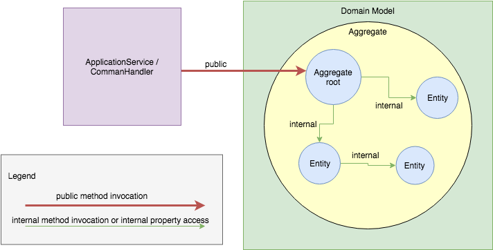
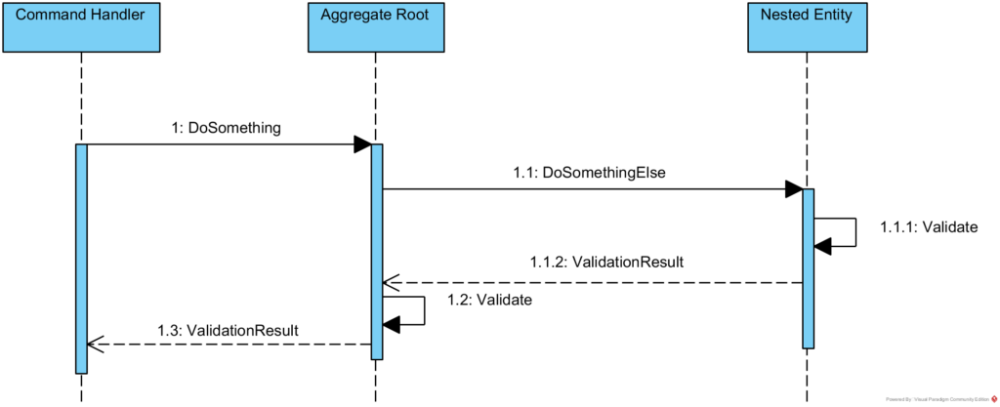
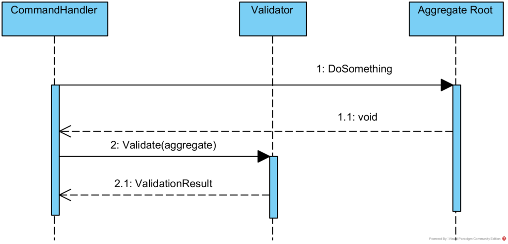
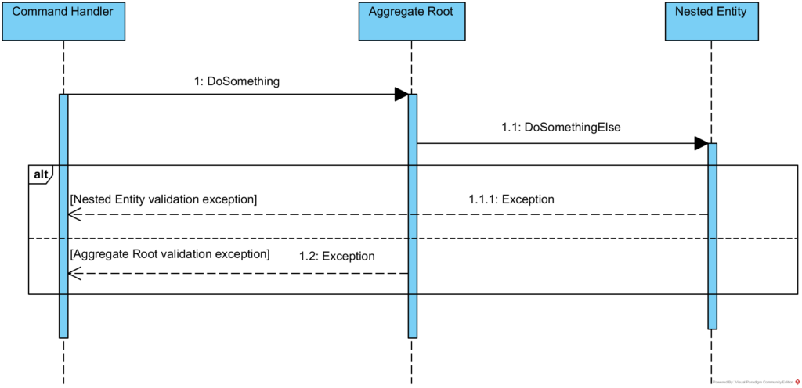
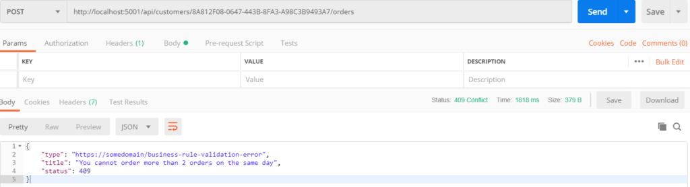

# 领域模型验证

2019-03-04 📂 架构和设计 📂 .NET 📂 领域驱动设计 [原文](https://www.kamilgrzybek.com/blog/posts/domain-model-validation)


## 引言

**引言**

在 [上一篇文章](./rest-api-data-validation.md) 中，我描述了如何在应用服务层验证请求输入数据。
我展示了 [FluentValidation](https://fluentvalidation.net/) 库与 [Pipeline](https://en.wikipedia.org/wiki/Pipeline_(software)) 模式和 [Problem Details](https://tools.ietf.org/html/rfc7807) 标准的结合使用。
在这篇文章中，我想关注位于领域层的第二种验证类型 —— *领域模型验证* 。

## 什么是领域模型验证？

根据范围，我们可以将领域模型的验证分为两种类型：*聚合范围* 和 *限界上下文范围* 。

### 聚合范围

让我们通过引用 Vaughn Vernon [Domain-Driven Design Distilled](https://www.goodreads.com/book/show/28602719-domain-driven-design-distilled) 一书中的一段文本来回顾一下什么是聚合：

> 每个聚合形成一个事务一致性边界。
这意味着，在单个聚合内，当控制事务提交到数据库时，<ins>所有组成的部分必须根据业务规则保持一致</ins>。

在验证的上下文中，我强调了这个引用中最重要的部分。
这意味着 **在任何情况下**，我们都不能将具有无效状态或违反业务规则的聚合持久化到数据库中。
这些规则通常被称为 “**不变量 (invariants)**”，Vaughn Vernon 将其定义如下：

> ……业务不变量 (invariants) ——软件必须始终遵守的规则—— 在每个业务操作之后都被保证是一致的。

因此，在聚合范围的上下文中，我们需要通过在用例（业务操作）处理期间执行验证来保护这些不变量。

### 限界上下文范围

不幸的是，仅验证聚合的不变量是不够的。
有时业务规则可能适用于多个聚合（它们甚至可以是不同类型的聚合）。

例如，假设我们有 `Customer` 实体作为聚合根，业务规则可能是 “客户电子邮件地址必须是唯一的” 。
要检查此规则，我们需要检查所有客户的电子邮件，而它们是独立的聚合根。
这超出了单个客户聚合的范围。
当然，理论上我们可以创建一个名为 `CustomerCatalog` 的新实体作为聚合根，并将所有客户聚合到其中，但由于许多原因，这并不是一个好主意。
更好的解决方案将在本文后面描述。

让我们看看我们有哪些选项来解决这两个验证问题。

## 三种解决方案

### 返回验证对象

这种解决方案基于 [Notification Pattern](https://martinfowler.com/eaaDev/Notification.html) 。
我们定义一个特殊的类，称为 Notification/ValidationResult/Result 等，它 “*在领域层收集有关错误和其他信息，并将其传递出去*”。

这对我们意味着什么？
这意味着对于每个 **改变聚合状态** 的实体方法，我们都应该返回这个验证对象。
这里的关键词是 *实体* ，因为我们在聚合内部可能会有（而且很可能会有的）嵌套方法调用。
回顾一下关于领域模型封装的 [文章](http://www.kamilgrzybek.com/design/domain-model-encapsulation-and-pi-with-entity-framework-2-2/) 中的图：



程序流程将如下所示：



以及代码结构（简化版）：

```csharp
private NestedEntity _nestedEntity;

public ValidationResult DoSomething()
{
    // logic..
    
    ValidationResult nestedEntityValidationResult = _nestedEntity.DoSomethingElse();
    return Validate(nestedEntityValidationResult);
}

private ValidationResult Validate(ValidationResult nestedEntityValidationResult)
{
    // Validate AggregateRoot and check nestedEntityValidationResult.
}


public class NestedEntity
{
    public ValidationResult DoSomethingElse()
    {
        // logic..
        return Validate();
    }

    private ValidationResult Validate()
    {
        //NestedEntity validation...
    }
}
```

然而，如果我们不想从每个改变状态的方法中返回 `ValidationResult`，我们可以应用另一种方法，我在关于发布 *领域事件* 的 [文章](https://kamilgrzybek.com/blog/posts/how-to-publish-handle-domain-events) 中描述过。
简而言之，在这种解决方案中，我们需要为每个实体添加一个 `ValidationResult` 属性（类似于领域事件集合），并在聚合处理完成后检查这些属性，以决定整个聚合是否有效。

### 延迟验证

实现验证的第二种解决方案是在整个聚合的方法处理完成后执行检查。
例如，Jeffrey Palermo 在他的 [文章](https://jeffreypalermo.com/2009/05/the-fallacy-of-the-always-valid-entity/) 中提出了这种方法。
整个解决方案相当直接：



```csharp
public async Task<Unit> Handle(AddCustomerOrderCommand request, CancellationToken cancellationToken)
{
    var customer = await this._customerRepository.GetByIdAsync(request.CustomerId);

    // ....
    
    var order = new Order(orderProducts);
    
    customer.AddOrder(order);

    ValidationResult validationResult = ValidateCustomer(customer);

    await this._customerRepository.UnitOfWork.CommitAsync(cancellationToken);

    return Unit.Value;
}

private ValidationResult ValidateCustomer(Customer customer)
{
    Validatior validator = new Validator();
    return validator.Validate(customer);
}
```

### 始终有效

最后但同样重要的一种解决方案被称为 “始终有效”，它只是在聚合方法内部抛出异常。
这意味着我们在第一次违反聚合不变量时就停止业务操作的处理。
通过这种方式，我们确信我们的聚合始终是有效的：



### 解决方案的比较

我必须承认，我不喜欢 *返回验证对象* 和 *延迟验证* 的方法，并推荐 *始终有效* 策略。
我的推理如下：

*返回验证对象* 方法污染了我们的方法声明，为实体增加了偶然复杂性，并且违反了 [Fail-Fast](https://en.wikipedia.org/wiki/Fail-fast) 原则。
此外，验证对象成为我们领域模型的一部分，并且它肯定不是通用语言的一部分。
另一方面，*延迟验证* 意味着聚合没有被封装，因为验证器对象 **必须能够访问聚合内部** 以正确检查不变量。

然而，这两种方法都有一个优点 —— 它们不需要抛出异常，而异常只应在发生 **意外情况** 时抛出。
业务规则被违反并非意外。

尽管如此，我认为这是一个罕见的可以打破这条规则的例外。
对我来说，抛出异常并拥有始终有效的聚合是最好的解决方案。
我想说 “ *结果证明手段是正当的* ”。
我将此解决方案视为 [Publish-Subsribe](https://en.wikipedia.org/wiki/Publish%E2%80%93subscribe_pattern) 模式的实现。
领域模型是违反不变量消息的发布者，而应用程序是这些消息的订阅者。
主要假设是，在发布消息后，发布者停止处理，因为这就是异常机制的工作方式。

## 始终有效的实现

异常抛出是内置在 C# 语言中的，所以实际上我们拥有了一切。
唯一要做的是创建一个特定的异常类，我将其命名为 `BusinessRuleValidationException`：

```csharp
public class BusinessRuleValidationException : Exception
{
    public string Details { get; }

    public BusinessRuleValidationException(string message) : base(message)
    {
        
    }

    public BusinessRuleValidationException(string message, string details) : base(message)
    {
        this.Details = details;
    }
}
```

假设我们定义了一条业务规则：一天内不能下超过 2 个订单。其实现如下：

```csharp
// Customer aggregate root.
public void AddOrder(Order order)
{
    if (this._orders.Count(x =&gt; x.IsOrderedToday()) &gt;= 2)
    {
        throw new BusinessRuleValidationException("You cannot order more than 2 orders on the same day");
    }

    this._orders.Add(order);

    this.AddDomainEvent(new OrderAddedEvent(order));
}
```

```csharp
// Order entity.
internal bool IsOrderedToday()
{
   return this._orderDate.Date == DateTime.UtcNow.Date;
}
```


我们应该如何处理抛出的异常？
我们可以使用 [REST API 数据验证](./rest-api-data-validation.md) 中的方法，以 Problem Details 对象标准向客户端返回相应的消息。
我们所要做的就是添加另一个 `ProblemDetails` 类，并在 `Startup` 中设置映射：

```csharp
public class BusinessRuleValidationExceptionProblemDetails : Microsoft.AspNetCore.Mvc.ProblemDetails
{
    public BusinessRuleValidationExceptionProblemDetails(BusinessRuleValidationException exception)
    {
        this.Title = exception.Message;
        this.Status = StatusCodes.Status409Conflict;
        this.Detail = exception.Details;
        this.Type = "https://somedomain/business-rule-validation-error";
    }
}
```

```csharp
services.AddProblemDetails(x =>
{
    x.Map<InvalidCommandException>(ex => new InvalidCommandProblemDetails(ex));
    x.Map<BusinessRuleValidationException>(ex => new BusinessRuleValidationExceptionProblemDetails(ex));
});
```

返回给客户端的结果：



### 限界上下文范围验证的实现

那涉及多个聚合（限界上下文范围）的验证呢？
假设我们有一条规则：不能有两个客户拥有相同的电子邮件地址。
有两种方法可以解决这个问题。

第一种方法是在 `CommandHandler` 中获取所需的聚合，然后将它们作为参数传递给聚合的方法/构造函数：

```csharp
// RegisterCustomerCommand handler - get all customers
public async Task<CustomerDto> Handle(RegisterCustomerCommand request, CancellationToken cancellationToken)
{
    var allCustomers = await _customerRepository.GetAll();
    var customer = new Customer(request.Email, request.Name, allCustomers);

    await this._customerRepository.AddAsync(customer);

    await this._customerRepository.UnitOfWork.CommitAsync(cancellationToken);

    return new CustomerDto { Id = customer.Id };
}
```

```csharp
public Customer(string email, string name, List<Customer> allCustomers)
{
    if (allCustomers.Contains(email))
    {
        throw new BusinessRuleValidationException("Customer with this email already exists.");
    }
    this.Email = email;
    this.Name = name;

    this.AddDomainEvent(new CustomerRegisteredEvent(this));
}
```

然而，这并不总是一个好的解决方案，因为如你所见，我们需要将 **所有 `Customer` 聚合加载到内存中** 。
这可能会导致严重的性能问题。
如果我们无法承受，则需要引入第二种方法 —— 创建一个 *领域服务* ，其定义如下（来源 —— [DDD 参考](../ddd-ref/README.md) ）：

> 当领域中的一个重要过程或转换不是实体或值对象的自然职责时，将一个操作添加到模型中，作为一个声明为服务的独立接口。

因此，对于这种情况，我们需要创建一个 `ICustomerUniquenessChecker` 服务接口：

```csharp
public interface ICustomerUniquenessChecker
{
    bool IsUnique(Customer customer);
}
```

这是该接口的实现：

```csharp
public class CustomerUniquenessChecker : ICustomerUniquenessChecker
{
    private readonly ISqlConnectionFactory _sqlConnectionFactory;

    public CustomerUniquenessChecker(ISqlConnectionFactory sqlConnectionFactory)
    {
        _sqlConnectionFactory = sqlConnectionFactory;
    }

    public bool IsUnique(Customer customer)
    {
        using (var connection = this._sqlConnectionFactory.GetOpenConnection())
        {
            const string sql = "SELECT TOP 1 1" +
                               "FROM [orders].[Customers] AS [Customer] " +
                               "WHERE [Customer].[Email] = @Email";
            var customersNumber = connection.QuerySingle&lt;int?&gt;(sql,
                            new
                            {
                                customer.Email
                            });

            return !customersNumber.HasValue;
        }
    }
}
```

最后，我们可以在 `Customer` 聚合内部使用它：

```csharp
public Customer(string email, string name, ICustomerUniquenessChecker customerUniquenessChecker)
{
    this.Email = email;
    this.Name = name;

    var isUnique = customerUniquenessChecker.IsUnique(this);
    if (!isUnique)
    {
        throw new BusinessRuleValidationException("Customer with this email already exists.");
    }

    this.AddDomainEvent(new CustomerRegisteredEvent(this));
}
```

这里的问题是，是将领域服务作为参数传递给聚合的构造函数/方法，还是在命令处理器本身中执行验证。
如你在上面所见，我是前一种方法的粉丝，因为我喜欢让我的 *Command Handler* 非常薄。
支持这种选择的另一个论点是，如果我将来需要从不同的用例注册客户，我将无法绕过并忘记这个唯一性规则，因为我将不得不传递这个服务。

## 总结

在领域模型验证的上下文中，本文涵盖了很多内容。
让我们总结一下：

- 我们有两种类型的 *领域模型验证* —— *聚合范围* 和 *限界上下文范围* 。
- 一般来说，有 3 种 *领域模型验证* 方法 —— 使用 *验证对象* 、*延迟验证* 或 *始终有效*（抛出异常）。
- *始终有效* 方法是首选。
- 对于 *限界上下文范围验证* ，有 2 种验证方法 —— 将所有必需数据传递给聚合的方法或构造函数，或者创建 *领域服务* （通常出于性能原因）。

## 源代码

如果你想查看完整的、可工作的示例，请查看我的 [GitHub 仓库](https://github.com/kgrzybek/sample-dotnet-core-cqrs-api) 。

## 补充资源

- [领域驱动设计（DDD）中的验证](http://gorodinski.com/blog/2012/05/19/validation-in-domain-driven-design-ddd/) —— Lev Gorodinski
- [DDD 世界中的验证](https://lostechies.com/jimmybogard/2009/02/15/validation-in-a-ddd-world/) —— Jimmy Bogard
