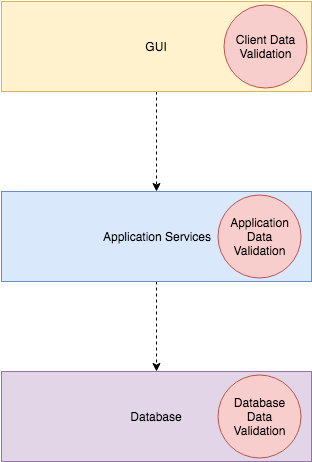
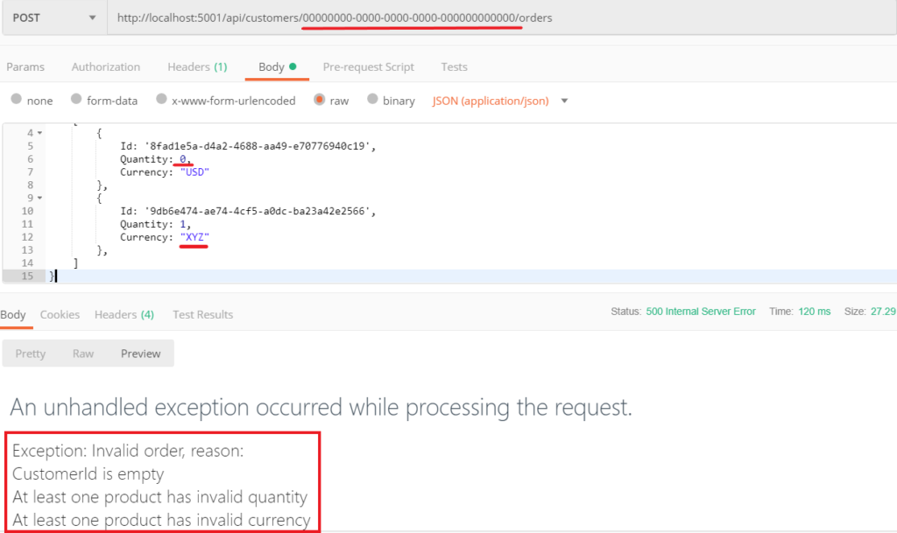
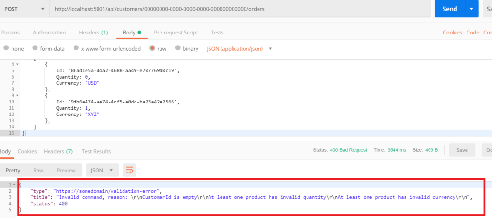

# REST API 数据验证

2019-02-20 📂 架构和设计 📂 .NET [原文](https://kamilgrzybek.com/blog/posts/rest-api-data-validation)

<br/>

## 引言

这一次，我想描述一下我们如何保护 REST API 应用程序免受包含无效数据的请求（数据验证过程）的影响。
然而，仅仅验证我们的请求是不够的。
除了验证之外，我们还有责任向 API 客户端返回相关的消息和状态。
在这篇文章中，我想处理这两件事。

## 数据验证

### 数据验证的定义

数据验证到底是什么？
我能找到的最好的定义来自 UNECE 数据编辑组：

> 一项旨在验证数据项的值是否来自给定的（有限或无限）可接受值集合的活动。

根据这个定义，我们应该 **验证** 从外部来源进入我们应用程序的 **数据项** ，并检查它们的 **值是否可接受** 。
我们如何知道一个值是可接受的呢？
我们需要为系统中处理的每种类型的数据项定义 **数据验证规则** 。

### 数据验证 vs 业务规则验证

我想强调的是，数据验证与 **业务规则** 验证是 **完全不同的概念** 。
数据验证侧重于验证 **原子数据项** 。
业务规则验证是一个更广泛的概念，更接近于业务的工作方式和行为。
因此，它主要侧重于 **行为** 。
当然，验证行为也依赖于数据，但范围更广。

**数据验证示例：**

- 产品订单数量不能为负数或零
- 产品订单数量应该是一个数字
- 订单的货币应该是货币列表中的一个值

**业务规则验证示例：**

- 仅当客户年龄大于或等于产品最低年龄时，才能订购该产品。
- 客户一天内只能下两个订单。

## 返回相关信息

如果我们承认在验证过程中违反了规则，我们必须停止处理并向客户端返回相应的消息。
我们应该遵循以下规则：

- 我们应该尽快向客户端返回消息（ [快速失败 (Fail-fast)](https://en.wikipedia.org/wiki/Fail-fast) 原则）
- 验证错误的原因应该被很好地解释并被客户端理解
- 出于安全原因，我们不应返回技术细节

### HTTP API 问题细节标准

返回错误消息的问题非常普遍，以至于创建了一个特殊标准来描述如何处理此类情况。
它被称为 “HTTP API 问题细节标准”，其官方描述可以在 [这里](https://tools.ietf.org/html/rfc7807) 找到。
以下是该标准的摘要：

> 本文档将 “问题细节 (problem detail)” 定义为一种在 HTTP 响应中携带机器可读错误细节的方式，以避免为 HTTP API 定义新的错误响应格式的需要。

*问题细节* 标准引入了 *Problem Details JSON* 对象，当发生验证错误时，它应该成为响应的一部分。
这是一个简单的规范模型，包含 5 个成员：

- 问题类型（type）
- 标题（title）
- HTTP 状态码（status）
- 错误详情（detail）
- 实例（instance）（指向特定发生的指针）

当然，我们可以（有时也应该）通过添加新属性来扩展此对象，但基础应该是相同的。
这样，我们的 API 更容易理解、学习和使用。
有关标准的更详细信息，我邀请你阅读文档，其中描述得很好。

## 数据验证的本地化

对于标准应用程序，我们可以将数据验证逻辑放在三个地方：

- GUI —— 这是用户输入的入口点。
数据在客户端进行验证，例如使用 JavaScript 用于 Web 应用程序

- 应用逻辑/服务层 —— 数据在服务器端的特定应用服务或命令处理器中验证

- 数据库 —— 这是请求处理的出口点，也是验证数据的最后时刻


*数据验证的本地化*

在本文中，我略过了 GUI 和数据库组件，专注于应用程序的服务器端。让我们看看如何在应用服务层实现数据验证。

## 实现数据验证

假设我们有一个命令 `AddCustomerOrderCommand`：

```csharp
public class AddCustomerOrderCommand : IRequest
{
    public Guid CustomerId { get; }

    public List<ProductDto> Products { get; }

    public AddCustomerOrderCommand(
        Guid customerId, 
        List<ProductDto> products)
    {
        this.CustomerId = customerId;
        this.Products = products;
    }
}

public class ProductDto
{
    public Guid Id { get; set; }

    public int Quantity { get; set; }

    public string Currency { get; set; }

    public string Name { get; set; }
}
```

假设我们要验证 4 件事：

1. `CustomerId` 不是空的 GUID。
2. `Products` 列表不为空。
3. 每个产品的数量大于 0。
4. 每个产品的货币等于 USD 或 EUR。

让我展示解决这个问题的 3 种方案 —— 从简单到最复杂的。

### 1. 在应用服务上进行简单验证

首先想到的可以是在 `_Command Handler` 本身中进行简单的验证。
在这种解决方案中，我们需要实现一个私有方法来验证我们的命令，并在发生验证错误时抛出异常。
从 [整洁代码](https://kamilgrzybek.com/blog/posts/10-common-broken-clean-code-rules) 的角度来看，
将这种逻辑封装在单独的方法中更好（参见 [Extract Method](https://docs.microsoft.com/en-us/visualstudio/ide/reference/extract-method) ）。

```csharp
public class AddCustomerOrderCommandHandler : IRequestHandler<AddCustomerOrderCommand>
{
    private readonly ICustomerRepository _customerRepository;
    private readonly IProductRepository _productRepository;

    public AddCustomerOrderCommandHandler(
        ICustomerRepository customerRepository, 
        IProductRepository productRepository)
    {
        this._customerRepository = customerRepository;
        this._productRepository = productRepository;
    }

    public async Task<Unit> Handle(AddCustomerOrderCommand request, CancellationToken cancellationToken)
    {
        Validate(request);
        var customer = await this._customerRepository.GetByIdAsync(request.CustomerId);

        // logic..
    }

    private static void Validate(AddCustomerOrderCommand command)
    {
        var errors = new List<string>();

        if (command.CustomerId == Guid.Empty)
        {
            errors.Add("CustomerId is empty");
        }

        if (command.Products == null || !command.Products.Any())
        {
            errors.Add("Products list is empty");
        }
        else
        {
            if (command.Products.Any(x => x.Quantity < 1))
            {
                errors.Add("At least one product has invalid quantity");
            }

            if (command.Products.Any(x => x.Currency != "USD" &amp;&amp; x.Currency != "EUR"))
            {
                errors.Add("At least one product has invalid currency");
            }
        }

        if (errors.Any())
        {
            var errorBuilder = new StringBuilder();

            errorBuilder.AppendLine("Invalid order, reason: ");

            foreach (var error in errors)
            {
                errorBuilder.AppendLine(error);
            }

            throw new Exception(errorBuilder.ToString());
        }
    }
}
```

执行无效命令的结果：



这种方法不算太差，但有两个缺点。
首先，它需要我们编写大量简单且重复的代码 —— 比较 null、默认值、列表中的值等。
其次，我们在这里失去了部分关注点分离，因为我们将验证逻辑与编排用例流程混在一起。
让我们首先处理重复代码的问题。

### 2. 使用 FluentValidation 库进行验证

我们不想 [重新发明轮子](https://en.wikipedia.org/wiki/Reinventing_the_wheel)，所以最好的解决方案是使用库。
幸运的是，在 .NET 世界中有一个很棒的验证库 —— FluentValidation](https://fluentvalidation.net/) 。
它拥有良好的 API 和许多功能。
下面是我们如何使用它来验证命令：

```csharp
// FluentValidation validator
public class AddCustomerOrderCommandValidator : AbstractValidator<AddCustomerOrderCommand>
{
    public AddCustomerOrderCommandValidator()
    {
        RuleFor(x => x.CustomerId).NotEmpty().WithMessage("CustomerId is empty");
        RuleFor(x => x.Products).NotEmpty().WithMessage("Products list is empty");
        RuleForEach(x => x.Products).SetValidator(new ProductDtoValidator());
    }
}

public class ProductDtoValidator : AbstractValidator<ProductDto>
{
    public ProductDtoValidator()
    {
        this.RuleFor(x => x.Currency).Must(x => x == "USD" || x == "EUR")
            .WithMessage("At least one product has invalid currency");
        this.RuleFor(x => x.Quantity).GreaterThan(0)
            .WithMessage("At least one product has invalid quantity");
    }
}
```

现在，`Validate` 方法看起来像这样：

```csharp
// Validate with FluentValidation
private static void Validate(AddCustomerOrderCommand command)
{
    AddCustomerOrderCommandValidator validator = new AddCustomerOrderCommandValidator();

    var validationResult = validator.Validate(command);
    if (!validationResult.IsValid)
    {
        var errorBuilder = new StringBuilder();

        errorBuilder.AppendLine("Invalid order, reason: ");

        foreach (var error in validationResult.Errors)
        {
            errorBuilder.AppendLine(error.ErrorMessage);
        }

        throw new Exception(errorBuilder.ToString());
    }
}
```

验证的结果与之前相同，但现在我们的验证逻辑更加清晰了。
最后要做的是将此逻辑与 `Command Handler` 完全解耦……

### 3. 使用管道模式进行验证

为了解耦验证逻辑并在 `Command Handler` 执行 **之前** 执行它，我们将命令处理过程安排在 [Pipeline](https://en.wikipedia.org/wiki/Pipeline_(software)) 中
（参见 [NServiceBus Pipeline](https://docs.particular.net/nservicebus/pipeline/) ）。

对于 `Pipeline` 实现，我们可以轻松使用 [MediatR Behaviors](https://github.com/jbogard/MediatR/wiki/Behaviors) 。
首先要做的是实现行为：

```csharp
// CommandValidationBehavior
public class CommandValidationBehavior<TRequest, TResponse> : IPipelineBehavior<TRequest, TResponse>
{
   private readonly IList<IValidator<TRequest>> _validators;

   public CommandValidationBehavior(IList<IValidator<TRequest>> validators)
   {
       this._validators = validators;
   }

   public Task<TResponse> Handle(TRequest request, CancellationToken cancellationToken, RequestHandlerDelegate<TResponse> next)
   {
       var errors = _validators
           .Select(v => v.Validate(request))
           .SelectMany(result => result.Errors)
           .Where(error => error != null)
           .ToList();

       if (errors.Any())
       {
           var errorBuilder = new StringBuilder();

           errorBuilder.AppendLine("Invalid command, reason: ");

           foreach (var error in errors)
           {
               errorBuilder.AppendLine(error.ErrorMessage);
           }

           throw new Exception(errorBuilder.ToString());
       }

       return next();
   }
}
```

接下来要做的是在 IoC 容器中注册行为（Autofac 示例）：

```csharp
// Register CommandValidationBehavior
public class MediatorModule : Autofac.Module
{
    protected override void Load(ContainerBuilder builder)
    {
        builder.RegisterAssemblyTypes(typeof(IMediator).GetTypeInfo().Assembly).AsImplementedInterfaces();

        var mediatrOpenTypes = new[]
        {
            typeof(IRequestHandler<,>),
            typeof(INotificationHandler<>),
            typeof(IValidator<>),
        };

        foreach (var mediatrOpenType in mediatrOpenTypes)
        {
            builder
                .RegisterAssemblyTypes(typeof(GetCustomerOrdersQuery).GetTypeInfo().Assembly)
                .AsClosedTypesOf(mediatrOpenType)
                .AsImplementedInterfaces();
        }

        builder.RegisterGeneric(typeof(RequestPostProcessorBehavior<,>)).As(typeof(IPipelineBehavior<,>));
        builder.RegisterGeneric(typeof(RequestPreProcessorBehavior<,>)).As(typeof(IPipelineBehavior<,>));

        builder.Register<ServiceFactory>(ctx =>
        {
            var c = ctx.Resolve<IComponentContext>();
            return t => c.Resolve(t);
        });

        builder.RegisterGeneric(typeof(CommandValidationBehavior<,>)).As(typeof(IPipelineBehavior<,>));
    }
}
```

通过这种方式，我们以一种优雅的方式实现了关注点分离和快速失败 (Fail-fast) 原则。
但这还不是结束。
最后，我们需要对返回给客户端的消息进行处理。

## 实现问题细节标准

正如验证逻辑的实现一样，我们将使用一个专用库 —— [ProblemDetails](https://www.nuget.org/packages/Hellang.Middleware.ProblemDetails/) 。
该机制的原理很简单。
首先，我们需要创建一个自定义异常：

```csharp
// InvalidCommandException
public class InvalidCommandException : Exception
{
    public string Details { get; }
    public InvalidCommandException(string message, string details) : base(message)
    {
        this.Details = details;
    }
}
```

其次，我们必须创建自己的 Problem Details 类：

```csharp
// InvalidCommandProblemDetails
public class InvalidCommandProblemDetails : Microsoft.AspNetCore.Mvc.ProblemDetails
{
    public InvalidCommandProblemDetails(InvalidCommandException exception)
    {
        this.Title = exception.Message;
        this.Status = StatusCodes.Status400BadRequest;
        this.Detail = exception.Details;
        this.Type = "https://somedomain/validation-error";
    }
}
```

最后要做的是在启动中添加 `Problem Details` [中间件](https://docs.microsoft.com/en-us/aspnet/core/fundamentals/middleware/?view=aspnetcore-2.2)，并定义 `InvalidCommandException` 与 `InvalidCommandProblemDetails` 类之间的映射：

```csharp
// Startup
services.AddProblemDetails(x =>
{
    x.Map<InvalidCommandException>(ex => new InvalidCommandProblemDetails(ex));
});

....

app.UseProblemDetails();
```


在修改 `CommandValidationBehavior`（抛出 `InvalidCommandException` 而不是普通 `Exception`）之后，我们返回的内容将与标准兼容：



## 总结

在这篇文章中，我描述了：

- 什么是数据验证及其所在位置
- 什么是 HTTP API *问题细节* 以及如何实现它
- 在应用服务层实现数据验证的 3 种方法：不使用任何模式和工具、使用 FluentValidation 库，以及最后 —— 使用 `Pipeline` 模式和 `MediatR Behaviors` 。

## 源代码

如果你想查看完整的、可工作的示例，请查看我的 [GitHub 仓库](https://github.com/kgrzybek/sample-dotnet-core-cqrs-api) 。
