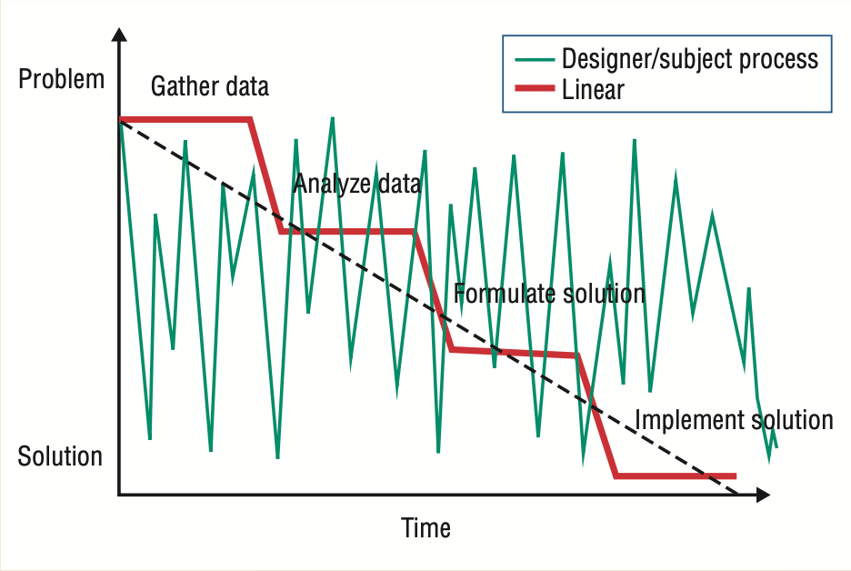
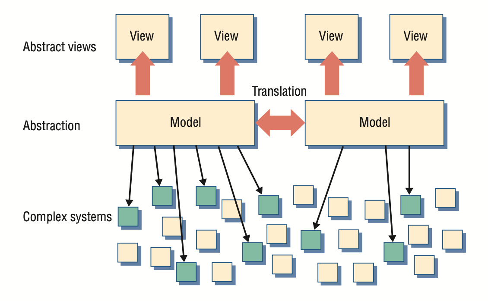

# 模型驱动工程
Douglas C. Schmidt 范德堡大学

***特邀编辑导言***

2006 [original english](original/schmidt2006.pdf)

模型驱动工程技术为解决第三代语言无法有效缓解平台复杂性及表达领域概念的问题提供了极具前景的解决方案。

----
过去五十年间，软件研究者与开发者不断创造抽象概念，使他们能够基于设计意图而非底层计算环境（例如 CPU、内存和网络设备）进行编程，从而隔绝这些环境的复杂性。

从计算机发展的早期阶段起，这些抽象概念就涵盖了语言和平台技术。例如，早期编程语言（如汇编语言和 Fortran）使开发人员免于处理机器代码编程的复杂性。同样，早期操作系统平台（如 OS/360 和 Unix）也使开发人员免于直接面向硬件编程的复杂性。

尽管这些早期语言和平台提升了抽象层次，但它们仍具有鲜明的 “计算导向” 特征。具体而言，它们提供的是解决方案空间的抽象——即计算技术本身所处的领域——而非问题空间的抽象，后者通过电信、航空航天、医疗保健、保险和生物学等应用领域的概念来表达设计。

----
## 计算机辅助软件工程的经验教训
过去的各种努力创造了技术，这些技术进一步提升了用于开发软件的抽象层次。

20世纪80年代启动的一项重要举措是计算机辅助软件工程（CASE），其核心在于开发软件方法与工具，使开发者能够通过通用图形化编程表示形式（如状态机、结构图和数据流图）来表达设计。CASE 的一个目标是实现对图形化程序的更深入分析——这类程序比传统通用编程语言更少复杂性，例如可避免 C 语言相关的内存损坏和泄漏问题。另一目标则是从图形化表示中合成实现构件，从而减少手动编码、调试和移植程序的工作量。

尽管 CASE 在研究和行业文献中备受关注，但在实际应用中并未得到广泛采用。<ins>其面临的一个问题在于：CASE 工具中用于编写程序的通用图形化语言表示形式，与底层平台的映射效果不佳</ins>。这些平台主要是一些单节点操作系统——如 DOS、OS/2 或 Windows ——它们缺乏对关键服务质量（QoS）属性的支持，例如透明分布、容错性和安全性。为弥补底层平台的缺陷而生成的代码量与复杂度，远超当时可用的转换技术能力范围，这使得基于 CASE 工具开发的应用程序及其工具本身难以进行开发、调试和演进。

<ins>CASE 的另一个问题在于其无法扩展以处理广泛应用领域中复杂的生产级系统</ins>。总体而言，CASE 工具不支持并行工程，因此仅适用于由单人编写的程序，或由团队通过串行化访问方式使用这些工具的文件。此外，由于缺乏强大的通用中间件平台，CASE 工具针对专有执行环境开发，导致其生成的代码难以与其他软件语言及平台技术集成。CASE 工具还因其 “一刀切” 的图形化表示过于通用且不可定制，导致无法有效支持众多应用领域。

因此，在 1980 至 1990 年代，CASE 对商业软件开发的影响相对有限，主要集中在少数几个领域，例如电信呼叫处理——这类领域能很好地映射到状态机表示法。在实际应用中，CASE 工具主要局限于一类子集：这类工具能帮助设计师绘制软件架构图并记录设计决策，程序员随后据此指导手工编写的实现方案的创建与演进。然而由于图表与实现之间缺乏直接关联，开发人员往往不重视图表的准确性——这些图表在项目后期极少与代码保持同步。

----
## 当前平台与语言的局限性
<ins>过去二十年间语言与平台的进步，提升了开发人员可用的软件抽象层次，从而消除了早期计算机辅助软件工程（CASE）努力面临的障碍之一</ins>。例如，当今开发者通常采用更具表达力的面向对象语言（如 C++、Java 或 C#），而非 Fortran 或 C 语言。同样，现代可复用类库与应用框架平台最大限度减少了对常见及领域特定中间件服务的重复开发需求，例如事务处理、发现机制、容错机制、事件通知、安全机制及分布式资源管理等。因此，随着第三代语言和可复用平台的成熟，软件开发人员如今更能有效隔离早期技术构建应用程序时的复杂性。

<ins>尽管取得了这些进展，若干棘手问题依然存在。这些问题的核心在于平台复杂性的增长，其演进速度已超越通用语言掩盖复杂性的能力</ins>。例如，诸如 J2EE、.NET 和 CORBA 等主流中间件平台包含数千个类和方法，它们之间存在大量复杂的依赖关系和微妙的副作用，需要投入大量精力才能正确编程和调优。此外，由于这些平台往往快速演进——且新平台层出不穷——开发人员不得不耗费大量精力手动将应用程序代码移植到不同平台或同一平台的新版本上。

一个相关的问题是，大多数应用程序和平台代码仍采用第三代语言手动编写和维护，这导致耗费过多时间和精力——尤其在关键的集成相关活动中，如系统部署、配置和质量保证。例如，要编写能够正确且最优地部署由数百或数千个互联软件组件构成的大型分布式系统的 Java 或 C# 代码非常困难。<ins>即使使用基于 XML 的部署描述符等新型标记语言——这类语言在组件和面向服务架构的中间件平台中很流行——也充满复杂性。这种复杂性很大程度上源于设计意图与表达之间的语义鸿沟</ins>——例如 “根据系统资源需求和可用性，将组件 1-50 部署到节点 A-G，组件 51-100 部署到节点 H-N” ，而这种意图却需要通过数千行手工编写的 XML 来表达，其视觉密集的语法既无法传达领域语义，也无法传递设计意图。

<ins>由于此类问题，软件行业正面临复杂性瓶颈——新一代平台技术（如 Web 服务和产品线架构）已变得极其复杂，开发者需耗费数年时间掌握并应对平台 API 和使用模式，且通常仅熟悉其常用平台的子集</ins>。此外，第三代语言要求开发人员高度关注大量战术性命令式编程细节，导致他们往往无暇顾及系统级正确性与性能等战略性架构问题。

----
## 模型驱动工程
为应对平台复杂性——以及第三代语言无法有效缓解这种复杂性并准确表达领域概念的局限性——一种极具前景的方法是开发模型驱动工程（MDE）技术，该技术融合了以下要素：

- *特定领域建模语言（DSML）* 通过其类型系统，将特定领域的应用结构、行为及需求形式化，例如软件定义无线电、航电任务计算、在线金融服务、仓库管理，甚至中间件平台领域。<ins>DSML 通过元模型进行描述，元模型定义了领域概念间的关联关系，并精确规定了这些领域概念的关键语义与约束条件</ins>。开发者利用 DSML 构建应用程序时，采用元模型捕获的类型系统元素，以声明式而非命令式方式表达设计意图。
- *转换引擎和生成器* 通过分析模型的特定方面，进而合成各类工件 (artifact)，例如源代码、仿真输入、XML 部署描述或替代模型表示形式。<ins>从模型中合成工件的能力有助于确保应用实现与（模型捕获的功能及 QoS 要求）相关分析信息之间的一致性</ins>。<ins>这种自动化转换过程常被称为 “构造即正确 (correct-by-construction)”，区别于传统手工编写的 “修正即构造 (construct-by-correction)” 软件开发流程——后者既繁琐又易出错</ins>。

现有及新兴的 MDE 技术借鉴了早期开发更高层次平台与语言抽象的经验教训。例如，<ins>相较于难以准确表达应用领域概念与设计意图的通用记法，通过元建模定制的 DSML 能精准匹配特定领域的语义与语法</ins>。引入直接关联熟悉领域的图形元素，不仅能降低学习门槛，更能帮助更广泛的领域专家，如系统工程师和资深软件架构师，确保软件系统满足用户需求。

<ins>此外，MDE工具会施加领域特定约束并执行模型检查，从而能在生命周期早期阶段检测并预防诸多错误</ins>。此外，由于当今平台的功能和 QoS 远比 1980 年代和 1990 年代丰富，MDE 生成器工具无需过于复杂——它们能够合成映射到更高层级（通常是标准化）中间件平台 API 和框架的构件，而非低层操作系统 API。因此，基于这些工具开发的 MDE 工具及其应用程序，其开发、调试和演进过程往往更为简便。

----
## 本期内容
本期《计算机》特刊收录了四篇论文，介绍了近期研发成果，这些成果代表了新一代 MDE 工具与环境的发展方向。

其中两篇聚焦于创建语言，迫切需要创建能够降低现代平台开发与使用复杂性的语言。Krishnakumar Balasubramanian 及其同事的 "Developing Applications Using Model-Driven Design Environments" 介绍了多种 DSML，可简化并自动化，基于组件的分布式实时与嵌入式系统的开发、优化、部署及验证活动。Adam Childs 及其同事的 "CALM and Cadena: Metamodeling for Component- Based Product-Line Development" 提出了一种 MDE 框架，该框架通过扩展类型系统，捕获基于组件的软件产品线架构，并将这些架构分层组织，从而实现将平台无关模型转换为平台特定模型的目标。

当开发人员将 MDE 工具应用于包含数千个元素的大型系统时，必须能够快速检视多种设计方案，并评估可用的众多配置可能性。Jeff Gray  及其同事在 "Automating Change Evolution in Model-Driven Engineering" 一文中，提出了一种用于探索和操作大型模型的模型转换引擎。该方案既解决了 MDE 中的伸缩性问题（例如，将传感器网络的基础模型扩展至数千个传感器），又采用面向方面的方法处理横切关注点（例如跨越多个航电组件的飞行数据记录器策略）。

<ins>随着 MDE 工具跨越早期采用者与主流软件开发者之间的鸿沟，关键挑战在于制定实用标准，使工具与模型能够便携且高效地协同工作</ins>。在 "Model-Driven Development Using UML 2.0: Promises and Pitfalls" 一文中，Robert B. France 及同事从支持 MDE 的角度，对 UML 2.0 功能的优劣进行了评估。

<ins>有关 MDE 标准化的另一信息来源可访问对象管理组织 (OMG) 网站（http://mic.omg.org）</ins>，该网站介绍了模型集成计算平台特别兴趣小组 (Model-Integrated Computing Platform Special Interest Group) 的工作——该小组正致力于将政府机构，如国防高级研究计划局 (DARPA) 和国家科学基金会 (NSF)，资助的研发成果进行标准化。

研发成果向标准转化的典型案例是开放工具集成框架（OTIF），一个基于元模型的MDE工具集成方案，定义了架构组件（如工具适配器和语义转换器）及交互协议，用于构建集成化设计工具链。其他标准，如 Query/Views/Transformations 以及作为基于 UML 的模型驱动架构 OMG 标准组成部分的 MetaObject Facility ，同样可作为特定领域 MDE 工具的基础。

<ins>然而，仅凭标准本身并不足够，还需有坚实的基础设施支持来开发和演进 MDE 工具与应用</ins>。本期特刊中的文章描述了多种 MDE 工具的应用实例，例如：IBM 的 Eclipse 平台以及软件集成系统研究所 (ISIS) 的 Generic Modeling Environment（GME），这些工具已被应用于各类商业项目和研发项目。<ins>为深入探讨商业应用实践，两篇侧栏文章，Daniel Waddington 与 Patrick Lardieri 合著的 "[Model-Centric Software Development](#模型为中心的软件开发)"，以及 John M. Slaby 与 Steven D. Baker 合著的 "[Domain-Specific Modeling Languages for Enterprise DRE System QoS](#面向企业-dre-系统-qos-的-dsml)"，总结了大型系统集成商将 MDE 工具应用于复杂指挥控制系统及舰载计算项目的实践经验</ins>。

从这类项目中汲取的经验有助于完善 MDE 工具基础设施，使其更成熟可靠，从而能够应用于主流商业项目。未来值得关注的几款新兴 MDE 工具包括：Eclipse Graphical Modeling Framework、微软 Visual Studio Team System 中的 DSL 工具包，以及 SourceForge 提供的 openArchitectureWare。

正如本期特刊文章所展示的，全球多年研发努力带来的最新进展，已使 MDE 成功应用于满足复杂软件系统的诸多需求。<ins>为避免早期 CASE 工具与其他技术集成不佳的问题，这些 MDE 实践认识到仅凭模型不足以开发复杂系统</ins>。

因此，这些文章阐述了 MDE 如何利用、增强并整合其他技术，例如设计模式、模型检查器、第三代语言与面向切面语言、应用框架、组件中间件平台以及产品线架构。<ins>在此更广阔的背景下，模型与 MDE 工具作为统一载体，在系统生命周期的多个阶段系统性地记录、分析和转换信息，通过通用的或领域特定的符号体系捕捉应用程序结构、行为及服务质量（QoS）的各个维度</ins>。

尽管行业媒体上涌现了大量关于模型驱动主题的宣传报道，但令人惊讶的是，关于 MDE 技术、在复杂生产级系统中的应用这些技术，以及对 MDE 优势和仍需关注领域的直率评估，要找到关于这方面的扎实技术资料却相当困难。例如：需要进一步研发以支持往返并发工程，及模型与源代码间的同步，或模型与其他模型表示形式间的同步；改进建模层面的调试能力；确保 MDE 工具的向后兼容性；标准化元建模环境与模型交换格式；捕捉任意应用领域的设计意图； 实现模型转换与 QoS 属性的规范与综合自动化，以简化模型与元模型的演进过程，并验证 DSML 及其生成成果中模型的安全属性。

尽管 MDE 仍面临某些研发挑战，但数十年的发展与商业化进程已使我们积累了跨越鸿沟、进入主流软件实践者的关键规模。本期文章旨在以扎实的技术洞见和从复杂系统实践中获取的经验取代炒作，我们诚邀您加入 MDE 社区，在未来的会议、期刊及其他出版平台分享您的实践经验。有关软件系统模型驱动工程的学习与信息交流活动日程，请访问 www.planetmde.org 获取最新动态。

----
## 致谢
感谢Frank Buschmann, Jack Greenfield, Kevlin Henney, Andrey Nechypurenko, Jeff Parsons 和 Markus Völter 2005 年德国慕尼黑面向对象编程大会上的热烈讨论，这些讨论帮助我形成了对现代语言和平台中 MDE 作用的思考。同时感谢 Arvind S. Krishna 对本期特刊的启发。最后，谨向 MDE 研发社区的成员们致谢，正是你们推动了生成式软件技术领域至关重要的范式转变。

----
# 模型为中心的软件开发
Daniel Waddington, Patrick Lardieri，洛克希德·马丁先进技术实验室

利用模型来缓解软件复杂性的理念已存在多年。然而，研究人员主要将模型应用于开发过程的特定环节，尤其是在设计阶段关注结构与组合方面，而在测试阶段则侧重模型检查与验证。

----
## 集成建模方法
在洛克希德·马丁公司，我们正在开发一种模型驱动工程方法，称为模型为中心的软件开发（Model-Centric Software Development, MCSD）。这是一种集成方法，模型贯穿开发过程的所有阶段。我们的愿景与其他软件建模实践存在微妙差异，例如 OMG 的模型驱动架构（Model-Driven Architecture, MDA）[1](#1) 和微软的软件工厂 [2](#2) 主要侧重于从模型生成产出物 (artifact)。而 MCSD 则基于以下理念：

- *避免采用单一语言通用的方法*。我们的方法使用领域特定建模语言（DSML）来表示“关注点”，例如数据访问的原子性、端到端消息延迟以及资源争用。
- *自动生成部分实现构件 (artifact)*。模型元素与对应实现元素之间的映射关系定义明确。部分实现不仅限于程序骨架，还可包含精细化的具体功能，以及软件仿真器和模拟器的规范说明。仅凭模型本身无法构建完整的实现方案。
- *通过逆向工程整合遗留资产*。大型系统本质上需要整合遗留实现资产。逆向工程用于从现有源代码构建模型（同样针对特定关注点）。此前许多从源代码逆向工程模型的尝试均因缺乏对关注点的约束而失败。
- *模型验证与检查*。开发人员可结合静态分析、快速原型生成及运行时性能分析来评估设计方案。

我们的经验表明，将这些概念结合起来为大规模系统开发提供了充满希望的方向。

----
## 运用 MCSD 解决棘手问题
根据我们开发大型软件系统的经验，<ins>软件开发成本膨胀和上市周期延长的主要原因在于串行化分阶段开发模式，这种模式使得设计决策的评估必须等到实现阶段完成后才能进行。开发人员可在实现完成前评估某些设计属性，如接口兼容性，但其他属性，如无死锁特性和可扩展性，则需实际运行软件才能验证</ins>。若在软件开发生命周期后期才发现导致这些问题的设计缺陷，将显著推高成本并造成严重延误。

<ins>在处理 “棘手” 问题的大型系统中，串行化分阶段开发模式中的后期设计评估问题尤为突出，这类问题往往在解决方案形成前难以被充分理解</ins>。因此，如 [Figure A](#figure-a) 所示，问题认知与解决方案之间的迭代过程需要在软件设计、实现和测试环节进行多次往复。

#### Figure A

*Figure A: 棘手问题导致的线性问题解决偏差。在问题理解与解决方案之间反复迭代，需要在软件设计、实现和测试之间进行多次循环。*

为开发适用于大规模系统及系统集群的高效软件，洛克希德·马丁公司正应用 MCSD 技术与流程，以缓解串行化阶段带来的问题。

我们特别关注执行架构建模的研究，致力于使系统工程师能够探索执行设计及其对系统动态的影响；这通过静态分析和快速生成用于仿真与仿真器的产出物 (artifact) 实现。该方法促进了问题定义与实现方案之间的快速迭代。

<ins>我们学到的重要教训是：模型不应用于复制编程语言提供的抽象概念</ins>。如 [Figure B](#figure-b) 所示，模型应当对已实现的复杂系统进行选择性抽象。

#### Figure B

*Figure B: 视图、模型与实现之间的关系。模型并非复制编程语言提供的抽象概念，而是对已实现复杂系统的 "选定" 要素进行抽象。*

我们认为仅凭系统模型就生成完整的实现方案在短期内并不可行。此外，我们确信需要多种建模符号表示法与解释（视角）来呈现不同关注点，并在 MCSD 框架内承担不同角色，例如正确性验证、通过可视化解释方便人类理解，以及代码生成等任务。

洛克希德·马丁公司正通过整合元建模、模型检查与验证、代码生成及逆向工程等精选技术，致力于实现 MCSD 愿景。我们正量身定制解决方案，以满足信息系统与解决方案部门的特定业务需求，并支持其整合大规模信息处理系统的需求。

----
## 参考文献

#### 1
OMG, “Model Driven Architecture (MDA),” document ormsc/2001-07-01,Architecture Board ORMSC, July 2001.

#### 2
J. Greenfield et al., Software Factories: Assembling Applications with Patterns,Models,Frameworks andTools,JohnWiley & Sons,2004.

#### 3
H. Rittel and M.Webber,“Dilemmas in a General Theory of Planning,” Policy Sciences, vol. 4, no. 2, 1973, pp.155-169.

----
**Daniel Waddington** 是洛克希德·马丁公司先进技术实验室，工程团队的核心成员，新泽西州切里希尔。联系邮箱：dwadding@atl.lmco.com。

**Patrick Lardieri** 现任洛克希德·马丁先进技术实验室，分布式处理项目经理，新泽西州切里希尔。联系邮箱：plardieri@atl.lmco.com。

----
# 面向企业 DRE 系统 QoS 的 DSML
John M. Slaby and Steven D. Baker, Raytheon, Portsmouth, R.I.

研究人员正越来越多地在多个领域开发企业系统，这些系统采用基于功能丰富的中间件框架运行的分布式组件构建的应用程序，这种架构常被称为 *面向服务的架构 (service-oriented architecture)*。

----
## SOA 中间件
在 SOA 中间件中，软件组件为各类应用领域提供可复用服务，这些服务随后被组合成特定领域的程序集以供应用程序（重复）使用。SOA 中间件平台的实例包括 J2EE、.NET 以及 CORBA 组件模型（CORBA Component Model, CCM）。

SOA 中间件在企业业务系统领域的转型势头正盛，因为它有助于僵化问题，以及核心功能重复开发的问题，这些问题与传统单体式、功能化设计及 “烟囱式” 遗留应用有关。软件工程师开发遗留应用程序时，会针对特定需求和运行条件设计精确的功能模块；而 SOA 组件则具备可扩展能力，使其能在不同场景中复用。此外，企业系统采用分层架构开发，包含基础架构中间件服务（如命名与发现、事件与通知、安全与容错）以及应用组件，这些组件通过不同组合方式调用上述服务。

开发人员还正在将某些基于 SOA 的中间件（如实时 CCM）应用于企业分布式实时与嵌入式（distributed real-time and embedded, DRE）系统领域，例如，全船计算环境和监督控制与数据采集系统，以通过计算机网格为用户提供服务质量支持，确保在正确的时间、正确的地点处理正确的数据。企业级 DRE 系统所需的 QoS 特性包括：低延迟与低抖动，如同传统实时嵌入式系统要求的，以及高吞吐量、可扩展性和高可靠性，如同传统企业分布式系统要求的。实现这种 QoS 能力的组合具有相当难度。

SOA 中间件还会通过将责任从软件开发工程师转移至其他类型的软件工程师（如软件配置与部署工程师）及系统工程师，从而使软件生命周期流程变得复杂化。传统上，软件开发工程师采用自上而下的设计方法在内部创建完整应用程序，并能在整个生命周期中进行评估。相比之下，如今软件配置与部署工程师及系统工程师必须越来越多地通过定制和组合可重用的 SOA 组件来构建企业级分布式资源环境系统，而这些组件的组合特性通常仅在集成阶段进行评估。遗憾的是，集成阶段暴露的问题修复成本远高于生命周期早期发现时。因此，关键研发挑战在于将此类问题（往往依赖于开发后期才可获取的组件）提前暴露在生命周期更早阶段 -- 即系统集成阶段之前。

基于 SOA 的企业级 DRE 系统需要设计和运行时的配置步骤，这些步骤通过定制可重用组件的行为，使其在执行环境中满足 QoS 要求。寻找合适的（组件）配置以满足应用 QoS 要求可能是一项艰巨的任务。例如，调整 DRE 舰载计算系统的并发配置，以同时支持实时和容错 QoS，其涉及的权衡取舍甚至令经验最丰富的工程师都感到棘手。此外，由于应用功能在 SOA 中分布于众多组件，开发人员必须正确高效地互联集成组件，采用传统手工配置流程时，此过程既繁琐又易出错。

组装成应用程序的组件也必须部署在企业 DRE 系统中的相应节点上。该部署过程难度较大，因为组件部署的主机特性及其通信网络可能存在静态差异（例如，产品线架构中使用的不同软硬件平台）和动态变化（例如，损坏故障、计算目标变更，或实际运行中应用行为与预期存在偏差）。因此评估系统部署的运行特性既繁琐又易出错，尤其当开发人员手动执行部署时。

## 解决方案方法：系统执行的建模工具
尽管 SOA 中间件提供了高度灵活性，但令人惊讶的是，很少有配置和部署设计能够满足企业级 DRE 系统对功能和 QoS 的要求。

为应对这些挑战，雷神公司正在开发系统执行建模（system execution modeling, SEM）工具，该工具融合了支持 QoS 的 SOA 中间件与模型驱动开发（model-driven development, MDD）技术。软件架构师、开发人员和系统工程师可借助这些 SEM 工具，在多个生命周期阶段，从多重计算与评估视角出发，运用多种质量标准，协同多方利益相关者及供应商，探索设计的替代方案。

除了验证设计规则和检查设计符合性外，这些 SEM 工具还能促进对替代方案进行 “假设分析”，从而量化特定设计选择对端到端系统性能的影响及成本。这些选择包括：确定主机在性能下降前可处理的最大组件数量、各类工作负载的平均响应时间与最差响应时间，以及不同系统部署方案和配置满足各类工作负载端到端 QoS 要求的能力。

在企业级 DRE 系统中，我们的 SEM 工具能帮助开发人员、系统工程师和最终用户在系统生命周期的早期阶段，即架构和设计阶段，而非集成阶段，发现、衡量并纠正集成与性能问题。在集成阶段修复错误将困难得多且成本更高。

借助 SEM 工具，用户可直观创建任意复杂的基于 SOA 的应用，并执行系统性评估难以模拟的交互关系的实验。这些工具尤其能促进基于 MDD 的工作负载生成、数据简化与可视化，从而快速构建实验并比较分析不同执行架构的结果。该工具还能导入测量数据，数据源自从实际配置/部署的基础设施 SOA 中间件服务中运行的模拟应用组件，从而更准确地预测企业级 DRE 系统在生产环境中的行为表现。

## 雷神公司的 MDD 工具经验
作为系统执行建模工具的基础，软件集成系统研究所 (ISIS) 开发的 MDD 范式、Generic Modeling Environment 及 CoSMIC MDD 工具，为我们提供了高效的核心能力集。这些工具不仅易于扩展，且操作直观。目前我们正将这些技术逐步应用于雷神公司的主流采购项目中。

尽管开端令人鼓舞，但要构建一个统一的 MDD 环境仍需付出巨大努力。该环境需支持企业 DRE 系统中各类技术，包括当前互不兼容的组件框架和遗留应用程序，并贯穿软件开发生命周期的所有阶段。

这些工具仍在不断完善中，要通过统一建模接口实现对整个企业计算环境的建模、验证、配置和部署，仍面临重大挑战。

----
**John M. Slaby** 是雷神综合防御系统公司架构团队成员，同时担任以模型驱动开发和领域特定建模语言为研究方向的首席研究员，罗德岛州朴茨茅斯市
。联系邮箱：john_m_slaby@raytheon.com。

**Steven D. Baker** 是雷神综合防御系统公司的软件工程师，同时从事模型驱动开发和领域特定建模语言的研究工作，罗德岛州朴茨茅斯市。联系邮箱：steven_d_baker@raytheon.com。
