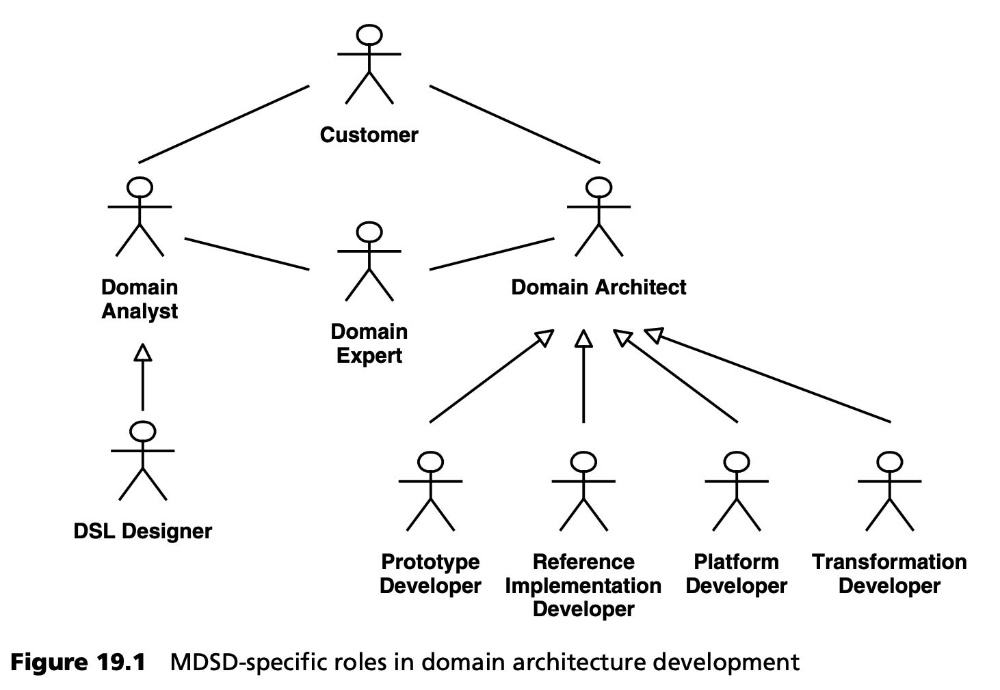

## 19.1 角色分配
本节讨论 MDSD 特有的角色分配。第 [13](../ch13/0.md) 章中概述的开发流程在此作为我们的指导原则。

### 19.1.1 领域架构开发
为了成功地进行领域架构开发，需要对该领域有深入的了解和丰富的经验。这些知识和经验通常分散在一群人身上。其中一些角色与传统软件开发项目中的角色并无不同，而其他角色在 MDSD 中则具有特殊意义。我们将主要讨论后者，这并不是为了提供一种工作描述，而是为了说明在实际项目中必须开展的各种活动。当然，一个人可以在一个项目中担任不止一个角色，同样，一个角色也可以由许多人担任。

***领域专家***

开发一个好的领域架构（见第 [4.1.1](../ch4/1.md#411-建模) 节）需要对 MDSD 领域具备专业知识 -- 即对 MDSD 将要支持的领域有深入了解。我们认为，这些人要么是领域专家，过去至少在该领域实现过两个应用；要么是潜在用户，他们是该领域的部分专家。例如，在开发保险应用时，可以咨询专门从事损害赔偿的法学家、精算师、直销专家等领域专家。(请注意，在以架构为中心的 MDSD 中，领域专家是在目标架构技术方面经验丰富的软件架构师 -- 参见第 [7](../ch7/0.md) 章）。

专家知识与传统的应用开发有关，但对于开发领域架构来说却是必不可少的。这就是为什么领域架构开发不适合离岸外包的原因之一，至少在项目启动阶段是如此。

***领域分析师***

在产品线工程部分（第 [13.5](../ch13/5.md) 节），我们讨论了领域分析的各个方面。对某个领域内共性与差异的分析，最好通过多次与领域专家、产品经理（如适用）、客户、需求分析师及领域架构师共同参与的研讨会，以迭代方式逐步完善。

***语言设计师***

语言设计师是一种特殊的领域分析师。他们一方面负责元模型和 UML 配置文件的开发，另一方面，他们还负责其他具体语法类型的开发（见第 [4.1.1](../ch4/1.md#411-建模) 节）。换句话说，他们定义领域特定语言（DSL）。为此，语言设计者与领域专家和其他领域分析师密切合作。在实现层面，语言设计师是与领域架构师之间至关重要的纽带，尤其是因为语言设计师还会创建参考模型，确保其与参考实现相匹配。（见第 [13.2.2](../ch13/2.md#1322-领域架构开发主线) 节）。

***领域架构师***

领域架构师负责实现领域架构（见 [第二部分](../part2.md) 和第 [13](../ch13/0.md) 章）。这尤其包括目标架构的定义（见第 [7](../ch7/0.md) 章）和领域架构内子系统（结构）的开发。后者是与语言设计者合作完成的。可以区分出不同类型的领域架构师，这与领域架构的各个部分类似：

- *原型开发人员 (Prototype developers)* 。原型开发人员负责创建技术原型。在大多数情况下，他们是技术专家或与技术专家密切合作。与传统开发相比，MDSD 可以非常经济地利用技术专长 -- 通过生成式方法将其转移到应用开发中，从而减少对辅导 (coaching) 的需求。
- *参考实现人员 (Reference implementers)* 。参考实现者根据原型将 DSL 的构造映射到目标架构。他们使用领域分析中提到的参考模型作为此目的的规范。

  原型具有相当实验性的特点，而参考实现则具有非常正式的特点。这是因为转换必须从原型中导出。
- *平台开发者 (The platform developer)* 。我们在第 [4.1.2](../ch4/1.md#412-平台) 节和第 [7.6](../ch7/6.md) 节中讨论了特定领域 MDSD 平台的重要性。具有框架开发经验的人员尤其适合担任平台开发人员的角色。平台开发人员必须与参考实现人员密切合作，因为 MDSD 平台是参考实现的重要组成部分。换句话说，参考实现基于特定领域的 MDSD 平台，并展示了其应用。
- *转换开发人员 (Transformation developers)* 。转换开发人员必须能够高效地使用生成或转换工具。他们生成代码模板，例如用于从参考实现生成源代码，或定义模型到模型的转换。模板开发也与特定领域平台的开发密切相关。其目标是调整转换和平台开发，使平台的内部复杂性和转换的复杂性都不会失控。

***协调员***

领域分析团队和领域架构团队各自都需要一名协调员，负责确保工作成果的达成。根据团队成员的能力和团队规模，这两个角色可以由同一人兼任。领域分析协调员的角色与语言设计师的角色是兼容的。

***其他角色***

除上述提到的角色外，以下角色也与领域架构开发相关：
- *客户 (Customers)* 。客户应尽可能参与 GUI 和应用原型的开发。为了确保实用性标准不会被忽视，潜在的最终用户也应参与其中。客户也可以是上述意义上的领域专家。
- *产品经理 (Product managers)* 。在开发产品和产品系列时，不仅要考虑单个客户的意愿，还要考虑产品或产品系列的战略重点。产品经理应充分了解现有客户对产品的使用情况。同样，他们还应了解目标市场中更多潜在客户的需求。
- *项目经理 (Project manager)* 。与传统的软件开发一样，MDSD 也需要一名项目经理。在这方面，迭代软件开发经验至关重要。
- *需求分析师 (Requirements analyst)* 。与传统软件开发一样，分析师需要以用例和类似工件的形式分析和定义客户需求。
- *测试工程师 (Test engineers)* 。测试工程师负责制定测试策略，其中要考虑到 MDSD 在这方面的特殊潜力（见第 [14](../ch14/0.md) 章）。

### 19.1.2 应用开发
如果忽略以下几个方面，MDSD 应用开发中的角色与传统软件开发中的角色是相同的，因为在 MDSD 中，这些角色被委托给领域架构开发主线：

- 框架的开发，即开发 MDSD 平台。
- 应用原型和参考实现的开发，以及新实现技术的实验。
- 分析与整个目标市场相关的需求。

<ins>显然，正是那些常常导致延误或质量下降的关键活动，被委托给领域架构开发，因此它们更好地脱离了日常开发的时间压力（参见第 [13.3](../ch13/3.md) 节）。</ins>

除了传统的软件开发知识外，应用开发人员还需要对 MDSD 有基本的了解，特别是对领域架构的 DSL 有基本的了解。
