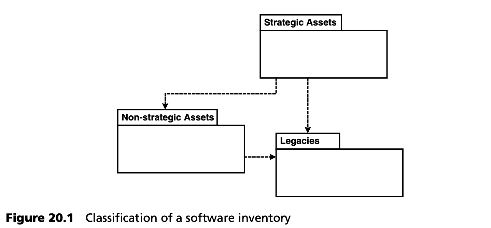

## 20.4 软件库的分类
一旦成功完成第一批 MDSD 项目，MDSD 的范围就可以从单个项目扩展到一组项目/产品开发。因此，MDSD 可以成为公司 IT 战略的一部分。这将引出 *产品线工程 (product-line engineering)*（第 [13.5](../ch13/5.md) 节）、*软件系统族 (software system families)*（第 [4.1.4](../ch4/1.md#414-软件系统族) 节）、*产品家族 (product families)* 和 *产品线 (product lines)*（第 [19.3.1](../ch19/3.md#1931-术语) 节）的概念。

为了适应这些概念，有必要对软件库 (inventory) 进行分类，以确定其可用性和每个组成部分的维护成本。这一步骤可以在 MDSD 试用之前、期间或之后进行，但应将其视为在企业范围内 (business-wide) 使用 MDSD 的先决条件。

如果软件维护和演化的优先级仅由短期目标决定，那么原始设计的意图就会随着时间的推移而丧失。除了项目的实际时间压力外，仅从会计角度审视软件，这种观点容易忽视软件维护的重要性。这种视角与逐步构建和维护领域架构的理念，以及在产品家族内有针对性地重用软件资产的理念，几乎无法调和。

<ins>由于运用了特定领域的知识和严谨的方法 (disciplined approach)，从现有软件的部分内容中开发出了战略性软件资产（模型、组件、框架、生成器、语言和构件），与传统的软件维护相反， *软件的价值得到了提升*</ins>。如果采取长期投资战略，战略性软件资产 (strategic software assets) 的价值就能得到最佳利用。为了避免在软件架构质量上做出致命的妥协，是绝对必要的。从这个角度看，有意识地将领域架构开发与应用开发分开也是有好处的：在应用开发中，短期战术决策有助于实现产品上市目标。在领域架构开发的背景下，人们可以并行开发更通用、更长期的解决方案。这些解决方案将从特定版本开始提供。MDSD 方法在这方面具有显著优势，因为以后对架构的更改可以更容易地集成到整个代码库中。

当然，将应用中使用的所有软件组件，都视为战略性软件资产是没有意义的。就软件投资规划而言，以下分类方案非常适合：

- <ins>*战略性软件资产* 是企业的核心。这些资产经过进一步开发，可以成为产品和业务流程的人/机均可读的知识库。</ins>
- <ins>*非战略性软件资产* 是必要的基础设施，会受到实现技术变化的影响，应在两到三年内折旧。</ins>
- <ins>*遗留 (Legacies)* 资产是指维护成本过高，无法继续维护的软件组件或系统。</ins>

<ins>战略性软件资产的识别仅在以下条件下才有可能实现：公司拥有清晰的业务战略，公司内部已明确盈利的业务流程，且公司能够清晰地阐述软件需求。公司的战略性软件资产决定了其竞争优势。非战略软件资产的功能并不独特，可以从许多制造商处获得。例如，操作系统、关系数据库和应用服务器。战略性软件资产通常建立在非战略性（基础设施）资产的基础上。必须对后者进行识别和处理。</ins>

<ins>*模型驱动软件开发为战略性软件资产的管理提供了工具。模型驱动集成允许使用商业第三方工具，以经济的方式提供非战略性软件资产。使用开源基础设施作为公共资产，可降低创建和维护战略性软件资产的成本。*</ins>

