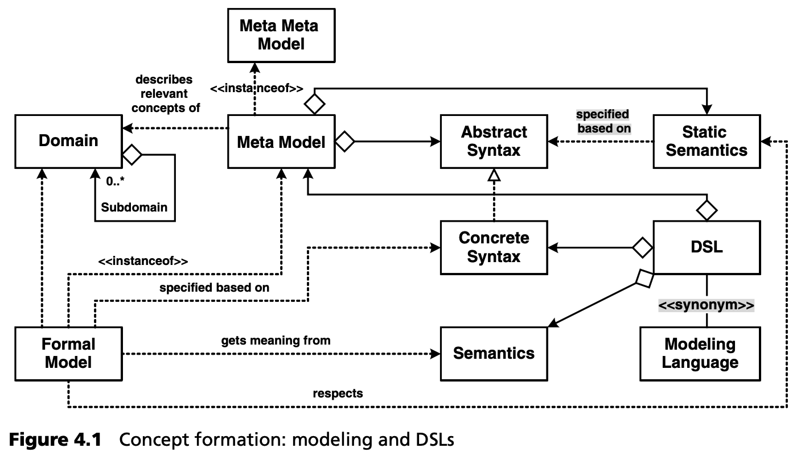
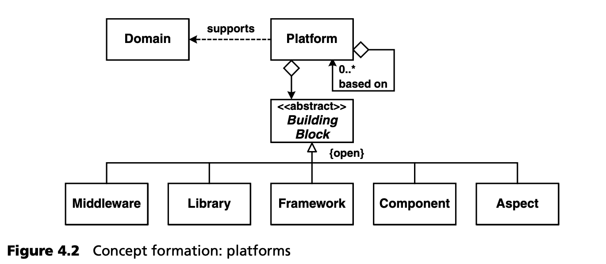
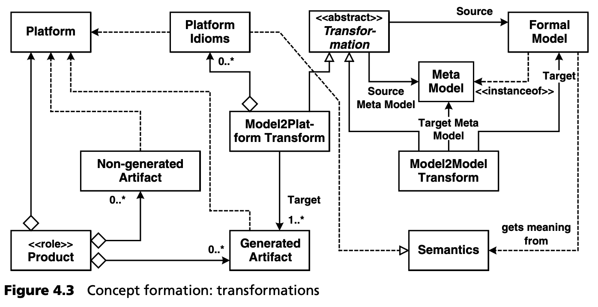
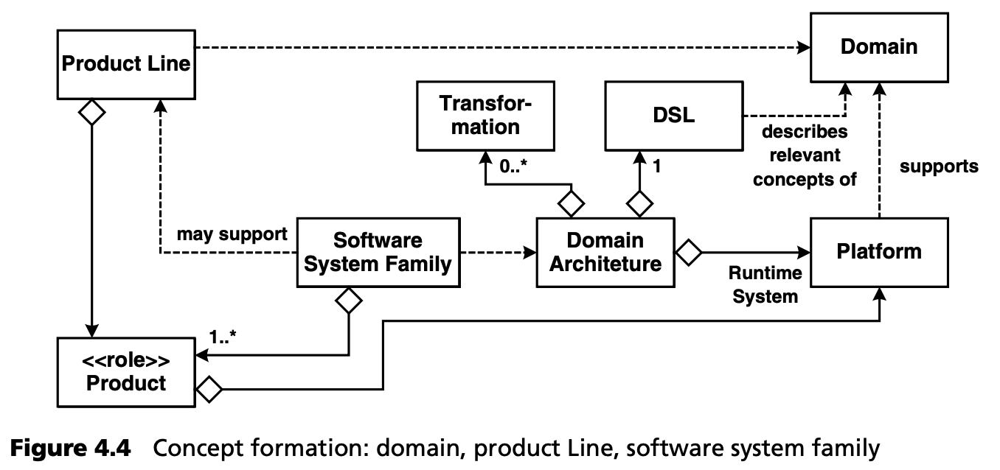

## 4.1 共同的 MDSD 概念和术语
MDSD 的某些技术、子领域或具体内容并不新鲜。诸如 “生成式编程”、“特定领域建模”、“产品线工程”，尤其是 “代码生成” 等术语早已有之，尽管它们在流行程度上差别很大。OMG 通过其 MDA 计划启动了某些核心概念的标准化进程，尽管其主要重点是互操作性和可移植性。MDA 很快就获得了相对较高的普及率，因此在一定程度上盖过了上述技术，但又没有完全盖过它们。因此，我们认识到需要有一个统一的共同背景，包括其术语，我们将大胆地创造这两者。这个概念背景就是模型驱动的软件开发，OMG 的标准术语将在合理和可能的范围内作为基础。

我们将以静态 UML 模型的形式开发通用概念及其关系，即 MDSD 概念空间，并逐步扩展和完善。

### 4.1.1 建模

***领域***

MDSD 的起点总是一个 <ins>*领域*。这个术语描述了一个*有边界的兴趣或知识领域*。为了内化和处理这些知识，创建一个领域概念的本体 (ontology) 是非常有用的。如果要对领域进行区分，可以从技术和专业两方面来考虑</ins>。例如，第 [3](../ch3/0.md) 章中的案例研究就属于 “商业软件架构” 领域，因为它包含 *Entity, SystemUseCase, Controller 和 Presentation* 等概念。 “专业” 领域可以是 “保险” ，包含 *保险产品、费率、损失或损害、服务、投保人、保险合同* 等概念。其他领域的例子可能包括 “嵌入式系统”、“EAI” 或 “天文学” 。

域可以由更小的 *子域* (subdomains) 组成。子域可分为两种：
- 技术子域描述的是，整个系统中适合使用专门建模语言的单个部分或方面。典型的例子包括 GUI 布局和持久性。
- 综合系统可细分为 *分区 (partitions)* 或内容增量。例如，在保险领域，可以为单个部分或产品类型定义分区，如 “人寿”、“车辆”、“责任” 等。

***元模型***

就 MDSD 而言，<ins>明确一个领域的结构（即它的本体）是绝对必要的，这样才能将该结构或其相关部分形式化。这是一切自动化的基础。形式化是以元模型的形式进行的</ins>。第 [3.2.1](../ch3/2.md#321-uml-配置文件) 节中的 UML 配置文件就是这样一个元模型的例子。它将基本 UML 元模型与该领域的相关概念进行了特殊化。一般来说，元模型不一定是基于 UML 的。

元模型包含语言的 *抽象语法* (abstract syntax) 和 *静态语义* (static semantics)，是 *元元模型* (meta meta model) 的一个实例。

***元元模型***

*元* 一词是相对的。<ins>元模型描述了可用于模型建模的概念（即元模型实例中的概念）。因此，元模型本身必须有一个元模型来定义可用于元建模的概念。这就是 *元元模型* 的作用</ins>。元元模型在两个方面非常重要：对于定义元模型的人来说，元元模型定义了用于定义元模型的语言。对于工具集成者来说，元元模型更为重要，因为它是元模型之间集成的基础。因此，作为工具构建者，通常需要使用特定的元元模型来构建元模型。元元模型的知识被硬编码到工具中。

关于模型、元模型和元元模型的更多详情，请参阅第 [6](../ch6/0.md) 章。

***抽象语法和具体语法***

<ins>Java 等语言的 *具体语法* (concrete syntax) 规定了该语言的解析器所接受的语法，而 *抽象语法* (abstract syntax) 则仅仅规定了该语言的结构</ins>。例如，从关键字的拼写等细节中引入抽象。因此，<ins>可以说具体语法是抽象语法的实现。有趣的是，各种具体的语法形式可以有一个共同的抽象语法。换句话说，一个领域的元模型可以用不同的符号来表达</ins> ，例如基于 UML 的图形符号或文本符号。

<ins>从技术角度看，语言的抽象语法通常由解析器实例化，也就是说，编译器用它来表示编译进程堆中的输入（程序源代码），以便进一步处理</ins>。这种范式在 XML 领域很常见：XML 文档是用 XML 的具体语法编写的，通用 XML 解析器从中实例化出内存中的表示形式 -- DOM[1](#1) 树。DOM 本身就是 XML 的抽象语法。

UML 是另一个例子：它的具体语法是由小方框和箭头组成的图形符号，而抽象语法则包含 *类、属性、操作、关联、依赖* 等构造以及这些构造之间的关系。

自然而然就会出现这样一个问题：如何才能真正指定或写出一个领域的抽象语法或元模型？为此，通常会有一个元元模型。在 OMG 标准中，这就是 MOF -- *元对象设施 (meta object facility)* （第 [6](../ch6/0.md) 章）。元模型可以用这种原始形式来描述。UML 配置文件是这种情况下的一个特例 -- 换句话说，MOF 只为元模型的规范提供了一种可能的具体语法。

***静态语义***

<ins>语言的静态语义 ( static semantics) 决定了它的良好构造 (well-formedness) 的标准。编程语言世界中的一个典型例子是变量必须声明的规则。语言的语法（包括抽象语法和具体语法）通常无法确定这一点，也就是说，解析器不会将未声明的变量视为错误，但编译器的静态分析却会失败</ins>[2](#2)。

<ins>在第 [3](../ch3/0.md) 章中，我们看到了如何使用 OCL 表达式正式定义 UML 配置文件的静态语义，这些表达式建立在语言的抽象语法（即配置文件的类结构）之上。在 MDSD 中，静态语义尤其重要。它们的作用是检测形式化领域的建模错误</ins>。

***特定领域语言***

我们现在有了理解特定领域语言 (domain-specific languages, DSL) 概念 (notion) 所需的概念。<ins>特定领域语言的作用是使一个领域的关键方面（但不是其所有可以想象的内容）可以正式表达和建模。为此，它拥有元模型（包括静态语义）和相应的具体语法。但仅有这些还不够：还缺少赋予元模型构造意义所需的动态语义</ins>。DSL 的语义与几个方面有关：一方面，建模者必须知道他们所掌握的语言元素的含义，才能创建合理的模型；另一方面，模型的自动转换必须准确地执行这些语义。关于这一点，稍后再详述。

DSL 的语义必须有详细的文档说明，或者对建模者来说直观明了。如果 DSL 采用了问题空间的概念，那么领域专家就能识别它的 “领域语言” [3](#3)
，这就更容易了。

*建模语言* 通常与 DSL 同义。我们更喜欢 DSL 这个术语，因为它强调我们总是在特定领域的背景下进行操作。

DSL 的能力和复杂程度各不相同。简单的带有有效性测试的文本配置选项就可以构成 DSL，而 DSL 的另一端则是带有相应特定语言编辑器的图形语言。

DSL 编辑器分为两类：通用工具（如通过配置文件配置的 UML 工具）和定制的 DSL 专用工具。

***形式化模型***

下面我们将结合 MDSD 讨论 *形式化模型 (formal model)* 。<ins>形式化模型是自动转换的起点 -- 即使是纯粹的解释性方法也需要形式化
模型。形式化模型需要 DSL，因此显然与相应的领域有关。它是用 DSL 的具体语法表述的，至少在概念上构成了给定元模型的一个实例</ins>，在大多数情况下，在技术上也是如此。

因此，形式化模型是用 DSL 拟定的句子 (sentence)，其含义来自 DSL 的语义。因此，在 MDSD 中，领域的上下文显然是最重要的。

现在我们来看几个例子：

- 第 [3](../ch3/0.md) 章案例研究中以架构为中心的设计就是 MDSD 背景下的形式化模型。它们的领域是商业软件的架构。
- Java 程序是编程语言 Java 或其相应元模型的实例。Java 也具有语义。但 Java 的领域是什么呢？可以说是 “图灵可计算函数” -- 原则上就是 “一切可以用计算机完成的事情” 。可执行 UML 也是如此，它是第 [12](../ch12/0.md) 章描述的 UML 的直接可执行变体。在 MDSD 的语境中，这样的领域没有什么帮助，因为我们的方法是将更高层次的问题空间概念形式化，以便将它们与编程语言的抽象层次区分开来。
- Powerpoint 幻灯片本身并不是 MDSD 的正式模型，尽管它拥有一个非常通用的元模型（ *矩形、箭头、日蚀 (eclipse)、文本* ），但这种模型并没有语义。一旦用基于 Powerpoint 的具体语法定义了真正的 DSL，就可以进一步处理相应地形成正式模型的 Powerpoint 幻灯片，例如，从中生成图形用户界面 (GUI) 的代码。

### 4.1.2 平台
现在，我们通过下一个分区来扩展我们的领域 MDSD 本体：我们借助 DSL 来表示问题空间，允许对形式化模型进行进一步处理（转换）或解释。为此，我们需要在 “另一侧” --也就是在解决方案空间-- 有某种东西支持转换或解释，有某种东西作为转换生成的代码的基础。

***平台***

*平台* 一词用于 MDA（第 [2](../ch2/0.md) 章和第 [12](../ch12/0.md) 章）以及软件产品线工程中。它具有足够的通用性，可用于描述 MDSD。<ins>平台的任务是支持领域的实现，也就是说，形式化模型的转换应尽可能简单。在第 [3](../ch3/0.md) 章的案例研究中，我们使用了带有 Apache Struts 的 J2EE 作为平台，外加一些我们自己创建的超类和辅助类。领域的 DSL（这里使用的以架构为中心的 UML 配置文件）描述了问题空间 ( *entity, controller, presentation* ) ，但没有描述解决方案空间 (solution space)，即平台</ins>。显然，转换越容易构建，平台就越强大。如果我们将 Struts 和辅助类从平台中移除，那么在代码生成过程中映射 DSL 的动态结构（其活动图）所需的工作量就会大得多。平台也可以级联。

在解释的极端情况下，平台扮演着可执行模型虚拟机（解释器）的角色，因此模型转换变得微不足道。

***构建基础***

平台可以建立在现有的构件基础 (building block) 
上。这些构件可以是中间件、库、框架、组件或 AOP[4](#4)的各个方面 (aspects)。

### 4.1.3 转换
在了解了建模和平台之后，我们现在可以将概念空间中的这两个分区连接起来：

***转换***

<ins>MDSD 转换 (transformations) 总是基于源元模型 (source metamodel) ，因为要转换的源模型正是该元模型的一个实例。转换规则只能基于元模型的构造，这是它的主要目的，因为转换实现了 DSL 的语义。</ins>

我们区分了模型到模型的转换（ *Model2ModelTransform* ）和模型到平台的转换（ *Model2PlatformTransform* ），后者通常也称为 *模型到代码的转换 (model-to-code transformation)* 。

<ins>模型到模型的转换会创建另一个模型。然而，这个模型通常基于与源模型不同的元模型。这种转换通常描述源元模型的构造如何映射到目标元模型的构造。MDA 通过其查询/视图/转换 (query/view/transformation) 规范实现了这种方法</ins>，详见第 [12](../ch12/0.md) 章。

相反，从模型到平台的转换 “了解” 平台，并生成基于平台的工件（ *生成的工件* ）。生成适合现有框架的源代码就是一个例子。对于这类转换，不需要目标元模型，因为我们通常只处理简单的文本替换。第 [3](../ch3/0.md) 章中的模板定义就属于这一类。请注意，除了转换，解释器也可以用来执行模型（见第 [8.4](../ch8/4.md) 节）。

***平台成语***

模型到平台的转换可以使用有关平台的完整知识，这为它们提供了一个强大的工具 -- *特定于平台的成语 (Platform-specific Idioms)* ，转换可以透明地使用这些成语。在第 [3](../ch3/0.md) 章的案例研究中，我们生成了使用业务委托模式 (Business Delegate pattern) 的代码，使领域模型与 EJB 编程模型保持一致。这种模式的使用不需要在模型的任何地方指定 -- 关于在哪里以及如何应用这种模式的知识仅存储在转换中。

***产品***

MDSD 追求的目标是，通过一次或多次转换，创建部分或全部软件 *产品* 。<ins>产品可以是一个完整的应用，也可以只是一个组件，用作其他地方的构件</ins>。就 MDSD 而言，这种产品汇聚了平台、生成的、有时甚至是非生成的工件。例如，非生成工件可以是特定于应用的辅助类，也可以是手动编程的业务逻辑。

### 4.1.4 软件系统族

下一个 MDSD 分区将研究领域产品之间的相关性，并解决可重用性问题。

***领域架构***

<ins>领域元模型、平台和相应的转换（包括已实现的成语）是实现从模型到产品（无论是完全自动化还是部分自动化）过渡所需的工具。这些所有的集合就是我们通常所说的 *领域架构 (domain architecture)* -- MDSD 的核心概念</ins>。除平台架构外，领域架构还决定了哪些概念在形式上得到支持（尽管不一定是具体语法），以及如何将这些概念映射到现有平台上。在这种情况下，平台扮演着运行时系统的角色：领域架构总是相对于平台而言的。第 [3](../ch3/0.md) 章案例研究中的生成式软件架构就是领域架构的一个例子。

***软件系统族***

显然，一个领域架构适用于构建，所有可以用给定元模型表示，并在同一平台上实现的产品。

<ins>使用特定领域架构可以创建的所有产品的集合通常被称为 *软件系统族 (software system family)* 。换句话说，软件系统族使用领域架构来实现它，而领域架构对软件系统族的所有产品都是可重用的。领域架构必须具有足够的灵活性，以便表达构成软件系统族的各种产品之间的差异（可变性）。</ins> 

***产品线***

<ins>*产品线 (product line)* 是一组互补的单一产品。从用户的角度来看，产品线中的产品可以是替代产品，即适用于不同但相关的环境，也可以在内容上相互补充，从而形成一个 “套件”</ins> 。值得注意的是，软件系统族的产品并不一定具有任何技术共性。软件系统族可以构成产品线的基础，但并非必须如此。

---
#### 1
DOM： 文档对象模型。

#### 2
从概念上讲，静态语义属于语言的语法而非语义。

#### 3
在以架构为中心的语境中，领域专家更像是软件架构师，因为这里的领域是软件架构。

#### 4
面向方面的编程 [Lad03](../ref.md#lad03)。

