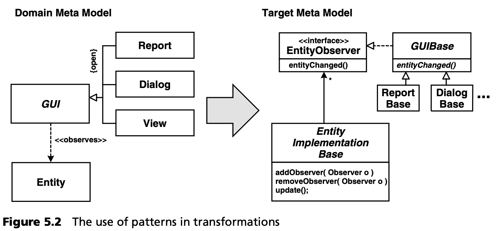

## 5.3 MDSD 与模式
模式（架构模式、设计模式、成语）与 MDSD 并无具体关系。模式是为解决重复出现的特定问题而记录下来的最佳实践。然而，这两个领域之间存在一些有趣的关系。我们将在本节中加以概述。

### 5.3.1 模式与转换
<ins>模式 (patterns) 与 MDSD 的关系源于这样一个事实，即转换是一种 “形式化的最佳实践” ，因为与模式解决方案结构相对应的目标模型中的结构（以及相应的生成代码中的结构）往往是通过转换创建的</ins>。下图展示了 GUI 和实体之间的依赖，例如，映射到观察者模式 (observer pattern) 的实现（见图 5.2）。

然而，在这种情况下，重要的是要明白模式并不仅仅包括解决方案的 UML 图！模式的重要部分解释了哪些力量会影响模式的解决方案，什么时候可以应用模式，什么时候不可以，以及使用模式的后果。一个模式往往还记录了自身的许多变体，这些变体可能都有不同的优缺点。在转换中实现的模式不会考虑到这些方面，转换的开发者必须考虑到这些方面，对其进行评估并做出相应的决定。

另一个重要问题是，使用 MDSD 可以为解决特定问题提供更多的选择。例如，在观察者模式的情况下，没有人会考虑将依赖关系和通知硬连接到代码中，因为这样做既极不灵活，又要做大量的额外工作。但在特定情况下，使用后一种方法并从描述依赖关系的模型中生成必要的代码，可能是最佳解决方案（在性能或占用空间方面）。在描述模式时并没有考虑到代码生成，因此 MDSD 可能会使某个模式所描述问题的其他解决方案变得可行，而这些解决方案在非生成环境中是不会被认真考虑的。

MDSD 转换还可以用于将解决方案结构（包括其行为）生成模型或代码。但是，是否使用模式以及如何使用模式仍必须由开发人员来考虑，即转换的开发人员，而不是在应用开发中使用转换的开发人员。

### 5.3.2 模式和配置文件
一些 UML 工具和 MDA（或者更准确地说，EDOC 模式配置文件 (pattern profile)，见第 [12.2.7](../ch12/2.md#1227-核心模型) 节）在 UML 层定义了工具支持的宏定义，用来把模型打包成 “模式”。这是一种误导，因为正如我们已经解释过的，真正的模式不仅仅是一个 UML 宏。此外，在许多工具中，这些 "模式" 只能扩展一次，因此之后就失去了压缩性。

### 5.3.3 模式语言作为 DSLs 的来源
*模式语言 (Pattern languages)* 使用模式集合来描述潜在的复杂（技术）的设计或架构：例如 EAI 应用 [Fow04](../ref.md#fow04) 、远程基础设施 (remoting infrastructures) [VKZ04](../ref.md#vkz04) 和组件容器 [VSW02](../ref.md#vsw02) 。这样的模式集合结构严谨，模式之间的依赖关系明确：通常必须按顺序阅读，因为特定模式是建立在前一个或多个模式的基础上的。这些模式通常与它们所描述的系统的主要结构工件相一致，或说明其最重要的行为。因此，除其他外，模式语言是对其所描述的系统类别的概念化表述。

<ins>因此，这种模式语言是挖掘元模型元素的良好开端，而元模型正是能够描述相关系统类别的 DSL 所需要的</ins>。让我们以远程模式为例：如果你想构建一个用于配置/生成远程 (调用) 中间件基础设施的 DSL，那么模式语言可以帮助你确定 DSL 中可能需要表示的关键概念，例如：

* 调用者
* 接口
* 客户端和服务器请求处理程序
* 对象标识
* 生命周期替代方案，如延迟/提前获取、池化或租赁
* 使用调用并遗忘 (fire and forget)、与服务器同步、轮询对象或结果回调等进行异步通信

模式语言中的模式描述了描述此类系统时可能需要配置的 “热点”，以便能够生成系统。这些概念、它们之间的关系以及它们的配置替代，可以很容易地重构为一个元模型，作为用于远程基础设施描述和配置的 DSL 的基础。
