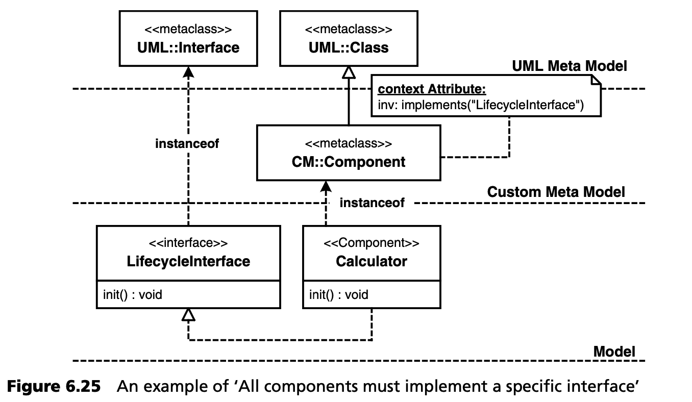

## 6.10 元建模与行为
元建模背景下的行为在两个方面都很有趣。一方面，行为可以隐藏在元模型的意义中；另一方面，我们可以使用元建模使行为建模显式地可访问，例如以活动图或状态图的形式。

在这里，我们将重点讨论前一种情况。我们将以熟悉的组件为例进行说明：假设我们要求每个组件都有一个操作 *init()* 。如果我们定义一个包含该操作的接口，并要求元类 *Component* 的所有实例都必须实现该接口，那么这一点就很容易实现。

一个简单的计算器就是一个例子，如图 6.25 所示。



问题是，在 *init()* 操作中会发生什么？例如，我们可以检查所有 *RequiredPorts* 的链接是否可用。这些链接<sup>[10](#10)</sup> 是由 *Container* 创建的。为此，组件实现为每个 *RequiredPort* 提供了相应的 *set* 操作，该操作由容器调用。这些操作的实现会在属性中保存为相应 *RequiredPort* 提供 *ProvidedPort* 的组件的引用。当容器调用 *init()* 时，组件实例希望这些链接存在，即相应的属性不再为空。验证这一点的算法如下：

```java
foreach r:RequiredPort {
  if (Attribute with the name of the port == null ) {
    ERROR!
  }
}
```

这种行为不是由用户编程的，而是由架构指南隐含决定的。这会产生以下影响：

- 创建应用的程序员不必处理这个问题。
- 在这种情况下，模型验证仅限于确保每个组件都实现了 *LifecycleInterface*。这种情况如上所述。方法中的行为不需要验证，因为实现代码（见下文）可以自动生成。
- 如果需要，我们也可以在元模型层级指定这种行为，例如通过序列图、动作语义（见第 [12](../ch12/0.md) 章），或者在本例中使用一个约束，规定一旦操作执行完毕，所有资源属性都不得为空。
- 在代码生成过程中，可以直接生成此类操作的执行代码。生成所需的所有信息在生成时都已存在。下面将举例说明上述约束的程序实现：

```java
«DEFINE InitOperation FOR Component»
  public void init() throws IllegalConfiguration {
  «FOREACH Operation o IN RessourceInterface»
   if ( «o.NameWithoutSet» == null ) {
    throw ( new IllegalConfiguration(
      “Resource «o.NameWithoutSet» not set!” ) );
   }
  «ENDFOREACH»
«ENDDEFINE»
```

顺便提一下，值得注意的是，应用的大部分行为通常都是由架构定义的。其中包括持久性、工作流或远程代理。所有这些方面都可以很容易地完全生成。有关 DSL 行为建模的更多详情，请参见第 [8.1.3](../ch8/1.md#813-行为建模) 节。

---
#### 10
引用是关联的实例。
