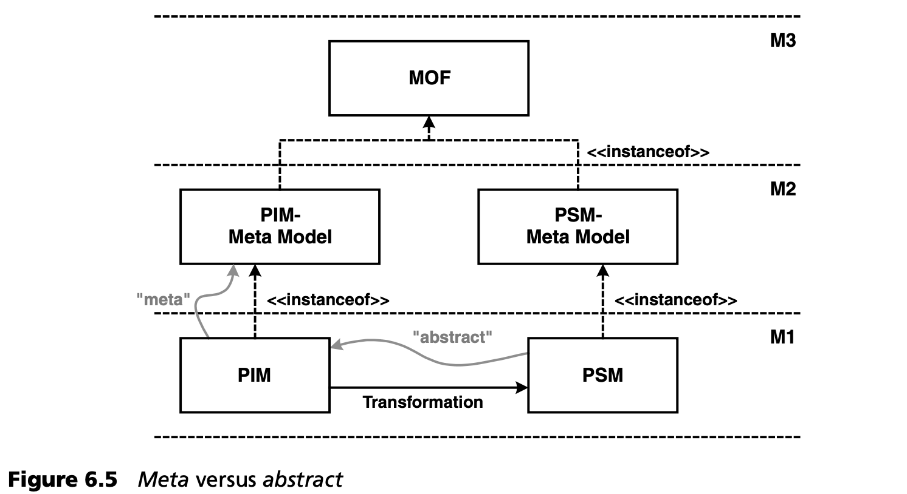

## 6.2 元层次与抽象层次
模型之间可以有不同的关系。本章阐明了 *元* 关系，即元模型定义了可以创建模型的概念。

另一方面，模型也可以位于不同的抽象层，即使它们位于同一个元层。通常，转换用于将较高抽象层次的模型映射到较低抽象层次的模型。每个模型（不可避免地）都是一个元模型的实例。因此，两个模型的元模型是不同的，但模型和元模型可以在同一个元层次上找到[note](#note)。图 6.5 展示了这一点。

---
#### note
译注：PIM 和 PSM 式不同抽象层次的模型，但都位于 M1 元层。
