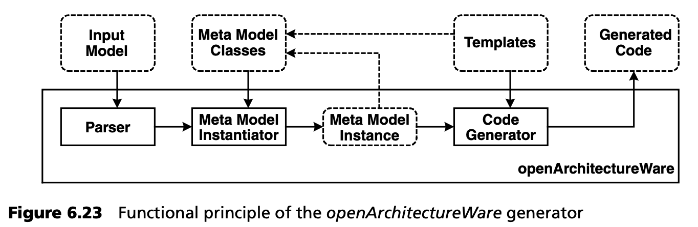
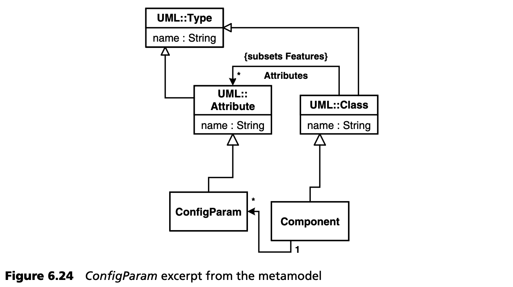

## 6.9 工具支持的模型验证
元建模的工具支持差别很大。可分为以下几种：

* *不支持* 。大多数 UML 建模工具几乎不支持元模型。这并不是消极的批评 -- 它们根本就不是为此目的而设计的。它们隐含地基于 UML 元模型，而元模型是不可改变的。当然，这就留下了通过定型将模型与元模型耦合的选项，但没有提供进一步的支持（或验证）。实际上，所有广泛使用的 UML 工具都属于这一类。然而，UML 配置文件的支持有一个缓慢但明显的增长趋势。
* *单独的工具* 。有些工具是在用普通 UML 工具创建模型后应用的。通常，模型是用 XMI 从 UML 工具导出的（XMI 是 MOF 的 XML 映射，见第 [12](../ch12/0.md) 章），并在此基础上进一步处理。这类工具包括模型验证器、转换器和代码生成器 -- 几乎所有涵盖这些任务的工具，通常不局限于 UML/MOF -- 甚至可以处理任何建模语言。第 [3](../ch3/0.md) 章中介绍的开源生成器 openArchitectureWare 就是这类工具的一个例子。
* *集成（元）建模工具* 。与普通的 UML 建模工具不同，集成（元）建模工具实际上是以元模型为内部基础的。在工具的帮助下，用户不仅可以调整元模型，还可以在此元模型的基础上创建新模型。然后，工具会调整其界面，确保只能创建有效的模型。在大多数情况下，验证是实时进行的，即在输入过程中。这类工具的例子有 MetaEdit+ [MC04](../ref.md#mc04) 或 [GME](../ref.md#gme)。

最常见的是把 UML 工具和单独的生成器/验证工具结合起来。遗憾的是，集成的元建模工具在很大程度上仍被市场所忽视。

现在我们来看看通过 openArchitectureWare 进行的模型验证。其功能原理如图 6.23 所示。



生成器使用任何模型作为输入数据。解析器对其进行解析，然后元模型实例化器使用配置的元模型实例化产生的解析树。输入（模型）格式可以互换，因为生成器中可以使用不同的解析器。在我们的例子中，使用的是 XMI，这在很多情况下都是一样的。元模型实例化后，模型在生成器内存中将以 Java 对象图的形式存在。对象的 Java 类与元模型的元类相对应。正如我们在第 [3](../ch3/0.md) 章第一个案例研究中所解释的，现在可以通过模板生成实际代码了。我们在前面说过，元模型毕竟是一种定义建模者可用 “语言” 的手段。这尤其包括建模规则的定义和具体模型的相应验证。

让我们回到上面的组件示例。我们使用的生成器拥有一个明确的、可配置的元模型。这是用 Java 实现的。第 [3.2](../ch3/2.md) 节已详细解释了其原理。因此，元模型适配的样子应该很清楚：我们创建相应元类的子类，并在生成器中配置新元类的实例映射到模型中新实现的元类。下面是 *ConfigParam* 的示例：

```java
package cm;
public class ConfigParam extends Attribute {
}
```

通过配置文件（此处未显示），我们可以告诉生成器，所有带有 *“ConfigParam”* 定型的 UML 属性实际上都是配置参数，这就是为什么它应该实例化子类 *ConfigParam* 而不是 *Attributes* 。从生成器的角度来看，这并不是一个问题，因为在 OO 编程中，如果变量的类型与超类相同，就可以使用子类的实例 -- 多态性。

到目前为止，*ConfigParam* 这个类对我们来说用处不大，尤其是因为我们目前还没有对模型验证做出什么贡献。例如，*ConfigParam* 缺少约束，即 *ConfigParam* 类型必须始终为 *String* 。<ins>为了检查此类约束，所有元类都有一个 *CheckConstraints* 操作，生成器会在整个元模型实例化后调用该操作。这是进行模型验证的主要场所</ins>。如果该操作检测到问题，就会抛出一个 *DesignError-Exception*，然后报告给开发人员，表明处理后的模型与元模型不一致。这是类 *ConfigParam*<sup>[9](#9)</sup> 的 *CheckConstraints* 的代码：

```java
public String CheckConstraints() throws DesignError {
  if ( !Type().Name().toString().equals("String") ) { 
    throw new DesignException("ConfigParam Type not String");
  }
  return super.CheckConstraints();
}
```

如图 6.24 所示，为更好地理解这里发生的事情，我们可以看一下生成器使用并由 *ConfigParam* 扩展的 UML 元模型。



由于我们在 *ConfigParam* 类中进行操作，*Type()* 表达式通过遵循 *Attribute* 类继承的 *Type* 关联，提供 *UML::Type* 对象的实例。该类型具有一个类型为 *String* 的 *Name* 属性，其中包含该类型的名称。请注意，约束的实现不是通过 OCL 声明的，而是通过 Java 操作的。这里可以集成 OCL/Java 编译器，在不久的将来，openArchitectureWare 开放源代码项目也一定会这样做。

现在我们以同样的方式为 *Component*、*ProvidedPort* 和 *RequiredPort* 创建元类。下面举几个例子。

例如，*Component* 的元类可以如下所示：

```java
public class Component extends Class {
  public ElementSet Port() {
    // return all ports of the component
  }
  public ElementSet RequiredPort() {
    return Util.filter( Port, RequiredPort.class );
  }
  public ElementSet ProvidedPort() {
    return Util.filter( Port, ProvidedPort.class );
  }
  public void CheckConstraints() {
    Util.assert( Operation().size() == 0,
      "Component must not define operations by itself" );
  }
}
```

辅助函数 *Util.filter()* 可以过滤特定元类的一些对象（这里指端口）。例如，*ProvidedPort()* 操作会返回所有实际提供的端口。还要注意操作 *CheckConstraints()*，它可用于实现元模型的不变式 (invariants)。

现在我们来看看元类 *Application*。这是一种不允许有 *ProvidedPorts* 的特殊组件。

```java
public class Application extends Component {
  public void CheckConstraints() {
    Util.assert( ProvidedPort().size() == 0,
      “Application must not have any provided”+
      “ports, only required ports are allowed.” );
  }
}
```

在这里，*CheckContraints()* 也用于保证应用没有提供端口。

---
#### 9
在本例中，Type 和 Name 是元类 Attributes 的属性。不幸的是，在这种情况下，生成器使用的属性是以大写字母开头的，这有点令人困惑，但我们无法控制。
