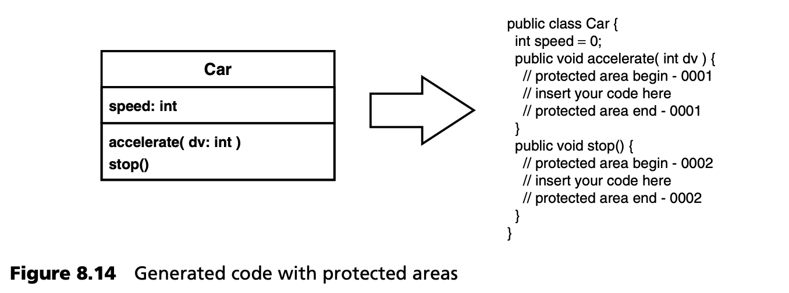
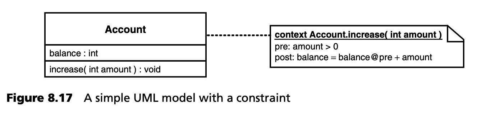
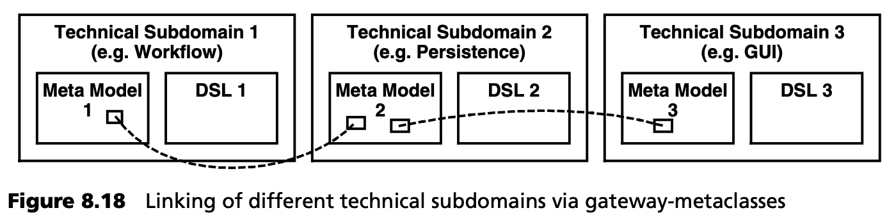
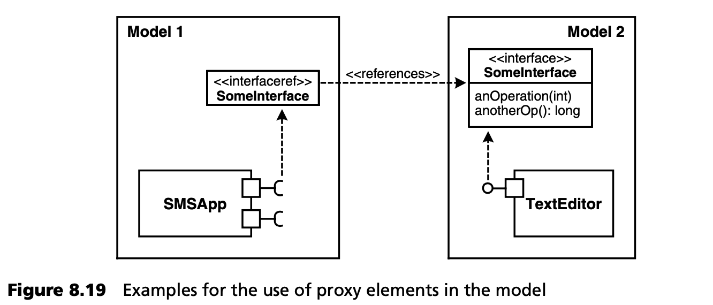
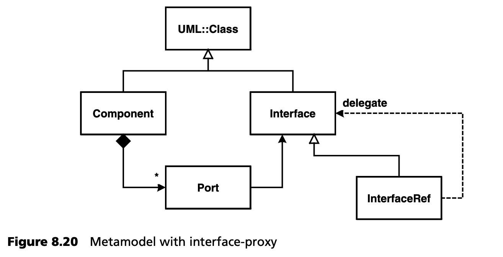
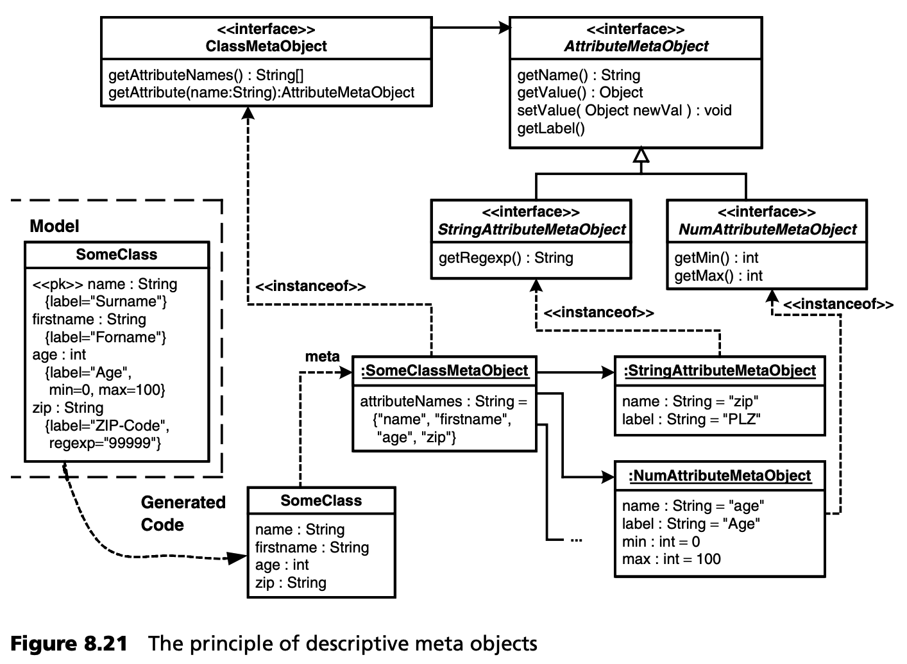

## 8.3 构建转换的技术方面
除了本节描述的最佳实践外，我们还将在下面两章中描述代码生成和模型到模型转换的一些细节。

### 8.3.1 生成代码与人工部分的显式集成
*显式集成 (Explicit integration)* 意味着一开始，生成的代码完全独立于手工代码。依靠开发人员整合这些工件。只有极少数情况下，这两种代码实际上是完全独立的 -- 非生成代码经常依赖于生成代码，因为它们在系统上下文中通常是一起使用的。

最简单的集成方法是在生成代码中创建保护区域，开发人员可以在其中插入手工代码。这些区域的指定方式可以让生成器读取，这样手写代码就不会在生成器的后续运行中被覆盖。

UML 工具通常以这种方式工作。在这里，类存根由模型数据生成，然后开发人员将行为集成到类存根中。图 8.14 展示了这一点：



这种方法有许多缺点：
- 生成器更加复杂，因为它必须识别、管理和保护受保护区域。
- 保护受保护区域的内容并不总是容易实现。在实际操作中，代码有时会丢失。
- 生成代码和手写代码的分离消失了，因为两者都在同一个文件/类中。

最后一点是最棘手的问题，因为开发人员必须在生成的代码中工作。为此，他们必须首先理解代码，而这并非易事。软件开发的其他方面（如版本控制）也变得更加复杂。

<ins>因此，应考虑其他集成机制。一种经常采用的解决方案（同时也能处理与平台的集成）是 *三层实现 (3-tier implementation)* 。在许多情况下，必须生成的系统组件，包括三种功能：</ins>

- 对某一类型的所有组件都相同的功能。
- 每个组件都不同的功能，但可以从模型中生成。
- 必须由开发人员手工实现的功能。

图 8.15 所示的方法是在面向对象语言中实现这种功能的一种行之有效的技术：


<ins>作为平台的一部分，为某一类型的所有组件实现了一个抽象超类。对于每个组件，生成器都会生成一个抽象的中间类，该类继承于超类，并实现了可从模型中推导（从而生成）的所有方面。最后但并非最不重要的一点是，开发人员要创建一个非抽象的实现类，该类继承自生成类。系统随后将通过实例化的方式使用该类。这个手工实现的类可以 “填补” 生成的中间类的 “漏洞” </ins>。借助 “四人帮 (Gang-of-Four)” 模式 [GHJ+94](../ref.md#ghj94) ，可以非常优雅地完成这一工作。本节的其余部分以及图 8.16 将解释如何做到这一点。


在图 8.16 案例 a) 中，生成的代码调用非生成的代码。这几乎是显而易见的。在生成的代码中，我们总是会访问非生成的代码 -- 毕竟，我们会继续使用久经考验、值得信赖的库。在这种情况下，解释应进一步扩展：应始终尽量减少代码的生成，并且在可行时，应优先使用已存在且经过测试的代码，这些代码在领域架构中以平台的形式存在。

情况 b) 就不那么明显了。在这里，手工实现的代码调用生成的代码。为此，手工实现的代码必须 “了解” 生成的代码，这可能会在构建过程中产生令人不快的依赖关系。案例 c) 可以在这方面提供帮助。在这里，生成的代码可以从手工创建的类继承，或分别实现一个手写接口。然后，手写代码可以根据该接口进行编程。运行时，生成类的实例将被实例化，例如使用工厂操作。

让我们回到有保护区的例子：避免保护区的一种方法是使用继承，如案例 d) 所示。在这里，一个实现类继承自生成的超类。实现类覆盖生成的操作，并以这种方式提供行为。工厂可以再次帮助实例化。当然，如案例 e) 所示，生成的代码可以继承自非生成类，并在必要时调用其操作。

情况 f) 也很有趣，手工实现的类或其操作会调用生成子类的操作。这基本上是模板方法 (Template Method) 模式的一种用法。非生成的超类定义了一些抽象操作，这些操作会被生成的类覆盖。超类的其他操作会调用这些抽象操作。此外，工厂还有助于实例化。

集成手工代码和生成代码（或更广泛地说，通过各种工具创建的代码）的另一种方法是使用部分类（如果您的语言支持的话）。例如，在 .NET 平台上，您可以通过在每个文件中使用附加关键字 *partial（public partial class XYZ...）*  来标记类定义，从而将一个类声明分成几个文件。在编译代码时，编译器会将一个类的所有部分声明放在一起考虑。这样就可以生成类的一部分，并手工实现另一部分。

本节所述的集成生成代码和非生成代码的方法通常需要包含多个步骤的生成。当然，只有在中间层已经生成的情况下，应用开发人员才能在最底层实现其应用逻辑。另一方面，在许多情况下，还需要额外的生成、编译和进一步的构建步骤，使用生成的工件、平台的工件以及手工实现的工件，将它们合并为一个完整的应用。

因此，通常必须执行两次生成器运行：第一次运行读取特定的模型元素并生成一些超类（即一种应用接口），然后开发人员在这些超类上实现他们的应用逻辑，而这些逻辑必须手工编写。

生成器的第二次运行会生成所有模型元素，并使用这些元素和开发人员手工编写的元素创建完整的应用。根据平台的不同，这一步骤还包括编译、链接、打包等过程。要使开发人员的代码真正继承自生成的类，可以使用哑代码 (dummy code, 见下一节) 或配方框架 (recipe framework)（第 [11.1.4](../ch11/1.md#1114-配方框架) 节）。

如果应用了目标编程语言的正确功能，这种方法还可以强制执行某些架构约束。请看图 8.17：



在这种情况下，我们的目标是在生成的代码中将 OCL 中定义的前置条件和后置条件固定在模型中，并且使程序员无法在运行时规避检查。使用保护区域，可以生成以下代码：

```java
// generated
class Account {
  int balance;
  public void increase( int amount ) {
    assert( amount > 0 ); // precondition
    int balance_atPre = balance; // postcondition
    // — protected area begin —

    // — protected area end —
    assert( balance = balance_atPre + bamount );
    // postcond.
  }
}
```

<ins>当然，实际情况并非如此。开发人员可以随时删除前置条件和后置条件代码。使用简单继承的变体也不可行。开发人员会覆盖操作 *increase()* ，从而避免检查约束。或者，我们可以定义额外的操作 *increase_pre()* 和 *increase_post()* ，以检查前置条件和后置条件。子类中的执行操作必须调用该操作。然而，在这种方法中，开发人员可能会忘记调用这些操作。对于这个问题，使用模板方法 (Template Method) 模式是一种相当优雅的解决方案</ins>：

```java
// generated
public abstract class Account {
 
    int balance;
 
    public final void increase( int amount ) {
      assert( amount > 0 ); // precondition
    int balance_atPre = balance; // postcondition
    increase_internal(amount)
    assert( balance = balance_atPre + amount );
            // postcond.
    }
  protected abstract void increase_internal(int amount);
}
```

在这里，*increase()* 操作是完全生成的。它包含前置条件和后置条件代码，并在内部调用 *increase_internal()* 操作来执行实际行为。该操作被定义为抽象方法，开发人员手工编写的子类必须实现该操作。

```java
// manually written code
class AccountImpl extends Account {
  protected void increase_internal(int amount) {
    balance += amount;
  }
}
```

由于外部接口（公共方法）仍然是 *increase()* ，该类的客户端必须始终调用该操作，因此无法规避检查，因为 *increase_internal()* 是 protected。开发人员也无法覆盖子类中的 *increase()* 操作来规避检查，因为它是 *final* 的。因此，这个问题的解决方案既预防 (bulletproof) 了问题，又非常优雅。

### 8.3.2 哑代码 (Dummy Code)
为了获得一个一致的系统，我们经常需要强迫开发人员做某些事情。例如，在三层实现的背景下，开发人员必须实现一个自己的类，该类必须满足以下要求：

- 必须遵循特定的命名约定（与超类具有相同的名称，只是后缀为 “Impl”）。
- 它必须继承自某个类（通常是生成的），如有必要，还必须覆盖特定的操作。
- 它也许必须实现一个特定的接口，或提供特定的预定义操作。

由于我们在这里处理的是手工开发的类，因此无法通过简单的代码生成模板来强制执行这些内容。不过，我们可以做的是在编译器的帮助下生成检查所需特性的代码。假设我们有以下生成的类：

```java
public abstract SomeGeneratedBaseClass
      extends SomePlatformClass {
    protected abstract void someOperation();
    public void someOtherOp() {
        // stuff
        someOperation();
  }
}
```

让我们进一步假设，开发人员将从该类继承，覆盖操作 *someOperation()* ，调用类 *...Impl* ，并实现接口 *IExampleInterface* 。正确的实现如下

```java
public abstract SomeGeneratedBaseClassImpl
        extends SomeGeneratedBaseClass
        implements IExampleInterface {
  protected void someOperation() {
    // do something
  }
  public void anOperationFromExampleInterface() {
    // stuff
  }
}
```

<ins>如何强制开发人员正确实现这个类，即使框架（经常发生）只是在工厂的上下文中动态实例化这个类，从而阻止了编译器检查的选项？</ins>

<ins>解决办法是生成哑代码 (dummy code)，该代码仅用于验证此处所述的准则：</ins>

```java
public abstract SomeGeneratedBaseClass
      extends SomePlatformClass {
    // as before
    static {
      if ( false ) {
        new SomeGeneratedBaseClassImpl();
          // verifies that the class is present,
          // and that it is not abstract
        SomeGeneratedBaseClass a = (SomeGeneratedBaseClass)
        new SomeGeneratedBaseClassImpl();
          // verifies that the implemented class is
          // actually a subclass of SomeGeneratedBaseClass
        IExampleInterface x = new
        SomeGeneratedBaseClassImpl();
          // verifies that it implements the
          // IExampleInterface
        new SomeGeneratedBaseClassImpl().xyzOperation();
          // this would verify that the operation
          // xyzOperation is implemented in the class
      }
    }
}
```

<ins>这种机制可确保编译器在 *生成基类后* 立即发出相应的错误信息。这就迫使开发人员正确地实现子类。这样就避免了以后可能难以发现的错误。请注意 *if (false)* ，它确保代码在运行时不会被执行<sup>[2](#2)</sup>。</ins>

根据工具链提供支持的程度，使用配方框架 (recipe framework)（第 [11.1.4](../ch11/1.md#1114-配方框架) 节）显然是比哑代码更好的方法。

### 8.3.3 技术子域
<ins>大型系统通常包含各种（技术）方面。在一个单一的模型中描述所有这些方面（并因此使用一个单一的 DSL）是复杂和不切实际的。该模型有可能因不同方面的细节而负担过重，从而被自身的复杂性所淹没。此外，在大多数情况下，某个 DSL（或者说其表示符号）非常适合描述 *某个* 特定方面，但却不适合描述系统中的其他方面。</ins>

例如，让我们来看看基于 UML 的 DSL 是如何描述业务流程的。此外，还必须描述模型元素的持久性和图形用户界面的设计/布局。

您必须在 DSL 中相应地标记持久性模型元素，以便生成所需的代码和 RDBMS schemas（SQL DDL）。在一个模型中容纳所有这些信息是很困难的。基于 UML 的语言通常无法涵盖所有这些方面。

从理论上讲，用 UML 对详细的图形用户界面布局进行建模是可以想象的，但这并不可行，尤其是因为当今的图形用户界面设计工具提供了非常好的图形化、所见即所得风格的 DSL 和相应的向导。图形用户界面设计只有通过真正的抽象才能进一步实现自动化，例如，如果平台对布局和设计进行了严格的标准化，并为开发人员做出了许多决定。在某些应用领域（商业应用、管理界面），广泛的标准化是有意义的，而在其他应用领域，过强的标准化则会限制设计决策的必要余地（如网站）。

如果试图在一个模型中涵盖过多的切面（aspect），可维护性就会受到影响，在不同（部分）团队中有效分配建模任务，也会变得更加困难。<ins>为避免此类问题，应引入技术子域结构。每个子域都应使用适合的 DSL 进行建模。用不同的模型对各个子域进行建模，并在生成器中将这些不同的模型整合在一起。要实现这一点，需要定义少量网关元类 (gateway metaclasses) -- 即在各种 DSL 的元模型中使用的元模型元素。这些元类用于连接不同DSL的模型，如图 8.18 所示。</ins>



<ins>如果忽略转换器/生成器中的具体语法（见第 [11](../ch11/0.md) 章），这种方法尤其有用，因为这样网关元模型元素就可以在不同的子域中以不同的具体语法呈现，而转换器/生成器则只使用抽象语法。这样，子域之间就可以进行简单而自然的整合。</ins>

请注意，这里介绍的方法是将系统划分为技术子域，而不是将系统结构划分为功能子系统。不过，后者也是重要和必要的，但与本文所述的子域结构无关。

模型驱动集成是一个非常特殊的技术子域。映射和封装规则可以非常优雅地定义在定制的 DSL 中。基于生成器的 AOP 是处理交叉子域的另一种方法。

### 8.3.4 代理元素
原则上，通过网关元类集成不同子域的方法效果很好，但它会导致特定的模型元素出现在许多模型中，无论这些模型是不同子域的模型还是共享元素，例如，不同分区（部分模型）中的示例接口。为避免信息重复，通常建议使用代理或引用。请看图 8.19 中的例子：



在这里，Model 1 中的接口引用指的是 Model 2 中的同名接口 -- 匹配基于相同的名称。当然，元模型必须进行相应的扩展。您可以在图 8.20 中看到相应的节选。



<ins>*Port* 实现了一个 *Interface* ：*InterfaceRef* 是 *Interface* 的子类，如 [GHJ+94](../ref.md#ghj94) 中的代理模式（Proxy pattern），并引用 *delegate* -- 即代理所代表的对象。请注意，此处对委托的引用实际上是通过元模型中的关联实现的 -- 也就是说，在生成器中，一旦加载了所有局部 (partial) 模型，就可以实现对委托的引用。在模型中，委托引用通过其他属性引用实际对象：在本例中，它使用的是名称。</ins>

这种方法的前提条件是，生成器在生成示例中的 Model 1 时已拥有 Model 2。生成器必须解除对实际对象的引用。理想情况下，它将端口与引用的关联直接替换为与实际对象的关联。或者，代理可以将任何操作调用转发给委托。由于存在子类型关系，通过多态性，这在技术上不成问题。

需要注意的是，应用这一原则可以合并任何局部模型（无论是分区还是技术子域），而不受建模工具或具体语法的影响。在实践中，这是一项非常有用的技术。

### 8.3.5 外部模型标记
为了将源模型转换为目标模型（或生成代码），有时需要在生成时提供针对特定目标元模型的附加信息。将这些信息添加到源模型中会使源模型不必要地受到目标模型概念的污染。OMG 建议使用模型标记 (model markings)，但只有极少数工具能充分支持这一概念。相反，我们建议在模型 *外部*，例如在 XML 文件中，描述这些信息，并在生成时将这些外部信息提供给生成器/转换器。

如果处理得当，就不会出现不一致的情况，因为当外部模型标记中缺少某个模型元素的信息，或提供了不存在的模型元素的信息时，生成器可以发出错误信息。原则上，这个过程 (procedure) 是技术子域的一个特例。

### 8.3.6 面向切面和 MDSD
本节要求了解面向切面编程（aspect-oriented programming, AOP）。介绍性材料可参见 [Lad03](../ref.md#lad03) 和 [AOSD](../ref.md#aosd)。

就 AOP 而言，切面 (Aspects) 是指那些在应用代码中 “水平 (horizontally)” 穿梭的横向 (cross-cutting) 关注点。典型的例子通常是技术性的<sup>[3](#3)</sup> ，如事务、持久性或日志记录。面向切面的目标是将这些横向关注点本地化到软件系统族的 *单个* 模块中，从而使其更易于更改或配置。在 MDSD 环境中，可以在不同层次上解决横向关注问题：

- 生成器可以读取代表完整系统不同切面（技术子域）的不同模型，在模型层面对它们进行编织，并从其生成解决所有切面的代码。
- 生成器本身可以将特定的交叉问题本地化。由于许多工件都是通过 *单个* 转换规则或 *单个* 代码生成模板生成的，因此模板中这一处的变化会影响到所有生成的工件。
- 具体的横向关注点可以通过架构结构来解决。这种方法的典型例子是代理和拦截器。在这种情况下，生成器可以自动创建所需的 proxys，而所需的拦截器可以在定义了必要的配置后在运行时安装。
- 最后，我们当然还可以通过生成切面（例如以 AspectJ 的形式）或至少是 *pointcuts* <sup>[4](#4)</sup> 来集成AOP，*pointcut* 定义了切面对基础系统的影响。第 [16](../ch16/0.md) 章末尾将举例说明。

有几个具体方面可以通过生成器轻松实现：
- *线程同步* 。当生成器生成队列的实现时，如果队列被多个线程使用，它可以自动插入同步代码。(这一点必须在模型中说明，生成器才能知道）。
- *资源分配* 。生成器可以生成支持各种资源分配策略（eager acquisition, lazy acquisition, and pooling -- 参见 [POSA3](../ref.md#posa3) ）的工厂的实现。
- *安全性* 。生成器可以为所有进行授权检查的组件创建 proxys。组件的实例化可以通过工厂进行，工厂会插入 proxy。重要的是，要确保生成器在生成组件时拥有对组件的内省 (introspective) 访问权限： 它知道组件的接口、方法、参数等，因为这些方面都明确存在于模型中，或者至少存在于生成器中。

解决横向关注点的另一种方法是使用合适的（技术）平台。然后，生成器将只为该平台生成必要的配置文件。
- 有些平台只允许解决某些特定的预定义技术问题。例如，EJB 容器会进行安全检查并管理事务和资源分配。在这种情况下，生成器会创建相应的部署描述符。
- 其他平台只允许在预定义的连接点 (join points) <sup>[5](#5)</sup> 配置特定切面。CORBA 的可移植拦截器就是一个例子。在这里，生成器将生成代码，用于实例化经适当配置的 POA 或 ORB 核心。

<ins>我们面临的问题是，在实践中应该采用哪种方案。这个问题没有统一的答案。不过，有各种因素会影响决策：</ins>
- <ins>必须在哪个粒度级别处理各切面问题？如果平台层面存在相应的钩子，那么使用这些钩子无疑是最简单的方法。</ins>
- <ins>如果受切面影响的连接点是由生成器生成的，那么生成器就可以在这些连接点上添加相应的切面。在这种情况下，生成代码中的横向关注点实际上自动成为生成器中的一个 “模块”。策略模式 [GHJ+94](../ref.md#ghj94) 在这里绝对适用！</ins>
- <ins>当切面影响了非生成代码中的连接点，而平台框架又无法访问这些连接点时，AspectJ 等切面语言无疑是最佳选择。在这种情况下，生成器只需根据模型，决定哪个切面适用于哪些代码段。因此，生成器将为切面编织器<sup>[6](#6)</sup> 和pointcuts 创建配置。在第 [16](../ch16/0.md) 章第二个案例研究的末尾，我们可以找到一个这样的例子。</ins>

<ins> 一般规则是尽可能避免使用额外的工具</ins>。关于 MDSD 和 AOSD/AOP 之间的关系，以及如何将它们结合起来使用的更详细阐述，请参阅 [Voe04](../ref.md#voe04)。

### 8.3.7 描述性元对象
当丰富的特定领域平台用于 MDSD 时，应用通常需要运行时的模型元素信息，以便能够动态地控制平台。<ins>如何在运行时提供生成应用的信息，并将其与生成的工件关联起来？如何在生成的代码和框架部件之间搭建桥梁？</ins>

举例来说，假设您想为应用配备一个日志 (logging) 机制，以记录领域问题。应用需要在文件中记录生成类实例的属性值。为此，需要同时记录属性值和属性名称。<ins>在不具备反射功能的语言中，实现这种功能并非易事</ins> -- 除非你真的想忍受为每个类手工实现这种功能的痛苦。

另一种情况是为模型中的对象属性注释有用的附加信息，如用于图形用户界面的多语言描述，或用于检查属性值的简单值范围限制的正则表达式。在运行时，您必须能够方便地访问这些信息，例如动态构建图形用户界面。通常情况下，由于性能原因、避免依赖关系或其他架构限制，您不能简单地将这些信息嵌入现有的类中。

为了解决这个问题:

- <ins>使用模型中的可用信息生成元对象，以描述运行时生成的工件。</ins>
- <ins>提供一种机制，让生成的工件可以访问各自的元对象。</ins>
- <ins>确保元对象具有可在特定领域平台上访问的通用接口。</ins>

图 8.21 展示了这种方法，它使运行中的应用可以高效地访问模型的选定部分。从理论上讲，将模型的某些部分与应用一起存储是一种替代方法，但访问模型信息通常会很慢、很麻烦，这就是为什么在大多数情况下这种方法在实践中毫无用处。小的文本模型片段（例如值限制）是一个例外，可以在运行时由解释器进行评估。

将元对象与它们所描述的人工制品联系起来有不同的方法。如果工件是完全生成的，通常可以直接在工件中生成 *getMetaObject()* 操作。



如果这样做不可行，可以使用中心注册表，使用类似 *MetaRegistry.getMetaObjectFor(an Artifact)* 这样的查询函数访问元对象。当然，这一操作的实现也是生成的。

元对象不仅可以用来描述程序元素，还可以用来处理程序元素，这会产生一个生成的反射层，我们将在第 [8.3.8](#838-生成的反射层) 节中介绍。

<ins>在支持注解的语言（如 .NET 或 Java 5 ）中，您可以使用此功能实现类似的效果。下面的代码片段说明了如何将信息附加到源代码中。运行时可使用反射来查询这些信息。</ins>

```java
public class SomeClass {
 
  @StringAttributeMeta( name=“name”, label=“Name” )
  private String name;
 
  @StringAttributeMeta( name=“firstname”, label=“First Name” )
  private String firstname;
 
  @IntAttributeMeta( name=“age”, label=“Age”, min=0, max=0 )
  private int age;
 
  @StringAttributeMeta( name=“zip”, label=“ZIP” )
  private String zip;
 
  // getters and setters …
}
```

### 8.3.8 生成的反射层
元对象协议（如 [KRB91](../ref.md#krb91) 中描述的协议）是一种检查、修改或 “重新解释” 编程语言对象的方法。这种情况通常是动态发生的，例如在 CLOS [Kos90](../ref.md#kos90) 等语言中。<ins>在 MDSD 的语境中，我们至少可以提供一种 *只读* 元对象协议，这样就可以内省 (introspected) 类或动态地调用操作。这与底层编程语言是否支持反射或其他类似机制无关</ins>：你也可以在 C/C++ 中实现这种方法！通用接口允许客户访问各种生成的类。为了简化问题，我们在这里用 Java 来说明：

```java
public interface RClass {
      // initializer – associates with base-level object
  public setObject( Object o );
      // retrieve information about the object
  public ROperation[] getOperations();
  public RAttribute[] getAttributes();
      // create new instance
  public Object newInstance();
}

public interface ROperation {
      // retrieve information about op
  public RParameter[] getParams();
  public String getReturnType();
      // invoke
  public Object invoke(Object[] params)
}

public interface RAttribute {
      // retrieve information about op
  public String getName();
  public String getType();
      // set / get
  public Object get();
  public void set( Object data );
}
```

我们会为相应的类生成该接口的实现。在生成过程中，您可以访问模型中的所有相关信息。由于接口是通用的，因此平台或其他动态工具可以使用反射接口处理这些数据。

---
#### 2
有些 IDE 很聪明，它们会注意到 if (false) 分支中的代码从未执行过，因此会抱怨代码不可达。在这种情况下，我们必须将条件表述得不那么明显。

#### 3
还有一些功能性横向关注点，但为简单起见，我们在此忽略不计。

#### 4
pointcut 是程序执行过程中的一个位置，在这个位置上，一个切面可以贡献额外的行为。

#### 5
join points 程序执行过程中的一个特定位置，在该位置可以编织一个切面的建议。

#### 6
将方面代码与基本程序相结合（编织）的工具。
