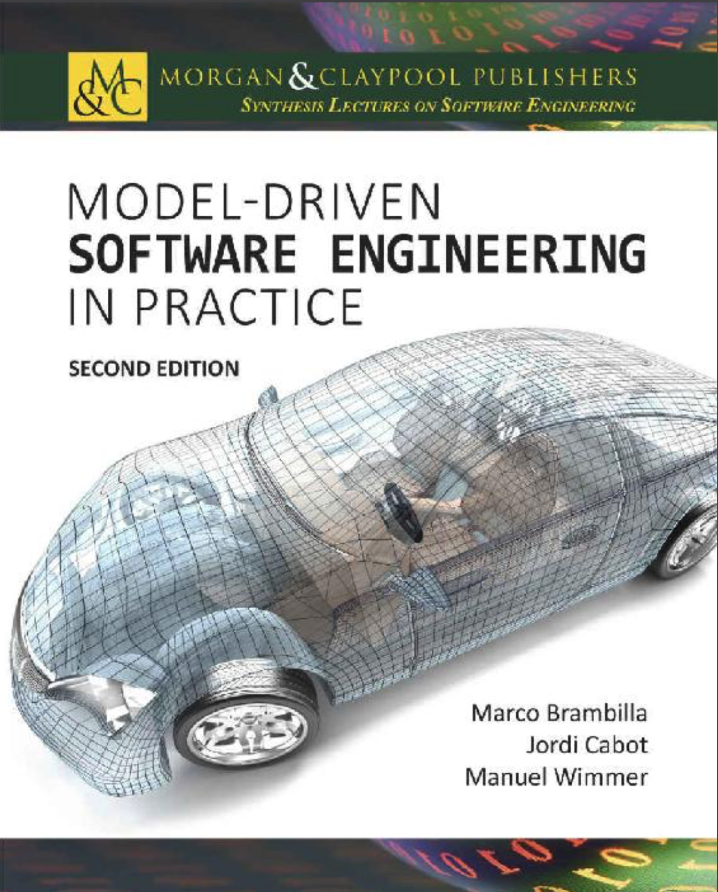

----
## 软件工程综合讲座

编辑

Luciano Baresi，米兰理工大学

《软件工程综合讲座》系列出版短篇著作（75 -125 页），内容涵盖复杂软件系统的构思、需求定义、架构设计、实现开发、管理维护、性能评估、分析测度、有效性验证及正确性验证。本系列旨在提供聚焦软件开发各阶段的专题专著，同时深入探讨前沿技术议题。国际软件工程大会（ICSE）、欧洲软件工程大会（ESEC/FSE）及亚洲软件工程大会（ASE）等顶尖会议将持续塑造本系列的学术视野并推动其发展。

- 《模型驱动软件工程实践：第二版》 Marco Brambilla, Jordi Cabot, and Manuel Wimmer, 2017 年

- 《基于 HadoopUnit 的 iOS 应用测试：分布式 GUI 快速测试》 Scott Tilley and Krissada Dechokul, 2014 年

- 《软件测试中的硬骨头：基于测试即服务（TaaS）的解决方案》 Scott Tilley and Brianna Floss, 2014 年

- 《模型驱动软件工程实践》 Marco Brambilla, Jordi Cabot, and Manuel Wimmer, 2012 年

----
## 模型驱动软件工程实践：第二版

Marco Brambilla, 意大利米兰理工大学

Jordi Cabot, 西班牙加泰罗尼亚高等研究院（ICREA）与加泰罗尼亚开放大学（UOC）

Manuel Wimmer, 奥地利维也纳工业大学

### 摘要
本书探讨了基于模型的方法如何提升软件专业人员的日常实践水平。这种方法被称为模型驱动软件工程（Model-Driven Software Engineering, MDSE），或简称为模型驱动工程（Model-Driven Engineering, MDE）。

大量定量与定性研究表明，MDSE 实践能显著提高软件开发的效率与成效。鉴于软件开发与业务分析的融合趋势，预计未来软件行业对 MDSE 的采用将呈指数级增长。

本书旨在提供敏捷灵活的入门工具，助您快速掌握 MDSE 的基本原理与技术，并根据需求选择合适的工具集，从而立即享受 MDSE 带来的效益。

本书主要分为两部分。

- 第一部分探讨了 MDSE 的基础理论，涵盖基本概念（即模型与转换）、核心驱动原则、应用场景及现行标准，例如由 OMG（对象管理组织）提出的知名 MDA 倡议，以及如何将 MDSE 整合到现有开发流程中的实践方法。
- 第二部分聚焦 MDSE 的技术层面，涵盖从领域特定建模语言的创建时机与方法等基础知识，到模型到文本（Model-to-Text）与模型到模型（Model-to-Model）转换的描述，以及支持 MDSE 项目管理的工具。

本书第二版特色：

- 增设全新主题，包括：全新建模语言（IFML）创建完整示例，探讨特定领域的建模问题与方法，如业务流程建模、用户交互建模及企业架构
- 全面修订示例、图表与文本，提升可读性、理解度与连贯性
- 优化定义表述及概念间依赖关系阐释
- 新增全书内容索引

### 关键词
建模、软件工程、UML、领域特定语言、模型驱动工程、代码生成、逆向工程、模型转换、MDD、MDA、MDE、MDSE、OMG、DSL、EMF、Eclipse

### 目录
* [序言](foreword/0.md)
* [感谢](ack/0.md)
* [第 1 章 引言](ch1/0.md)
  - [1.1 模型的目的与用途](ch1/1.md)
  - [1.2 软件开发的建模](ch1/2.md)
  - [1.3 如何阅读本书](ch1/3.md)
* [第 2 章 MDSE 原理](ch2/0.md)
  - [2.1 MDSE 基础](ch2/1.md)
  - [2.2 缩略语迷宫：MD\* 丛林](ch2/2.md)
  - [2.3 MDSE 方法论概述](ch2/3.md)
    * [2.3.1 整体愿景](ch2/3.md#231-整体愿景)
    * [2.3.2 领域、平台与技术空间](ch2/3.md#232-领域平台与技术空间)
    * [2.3.3 建模语言](ch2/3.md#233-建模语言)
    * [2.3.4 元建模](ch2/3.md#234-元建模)
    * [2.3.5 转换](ch2/3.md#235-转换)
  - [2.4 工具支持](ch2/4.md)
    * [2.4.1 绘图工具与建模工具的区别](ch2/4.md#241-绘图工具与建模工具的区别)
    * [2.4.2 基于模型的 MDSE 工具与基于编程的 MDSE 工具](ch2/4.md#242-基于模型的-mdse-工具与基于编程的-mdse-工具)
    * [2.4.3 Eclipse 与 EMF](ch2/4.md#243-eclipse-与-emf)
  - [2.5  MDSE 的采用与批评](ch2/5.md)
* [第 3 章 MDSE 用例](ch3/0.md)
  - [3.1 软件开发的自动化](ch3/1.md)
    * [3.1.1 代码生成](ch3/1.md#311-代码生成)
    * [3.1.2 模型解释](ch3/1.md#312-模型解释)
    * [3.1.3 代码生成与模型解释的结合](ch3/1.md#313-代码生成与模型解释的结合)
  - [3.2 系统互操作性](ch3/2.md)
  - [3.3 逆向工程](ch3/3.md)
  - [3.4 组织建模](ch3/4.md)
    * [3.4.1 业务流程建模](ch3/4.md#341-业务流程建模)
    * [3.4.2 企业架构](ch3/4.md#342-企业架构)
* [第 4 章 模型驱动架构（MDA）](ch4/0.md)
  - [4.1 MDA 定义与假设](ch4/1.md)
  - [4.2 建模层次：CIM、PIM、PSM](ch4/2.md)
  - [4.3 映射](ch4/3.md)
  - [4.4 MDA 中的通用语言与领域特定语言](ch4/4.md)
  - [4.5 架构驱动现代化（ADM）](ch4/5.md)
* [第 5 章 将 MDSE 集成到开发流程中](ch5/0.md)
  - [5.1 在软件开发流程中引入MDSE](ch5/1.md)
    * [5.1.1 软件建模的得失](ch5/1.md#511-软件建模的得失)
    * [5.1.2 开发过程的社会技术契合度](ch5/1.md#512-开发过程的社会技术契合度)
  - [5.2 传统开发流程与 MDSE](ch5/2.md)
  - [5.3 敏捷与 MDSE](ch5/3.md)
  - [5.4 DDD 与 MDSE](ch5/4.md)
  - [5.5 TDD 与 MDSE](ch5/5.md)
    * [5.5.1 模型驱动测试](ch5/5.md#551-模型驱动测试)
    * [5.5.2 测试驱动建模](ch5/5.md#552-测试驱动建模)
  - [5.6 软件产品线与 MDSE](ch5/6.md)
* [第 6 章 建模语言概览](ch6/0.md)
  - [6.1 解剖建模语言](ch6/1.md)
  - [6.2 多视图建模与语言可扩展性](ch6/2.md)
  - [6.3 通用建模语言与领域特定建模语言](ch6/3.md)
  - [6.4 通用建模：以 UML 为例](ch6/4.md)
    * [6.4.1 设计实践](ch6/4.md#641-设计实践)
    * [6.4.2 结构图（或静态图）](ch6/4.md#642-结构图或静态图)
    * [6.4.3 行为图（或动态图）](ch6/4.md#643-行为图或动态图)
    * [6.4.4 UML 工具](ch6/4.md#644-uml-工具)
    * [6.4.5 UML 的批评与演进](ch6/4.md#645-uml-的批评与演进)
  - [6.5 UML 可扩展性：GPL 与 DSL 之间的中庸之道](ch6/5.md)
    * [6.5.1 定型](ch6/5.md#651-定型)
    * [6.5.2 谓词](ch6/5.md#652-谓词)
    * [6.5.3 标记值](ch6/5.md#653-标记值)
    * [6.5.4 UML 配置文件](ch6/5.md#654-uml-配置文件)
* [参考文献](bibliography.md)
