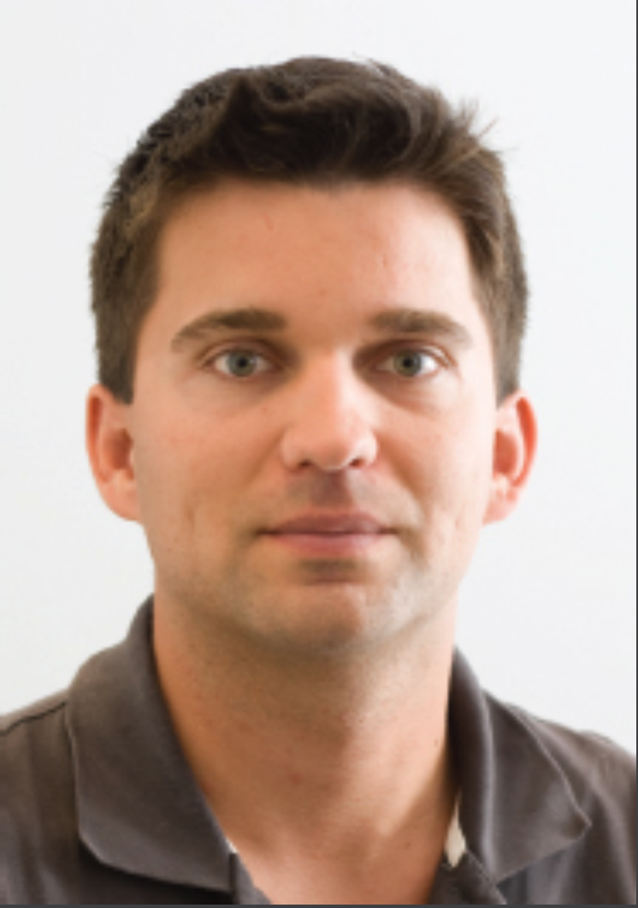

## 作者简介

### MARCO BRAMBILLA

Marco Brambilla 现任意大利米兰理工大学软件工程与网络科学教授。作为 WebRatio 公司的股东兼科学顾问，他参与开发了基于 IFML（OMG 标准化 UI 建模领域专用语言）的 MDD 工具 WebRatio（http://www.webratio.com ）。同时创立 Fluxedo（http://www.fluxedo.com ），并作为 IFML 与 WebML 语言的联合发明人之一。其研究领域涵盖：Web 与移动应用开发的概念模型、工具及方法论；Web 服务；众包；用户交互；业务流程；网络科学；大数据；社交媒体；社交内容分析。曾任思科系统公司（加州圣何塞）及加州大学圣地亚哥分校访问研究员，并担任巴黎第九大学客座教授。合著作品包括《 *设计数据密集型网络应用* 》（Morgan-Kauffman 出版社，2003 年）、《 *交互流程建模语言：基于 IFML 的网络与移动应用模型驱动 UI 工程* 》（Morgan-Kauffman 与 OMG 出版社，2014 年）等多部专著，并在学术会议及期刊发表逾百篇论文。活跃于 MDSE、领域特定语言（DSL）、BPM、SOA 及企业架构领域的教学与产业咨询项目。

个人博客：http://www.marco-brambilla.com/blog 
主页：http://home.dei.polimi.it/mbrambil

### JORDI CABOT

Jordi Cabot 现任加泰罗尼亚开放大学（UOC）下属互联网跨学科研究所的 ICREA 研究教授，并领导该所 SOM 研究实验室。此前，他曾任教于南特矿业学院，担任法国国家信息与自动化研究所国际讲席下的 AtlanMod 研究组组长，并在巴塞罗那（加泰罗尼亚理工大学）、多伦多（多伦多大学）和米兰（米兰理工大学）工作。其研究聚焦于系统与软件工程领域，尤其致力于推动软件模型与工程原理在各类软件工程任务中的严谨应用，同时关注项目中最不可预测的要素：参与人员。

软件开发博客：http://modeling-languages.com 
主页：http://modeling-languages.com

### MANUEL WIMMER

Manuel Wimmer 现任奥地利维也纳工业大学商业信息学组（BIG）教授。曾任德国慕尼黑工业大学及菲利普斯-马堡大学客座教授，并担任西班牙马拉加大学研究助理。他在模型驱动工程、模型版本控制及模型转换领域参与多项研究项目，成果发表于国际期刊及会议。自 2005 年起，他在维也纳工大讲授模型驱动工程课程（每年约 200 名学生），并举办多场行业研讨会，探讨模型驱动工程的实践应用策略。

主页：http://www.big.tuwien.ac.at/staff/mwimmer

