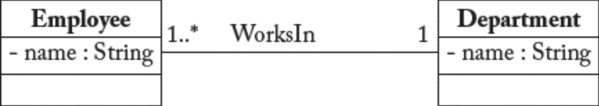

## 10.1 模型交换

#### ▶[上一节](0.md)

鉴于现有建模工具种类繁多，我们需要一种机制来实现模型在不同工具间的交换 (interchange)。借用 Java 的口号 *“编写一次，到处运行 (model once, open everywhere)”* ，建模者希望遵循 *“建模一次，到处可用”* 的原则。

这对开发人员而言是个重大问题，他们受限于模型编辑器的导入/导出功能欠佳，常常需要费力自行寻找需要互操作的两种不同工具格式之间的映射关系和桥梁。这严重阻碍了开发流程中高效利用不同工具的可能性。显然，开发人员无法自由选择最适合当前任务的建模工具，这已成为一个显著缺陷。例如，在理想状态下，开发者可使用建模工具 MT1 进行设计（因 MT1 的编辑器更易用且能提升效率），随后立即切换至工具 MT2 进行验证阶段（因 MT2 提供更精确或更全面的规则），最后转用工具 MT3 执行模型。

作为公认的关键问题，互操作性正受到标准化机构的重视。他们深知（标准）模型应承担的促进沟通与信息交换的职责尚未实现。即便像 UML 或 BPMN 这样成熟的标准，其抽象定义仍不足以让不同厂商的主流建模工具实现无缝模型共享。具体而言，各工具均采用自有内部格式或 “方言” 存储/管理模型，即便采用标准格式亦然。为提升建模工具间的互操作性，标准化机构定义了特定模型交换语言。

最知名的模型交换语言是 XMI <sup>[1](0.md#1)</sup>（XML Metadata Interchange），该标准由 OMG 采用，用于序列化和交换 UML 及 MOF 模型。遗憾的是，尽管它被设计为交换格式，不同工具仍以不同方式实现。即使如 [Fig 10.1](#fig-101) 所示的简单 UML 示例模型，也会因建模工具不同而存储为两个完全不同的 XMI 文件。

#### Fig 10.1


*Fig 10.1: UML 示例模型*

这是使用 MDT/UML2 Eclipse 项目 <sup>[2](0.md#2)</sup> 时为 UML 示例模型生成的（简化版）XMI 文件：
```xml
<packagedElement xmi:type="uml:Class" xmi:id="_c001" name="Employee">
  <ownedAttribute xmi:id="_a001" name="name"/>
</packagedElement>
<packagedElement xmi:type="uml:PrimitiveType" xmi:id="_t001" name="String"/>
<packagedElement xmi:type="uml:Class" xmi:id="_c002" name="Department">
  <ownedAttribute xmi:id="_a002" name="name" type="_t001"/>
</packagedElement>
<packagedElement xmi:type="uml:Association" xmi:id="_as001" name="WorksIn"
  memberEnd="_e001 _e002">
  <ownedEnd xmi:id="_e001" type="_c002" association="_as001"/>
  <ownedEnd xmi:id="_e002" name="" type="_c001" association="_as001">
    <upperValue xmi:type="uml:LiteralUnlimitedNatural" xmi:id="un001" value="*"/>
  </ownedEnd>
</packagedElement>
```

而这是由开源工具 ArgoUML 生成的（简化版）文件，它甚至不符合 XMI 语法规范：
```xml
<UML:Class xmi.id ='_c001'
  name ='Employee' visibility ='public' isSpecification ='false' isRoot ='false'
  isLeaf ='false' isAbstract ='false' isActive ='false'>
  <UML:Classifier.feature>
    <UML:Attribute xmi.id ='_a001'
      name ='name' visibility ='public' isSpecification ='false'
      ownerScope ='instance' changeability ='changeable' targetScope ='instance'>
      <UML:StructuralFeature.multiplicity>
        <UML:Multiplicity xmi.id ='_m001'>
          <UML:Multiplicity.range>
            <UML:MultiplicityRange xmi.id ='_mr001'
              lower ='1' upper ='1'/>
            </UML:Multiplicity.range>
        </UML:Multiplicity>
      </UML:StructuralFeature.multiplicity>
        <UML:StructuralFeature.type>
          <UML:Class xmi.idref ='_st001'/>
        </UML:StructuralFeature.type>
    </UML:Attribute>
  </UML:Classifier.feature>
</UML:Class>

<UML:Class xmi.id ='_c002'
  name ='Department' visibility ='public' isSpecification ='false' isRoot ='false'
  isLeaf ='false' isAbstract ='false' isActive ='false'>
  <!-- ... as before for the name attribute ..... -->
</UML:Class>

<UML:Association xmi.id ='_as001'
  name ='WorksIn' isSpecification ='false' isRoot ='false' isLeaf ='false'
  isAbstract ='false'>
  <UML:Association.connection>
    <UML:AssociationEnd xmi.id ='_ae001'
      visibility ='public' isSpecification ='false' isNavigable ='true'
      ordering ='unordered' aggregation ='none' targetScope ='instance'
      changeability ='changeable'>
      <UML:AssociationEnd.multiplicity>
        <UML:Multiplicity xmi.id ='_m001'>
          <UML:Multiplicity.range>
            <UML:MultiplicityRange xmi.id ='_mr001'
              lower ='1' upper ='-1'/>
            </UML:Multiplicity.range>
          </UML:Multiplicity>
        </UML:AssociationEnd.multiplicity>
      <UML:AssociationEnd.participant>
        <UML:Class xmi.idref ='_c001'/>
      </UML:AssociationEnd.participant>
    </UML:AssociationEnd>
    <!--... same for the second association end ...-->
  </UML:Association.connection>
</UML:Association>”
```
为解决此问题，多款工具正采用 Eclipse UML2 插件 (plugin) 的 XMI 实现方案作为事实标准。由于众多 UML 工具基于该组件构建，其他 UML 工具也必须提供导入/导出功能以确保互操作性，避免流失潜在客户。

值得庆幸的是，OMG 已意识到该问题的重要性，现成立模型交换工作组 <sup>[3](0.md#3)</sup>（Model Interchange Working Group, MIWG），旨在 “通过将供应商的 XMI 导出文件与每个测试用例的预期参考 XMI 文件进行比较，使公众能够评估建模工具的模型互操作能力。”。目前该工作组成员包括 Artisan Studio、RSx、IBM Rhapsody、MagicDraw、Modelio 和 Enterprise Architect。现行测试套件包含数十个 UML 和/或 SysML 测试模型，覆盖规范所有核心元素。这一现状正推动 XMI 规范化版本（即 Canonical XMI）的制定 —— 作为 XMI 的严格子集，该版本将强制采用者遵循更严苛的约束条件。

<ins>请注意，XMI 文件仅包含模型元素的相关信息。图形信息（位置、颜色、布局、字体等）不属于 XMI 文件范畴，因此在交换过程中会丢失。</ins>这令人相当失望，因为设计师通常会投入大量精力提升模型呈现效果（例如移动类的位置以减少线条交叉），作为模型可读性和可理解性的关键因素。数年前，OMG 曾创建图示交换 (Diagram Interchange) 格式以标准化图形模型信息的交换，但该方案未能证明其实用性且基本未被采用。<ins>新的 OMG 图示定义（Diagram Definition, DD）标准 <sup>[4](0.md#4)</sup> 试图解决此问题，旨在促进模型元素与其图形信息之间映射关系的定义</ins>。


其他建模语言也存在类似困境。例如，BPMN 虽有 XML 流程定义语言（XML Process Definition Language, XPDL）作为交换对应语言，但该交换语言与 XMI 面临相同问题。尽管 BPMN 2.0 提供了XMI 交换格式及标准定义的非 XMI 交换格式，实际将 BPMN 项目从一个建模环境迁移至另一个环境仍极为困难。

本节重点探讨语法层面的互操作性问题，但显然当涉及的工具采用不同语义、使用私有扩展或仅覆盖（待交换模型所遵循）元模型的子集时，情况将变得更为复杂。此类情形下，可通过模型转换来解决工具间的异构性问题。

#### ▶[下一节](2.md)
