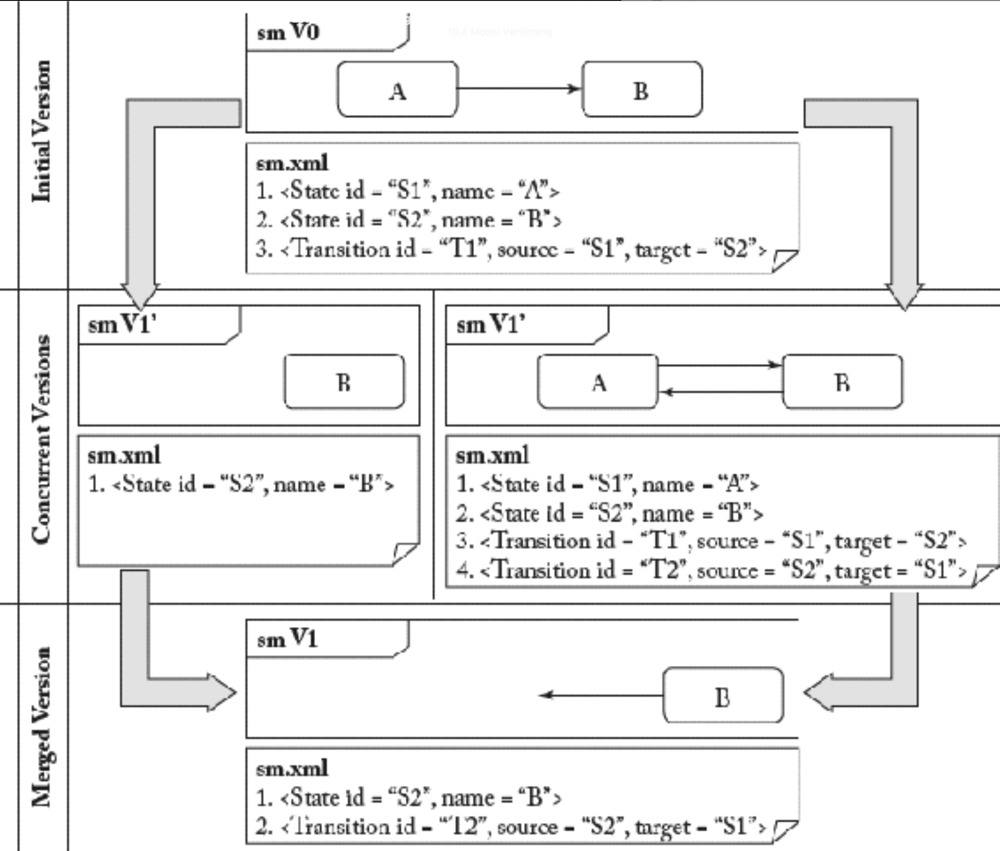

## 10.4 模型版本控制

#### ▶[上一节](3.md)

<ins>版本控制系统（Version Control Systems, VCS）是软件开发基础设施的重要组成部分，其功能包括：(i) 存储软件工件的演变历史；(ii) 支持多开发者并行协作；(iii) 管理不同开发分支 [13](../bibliography.md#13) 。对于所有这些任务，必须追踪版本控制下工件所做的变更。针对第二、三项任务，还需检测同一工件并行演进版本间的冲突，并通过冲突解决获得最终整合版本。当合并软件工件的两个并行修改版本时，冲突往往难以避免。版本控制系统正是用于检测、管理和解决此类冲突的工具。</ins>

显然，程序员离不开 Subversion（SVN）或 Git 这类 VCS 系统。然而直到最近，建模者仍被迫忍受这种困境。如今形势正在改变，模型版本控制技术已开始涌现 [12](../bibliography.md#12) 。

<ins>传统的基于文本的版本控制系统将模型视为普通文本文件，因而忽视了模型的基于图的本质</ins>。以下是一个简单示例，展示了在模型版本控制背景下，模型与其基于文本的表示 [52](../bibliography.md#52) 之间存在的阻抗失配 (impedance mismatch) 现象：假设存在一个基本状态机图，包含两个状态和一条转换（参见 [Fig 10.2](#fig-102) 中的 V0）。当两名建模者同时编辑该模型时，将产生两个不同版本（参见 V1' 与 V1" ）。左侧版本中，仅保留第二个状态，表明第一个状态及转换已被删除；右侧版本中，则保留初始图的所有元素，并引入了一条新增转换。在 XMI 序列化层级运行的基于文本的版本控制系统，在此场景下将自动生成合并后的版本 V1，其将包含状态 B 及指向空处的悬空转换。

#### Fig 10.2

*Fig 10.2: 状态机的基于文本的版本控制*

文本型 VCS 产生这种合并结果的原因在于：在文本层面，VCS 仅对被修改或删除的行进行推理。在本例中，基于文本的比较算法通过将左侧版本（V1’）与原始版本对比，可能检测到首行与末行已被删除。同理，当右侧版本与原始版本比较时，新增行会被检测到。然而，当仅将模型解释为文本行，用于检测新增转换所引用的状态 A 已被同时删除时，系统不会提供任何支持，这种情况必然会导致冲突。

<ins>本例表明基于文本模型的序列化可实现版本化。但仍可能存在未检测到的隐患。因此需要针对模型的专门的版本控制支持，来识别潜在冲突。幸运的是，已有若干优秀的模型版本控制工具问世（其中部分工具基于前文介绍的模型比较工具构建）。</ins>

- EMFStore 项目 [15](0.md#15) 是 Eclipse 官方项目，<ins>致力于提供能追踪所存储模型的版本历史的模型仓库。该项目遵循 SVN 中熟知的检出/更新/提交 (check-out/update/commit) 交互范式，并提供交互式模型合并界面，用于解决（两名用户对模型元素进行重叠修改时的）冲突。同时集成了模型迁移功能（在对元模型进行修改后更新模型）。</ins>
- <ins>AMOR（Adaptable Model Versioning）项目 [16](0.md#16) 为基于 EMF 的模型提供版本控制方法与技术。提供了多种冲突检测、可视化与解决方案。特别是利用模型标注 (annotation) 技术，将合并冲突以模型的图形化语法形式可视化呈现。</ins>
- <ins>CDO 模型仓库（参见第 [10.2](2.md) 节）在数据库层面上为模型提供了有限的分支与合并支持。</ins>
- <ins>Epsilon 合并语言 (Epsilon Merging Language) [17](0.md#17) 是一种基于规则的语言，用于合并同构或异构模型</ins>。待合并模型的对应关系可通过相关的 Epsilon Comparison Language 生成（参见第 [10.3](3.md) 节）。

<ins>需注意，上述工具仅对模型信息进行版本控制，通常不包含其图形表现形式（如图形布局）</ins>。一种可能性是同样对图形信息进行版本控制，这种信息在许多图形模型编辑器中也以模型的形式呈现。然而，当不同建模者并行修改图形时，仍需探讨在此情境下何种操作应被视为变更或冲突。例如：将类向右移动两英寸是否构成变更？这是否与另一项 "变更" （将该类向下略微移动）产生冲突？<ins>图形的版本控制仍是待解决问题。</ins>

#### ▶[下一节](5.md)
