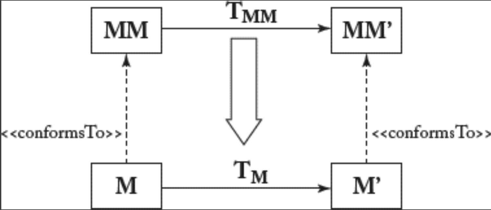

## 10.5 模型协同演进

#### ▶[上一节](4.md)

模型版本控制工具追踪单个建模工件在其生命周期中的演进过程。但这仅是演进问题的一面。由于模型并非孤立存在，而是相互关联，其中一个模型的变更可能影响其他模型。这意味着当某个模型演进时，依赖模型必须协同演进以重建彼此间的关联关系。

最典型的冲突性演进场景是通过修改元模型 [50](../bibliography.md#50) 来修正错误、支持新建模特性、优化现有功能等，从而实现建模语言的演进。这种元模型的演进要求我们协同演进已存在的模型实例，这些实例可能不再符合新版元模型（例如修改属性类型时，需更新所有具有该属性的模型值以确保类型一致性）。受影响的模型必须迁移至新版元模型。

[Fig 10.3](#fig-103) 直观展示了模型迁移问题。实心箭头表示转换操作；虚线箭头表示模型与元模型间的 *conformsTo* 关系。当元模型 MM 演进后（参见图上半部分），可将其视为对元模型的转换操作 TMM。此时目标是，通过创建合适的迁移转换 TM （参见图下半部分），将（符合 MM 的）模型 M 迁移至（符合 MM' 的）模型 M'。但在将模型迁移至新版元模型前，必须精确确定旧版与新版元模型间的变更点，因为这些变更构成了模型适配的基础。

在此背景下，在演进元模型前对元模型变更对模型的影响进行分类至关重要[17]。

#### Fig 10.3

*Fig 10.3: 元模型的演进及其对应模型的协同演进*

- **非破坏性操作** ：元模型层级的变更无需迁移实例，例如：在元类中添加新的可选属性。
- **破坏性与可解决操作** ： 元模型层级的变更通过自动迁移反映至实例层级，例如：在元类中添加带默认值的强制属性。
- **破坏性且不可解决的操作**：
某些元模型层级的变更需要复杂迁移，可能要求用户的输入以便为模型引入附加信息，例如：在元类中添加无默认值的强制属性。

根据元模型演进的复杂程度，为使模型适应新元模型版本所需的迁移转换，可从差异模型中推导，该模型记录了元模型演进过程中所做的变更列表。通常，此方法适用于 "破坏性与可解决操作" 。以元类删除为例：默认迁移策略是在所有模型中删除其实例。这虽使模型在语法层面重新符合元模型规范，但该默认迁移在语义层面的有效性仍需用户判断。例如：某些场景下，实例可能需要转换为其他元类而非直接删除。

多种工具可辅助迁移过程 [59](../bibliography.md#59)：

- **Edapt** [18](0.md#18) 通过提供标准迁移策略，支持 Ecore 元模型的演进及模型向新版元模型的自动迁移。
- **Epsilon Flock** [19](0.md#19) 是基于 Epsilon 语言家族构建的模型迁移语言，可自动更新模型以响应元模型变更。
- 任何 **M2M 转换语言** 均可用于指定模型迁移路径，以处理协同演进场景。

*其他协同演进场景：* 模型/元模型协同演进仅是建模工件变更影响相关工件的典型示例。例如，元模型变更可能影响所有（读取或写入该类型模型的）转换规则。变更后，这些转换可能失效，如因引用了已不存在的模型元素。此外，元模型的演进可能需要协调 OCL 约束，具体语法规范也是一样。显然，所有协同演进场景均源于元模型在语言工程流程中的核心地位，对它的任何变更都需传播至所有依赖的工件。

除元建模层面的协同演进外，模型层面同样存在多种协同演进场景。以 UML 等多视图建模语言为例：假设类图中某个操作被删除。若状态机以该操作作为转换触发器，模型将陷入不一致状态。因此在模型层，协同演进同样是关键要素，需通过不一致检测规则（如 OCL 定义）与协同演进规则（如 M2M 转换定义）予以支持。

#### ▶[下一节](6.md)
