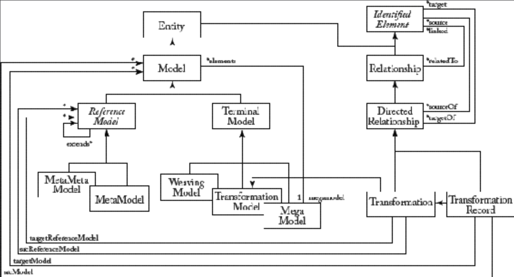

## 10.6 全局模型管理

#### ▶[上一节](5.md)

迄今为止，我们已探讨了多种技术与工具，用于在互联的 (connected) 建模生态系统中，管理模型生命周期的不同方面。管理此类生态系统的整体问题被称为全局模型管理（Global Model Management, GMM）。这也是国际倡议 “建模语言全局化，用于异构建模的一个语言工作台，以支持协同开发” 背后的核心挑战。<sup>[20](0.md#20)</sup>

管理整体生态系统的关键要素在于，将所有相关模型的信息及它们之间的关联关系，集中存储于一个位置（即模型）。该模型被称为 *巨型模型 (megamodel* [23](../bibliography.md#23) 。巨型模型不仅包含项目工件（如基于 MDSE 的模型，也可能包含配置文件等非 MDSE 工件），还包含其管理所需的关系及其他相关的元数据（如工件的实际类型、标识符、位置等）。从这个意义上说，巨型模型可被视为元数据仓库，其中存储着模型及其关联关系的精确表示，并为用户提供多种用途的支持。

巨型模型（本质上）是普通模型，其独特之处在于其模型元素本身即是其他模型。作为模型，巨型模型必须符合 (conform to) 元模型。Eclipse AM3（AtlanMod MegaModel Management）巨型建模框架的一部分，可作为巨型模型的具体元模型示例 <sup>[21](0.md#21)</sup>。 [Fig 10.4](#fig-104) 展示了该元模型的子集。如图所示，巨型模型的元素类型可包含模型、元模型、转换以及与 MDSE 项目相关的任何其他建模元素。

#### Fig 10.4


*Fig 10.4: 巨型模型的元模型：AM3 案例*

其重要优势在于：作为模型，巨型模型可使用其他模型工具进行操作。不过也存在专门的模型管理工具。特别值得一提的是 MoScript <sup>[22](0.md#22)</sup> ，一种文本 DSL，同时是巨型模型无关平台，用于访问和操作巨型模型中表示的建模工件。MoScript 支持编写查询语句从仓库检索模型、模型检查、调用模型服务（如转换），并能将新生成的模型注册回仓库。MoScript 脚本可描述并自动化复杂建模任务，实现对模型集的连续操作。因此该语言可用于建模任务和/或工作流自动化，以及任何可想象的批量模型处理任务。MoScript 架构包含可扩展的元数据引擎，用于解析和访问建模工件，并调用不同转换工具的服务。

例如，假设我们需要将 Java 系统重新生成为 .NET 系统。若已存在 java2dNet 转换工具，则可将其应用于存储库中的所有 Java 模型以生成对应的 .NET 模型。以下代码片段展示了 MoScript 如何自主/自动完成此任务： 脚本首先从存储库中筛选出符合 Java 元模型的模型集，随后从存储库获取 java2dNet 转换器 ，然后调用 *applyTo* 操作并应用于每个 Java 模型。此示例的结果是一组 TransformationRecord 元素，其中包含新生成 .NET 模型。

```dotnet
let javaModels : Collection(Model) =
  Model::allInstances()->select(m | m.conformsTo.kind ='Java') in
let java2dNet : Transformation =
  Transformation::allInstances()->any(t | t.identifier ='java2dNet') in
javaModels->collect(jm | java2dNet.applyTo(Sequence{jm}))
```
在幕台，MoScript 会在待转换模型的元模型之间进行类型检查，并通过查询巨型模型来验证元模型与转换操作的兼容性。通过相同机制，MoScript 确定应由哪个转换引擎执行转换操作。最终，MoScript 将模型、元模型及转换规则发送至转换引擎执行。生成的模型可持久化存储于模型仓库，供后续检视，甚至可通过串联 MoScript 脚本进行二次转换。

#### ▶[下一节](7.md)
