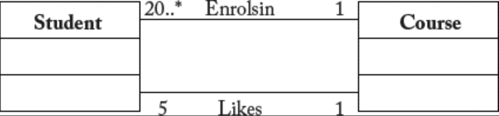

## 10.7 模型质量

#### ▶[上一节](6.md)

MDSE 为软件工程带来的视角转变意味着：模型的正确性（以及模型转换，如前所述也属于模型的一种）成为最终软件产品质量的关键因素。例如，当代码不再从零编写而是通过模型（半）自动合成时，模型中的任何缺陷都将传播到代码中形成缺陷。

尽管确保软件质量的问题已受到广泛关注和研究，但它仍被视为软件工程界面临的 *重大挑战 (grand challenge)* [39](../bibliography.md#39) 。亟需提供一套工具与方法，既能协助检测模型层面的缺陷，又能无缝集成到现有的基于 MDSE 的工具链中，且不产生过多开销。

总体而言，现有建模工具仅能保证模型的语法正确性 (well-formedness)，即检查所定义模型是否是（符合）元模型的有效实例。此类验证可按需进行（设计者需主动触发验证并负责修正错误），也可自动执行（工具阻止添加破坏语法正确性的新建模元素）。例如，Eclipse 中的 UML2 元模型实现就提供了部分 UML 语法规则的按需验证功能。基于 Eclipse 的 UML 建模工具可利用此特性，为用户提供某种程度的 “安全” 建模环境。

<ins>语法正确性通常仅针对单个模型进行考量。使用不同但互补的模型表达系统时，不同视图之间的一致性并不强制要求</ins>。在开发过程的早期阶段，这种做法是合理的（因为这些模型可能由独立的设计团队开发，例如：一个团队在 UML 序列图中定义的方法调用，可能与另一个团队在类图中定义的类中的实际方法不对应），但在某个时间点，消除这些不一致性就变得至关重要。

### 10.7.1 模型验证
就模型质量而言，语法正确性只是冰山一角。模型可能语法正确却存在错误，即便是极其简单的模型也可能出错。请看 [Fig 10.5](#fig-105) 所示模型，表示了学生与所选课程及喜好课程之间的关系。

#### Fig 10.5

*Fig 10.5: 结构正确但无效的模型：不可满足性问题*

即使该模型规模小且不含 OCL 约束，仍无法实例化该模型，使关联中的所有基数 (cardinality) 约束同时满足（此即所谓 *可满足性 (satisfiability)* 问题，冗余性等诸多高级正确性属性皆基于此定义）。因此该模型毫无用处，用户永远无法用它存储一致性信息。该模型的错误在于：*EnrollsIn* 关联强制要求每门课程至少有 20 名学生，而 *Likes* 关联却规定每门课程学生数必须恰为 5 。

对于此示例，由于问题仅在于基数约束，验证工具可以轻松检测错误并提供反馈。<ins>但遗憾的是，验证任意模型正确性（包括任何建模构造与完整性约束的组合，这些约束通过类似 OCL 的表达性语言进行表述）本身是个极其复杂的问题（事实上，该问题甚至在一般意义上都不可判定，这意味着无法创建一个算法来判定任意模型的正确性）</ins>。这解释了为何迄今尚未出现可轻松集成至最先进的建模工具的验证工具。现有验证工具需要设计人员参与交互，这限制了模型中可使用的元素范围，同时要求对形式化方法有深入理解或进行大量手动模型注释，这些因素严重削弱了其实际应用的便利性。

为规避这些问题，新一代验证工具采取更务实的方法：不再追求完美答案，而是以合理时间内给出（具有一定置信度的）答案为目标。EMFtoCSP [23](0.md#23) 即是此类工具的典范，它通过将 UML 和 EMF 模型透明转换为约束满足问题 (constraint satisfaction problem) [70](../bibliography.md#70)，再提交给约束求解器 (constraints solver) 去评估模型的可满足性 (satisfiability) 来验证模型。

不同模型的相关正确性属性取决于模型类型。对于静态模型（如 UML 类图），典型属性包括前述可满足性（即必须能创建模型的有效实例化）和无冗余性。动态模型则需关注无死锁、无无限递归，以及操作的适用性和可执行性。

### 10.7.2 模型测试与验证
形式化方法并非评估模型质量的唯一途径。已提出多种测试方法，用于对模型进行测试，（其原理）类似于软件测试技术在代码层面的运作方式。

对于添加了 OCL 约束的 UML 模型，这种方法尤为适用。USE [24](0.md#24) 等工具可从模型自动生成系统状态（运行中系统的快照）。针对每个快照，会自动验证 OCL 约束，并将结果通过图形化视图呈现给设计者。这种系统仿真，使设计者能够识别模型是否存在过度约束（即领域中某些有效情况被规范禁止）或约束不足（某些无效场景被规范判定为正确）。同样地，多种工具提供了行为模型的仿真功能，例如状态机，您可以在其中观察状态机如何根据系统状态和输入值演变。

测试技术对验证模型转换行为具有特殊意义。为此已提出多种白盒与黑盒测试技术 [7](../bibliography.md#7)，其目标与程序测试一致：在最小化生成测试用例数量的同时最大化覆盖率。模型转换测试的目标在于，检测转换从有效源模型生成无效目标模型的异常案例。

### 10.7.3 模型审查
除了传统的模型验证、确认和测试方法外，还需要通过人工检查来确保和提升模型质量。审查作为经典方法之一，早已通过非正式的走查或正式的检查，应用于程序领域。显然，这些技术同样需要应用于模型层面以保障质量。[25](0.md#25)

当前开展模型审查的方法与工具尚不丰富。EGerrit [26](0.md#26) 作为该领域的先驱，是一款将 Gerrit 集成至 Eclipse 的插件。此外，EGerrit 是一款代码审查工具，通过整合 EMF Compare 和 Gerrit，为建模项目提供专属支持。例如，模型及模型差异可直接添加评论，并支持投票等审查任务。虽然 EGerrit 为模型审查提供了首批工具支持，但未来仍需深入研究，以明确哪些审查流程对建模项目具有实际效益。

#### ▶[下一节](8.md)
