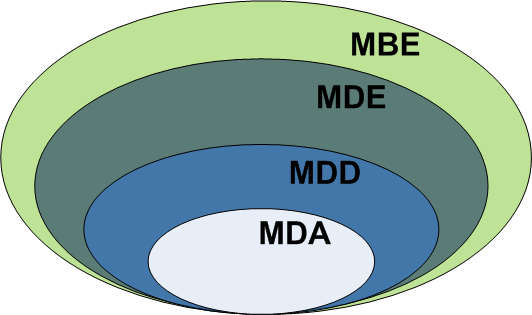

## 2.2 缩略语迷宫：MD\* 丛林

#### ▶[上一节](1.md)

从业者在探索模型驱动领域时面临的首要挑战，是应对大量看似晦涩却基本同义的缩略语。本节提供简明指南，助您轻松穿越缩略语丛林。[Fig 2.1](#fig-21) 以可视化形式展示了描述建模方法的各类缩略语之间的关联关系。

#### Fig 2.1

*Fig 2.1: 不同 MD\* 缩略语之间的关联关系* *（译注：原文中的图有误，从网上找到了一个最接近的图替代）*

模型驱动开发（Model-Driven Development, MDD）是一种以模型作为开发过程主要产物的开发范式。通常在 MDD 中，实现代码会从模型中（半）自动生成。

模型驱动架构（Model-Driven Architecture, MDA）是对象管理组织（OMG）提出的特定 MDD 愿景，因此依赖于 OMG 标准的应用。由此可将 MDA 视为 MDD 的子集，其中建模与转换语言均由 OMG 标准化。

另一方面，MDE 可视为 MDD 的超集。正如 MDE 中的 “E” 所示，MDE 超越了纯粹的开发活动，涵盖完整软件工程流程中的其他基于模型的任务（例如：系统的基于模型的演化，或遗留系统的模型驱动逆向工程）。

最后，我们使用 “基于模型的工程”（或 “基于模型的开发” ）来指代一种更柔性的 MDE 形式。即在 MBE 过程中，软件模型虽扮演重要角色，但未必是开发的核心产出物（即它们并不像 MDE 那样 “驱动” 整个过程）。例如，在某开发流程中，分析阶段的设计师会定义系统领域模型，但后续这些模型会被直接作为蓝图交付给程序员手动编写代码（不涉及自动代码生成，也不显式定义任何平台特定模型）。在此过程中，模型仍发挥重要作用，但并非开发流程的核心产出物，其完整性可能低于 MDD 方法中的模型（即更多作为系统蓝图或草图使用）。MBE 是 MDE 的超集 —— 所有模型驱动流程均基于模型，但反之则不然。

所有 “模型驱动某领域” 的变体常以缩写 MD\*（Model-Driven star）标识。需注意文献中还存在大量衍生缩写，例如 MDSE（模型驱动软件工程）、MDPE（模型驱动产品工程）等。MDE 可视为所有变体的超集，任何 MD\*E 方法均可归入 MDE 范畴。本书重点探讨 MDSE。”

#### ▶[下一节](3.md)
