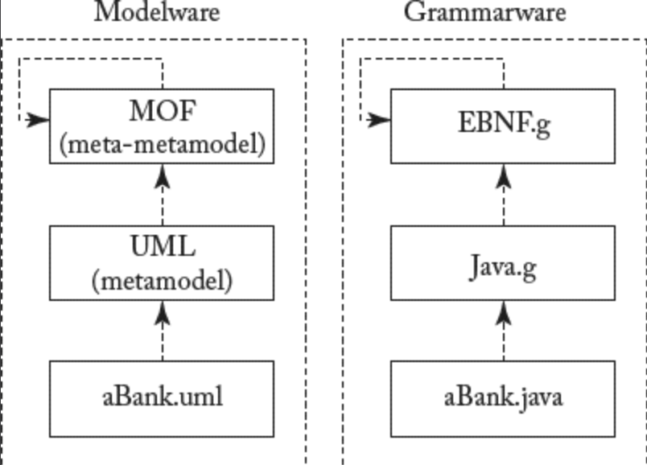

## 2.3 MDSE 方法论概述

#### ▶[上一节](2.md)

本节深入探讨 MDSE 方法的构成要素与核心理念。我们将重点阐明建模技术可在不同抽象层次上应用，并指出完整的建模方法甚至能实现对模型本身的建模。最后，我们将阐述模型转换的作用与本质。

### 2.3.1 整体愿景
MDSE 为系统开发提供了全面的愿景。[Fig 2.2](#fig-22) 展示了 MDSE 考虑的主要方面，并总结了如何处理不同问题。MDSE 根据正交维度寻求解决方案：概念化（图中列）与实现（图中行）。

*实现* 问题涉及将模型映射至现有或未来的运行系统，因此包含三个核心维度的定义：

- 建模层：模型定义所在层面
- 实现层：通过运行系统中实际使用的构件，实现解决方案的层面（软件情况下即代码）
- 自动化层：建立建模层与实现层之间映射关系的层面

*概念化* 问题侧重于定义描述现实的概念模型，主要应用于三个层面：

- 应用层：定义应用模型、执行转换规则并生成实际运行组件。
- 应用领域层：定义特定领域的建模语言、转换规则及实现平台。
- 元层面：定义模型与转换规则的概念化形式。

#### Fig 2.2

*Fig 2.2: MDSE 方法论概述（自上而下流程）*

MDSE 的核心流程是从应用模型向下流向运行实现，通过后续的模型转换实现。这使得模型能够复用，系统也能在不同平台上运行。事实上，在实现层面上，运行的软件依赖于特定平台（为特定应用领域定义）来执行。

为此，模型需依据建模语言进行定义，而该建模语言又基于元建模语言构建。转换执行则通过特定转换语言定义的一组转换规则实现。

在此框架中，系统 *构建* 通过 *自上而下的过程* 实现：*规范性模型 (prescriptive models)* 定义范围限制与目标实现方式；而自下而上的抽象化过程则用于生成系统的 *描述性模型 (descriptive models)* 。

后续小节将详细探讨建模抽象层次、概念化过程及模型转换机制。

### 2.3.2 领域、平台与技术空间
MDE  的本质意味着存在需要建模的上下文环境，以及模型需要转换的目标对象。此外，<ins>软件工程实践建议区分问题空间与解决方案空间：*问题空间* 由开发过程中的 *分析* 阶段处理，而 *解决方案空间* 则首先通过 *需求收集* 阶段（定义预期成果）处理，随后由 *设计* 阶段（规定实现目标的方法）处理</ins>。在 MDSE 中定义这些方面的通用术语如下。

*问题空间*（亦称问题领域）指为理解和定义问题所需考察的专业领域或范围。*领域模型* 作为问题领域的概念模型，描述各类实体及其属性、角色、关系，以及描述并保证该问题领域模型元素完整性的约束和交互。领域模型的目标是通过定义术语和关键概念，建立所关注领域的共识认知。关键建议是：领域模型必须避免预设设计或实现方案的倾向，仅应描述问题空间中的资源与议题。

相反，*解决方案空间* 是指在设计、实现和执行层面所做的选择集合，这些选择旨在获得能够在问题域内解决既定问题的软件应用程序。

*技术空间* 代表了此类软件应用程序的设计、实现和执行工作环境。这些工作环境通常意味着与特定实现技术（可组合成统一平台）和语言的绑定。

<ins>技术空间概念对 MDSE 至关重要，因为它使我们能够确定模型、转换和实现所采用的技术工具集与存储格式。需注意技术空间既可同时覆盖问题域与解决方案域，也可仅涵盖其中一方。</ins>

[Fig 2.3](#fig-23) 展示了若干技术空间的实例，它们覆盖开发的不同阶段：MDSE 贯穿从问题定义到应用程序设计、实现乃至执行的全过程（例如通过模型解释技术实现）；而 XML 和 Java 框架则更侧重于实现层面。

#### Fig 2.3

*Fig 2.3: 技术空间示例及其覆盖范围*

在软件开发过程中，技术空间之间存在迁移的可能性（如图中箭头所示）。这意味着需要具备适当的软件工件：一类称为提取器，能够从某个技术空间中提取知识；另一类称为注入器，能够将此类知识注入另一个技术空间。

需注意的是，模型在不同技术空间间的转换与迁移方式取决于开发活动的业务目标：事实上，MDSE 可应用于广泛场景，涵盖软件开发自动化、系统互操作性、逆向工程及系统维护等领域。这些方面将在第 [3](../ch3/0.md) 章进行深入探讨。

### 2.3.3 建模语言
正如后续将详细阐述的，建模语言是 MDSE 的核心要素之一。建模语言作为工具，使设计师能够通过图形或文本形式为系统指定模型。无论何种形式，建模语言均经过形式化定义，要求设计师在建模时遵循其语法规范。此类语言可归纳为两大主要类别。

*领域特定语言（Domain-Specific Languages, DSL）* 是专为特定领域、场景或企业设计的语言，旨在简化用户描述该领域事物的工作。若该语言用于建模，也可称为领域特定建模语言（Domain-Specific Modeling Language, DSML）。早在该缩写出现之前，DSL 已在计算机科学中广泛应用：典型示例包括网页开发的 HTML 标记语言、儿童笔式绘图的 Logo 语言、硬件描述语言 VHDL、数学工具 Mathematica 与 MatLab、数据库访问的 SQL 等。

*通用建模语言（General-Purpose Modeling Languages, GPML/GML/GPL）* 则代表可应用于任意领域进行建模的工具。此类语言的典型代表是 UML 语言套件，以及 Petri-nets、状态机等语言。

为避免命名歧义与变体混淆，本书后续将统一采用 DSL 和 GPL 作为这两类语言的缩写。

在这些类别中，可进一步定义细分与分类。鉴于建模本质上涉及抽象化，一种简易的建模语言及对应模型分类方式是基于建模所处的 *抽象层次*。直观而言，某些模型比其他模型更具抽象性。尤其在信息系统设计领域，可考虑以下替代模型：

- 在高度抽象层级描述需求与诉求，完全不涉及实现细节（例如用户需求或业务目标的描述）；
- 通过存储数据与执行算法定义系统行为，不包含任何技术细节；
- 详细定义所有技术层面要素。

基于不同的建模层级，可定义相应的转换机制，将某一层级的模型映射至另一层级的模型。

某些方法（如 MDA）提供了一组固定的建模层次，这使得讨论规范所涉及的模型类型更为便捷。具体而言，MDA 将其抽象层次定义为上述列表所示。

模型旨在描述系统的两个主要维度：静态（或结构）部分与动态（或行为）部分。

因此，我们可以定义如下：
- *静态模型* ：聚焦于系统的静态方面，包括管理数据、系统结构形态及体系架构。
- *动态模型* ：通过展示动作与算法的执行序列、系统组件间的协作关系、组件及应用程序内部状态的变化，强调系统的动态行为。

这种分离凸显了同一系统需具备不同视图的重要性：完整的系统视图应同时涵盖静态与动态维度，理想情况下应分别处理但保持适当的关联性。

毫无疑问，多视角建模是 MDSE 的核心原则之一。由于建模符号表示法通常专注于描述特定视角的细节，采用 MDSE 方法解决问题时，往往会构建出多个描述相同解决方案的模型。每个模型聚焦于不同视角，可能采用不同记法。最终目标是提供系统的全面描述，同时保持不同关注点的分离。因此模型可通过交叉引用相关工件实现互联。

虽然理论上可将设计定义为由多种独立符号表示法（可能来自不同标准化机构，甚至包含专有或第三方记法）构成的模型集合，但更便捷的做法是采用一套符号表示法组合 —— 这些符号表示法虽各不相同且处理设计的正交方面，却拥有共同基础并相互关联。这正是通用建模语言通常不包含单一符号表示法，而是包含若干协调互补的符号表示法的原因。这类语言也被称为建模语言套件或语言家族，因为它们实际上由多种语言组成，而非单一语言。最著名的语言套件实例当属 UML 本身，它使设计者能够表示多种不同的图类型（类图、活动图、序列图等）。

### 2.3.4 元建模
由于模型在 MDSE 中扮演着无处不在的角色，在定义模型之后，自然而然地需要将模型本身作为更抽象模型的 “实例” 来表示。因此，正如我们将模型定义为现实世界现象的抽象化表达，我们同样可以将 *元模型* 定义为另一种抽象形式，从而突出模型本身的特性。<ins>从实用角度看，元模型本质上构成了建模语言的定义，因为它们提供了描述该语言所能表示的整个模型的类的方法</ins>。

因此，人们可以定义现实世界的模型，进而定义描述模型的模型（即元模型），并递归地定义描述元模型的模型（即元元模型）。虽然理论上可定义无限层级的元建模，但实践表明元元模型可基于自身进行定义，因此通常没有必要超越此抽象层级。在任何元建模实践层面，我们都认为模型与其元模型的 *conforms to* 关系，如同计算机程序遵循其编程语言语法规则。更具体而言，当模型所有元素均可表示为对应元模型（元）类的实例时（如 [Fig 2.4](#fig-24) 所示），即称该模型符合其元模型。

#### Fig 2.4

*Fig 2.4: conformsTo 与 instanceOf 关系*

[Fig 2.5](#fig-25) 展示了一个元建模的实例：现实世界对象在 M0 层呈现（本例中为电影）；其建模表示则在 M1 层呈现，该模型通过属性（本例中为标题）描述了视频的概念。该模型的元模型位于 M2 层，描述了 M1 层定义模型所使用的概念：类、属性与实例。最终，M3 层呈现定义 M2 概念的元元模型：本例中该集合最终归结为单一的类概念。显然无需在 M3 之上设置更多元模型层级，因后续层级仅会包含类概念。

#### Fig 2.5

*Fig 2.5: 模型、元模型与元元模型*

尽管有人认为元模型属于繁复的概念化设计，但元建模在实践中极具实用价值（即便人们尚未意识到这一点）。元模型可高效用于：
- 定义新的建模或编程语言；
- 定义用于信息交换与存储的新建模语言；
- 定义与现有信息关联的新属性或特征（元数据）。

值得注意的是，*元数据（metadata）* 一词采用相同方法定义，旨在描述关于现有数据的数据。因此，元建模（metamodeling）完美契合此类信息的描述。

需注意的是，MDSE 范式，亦称 *modelware* ，在基本定义和基础设施层面与 *grammarware*（即通过语法定义语言的技术领域）并无本质差异。如 [Fig 2.6](#fig-26) 所示： *grammarware*（图右侧）可视为通过领域特定语法定义语言的广义技术空间。最常见的语言定义方式之一是 EBNF 形式，即语言语法规则的文本化表达（另存在称为语法图的图形化表示）。语法定义语言可基于自身进行递归定义（如 *grammarware* 栈顶层的循环箭头所示）。特定语言遵循其规范，模型（或程序、文本）可依据该语言定义。类似地，在 MDSE 栈中存在语言定义机制，基于自身递归定义，所有语言定义均可据此规范。最终，所有模型都将符合指定语言规范。该图示阐释了 OMG 标准化的 MDA 框架内该堆栈的运作机制（第 [4](../ch4/0.md) 章将对此案例进行深入探讨）。

#### Fig 2.6

*Fig 2.6: Modelware vs. Grammarware*

### 2.3.5 转换

<ins>除模型外，模型转换是 MDSE 的另一关键要素，它允许在不同模型之间定义映射关系。转换实际上是在元模型层级定义的，随后应用于符合这些元模型的具体模型层级。转换在源模型与目标模型之间执行，但实际基于各自的元模型进行定义</ins>（参见 [Fig 2.7](#fig-27) ）。

MDSE 提供专用的语言来定义模型转换，为设计者提供优化方案以指定转换规则。这些语言可用于通过转换模板定义模型转换，该模板通常根据模型元素的匹配规则应用于模型。

此类转换规则可通过不同方式定义：开发者可从零开始手动编写转换规则，也可将其定义为现有规则的精细化规范。此外，转换规则本身可通过模型间的高级映射规则自动生成。该技术基于两个阶段：

#### Fig 2.7

*Fig 2.7: 模型间转换的作用与定义*

1. 定义一个模型元素与另一个模型元素之间的映射关系（ *模型映射或模型编织* ）；以及
2. 通过一个系统自动生成实际转换规则 —— 该系统接收两个模型定义及其映射关系作为输入，并产出转换规则。

这使开发者能够专注于模型间关系的概念方面，并将转换规则的生成工作（可能在不同技术空间中实现）委托给系统。

<ins>与 “万物皆模型” 理念相关的另一有趣视角在于：*转换本身可被视为模型*，并以模型形式进行管理，包括其元建模过程</ins>。[Fig 2.7](#fig-27) 下部展示了两个模型（Ma 和 Mb）及其转换关系 Mt 将 Ma 转换为 Mb。上层定义了对应的元模型（MMa、MMb 和 MMt），三个模型（Ma、Mb 和 Mt）分别遵循这些元模型，而所有元模型又共同遵循同一元元模型。

#### ▶[下一节](4.md)
