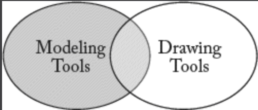
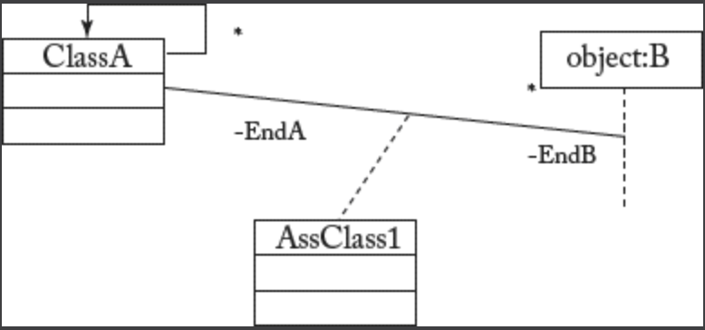

## 2.4 工具支持
除了 MDSE 在建模和转换语言方面提供的概念工具外，开发人员还可获得种类繁多的建模工具集，这些工具支持模型开发、模型转换以及在软件开发流程中的集成。如今开发者可从开源、免费到商业工具，从完整框架到独立工具，从桌面端到云端及 SaaS（软件即服务）解决方案中，选择全谱系的 MDSE 工具。部分工具支持完整的 MDSE 流程，即提供定义新语言、模型、转换及实现平台的功能；另一些则是支持特定领域或通用领域符号表示法的设计工具。

### 2.4.1 绘图工具与建模工具的区别
许多人误以为绘图工具和建模工具是可互换的概念，但事实远非如此。实际上，仅有部分工具同时兼具绘图与建模功能。

#### Fig 2.8

*Fig 2.8: 建模工具与绘图工具的对比*

某些建模工具采用具体的 *文本语法* 来定义模型（并非所有模型都需要图形化呈现），因此即使工具能将文本定义渲染为某种图形导出格式以实现可视化，这些工具本身也不支持绘制功能。例如，UML [2](0.md#2) 的文本建模工具，或是使用 XText [3](0.md#3) 和 EMFText [4](0.md#4) 等工具创建的任何 DSL 建模工具。

此外，许多绘图工具并不适合作为建模工具。只有当绘图工具能够 "理解" 所绘制的内容时，才能被视为建模工具 —— 即该工具不仅处理形状、线条和箭头，更能理解它们所代表的含义（例如类、关联或其他建模概念）。这至少应能实现模型验证功能，即检查模型是否符合其元模型的规范。

例如，绘图工具可能允许设计者绘制如 [Fig 2.9](#fig-29) 所示的荒谬模型。图标和形状或许符合特定语言规范（此例中为 UML 符号），但模型本身可能毫无意义 —— 因为元素的使用方式已违反语言规则。MDSE 始终建议使用建模工具定义模型，主要基于以下三点原因：*（译注： [Fig 2.9](#fig-29) 中将时序图和类图混放在了一起。）*

#### Fig 2.9

*Fig 2.9: 绘图工具定义的错误模型*

- 建模工具能够通过工具提供的（外部）访问 API 导出或操作模型。绘图工具的 API 可能提供诸如 *getAllRectangular-Shapes* 的方法，但不会提供类似 *getAllClasses* 的方法。后者才是建模工具应暴露的 API 方法类型，它能实现对模型的便捷操作。同样的讨论也适用于导出格式 —— 绘图工具几乎不提供任何语义感知型导出格式，无法轻松导入其他（建模）工具。
- 建模工具能保证最低限度的语义含义和模型质量，因为它确保了与某种元模型的对齐。在相同绘图工作量下，产出模型（而非仅是图纸）的价值远高于前者 —— 即便该模型仅用于沟通目的。事实上，此类模型极可能成为原型设计或代码生成的有效资源，而要实现这些目标，你必须能将模型纳入 MDSE 链条。
- 建模工具通常提供适配的模型转换功能。显然，由于模型最终以文件形式编码，人们可能考虑使用常规命令式编程语言定义转换规则。但此举会降低整个建模框架的抽象层次，往往导致生成臃肿且难以维护的软件。正因如此，MDSE 倡导采用声明式模型转换语言 —— 这类语言配备专为定义转换规则设计的原始操作集。

### 2.4.2 基于模型的 MDSE 工具与基于编程的 MDSE 工具
区分 MDSE 工具的初始依据之一，是根据其实现所采用的开发范式进行分类。事实上，MDSE 工具本身既可采用传统编码技术开发，也可运用其旨在推广和支持的 MDSE 原理进行构建。尽管两种方法均具合理性，但本书将更侧重于模型驱动型 MDSE 工具 —— 因其具备更优的集成性、概念简洁性，以及思想上的一致性与诚实性（某种意义上，应践行自身倡导的原则）。

### 2.4.3 Eclipse 与 EMF
除了各种专有的基于模型的企业开发工具外，Eclipse 开发环境已成为 MDSE 领域中备受瞩目的工具平台。基于 Eclipse 已推出一系列面向 MDSE 的创新工具，从而使该平台上的各类实践蓬勃发展。本书将主要探讨 Eclipse 框架，因其开源特性（同时支持商业扩展），且包含我们即将阐述的所有建模任务所需的流行组件。

Eclipse Modeling Framework（EMF）是 Eclipse 在模型驱动工程领域的核心技术。EMF 之所以成为模型化 MDSE 工具的典范，原因有三：首先，它支持基于 Ecore 元建模语言定义元模型；其次，提供生成器组件，可从元模型生成（i）用于程序化操作模型的特定 Java API，以及（ii）基于树状结构的建模编辑器； 第三，EMF 附带强大的 API，涵盖序列化/反序列化模型至 XMI 格式、强大的反射技术等多维功能。第四，基于 EMF 框架衍生出多个子项目，为 Eclipse 平台构建模型化开发支持提供了更丰富的功能扩展。
