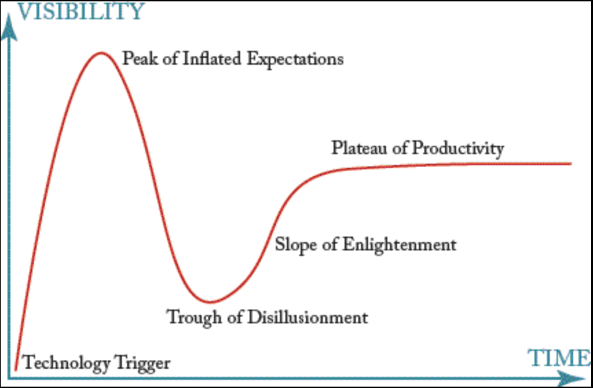
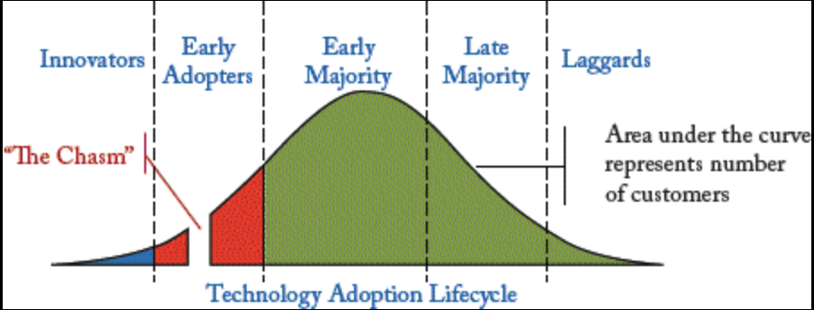

## 2.5  MDSE 的采用与批评

#### ▶[上一节](4.md)

建模常被软件工程从业者和顾问所推崇。然而，其在工业界的采用却并不普遍 [6](../bibliography.md#6) 。过去数年间的研究表明，建模并未在从业者中广泛普及 [20](../bibliography.md#20)，或未成为开发流程的核心环节 [24](../bibliography.md#24)，尽管近期研究对此持更积极的看法 [34](../bibliography.md#34)。

确实，建模尚未跨越鸿沟成为主流，主要原因在于过去各类 MDSE 倡议（包括 MDA 及更早基于纯 UML 的提案）曾引发过分高涨的期望。然而近年的新进展 —— 包括新技术与方法（如领域特定语言）的涌现、领域范围的拓展（建模不仅用于代码生成，更涵盖逆向工程、互操作性及软件维护）、更务实的建模策略（无需为每个项目建模所有细节）， 以及事实标准工具的发布（特别是基于 Eclipse 平台的开源建模框架 EMF），这些因素共同改变了行业格局，预示着主流工业应用可能比预期更早到来。正如 Steve Mellor 常言：“三年之内，建模与模型驱动工程将成为常态。” [5](0.md#5)

与其他新兴技术/范式类似，MDSE 正经历典型的技术炒作周期（见 [Fig 2.10](#fig-210) ）。在初期因 UML 普及（某些供应商和咨询公司将其吹捧为软件开发的万能解药）而形成虚高期望的峰值后，MDSE 随即跌入幻灭的低谷。当前我们正处于启蒙斜坡阶段 —— 对 MDSE 应用场景与实施方法的深入认知，正帮助企业精准筛选能发挥 MDSE 价值的项目，从而加速迈向生产力高原期。届时企业将真正收获 MDSE 带来的效益。我们期待本书能为这一演进进程贡献力量。

#### Fig 2.10

*Fig 2.10: 技术炒作周期图*

当前阶段，采用 MDSE 仍蕴藏大量机遇，相较于那些迟至末期才跟风的保守型组织，企业可借此获得显著竞争优势（ [Fig 2.11](#fig-211) ）。

#### Fig 2.11

*Fig 2.11: 技术采用生命周期*

尽管企业采用 MDSE 需应对技术变革，但专家普遍认为，企业实施模型驱动方法面临的最大挑战并非技术层面，而是更侧重于人为因素 [34](../bibliography.md#34)。以下是业内知名专家针对采用 MDSE、BPM、SOA 及类似实践时最大难点的回应：

- “应对人们的习惯和对变革的抵触”（R. M. Soley，OMG）；
- “接受并采用标准”（S. White，IBM）；
- “寻求指导与培训的对象、工具可用性；用户、业务线及其他利益相关方之间的沟通困难”（A. Brown，The Open Group）；
- “处理和管理人员”（S. Mellor）；以及
- “对拿到结果没有耐心”（T. Jensen, IBM）。

这些方面共同印证了众所周知的事实：“学习新工具或技术初期会降低程序员生产力与产品质量。唯有跨越学习曲线，才能最终获得收益” [29](../bibliography.md#29)。

尽管 MDSE 具备诸多优势，但不应将其视为解决所有问题的万能良方。部分专家对 MDSE 方法及其内涵提出警示：

- 警惕纯粹原则的论断：归根结底，软件工程实践的真正意义在于提高生产力、减少错误并精简代码 [25](../bibliography.md#25)。当面向模型的软件工程未能展现这些特性时，便会遭到质疑。
- 有时人们误解 MDSE 的核心主张是倡导以编程为导向的建模。但这种理解有失偏颇。真正的关键在于理解并定义适合每项开发活动的抽象层次 —— 最终这同样适用于编程本身。
- 在传统程序员眼中，图表终究只是漂亮的图画。因此它们带来的负担多于益处（如同文档需要持续更新、讨论等）。这种观点主要源于对建模（与绘图的区别）及其优势的模糊认知，本书稍后将对此展开讨论。
- 模型可能被视为对现实的过度简化 [63](../bibliography.md#63)。诚然，模型是现实的抽象化表达，其中省略了不必要的细节。但通过 MDSE 实践，可将模型组合或精炼以涵盖所有关键维度。
- 模型常被视为毫无价值的产物，无人欣赏，包括只追求软件执行效率和性能的终端用户。这种观点暗示模型与运行中的应用程序存在竞争关系，实则不然 —— 尤其当考虑到可执行模型概念时，这类模型可通过代码生成或模型解释技术实现。
- “对计算机科学家而言，万物皆可视为语言设计问题。在他们看来，语言与编译器是将理念付诸实践的唯一途径”（David Parnas）。这给语言定义时如何以及何时应用 MDSE 技术提供了明确警示。正如后续讨论领域特定语言时将阐明，我们同样建议审慎开展语言定义工作。

#### ▶[下一节](ch3/0.md)
