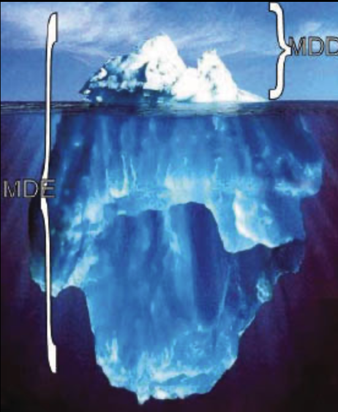

## 3. MDSE 用例
MDSE 最早期且最广为人知的应用场景无疑是 *软件开发自动化*（通常称为模型驱动开发（MDD）），该场景中模型驱动技术被持续应用，旨在尽可能自动化软件生命周期 —— 从需求分析直至应用部署。然而，MDSE 的完整应用谱系涵盖更广阔的场景；MDD 仅是 MDSE 冰山一角（如 [Fig 3.1](#fig-31) ）。

#### Fig 3.1

*Fig 3.1: MDD 只是 MDSE 最显而易见的一面*

由此延伸，缩写 MD(S)E 亦可解读为 “*模型驱动万物*” —— MDSE 理念可适用于任何软件工程任务。本章将聚焦三个主要应用场景，阐释 MDSE 如何满足不同需求。除软件开发场景外，我们将描述 MDSE 在逆向工程与软件现代化领域的应用，探讨工具/系统互操作性问题，并延伸至组织层面 —— 揭示模型在纯软件系统之外的组织应用价值。

----
#### 1
正如我们稍后将讨论的，这仅是一个示例。在某些场景下，我们可以直接从分析模型跳转至代码实现；或在采用模型解释时，跳过实现阶段直接执行模型。

#### 2
这并不意味着流程中创建的所有模型都必须具备可执行性，但至少部分模型必须满足此要求。

#### 3
需注意，这正是 Ruby、PHP 或 Python 等流行语言中众多 MVC 框架已采用的策略；诸如 Ruby on Rails、Symfony 或 Django 等框架会根据模型定义自动生成可投入生产环境的管理界面。

#### 4
可执行 UML 亦特指 S. Mellor [48](../bibliography.md#48) 提出的 xUML 开发方法，该方法作为 Shlaer-Mellor 方法的演进成果，专指特定的可执行 UML 开发范式。

#### 5
参见 http://www.omg.org/spec/ALF 获取 Alf 语言规范，或访问 http://modeling-languages.com/new-executable-uml-standards-fuml-and-alf 阅读主要语言设计师 Ed Seidewitz 的简要介绍。

#### 6
http://en.wikipedia.org/wiki/Turing_test

#### 7
运行时模型在自适应系统中也得到广泛应用，这类系统能监测环境并根据环境条件变化调整自身行为。适应变化的策略通常以模型形式表达，由系统在运行时进行解释。

#### 8
另请参阅讨论帖：http://www.theenterprisearchitect.eu/archive/2010/06/28/model-driven-development-code-generation-or-model-interpretation 。

#### 9
http://www.eclipse.org/MoDisco

#### 10
http://www.omg.org/spec/BPMN

#### 11
http://www.zachman.com/about-the-zachman-framework

#### 12
http://pubs.opengroup.org/architecture/togaf9-doc/arch

