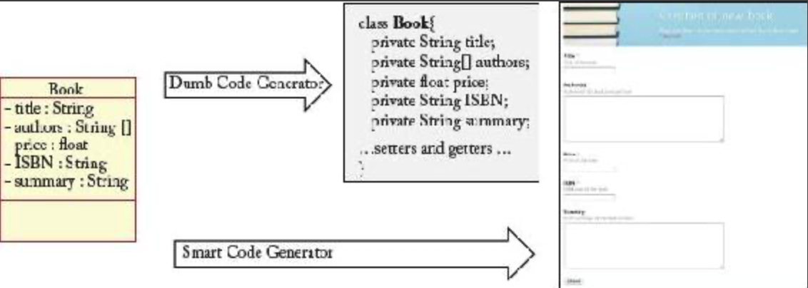

## 3.1 软件开发的自动化

#### ▶[上一节](0.md)

软件开发自动化是指从所需软件功能的高层级（或早期）表示出发，通过一系列中间步骤（可能允许用户在生成过程中进行一定程度的交互）最终生成可运行的应用程序。

<ins>采用 MDSE 方法时，通常通过一次或多次模型转换逐步生成精炼的软件描述版本，直至获得可执行版本</ins>。[Fig 3.2](#fig-32) 展示了典型的基于 MDSE 的开发流程。各阶段均采用模型间转换技术（必要时辅以人工完善/精炼），将前阶段生成的模型作为输入进行（半）自动生成。最终通过设计模型到文本的转换生成最终代码 [1](0.md#1) 。

#### Fig 3.2

*Fig 3.2: 基于 MDSE 的典型软件开发流程*

将 MDSE 引入开发流程还具有其他优势。其主要益处之一在于弥合需求/分析与实现阶段之间的沟通鸿沟。在组织层面，这相当于架起业务需求与 IT 实现或支持之间的桥梁。这在众多企业中是个重大难题，<ins>而模型已被证明是有效的解决方案 —— 它能作为业务部门与 IT 部门参与者之间的通用语言。</ins>

此外， <ins>模型能以促进团队讨论（并简化新成员融入）的方式捕捉和组织对系统的理解</ins>，非常适合文档化，允许更早探索设计方案并评估系统适用性，增强系统的分解与模块化，并提升系统组件在新项目中的复用率，以及系统演进与维护效率（例如通过便于追溯代码至原始需求）。<ins>总体而言，MDE 最直接的效益可归纳为：通过开发流程的（部分）自动化，既提升了利益相关者间的沟通效率，又提高了开发团队的生产力。作为附带效果，这种自动化还减少了开发人员可能无意引入的最终代码缺陷数量</ins>。

为了能够从模型生成可运行的系统，模型必须具备可执行性 [2](0.md#2) 。<ins>*可执行模型* 是指完整度足以被执行的模型。从理论角度而言，当模型的操作语义被完整指定时，该模型即具备可执行性。但在实践中，模型的可执行性往往更多取决于所采用的执行引擎，而非模型本身</ins>。<ins>一方面，某些未完全指定的模型仍可通过具备 '填补空白' 能力的先进工具执行；另一方面，即便存在极其复杂完整的模型，若缺乏适配的执行引擎仍无法运行</ins>。例如（ [Fig 3.3](#fig-33) 所示），面对仅定义领域静态信息的简单类图，基础代码生成器仅能生成对应（Java）类的骨架结构，而高级生成器则能据此推导出系统大部分行为逻辑。具体而言，这种高级生成器可推断出图中每个类都需要提供典型的 CRUD（创建/读取/更新/删除）操作，从而直接生成实现这些操作的所有表单和页面 [3](0.md#3)。<ins>事实上，如 [3](../bibliography.md#3) 等研究表明，在典型数据密集型应用中，CRUD 操作竟占据了软件整体功能的 80%，因此这种高级代码生成器仅凭最简系统规格说明就能节省大量开发时间</ins>。

#### Fig 3.3

*Fig 3.3: 代码生成示例*

最著名的可执行模型家族基于 UML 语言，通常统称为 *可执行 UML* [4](0.md#4)。 <ins>可执行 UML 模型广泛采用动作语言（一种命令式伪代码）精确定义所有类方法、状态转换等的行为</ins>。OMG 近期已将这种可执行 UML 模型概念标准化。<ins>特别是，OMG 已标准化了可执行 UML 模型基础子集（Foundational Subset for Executable UML Models, fUML）的语义，该子集足以以适合自动化软件开发流程输入的形式，建模软件规格说明。fUML 采用的动作语言称为 *fUML 动作语言（Action Language for fUML）*，简称 Alf [5](0.md#5)。Alf 本质上是 UML 行为的文本标记法，可附加于任何支持 fUML 行为的 UML 模型位置</ins>。从语法上看，Alf 初始形态酷似典型的 C/C++/Java 传统语言，从而降低了学习门槛。

代码生成与模型解释是两种不同的替代策略，用于 “实现” 执行工具，从而使可执行模型真正运行起来。

### 3.1.1 代码生成
<ins>*代码生成* 旨在从更高层次的模型中生成可运行的代码，以创建实际应用程序，这与编译器能够从源代码生成可执行二进制文件的过程极为相似。基于此，代码生成器有时也被称为 *模型编译器*。</ins>

<ins>该生成过程通常通过基于规则的模板引擎实现，即代码生成器由一组含占位符的模板构成，这些模板应用（实例化）于模型元素后即可生成代码。</ins>

<ins>代码生成完成后，可使用通用 IDE 工具对生成的源代码进行精修（如有必要）、编译，最终部署</ins>。如 [Fig 3.4](#fig-34) 所示，代码生成流程的唯一目标是根据模型集生成源文件集。围绕这些文件的所有后续操作，均可使用与处理手工编写代码相同的工具完成。

图3.4：

#### Fig 3.4

*Fig 3.4: MDSE 代码生成的范围（基于 [71](../bibliography.md#71) ）*

显然，我们所说的 “源代码” 并不局限于编程语言。通过代码生成技术，我们可以将多种模型转化为各类软件工件（如测试用例、Makefile、文档、配置文件等）。

#### 部分生成与完整生成

当输入模型不完整，且代码生成器无法智能推导或猜测缺失信息时，我们仍可通过创建系统的部分实现，来从代码生成方法中获益。<ins>然而，部分代码生成必须谨慎对待。部分生成意味着程序员需要手动补全代码才能获得功能完整的系统。这将导致信息来源分散的局面：模型与代码各自承载着对方可能缺失的关键信息，同时部分信息又会重复存在（例如直接转换为代码的模型片段）。信息在代码与模型中重复存储，往往是引发问题的根源</ins>。

<ins>最大化部分代码生成效益的策略包括：</ins>

- 在代码中定义受保护区域，这些区域需由开发者手动编辑。通过这种方式，代码生成工具仍可重新生成代码，同时确保手动添加的代码片段得以保留；
- 使用往返工程工具，使代码变更在可能时能立即反馈至模型，保持二者同步；以及
- 侧重系统部分组件的完整生成而非整体系统的局部生成。例如，与其让代码生成器同时产出少量业务逻辑和数据库实现，不如确保其能完整生成系统的数据库实现部分。对于系统某些组件，可采用完整生成策略以规避上述风险。

<ins>无论采用完整生成还是部分生成方案，核心目标始终是：以最小代码量实现预期功能。高效的代码生成策略应充分利用现有框架、API、组件及库资源，最大限度减少实际生成的代码量。</ins>

#### 代码生成的优势

代码生成方法具有以下显著优势：

- 保护建模者的知识产权：可为特定客户生成运行应用程序，同时无需共享概念设计与架构设计 —— 这些才是工作的核心价值所在，未来可复用或扩展至其他项目。客户开始要求获取付费应用程序的源代码，但目前尚未就模型是否应一并交付达成共识。
- 生成的实现与模型和流程无关性，因而更易理解：生成的代码采用标准编程语言编写，任何开发人员都能理解。
- 代码生成使客户能够自主选择运行时环境。这意味着客户在采用 MDSE 技术时可规避供应商锁定的风险。由于生成的代码符合行业标准，客户甚至可在未来选择放弃 MDSE 方案。
- 该技术可根据客户需求或现有遗留系统精准适配特定架构。生成的代码能严格遵循客户规范，实现与企业内部其他 IT 组件的深度集成。某种程度上，代码生成提供了双重自由度：模型与生成器均可根据客户需求进行定制。
- 生成的代码部署灵活，客户可借助标准执行环境的能力，轻松满足IT架构政策及其他法规要求（如国家或地方法规在安全性、隐私性、可靠性、容错性等方面的规定），无需依赖专有解决方案。
- 代码生成支持复用现有编程成果。特别是可将现有代码片段泛化为模板，用于生成软件新模块的代码。若生成器具备足够灵活性，可通过迭代扩展生成更多或更丰富的代码片段。
- 代码生成器通常更易于维护、调试和追踪，因其本质上由基于规则的转换构成；而解释器需覆盖所有可能的执行场景，其行为模式更为通用且复杂。
- 可采用部分生成策略。
- 通常情况下，生成的应用程序在执行速度方面优于对应的解释版本。

代码生成并非没有缺点（参见下节讨论的模型解释替代方案的优势）。采用代码生成技术面临的重大障碍之一在于，生成的代码对开发者而言缺乏 “熟悉感”。即便其行为完全符合预期且使用目标编程语言编写，仍可能与实际程序员的编写风格存在显著差异，这导致他们难以接受（例如，他们可能对未来必要时能否调整或改进该代码缺乏信心）。基于此，定义 *代码生成工具的图灵测试* 或许具有现实意义。参照经典人工智能图灵测试 [6](0.md#6)，代码生成工具的图灵测试可定义如下：

*由人类评判者分别审查程序员与代码生成工具针对同一形式化规范生成的代码。若评判者无法可靠区分工-具与人类生成的代码，则该工具通过测试。*

通过测试的工具将证明其生成的代码可与人类代码媲美，并应被人类接受。

从开发者手写代码（从这些代码中概括抽象出模板）中构建代码生成模板，可提高代码生成工具通过图灵测试的概率。这样在运行这些模板时，生成的代码对开发者而言将更具亲和力。

### 3.1.2 模型解释
<ins>*模型解释* 并非从模型生成代码以创建可运行的软件应用程序。相反，它实现了一个通用引擎，该引擎采用解释方法实时解析并执行模型（与解释器处理解释型编程语言的方式完全相同）。</ins>

模型解释具有以下特性和优势：

- 它能实现更快的模型变更，因为无需任何显式代码生成步骤。这可显著缩短增量开发方法的周转时间，因为模型可即时运行并修改。
- 它甚至允许在运行时修改模型而无需停止应用程序，因为解释器会通过解析新版模型继续执行。[7](0.md#7)
- 理论上可实现应用程序的可移植性，因为能够创建适用于多平台（如多种操作系统、云平台或技术）的解释器。该解释器本质上构建了一个无关的虚拟环境，使所建模的应用得以运行，其工作原理与解释型编程语言的解释器完全相同。若要通过代码生成实现同等效果，则需生成可解释代码，并为不同平台配备对应解释器。
- 采用模型解释时，您无需（也无法）再深入应用程序源代码，因为该概念已不复存在（尽管某些工具仍允许您添加自定义行为作为黑盒组件，在特定条件下通过模型进行 “解释” ）。可以说模型即代码，因为前者在所有意义上都取代了后者。
- 通过更新解释器即可增强或修改运行中应用程序的行为，同时保持模型不变（代码生成也可通过更新生成器实现同等效果，但需重新生成代码、编译并部署）。
- 它遵循平台即服务（PaaS）理念，为系统提供更高层次的抽象（由解释器实现）。需注意：所提供平台不仅需包含能运行模型并生成最终状态的执行引擎，还需配备多种工具（如模型调试器、分析器等）以充分释放 MDSE 的潜力。
- 支持运行时轻松调试模型，因解释过程可逐步推进。这在模型解释中是自然实现，而在代码生成场景则需复杂工具支持（因可执行应用需与模型概念挂钩，建模工具需捕获运行中应用的事件）。
- 无需部署阶段，因模型本身即是应用的运行版本。

尽管存在这些优势，该方案仍令许多 MDSE 用户 "望而却步"。应用程序源代码不可用意味着您必须依赖 MDSE 工具供应商。一旦供应商消失，您将无法仅凭源代码继续运行和升级应用程序。性能问题也常被用作放弃此方案的理由（既因模型采用解释执行模式，又因缺乏对应用程序的完全控制权导致调优受限），尽管对多数应用而言这并非实质性障碍。此外，模型解释要求客户在其 IT 基础设施中部署新的专有平台（解释器）。对于拥有严格 IT 架构政策的大型组织而言，这可能极具挑战性 —— 这些组织通常采用独立平台管理非功能性需求（如安全性、可靠性、模块化等），例如，基于服务总线的信息系统架构。

### 3.1.3 代码生成与模型解释的结合
代码生成与模型解释在实践中均被采用，二者并非互斥的替代方案。混合方法常被使用，或基于开发者的经验在开发过程中交织运用，或作为综合解决方案集成于开发平台之中。

例如在 MDSE 流程中，开发者可能选择代码生成将应用投入生产，同时在开发阶段采用模型解释 —— 通过模型仿真加速系统功能原型的设计，从而深化对领域知识的理解。此外，特定 MDSE 平台可选择混合式代码生成与模型解释的方案。具体实现方式包括：

- 基于内部代码生成策略提供模型解释方案。工具实际执行代码生成、编译与运行，但对设计者而言呈现为模型解释模式（可部分配置生成参数）；
- 采用代码生成导向策略，依托预定义运行时组件或框架大幅减少生成代码量。预定义组件需具备足够灵活性以执行复杂任务，仅需针对特定需求生成少量代码片段。这将简化代码生成阶段，并可能产出更易读的源代码（源代码可保持较高抽象层次，将内部复杂性主要委托给组件处理）。最终，所谓 “代码” 可能仅是一组 XML 描述符和配置文件，由运行时组件进行 “解释”。这极大降低了构建解释器的复杂度 —— 相较于为复杂建模语言开发通用解释器而言。该方案还具有额外优势：无需编译生成的构件，且构件仍保持人类可读性。

综上所述，两种方法并无绝对优劣之分。选择其中一种（或两者结合）取决于开发团队的理念与专业能力、所建应用程序的需求，有时还取决于开发周期的阶段。[8](0.md#8)

#### ▶[下一节](2.md)
