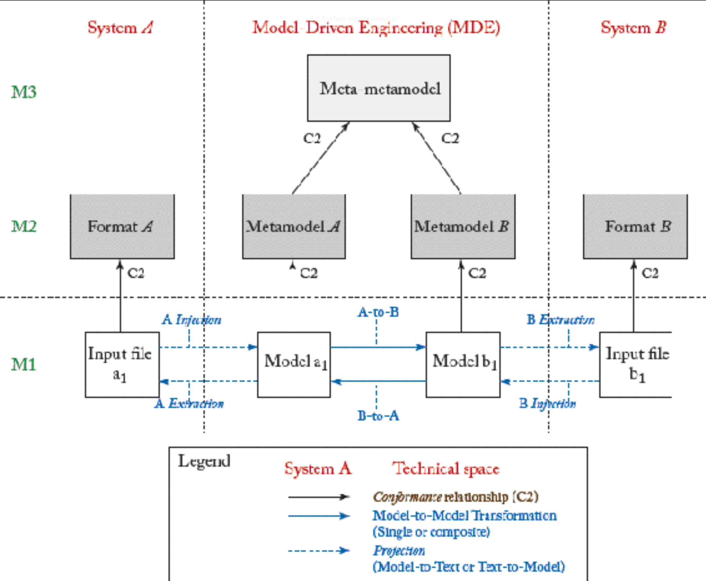

## 3.2 系统互操作性
互操作性由 IEEE 正式定义为 “两个或多个系统或组件交换信息并利用所交换信息的能力” [28](../bibliography.md#28)。

互操作性在多种场景下均有需求：正向与逆向工程（例如开发链中两个连续工具之间）、 工具与语言演进（为确保与旧版本的向后兼容性）、协同工作（同一组织内多名成员可能需在同一任务中协作，即使使用完全不同的系统）、系统集成（例如：企业并购后，被收购公司的信息系统必须与母公司系统通信）等场景。

遗憾的是，互操作性是一个极具挑战性的问题，需要同时解决语法和语义层面的矛盾。因为每个工具/组件/系统可能采用不同的语法格式存储信息，更重要的是，它们往往使用自有内部解释器（附带专属语义）来表示和处理信息，这种处理方式极可能与其他工具预期的方式存在差异。因此，手工解决方案不仅易出错且耗时巨大，即使使用相似组件也难以复用。<ins>相较于临时方案，应为两个系统的组件间提供通用桥集 (bridges)。每个桥都应确保参与方之间实现数据层互操作性（即元数据/数据交换）和操作层互操作性（即行为交换），且不受具体项目/使用场景的限制</ins>。

早期构建这类桥的尝试，试图通过直接连接组件的 API 或接口来实现。然而这种低层次的系统视角过于局限，难以实现真正的数据互操作性。随着 MDSE 的到来，现在可以在更高的抽象层面上解决互操作性问题。

<ins>*模型驱动互操作性（Model-driven interoperability, MDI）* 方法旨在通过应用模型驱动技术，来定义桥，实现两个或多个系统间的互操作。其工作机制首先显式化每个系统（或系统中每个外部可访问组件）的内部模式（internal schema, 即元模型）。随后通过匹配相关概念实现元模型的对齐。最后，模型间转换机制利用匹配信息，将第一个组件生成的数据（即模型）转换为符合第二个组件内部模式 (internal schema) 的数据</ins>。推导内部模式可采用多种策略：对于某些系统，内部模式可能已作为系统规范的一部分以显式模型及相关文档形式存在； 对于其他系统，可通过分析系统使用的存储格式结构推导（例如：若组件存储 XML 数据则分析 XML schema，若组件在关系数据库管理系统中管理信息则分析关系 schema）。也可通过分析组件的公共 API 生成元模型 [36](../bibliography.md#36) 。

[Fig 3.5](#fig-35) 展示了以 MDSE 为枢纽实现系统 A 与 B 互操作性的通用桥（关于此桥的具体应用参见 [15](../bibliography.md#15) ）。MDI 的基本原理是将桥分解为两个核心部分：语法映射与语义映射。

#### Fig 3.5

*Fig 3.5: 两个系统间的通用互操作性桥*

#### 语法映射

语法映射旨在跨越不同的技术领域。其核心思想是利用 *投影器 (projectors)* ，将通常异构的世界（在格式、技术等方面）转换为更同质化的世界 —— 在本案例中即 MDSE 的建模世界 —— 并实现反向转换。进入建模世界后，模型可作为工具间的 *通用语言 (lingua franca)* 。这些投影器既可通过 Java 等通用语言直接硬编码实现，更推荐采用 模型-到-文本/文本-到-模型 转换技术（前提是输入/输出文件为文本格式）来实现 —— 相关技术将在后续章节详述。

如第 [2](ch2/0.md) 章所述，投影器分为两类：
- 注入器：允许将输入文件内容 “注入” 为模型，输入文件使用专用格式（例如将 [Fig 3.5](#fig-35) 中的输入文件 a1 转换为模型 a1 ）；
- 提取器：通过将模型内容 “提取” 为输出文件，输出文件采用专用格式（例如将 [Fig 3.5](#fig-35) 中的模型 b1 生成输出文件 b1）。

#### 语义映射

语义映射将两个系统领域中的概念进行对齐。该映射以模型到模型的转换形式实现。该转换将系统 A 的领域概念重新表达为系统 B 可识别的等效领域概念集。元模型 A 和 B 可通过手动生成、从对应格式描述推导（例如，当输入或输出为 XML 文档时采用 XML schema），或者待桥接格式 (formats to bridge) 符合（已存在元级桥的）元格式 (meta-format) 时自动创建。例如，XML schema 语言与 MDSE 元元模型的通用桥可实现所有格式描述（即具体 XML schema）向元模型的自动转换。

#### MDI 整体视图

综上所述，标准 MDI 桥接流程由三个主要连续环节构成：

1. 注入（文本到模型）；
2. 转换（模型到模型）；
3. 提取（模型到文本）。

所有实际领域知识均在 “转换” 环节中定义。“投影” 环节（即 “注入” 或 “提取” ）仅处理技术/语法细节，主要涉及存储格式。

投影与转换均可为原子操作或复合操作（即转换链条）。多数情况下，为将整体问题分解为更简单的问题，同时提升桥接的可扩展性、可复用性和可维护性，此类转换链条 (transformation chains) 实为必需。
