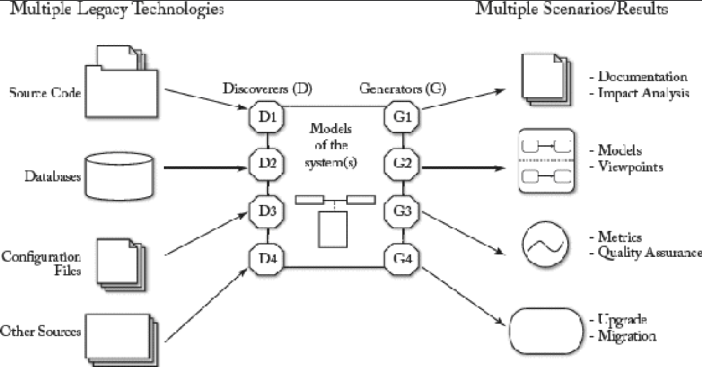
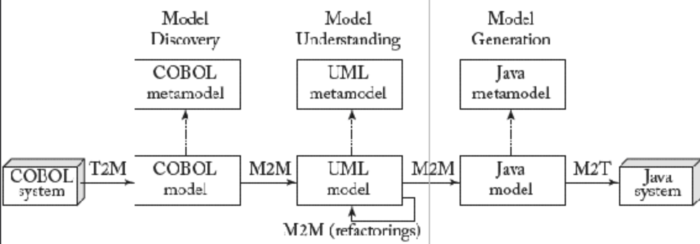

## 3.3 逆向工程

#### ▶[上一节](2.md)

如今，几乎所有组织 —— 无论规模大小或业务类型 —— 都面临着管理、维护或替换现有系统的难题。这些遗留系统通常是大型应用程序，在企业整体信息系统中扮演着关键角色。它们长期运行至今，采用的技术已然过时，且文档记录往往不完整。因此，在处理遗留系统的演进与现代化时，首要任务是真正理解其架构、提供的功能、处理的数据以及执行的业务规则和流程。

获取遗留系统有用的高层级表示的过程通常称为 *逆向工程*，至今仍是未解难题。MDSE 在此场景下同样能提供解决方案：<ins>模型驱动逆向工程（Model-Driven Reverse Engineering, MDRE）—— 即运用模型驱动工程原理为遗留系统提供基于模型的相关视图 —— 近期被提出作为应对这一重要挑战的新方案。</ins>

<ins>MDRE 的主要目标是通过采用基于模型的系统表示方法，为理解现有系统提供更优质的支持。MDRE 以遗留系统各组件相关的工件集（涵盖源代码、配置文件、数据库、部分文档等）为输入，旨在构建一组系统模型（每个模型聚焦于系统不同抽象层级的特定维度）</ins>。这些模型可用于多种目的，例如：指标与质量保证计算、文档生成、定制化系统视角，或作为软件演进/现代化流程的第一步（如图3.6所示）。

#### Fig 3.6

*Fig 3.6: 模型驱动的逆向工程*

MDRE过程包含三个主要阶段：

- <ins>*模型发现 (Model Discovery)* 。在 MDRE 中，核心思想是尽快从异构的现实世界（包含大量性质各异的遗留构件）切换到同构的模型世界，其中所有构件均以相互关联的模型集形式呈现</ins>。这便是我们所说的 *模型发现 (model discovery)* 阶段。创建这些模型的有效方法是：首先聚焦于快速构建一组初始模型，这些模型以相同（较低）的抽象层次表示遗留系统，即在过程中不丢失任何信息。这些 *原始模型 (raw models)* 可直接运用本书介绍的模型表示与操作技术进行处理，同时，其细节程度足以成为 [Fig 3.6](#fig-36) 所示任何 MDRE 应用的起点。
- <ins>*模型理解 (Model Understanding)* 。多数 MDRE 应用需要处理前阶段发现的原始模型，以获得便于分析、理解及后续再生的更高层次视图</ins>。因此第二阶段即 *模型理解 (model understanding)* 阶段，通过模型操作技术链条对原始模型进行查询与转换，生成更易管理的表示形式（例如：剔除当前 MDRE 场景无关的细节，或者派生/显化系统结构中隐含的信息，以深化系统理解）。
- <ins>*模型（再）生成 (Model (Re)Generation)*。模型理解阶段（末期）获得的处理后模型，最终用于生成和/或展示逆向工程过程的预期成果</ins>（例如：系统重构版本的代码）。

[Fig 3.7](#fig-37) 描绘了一个典型的 MDRE 场景，其目标是将现有 COBOL 系统迁移并重新部署到 Java 平台。

#### Fig 3.7

*Fig 3.7: 软件现代化场景示例*

<ins>在第一步（模型发现）中，我们获取包含 COBOL 代码完整细节的低级模型。</ins>

<ins>在第二步（模型理解）中，通过模型间转换提升这些模型的抽象层次</ins>，例如：基于从 COBOL 模型提取的领域信息与规则生成 UML 图。这些模型随后将通过多种方式进行重构或调整（例如：适应组织新政策，或满足安全性、性能等新型非功能性需求）。当 UML 模型同时作为转换的输入与输出时，重构操作也可实现为模型间转换。

<ins>随后，模型将用于生成新的运行时 Java 应用。这通过第三步（模型生成）实现：该步骤根据需要将模型通过 M2M 转换回低级表示形式（本例中为 Java 模型），再经模型到文本转换生成对应的 Java 代码</ins>。

Eclipse-MDT Modisco 项目 [9](0.md#9) 提供了多种模型发现器、生成器和转换器，可作为逆向工程项目的构建模块。

#### ▶[下一节](4.md)
