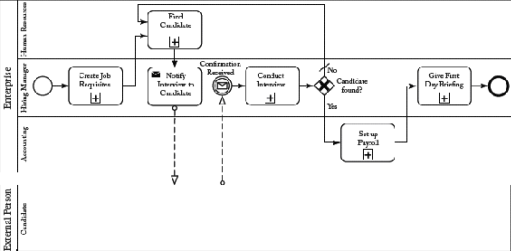
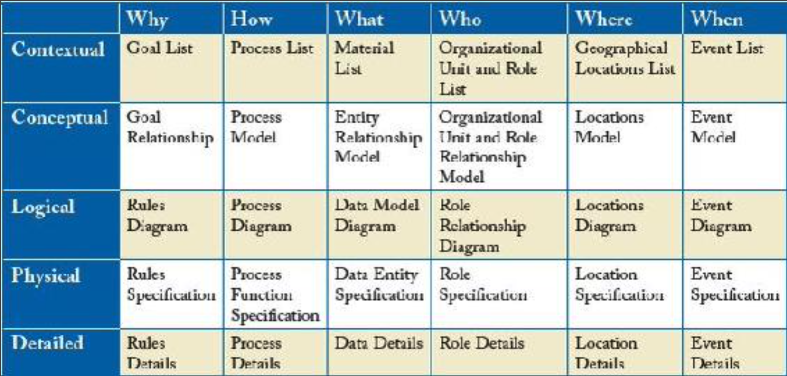

## 3.4 组织建模

#### ▶[上一节](3.md)

前文场景已展示了 MDSE 在处理组织内软件系统时的优势，但实际上模型在组织的任何其他领域都大有可为。你可以建模组织的目标、内部结构、与供应商及客户的关系……无所不包。针对这些不同维度，存在特定的建模语言（即领域特定语言，参见第 [7](ch7/0.md) 章）。

其中有两个维度尤为关键，它们直接影响软件系统本身及后续章节将探讨的软件模型：(i) 业务流程模型；(ii) 企业架构模型。

### 3.4.1 业务流程建模

每个组织都拥有无数业务流程来管理日常运营的各个环节。简而言之，业务流程是一组为达成特定目标（如制造产品或处理客户投诉）而需执行的关联任务。这些任务可能按顺序执行、并行执行，或需等待特定事件发生/条件满足等。

当这些流程未被正式记录时，员工需依赖记忆，管理者则需耗费大量时间精力确保流程正确执行。因此，采用精确语言将流程显性化对所有企业都更为有利。业务流程模型正是流程正式化的成果。除控制与澄清功能外，精确描述业务流程还能支持各类分析，例如评估流程绩效，从而为流程再造创造机遇，进而提升整体组织效能。

现存多种业务流程建模语言，其中最普及的是业务流程建模与表示法（Business Process Modeling and Notation, BPMN）[10](0.md#10)，该标准隶属于 OMG 标准建模语言家族（详见第 [4](ch4/0.md) 章）。BPMN 是一种流程化记法，包含图形符号来表示任务/活动（待办事项）、活动间的连接（如何从一项活动转移到另一项活动）、事件（流程中可能发生的情况）以及通道（区分工作流各部分的负责人）等。

例如 [Fig 3.8](#fig-38) 展示了某组织招聘流程的简化模型：经理设定岗位要求后，人力资源部门负责寻找候选人。潜在候选人收到通知后，通过邮件确认（该流程将暂停直至邮件事件触发），随后进行实际面试。面试任务末端的异或网关根据面试结果，或通知人力资源部门寻找其他候选人，或联系财务部门设置薪资。最后，新员工参加入职首日培训，流程结束。

#### Fig 3.8

*Fig 3.8: BPMN 模型示例*

BPMN 规范还提供了 BPMN 符号与工作流执行语言，即业务流程执行语言 （Business Process Execution Language, BPEL）之间的映射关系。这有助于识别流程模型中可通过软件组件实现自动化的部分（例如，若系统已存在人才数据库，则可根据经理需求自动推荐候选人），并能将这些活动与现有软件系统对接，监控系统行为是否符合预期 —— 即是否遵循流程模型定义的行为模式。流程挖掘技术可用于发现软件实际执行的流程，并与理论流程进行对比。

### 3.4.2 企业架构
软件视角与业务流程视角共同构成更宏大的概念 —— 企业架构（Enterprise Architecture, EA），该架构将组织所有维度有机联结。EA 可定义为从战略、业务及技术视角对企业当前与未来状态进行分析与文档化的过程，各视角间相互交织。通过优先评估变革对组织整体的影响及其潜在效益，EA 助力组织实现全层级变革管理。

鉴于其复杂性，EA 无法通过单一模型呈现，而需采用异构模型的组合，并整合为架构框架的一部分。每家公司都可以定义自己的框架，但通常采用预先定义了一套通用原则、假设和术语的参考框架，以便所有人更好地沟通。任何框架都提供特定利益相关者视角的 EA 架构视图集。

#### Fig 3.9

*Fig 3.9: 企业架构之 Zachman 框架*

最早的架构框架之一，也是最广为人知的，当属 1982 年由约翰·扎克曼 (John Zachman) 在 IBM 提出的扎克曼框架 [11](0.md#11)（但首次发表于 1987 年）。该框架将物理学和基础工程原理应用于整个企业体系。它并非用于开发 EA 的方法论，而是提供了一种正式且结构化的企业视角与定义方式。扎克曼框架的核心视角如 [Fig 3.9](#fig-39) 所示，以二维表格形式呈现。列方向对应各视角的目标，即明确该视角下需完成的工作内容、执行方式、时间节点、责任主体、实施地点及工作动因。行则对应视角所指的组织层级：情境层（高管层）、概念层（管理层）、逻辑层（系统架构师层）、物理层（工程层）及细节层（用户层）。表格中部分单元格将在书中展开阐述，其余则属于更高抽象层级的视角。

尽管扎克曼框架是经典参考框架，如今 TOGAF [12](0.md#12) 等框架更受青睐。事实上，许多最初面向 UML 的建模工具正不断演进，以覆盖 TOGAF 定义的其他企业架构视角，使工具不仅适用于软件开发人员，更能满足企业所有利益相关者的需求。

值得注意的是，构建能应对完整 EA 建模复杂性的工具，引发了一系列挑战：包括异构模型的管理、可追溯性与演进机制、混合多模型元素的视图定义、跨模型质量保证等诸多问题。其中部分议题将在第 [10](../ch10/0.md) 章中探讨。

#### ▶[下一节](../ch4/0.md)
