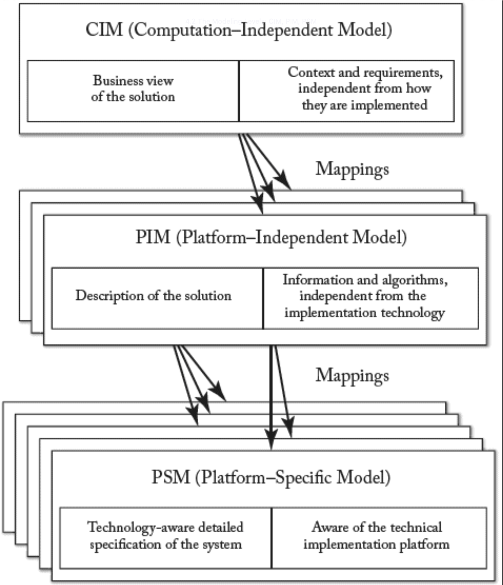
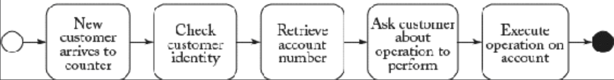

## 4.2 建模层次：CIM、PIM、PSM
正如我们在第 [1](ch1/0.md) 章所介绍的，模型的抽象层次会因模型自身目标的不同而变化。在 MDA 中，已定义了三个具体的抽象层次，如 [Fig 4.1](#fig-41) 所示。

- 计算无关模型（Computation-Independent Model, CIM）： 最高抽象层级，代表解决方案的背景、需求与目的，不涉及任何计算实现细节。它精确呈现解决方案的预期功能，同时隐藏所有 IT 相关规范，从而保持对系统实施方式（或当前实现状态）的独立性。CIM 常被称为业务模型或领域模型，因其采用领域专家（SME）熟悉的术语体系。原则上，CIM 的部分内容甚至可能无法映射到基于软件的实现。
- 平台无关模型（Platform-Independent Model, PIM）：描述应用程序行为与结构的抽象层级，不受具体实现平台限制。需注意 PIM 仅适用于 CIM 中通过软件方案解决的部分，并将其细化为软件系统需求。该模型具备充分的独立性，可映射至一个或多个具体实现平台。

#### Fig 4.1

*Fig 4.1: MDA 规范中的三层抽象建模：计算无关模型（CIM）、平台无关模型（PIM）和平台特定模型（PSM）*

- 平台特定模型（Platform-Specific Model, PSM）：即使该模型本身不参与执行，仍需包含应用程序在特定平台上的行为与结构所需的全部信息，供开发人员实现可执行代码。

通过模型转换可定义各级别间的映射关系。通常每个 CIM 可映射至不同 PIM，而不同 PIM 又可映射至不同 PSM。

以下是一个涵盖三个层级的具体示例：某企业欲实施开票流程。在 CIM 层级（ [Fig 4.2](#fig-42) ），该流程被定义为业务流程模型，列出需执行的任务集及其依赖关系。PIM 层将通过信息模型和行为模型描述软件应用将承担的部分工作（如数据库访问和邮件发送可完全自动化，但签名纸质发票的寄送需人工投递）。该层需详细说明流程系统实现的具体细节（例如 [Fig 4.3](#fig-43) 展示了账户概念的 PIM 描述）。最终在 PSM 层，需选定流程的实现平台（其描述应单独定义），并在模型中提供该平台相关技术细节的精确描述，包括所有涉及平台特定API调用的细节等。例如 [Fig 4.2](#fig-42) 展示了账户概念的 PSM 描述，包含所选具体实施平台（本例为 Enterprise Java bean，EJB）的所有细节。其设计理念在于：将所有与平台迁移无关的细节保留在 PSM 层，从而保持 PIM 层的通用性与平台无关性。

#### Fig 4.2

*Fig 4.2: CIM 示例：组织内部执行的业务流程描述*

