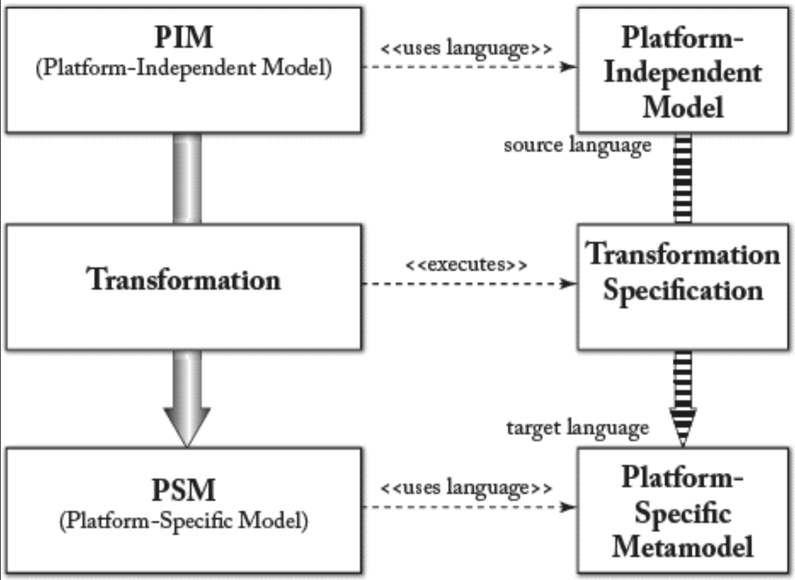

## 4.3 映射
通常而言，映射由两个不同模型元素间的对应关系定义构成。<ins>典型情况下，映射在两个元模型（即建模语言）之间进行指定，以实现相应模型间的自动转换</ins>。例如，若 PIM 层由 Petri Net 描述，而 PSM 由 UML 动态图描述，则映射必须将 Petri Net 的概念与 UML 图中的对应概念关联起来。元模型间的映射使我们能够构建模型间的映射关系，例如：追踪（详见第 [8](ch8/0.md) 章）。<ins>元模型层定义的映射称为 *内涵 (intensional)* 映射，而模型层定义的映射称为 *外延 (extensional)* 映射（因其定义于元模型的外延，即实例之上）。</ins>

#### Fig 4.3

*Fig 4.3: PIM 示例：概念（Account）的定义、其属性及任何涉及该概念的系统实现需考虑的约束*

#### Fig 4.4

*Fig 4.4: PSM 示例：基于 EJB 的实现模型*

映射规范可通过两种方式定义：*编织 (weavings)* ，定义元模型元素间的简单对应关系；和 *约束 (constraints)* ，描述模型转换的要求。两种规范均可推导出模型转换规则。

映射提供规则和/或算法，用于将 PIM 语言元模型中所有类型的实例转换为 PSM 语言元模型中的类型实例。[Fig 4.5](#fig-45) 说明了这一点：从 PIM 到 PSM 的映射被定义为在平台无关元模型与平台相关元模型之间进行的转换。

不同模型（或建模层次）间的映射可通过转换实现。映射可为不同建模层次间的转换提供概念性规范。显然，目标在于尽可能自动化映射实现，从而避免耗费大量人力进行手动转换。

在某些情况下，映射必须考虑开发过程中针对低层模型细节所作的决策。例如，从 PIM 到 PSM 的映射需基于 PSM 层级的选择，考虑适用于 PIM 层级的决策。此类映射会定义注解（MDA 术语中的 *标记 (marks)* ），用于引导两层级间的转换。例如，将 PIM 映射到 Enterprise Java Bean（EJB）平台的 PSM 时，需要决定为不同的 PIM 层概念创建何种 Bean 类型。本质上，标记代表 PSM 中的概念，应用于 PIM 元素以指示该元素的转换方式。PIM 与所有平台标记共同构成转换过程的输入，最终生成 PSM。

#### Fig 4.5

*Fig 4.5: 实现 PIM 与 PSM 层级映射的转换表示法*
