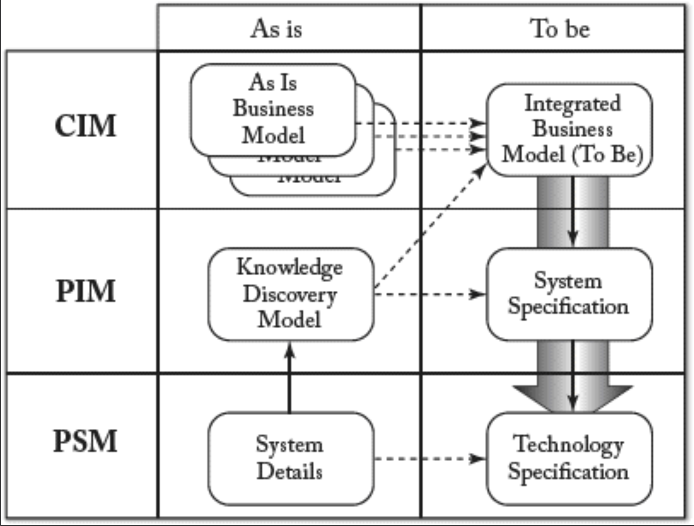

## 4.5 架构驱动现代化（ADM）
在结束 MDA 章节之前，我们还需提及 OMG 发起的另一项重要倡议，该倡议旨在协助软件开发者应对 “逆向” 难题 —— 即系统演进与现代化改造问题。正如 MDA 体现了 OMG 对 MDD 的构想，其对应的 ADM（架构驱动现代化）倡议则致力于解决系统逆向工程难题，并制定了多项相关标准。特别是 OMG 架构驱动现代化工作组 [54](../bibliography.md#54) 致力于制定规范并推动行业共识，以实现现有应用的现代化改造。所谓现有应用，指任何已投入生产环境的软件，无论其运行平台、编程语言或投入使用时长。该工作组致力于优化对已进入维护与演进阶段的现有软件应用的理解与演进流程，以实现：软件改进、修改、互操作性、重构与重组、复用、迁移、面向服务的集成等目标。

该倡议的终极目标是提供概念化工具，通过基于模型的方法实现现有应用的可行复兴 (viable revitalization)，从而降低维护工作量与成本，并延长应用生命周期。

ADM 工作组定义了一系列元模型，用于描述现代化改造问题的各个维度：

- 知识发现元模型（Knowledge Discovery Metamodel, KDM）：作为现有软件系统的中间表示形式，定义了生命周期管理工具深度语义集成所需的通用元数据。KDM 利用 OMG 的 MOF 定义了处理现有软件的工具间 XMI 交换格式，以及现代化工具的通用抽象接口。该模型支持在软件工程工件中进行知识发现。
- 软件测量元模型（Software Measurement Metamodel, SMM）：用于表示与软件、其运行及设计相关的测量信息的元模型。该规范是可扩展的元模型，用于交换涉及现有软件资产（设计、实现或运行）的软件相关测量信息。
- 抽象语法树元模型（Abstract Syntax Tree Metamodel, ASTM）：与 KDM 互补的建模规范。KDM 确立了抽象语义图模型的规范，而 ASTM 则确立了抽象语法树模型的规范。因此，ASTM 支持将所有代码级软件语言语句直接映射至低级软件模型。该映射旨在为任何软件语言编写的代码提供可逆模型表示框架（通过为 ASTM 补充具体语法规范实现）。

这套元模型体系是实现典型模型驱动逆向工程（MDRE）与现代化场景的有效工具，相关实践已在第 [3](../ch3/0.md) 章阐述并如 [Fig 4.6](#fig-46) 所示。设计者从系统现状的 PSM 出发，通过知识发现提取 PIM 模型，可利用 ASTM 提供的与实现语言模型的一对一映射关系。随后，他们致力于使这些模型符合功能性与非功能性需求（可能在 CIM 层级给出）所要求的合规等级（例如依据 SMM 描述）。最终，他们将系统与流程转化为无缝衔接的 MDA 合规解决方案，用于设计与实现目标版本。

#### Fig 4.6

*Fig 4.6: 由ADM工具支持的典型MDRE场景概述*

