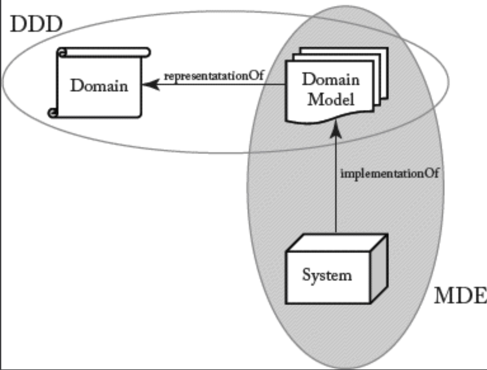

## 5.4 DDD 与 MDSE

#### ▶[上一节](3.md)

领域驱动设计（Domain-driven design, DDD）[22](../bibliography.md#22) 是一种基于两大核心原则的软件开发方法：

1. 软件项目应以领域本身为核心关注点，而非技术细节。
2. 复杂领域设计应基于模型构建。

因此，DDD 强调对系统目标领域进行恰当有效表征的重要性。为此，DDD 提供了一套全面的设计实践与技术，旨在帮助软件开发者与领域专家通过模型共享并呈现其领域知识。

显然，DDD 与 MDSE 存在诸多共通点。两者均主张需运用模型呈现领域知识，并强调开发过程中应优先聚焦平台无关性（采用 MDA 术语）。从这个意义上说，MDSE 可视为实践 DDD 的技术框架 —— 它提供建模领域、创建 DSL 以促进领域专家与开发者沟通等技术手段。

同时，MDSE 通过帮助开发者更充分地利用领域模型，实现了对 DDD 的补充（ [Fig 5.1](#fig-51) ）。借助 MDSE 的模型转换与代码生成技术，领域模型不仅能用于表示领域（结构、规则、动态等），更能直接生成用于管理该领域的实际软件系统。

#### Fig 5.1

*Fig 5.1: DDD 与 MDD 的关系*

#### ▶[下一节](5.md)
