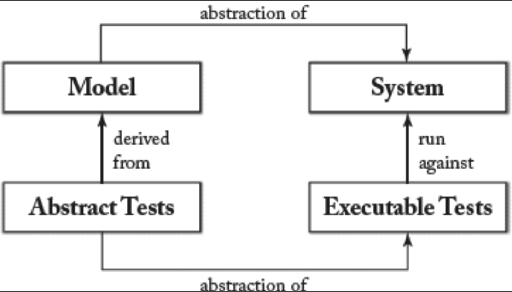

## 5.5 TDD 与 MDSE

#### ▶[上一节](4.md)

测试驱动开发（Test-driven development, TDD）[8](../bibliography.md#8) 基于测试优先的理念。这意味着开发者首先编写可执行的测试用例，用于验证待实现的新功能。若测试失败（由于新功能尚未编码，此情况理应发生），开发者便编写能通过测试的代码（即实质上 “强制” 实现该功能）。当新代码通过完整测试套件后，即可进行重构并重新启动该流程。

MDSE 可融入 TDD 流程的两个层面，取决于模型是否作为代码生成策略的一部分，自动推进系统实现。

### 5.5.1 模型驱动测试
当模型用于系统规格定义但系统未自动生成时，可利用模型推导出系统实现需通过的测试，以确保其行为符合预期（即符合模型定义）。此方法称为模型驱动测试。如 [Fig 5.2](#fig-52) 所示，测试生成策略在模型层级应用以生成测试集，该集随后被转换为可在系统实现技术平台上运行的可执行测试。测试策略取决于待生成的模型与测试类型：例如：约束求解器可为静态模型生成测试用例，而模型检查器则能为动态模型测试生成相关执行轨迹。

#### Fig 5.2

*Fig 5.2: 基于模型的测试*

### 5.5.2 测试驱动建模
当软件直接从模型派生时，无需测试代码（当然需假设代码生成完整且可信）。此时应直接测试模型本身。基于此理念，已提出若干面向建模产出物的测试驱动开发方法，例如 [69](../bibliography.md#69) 。<ins>这些方法遵循相同理念：在开发模型片段前，建模者需编写模型测试，用于在建模层级评估新功能。随后将新功能建模化，并执行测试以验证模型正确性。该实践要求模型具备可执行性（参见第 [3](../ch3/0.md) 章）</ins>。第 [10](../ch10/0.md) 章探讨了若干有助于模型穷尽性系统测试及/或验证的工具。

#### ▶[下一节](6.md)
