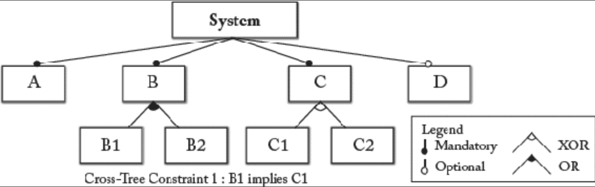

## 5.6 软件产品线与 MDSE

#### ▶[上一节](5.md)

软件产品线 [58](../bibliography.md#58) 正成为系统化开发相似系统的主流方法。其核心思想在于设计系统家族而非单一系统。系统家族定义了一组具有显著共性但同时存在明确差异的系统集合。由此，软件产品线实现的生产力与质量提升源于所谓核心资产的复用 —— 即家族内所有系统共享的元素。简言之，软件产品线可视为一种粗粒度软件复用机制，既能复用共性组件，又能管理家族内各系统间的差异。为此，软件产品线工程明确区分了领域工程（即在特定领域内开发可复用核心资产）与应用工程（即通过组合核心资产构建具体系统）。

模型驱动工程技术已被证实能有效支持软件产品线工程 [38](../bibliography.md#38) 。软件产品线与模型驱动工程结合时最引人关注的问题之一，是如何通过模型来构建软件产品线的知识体系。尤其值得关注的是可变性方面 —— 建模语言往往缺乏将可变性作为第一类 (first class) 语言概念的特性。近年来，众多变异性建模方法应运而生以弥补这一缺陷。总体而言，可将建模方法分为两类：注释式与组合式 [38](../bibliography.md#38) 。注释式建模旨在通过单一模型描述呈现系统家族的所有元素，且需额外显式激活或停用步骤来表示具体系统。相较之下，组合式建模采用一组模型片段，通过组合这些片段来表示具体系统。

在特征导向软件开发（feature-oriented software development, FOSD）框架下，软件产品线与模型驱动工程的结合展现出巨大潜力。FOSD 的核心思想是基于特征对软件系统家族进行分解 [5](../bibliography.md#5) 。特征可视为用户视角下软件系统的可见属性，或更广泛地理解为领域特性。通过从软件系统家族的特征集选择特定特征，即可生成相应系统。

实现系统家族特征化分解的一种方法是采用特征模型。特征模型表达了软件产品线中各系统间的共性与变异性，并以分层结构组织这些特征。在此背景下，特征与其子特征的基本关系包括：强制关系、可选关系以及异或（XOR）、或（OR）和与（AND）组合关系。此外，可引入跨树关系来描述特征模型不同部分中特征的包含/排除关系。通过选择特定特征，可生成配置或具体系统。特征模型作为形式化模型，其关系类型明确定义了特征组合的有效性，从而支持系统化配置推导。此外，该方法支持完成部分配置 —— 即对系统所需功能进行部分选择，通过推理确定除已选功能外还需哪些功能才能形成有效配置。

[Fig 5.3](#fig-53) 展示了一个特征模型示例。该模型定义了一个由不同 A-D 特征组成的抽象系统。需注意：存在必须选取的强制性 A 特征，同时也存在可独立于其他特征选择的可选 D 特征。此外，某些特征允许选择所有子特征（OR），或仅选择其中一个子特征（XOR）。最后还展示了一条跨树约束：若选择特征 B1，则必须同时选择特征 C1。

#### Fig 5.3

*Fig 5.3: 特征模型示例*

除特性模型外，还提出了大量用于建模软件产品线的其他建模语言。此外，已开发出若干基于模型的技术，用于变异性模型的自动化处理，包括变异性模型的自动分析、从软件产品线变异性模型中推导配置，以及为衍生产品生成测试用例。因此，模型驱动技术与软件产品线工程的结合，构成了软件系统可重用性的前景广阔的方法。毫不意外，这一方向早有探索。例如软件工厂 [30](../bibliography.md#30) 融合领域特定建模与 FOSD，通过结构化整合相关软件资产与流程（包括可重用代码组件、文档及参考实现），构建新型应用。

#### ▶[下一节](../ch6/0.md)
