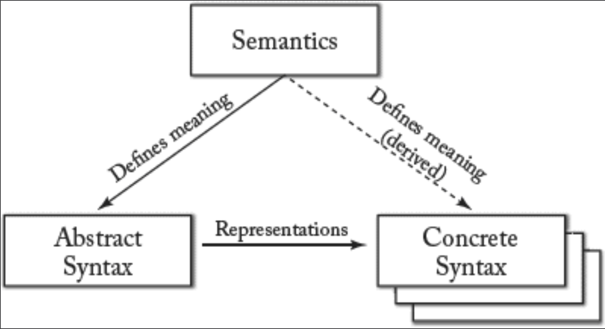

## 6.1 解剖建模语言

#### ▶[上一节](0.md)

<ins>建模语言由以下三个核心要素定义：</ins>
- <ins>*抽象语法 (Abstract syntax)* ：描述语言结构及不同基本元素的组合方式，独立于任何特定表示法或编码形式。</ins>
- <ins>*具体语法 (Concrete Syntax)* ：描述建模语言的具体表示形式，涵盖编码与/或视觉呈现问题。具体语法可为文本型或图形型。建模活动中设计师通常参考具体语法进行操作。若采用图形语法，建模结果将生成一个或多个图。</ins>
- <ins>*语义 (Semantics)* ：描述语言中定义的元素的含义，以及不同组合方式的意义。</ins>

对于建模语言而言，这三个要素是必不可少的，若其中任何一个缺失或不完整，该语言便无法得到明确定义。[Fig 6.1](#fig-61) 展示了这三个要素及其相互关系：<ins>语义定义了抽象语法的含义，并间接决定了具体语法的含义；具体语法则体现了抽象语法。</ins>

这适用于通用语言（GPL）和领域特定语言（DSL）。遗憾的是，语言设计者和使用者往往会忽略某些方面。尤其是在语言定义或使用过程中，语义常被忽视。这可能是因为具体语法作为语言最直观的部分 —— 它体现了日常应用中使用的实际记法 —— 最易引起关注。

但必须强调：若未完整规定构成语言的概念元素及其具体含义，语言定义便毫无意义。语义的片面或错误规定将导致语言使用偏差，引发对语言元素含义及目的的误解。这还会造成不同人群因对语言符号的诠释差异，对概念与模型产生相左的理解。正因如此，缺乏对语言语义的恰当理解具有极大危险性。

#### Fig 6.1

*Fig 6.1: 建模语言的三大核心要素（语义、抽象语法和具体语法）及其关系*

如第 [1](../ch1/0.md) 章所述，<ins>建模语言被用来从特定视角，以特定抽象层次描述现实世界。语言语义旨在详细描述此内容，并确保语言的正确使用。语言语义可定义为：</ins>

- *指称语义 ( Denotational semantics)* ：通过数学表达式定义所有概念、属性、关系及约束的含义。
- *操作语义 (Operational semantics)* ：通过实现解释器直接定义模型行为来阐释语言含义。
- *转换语义 (Translational semantics)* ：将语言概念映射至语义明确的另一种语言。

#### ▶[下一节](2.md)
