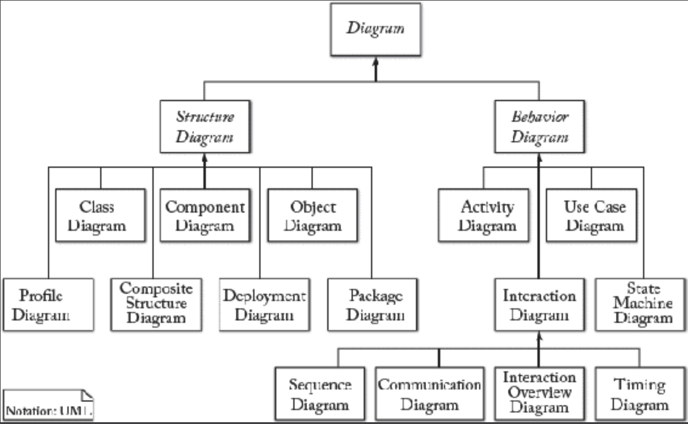
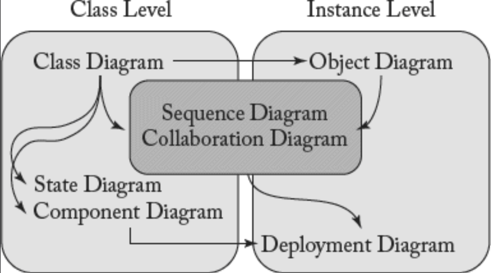
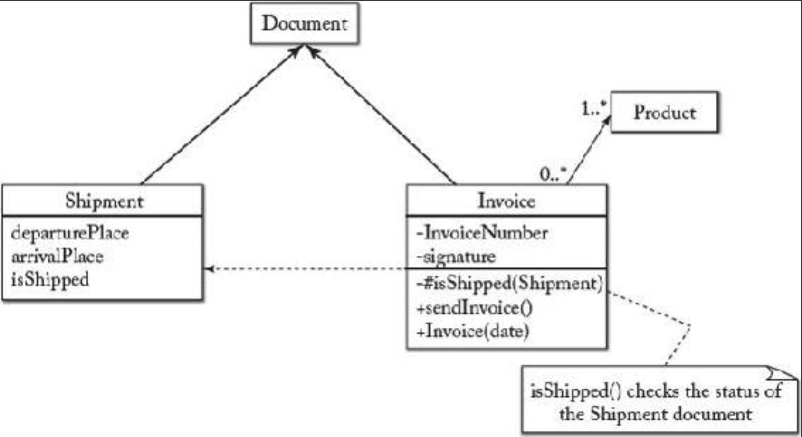
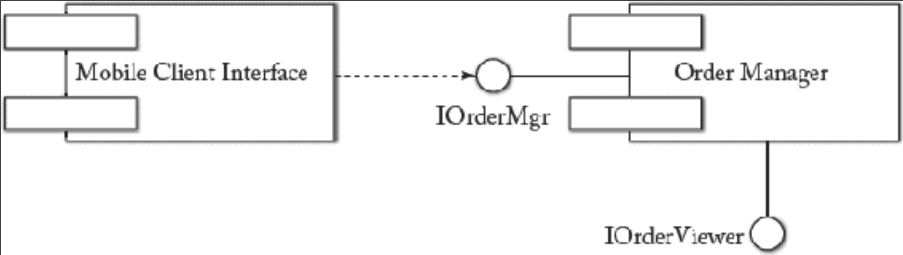
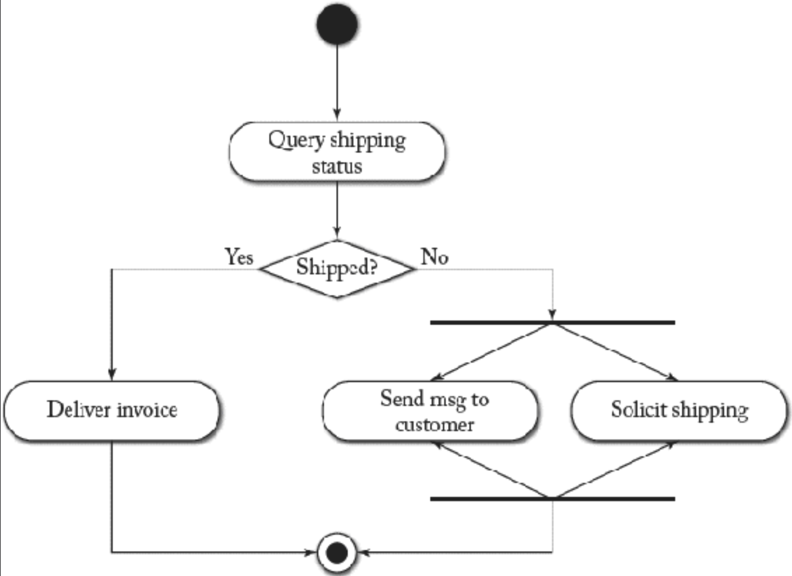
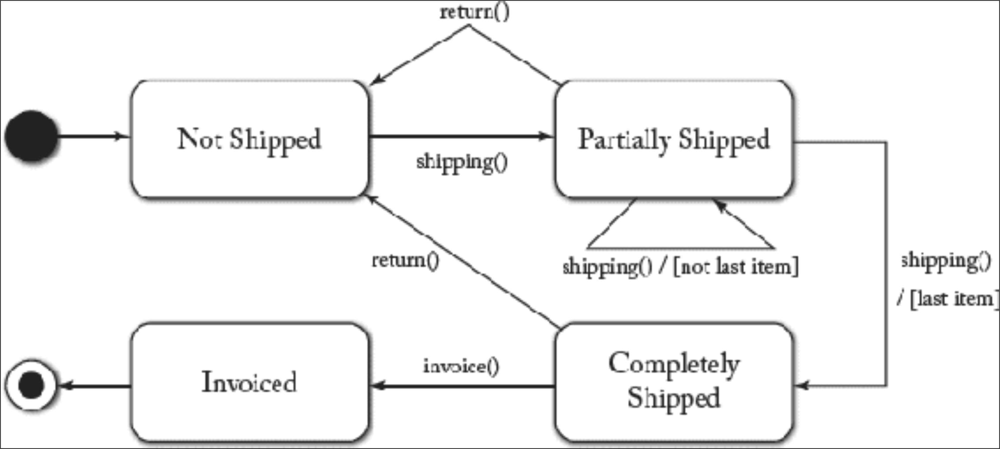
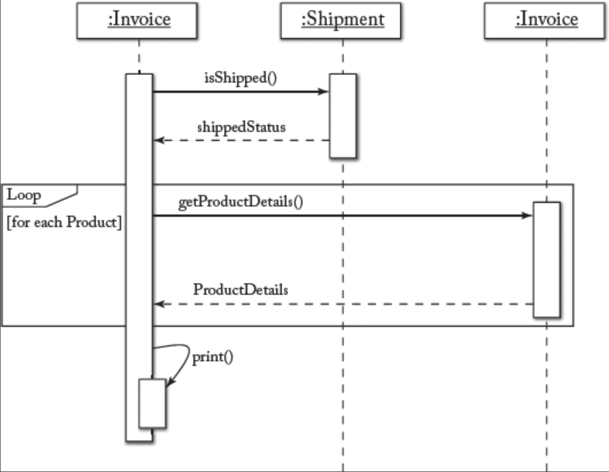
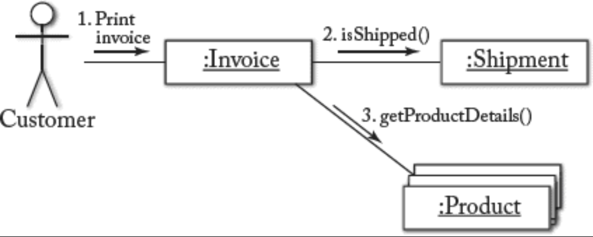

## 6.4 通用建模：以 UML 为例

#### ▶[上一节](3.md)

本节旨在概述统一建模语言（Unified Modeling Language, UML）[5](0.md#5) 。UML不仅广为人知且被广泛采用，作为示例语言，更因其能用于探讨建模语言通用特征的各项属性而具有研究价值。事实上，UML是一个完整的语言套件，包含多种图表用于从不同视角描述系统。[Fig 6.2](#fig-62) 展示了 UML 图的分类体系。其中 7 种图用于描述系统的静态（结构）特征，另有 7 种图用于描述动态（行为）特征。如 [Fig 6.3](#fig-63) 所示，部分图用于描述类（即抽象概念）的特性，另一些则用于描述具体对象（即实例）的功能与行为。某些图可同时描述这两种层次。

#### Fig 6.2

*Fig 6.2: UML 图分类体系*

需注意 UML 仅为建模语言，不强制要求特定开发方法。UML 常与统一过程（Unified Process, UP）并提，其中最知名的特殊版本是 Rational Unified Process（ RUP）。RUP 是由 Rational Software Corporation（现为 IBM 旗下部门）创建的迭代式软件开发过程框架。虽然 RUP 与 UML 配合使用效果极佳，但采用 RUP 并非使用 UML 的必要条件。

UML 发展历程悠久，融合了多种既有方法论并经历了规范体系的重构。其中部分元素如 Harel 的状态图和 Booch 的符号体系可追溯至 1980 年代中期。当时存在大量不同的记法体系。然而 UML 的首个版本直至 1996 年才诞生，它融合了Booch, Rumbaugh, 和 Jacobson 的方法论。该提案在 1996 年的面向对象程序设计语言大会（OOPSLA）上进行了讨论。后续的整合工作促使 UML 于 1997 年 8 月提交至 OMG，并于同年 11 月正式作为 OMG 标准发布（即 UML 1.1 版）。UML 漫长而充满争议的发展历程，造就了其至今仍存的复杂性与部分不一致性。尽管该语言存在重要且有理有据的批评，UML 仍作为软件建模的统一语言发挥着重要作用。

#### Fig 6.3

*Fig 6.3: UML 中基于类的模型与基于实例的模型之二分法*

### 6.4.1 设计实践
UML 为系统设计提供了一套工具，并支持良好的设计实践，包括以下内容：

- 整合使用多个互补模型：UML 包含一系列共享符号的图，支持建模产出物间的交叉引用。
- 不同细节层级的建模：UML 允许根据需要省略图中的细节，使设计师能根据建模目的和开发阶段，选择图中包含的信息量。
- 可扩展性：UML 提供完善的扩展特性，支持按需设计定制化建模语言。
- 基于模式的设计：可直接调用由 “Gang of Four” 定义的经典设计模式集 [27](../bibliography.md#27)。

后续章节将深入阐述 UML 建模的若干细节，以呈现典型 GPL 的概览。

### 6.4.2 结构图（或静态图）

*结构图 (Structure diagrams)* 着重描述被建模系统中必须存在的元素，主要应用于两个层面的软件系统文档化：

- 系统关注的 *概念性要素 (conceptual items)* 。此设计层级旨在通过概念及其关联关系，描述领域与系统。该部分通常通过以下图示呈现：

  1. *类图 (Class diagram)* ：通过类、类属性及类间关系描述系统结构。[Fig 6.4](#fig-64) 展示类图示例。Document 类（采用省略形式，即未显示完整属性和方法）由两个子类 Shipment 和 Invoice 进行特化。需注意类可按不同细节程度描述：Document 以省略形式仅显示类名；Shipment 同时展示其属性；而 Invoice 则同时展示属性和方法。注释说明显示 Invoice 依赖于 Shipment，因其 isShipped 方法会检查 Shipment 的 isShipped 属性值。Invoice 通过关联连接至 Product，该关联的多重性亦被明确标注。

  2. *组合结构图 (Composite structure diagram)* ：描述类的内部结构及其支持的协作关系。其语法与类图高度相似，但重点体现元素间的包含关系与连接关系。此类图的核心概念包括：*部件 (parts)* （即运行时由一个或多个实例扮演的角色）、*端口 (ports)* （即用于连接分类器的交互点）以及 *连接器 (connectors)* （以无向边形式表示，通常通过端口连接两个或多个实体）。

  3. *对象图 (Object diagram)* ：展示特定时间点下建模概念实例的结构视图，可能包含属性值。其语法同样类似于类图，但对象通过给名称加下划线来标识。对象可通过元组对象名与类名、简单对象名或其实例化来源的类名进行标识，对应记法如下：

objectName:ClassName or objectName or :ClassName

#### Fig 6.4

*Fig 6.4: UML 类图示例*

- 系统的 *架构表示 (architectural representation)* 。此设计层级旨在描述系统的架构组织与结构，通常包含面向复用与部署的信息，这些信息基于前一步骤的概念建模进行聚合或构建。该设计阶段涉及的图包括：

  1. *组件图 (Component diagram)* ：描述软件系统如何划分为组件，并展示组件间的依赖关系。UML 中的组件定义为可分发的系统实现单元，包含软件代码（源代码、二进制或可执行文件）及其他信息类型。组件可视为子系统的实现形式。[Fig 6.5](#fig-65) 展示了 UML 组件图示例，其中两个组件通过暴露接口并声明对其的依赖关系进行交互。
  2. *包图 (Package diagram)* ：描述系统如何划分为逻辑分组（UML 术语称为 package ），并展示这些分组间的依赖关系。
  3. *部署图 (Deployment diagram)* ：描述软件工件在硬件上的部署方式，这些硬件用于系统实现。

#### Fig 6.5

*Fig 6.5: UML 组件图示例*

### 6.4.3 行为图（或动态图）
*行为图 (Behavior diagrams)* 描述被建模系统中必须发生的事件与交互。描述动态特征可采用多种图示，其中部分图在信息承载上具有等效性。根据设计师希望突出的重点不同，可选择不同的图形符号表示法。基于这些图构建的行为模型通常不会一次性描述整个系统，每个模型描述系统的一个或若干特征及其涉及的动态交互。行为图包括：

- *用例图 (Use case diagram)* ：描述系统通过外部参与者实现的功能，包括参与者使用系统的目标，以用例形式呈现，及用例间的依赖关系。该图有助于厘清待实现的系统的边界并明确使用场景，在软件开发过程的需求规格阶段和早期设计阶段尤为重要。
- *活动图 (Activity diagram)* ：描述系统为达成特定目标而执行的活动步骤的工作流。活动图通过有向图展示任务执行的数据流与控制流，其中节点代表 *活动 (activities)* 。[Fig 6.6](#fig-66) 展示了 UML 活动图示例，描述了根据产品发货状态需采取的相应操作。

#### Fig 6.6

*Fig 6.6: UML 活动图示例*

- *状态机图 (State machine diagram 或 statechart)* ：描述系统、子系统或特定对象的状态及其转换。通常状态机适用于描述事件驱动的离散行为，但不适用于建模连续行为。[Fig 6.7](#fig-67) 示例展示了产品在发货与开票环节的状态及其转换关系。状态转换可能附带条件（例如：该物品是否为本次发货的最后一件）。请注意状态图中的节点表示状态（而在活动图中节点表示动作）。

#### Fig 6.7

*Fig 6.7: UML 状态图示例*

- *交互图 (Interaction diagrams)* ：行为图的子集，着重描述系统元素间的控制流与数据流。该类图包含以下类型。

  1. *序列图 (Sequence diagram)* ：展示对象之间通过消息传递进行交互的时间序列。时间维度是此类图中最显著的特征，消息沿垂直时间轴排序，同时记录与这些消息关联的对象的生命周期。[Fig 6.8](#fig-68) 展示了一个序列图示例，描述了三个对象（Shipment、Invoice 和 Product 类的实例）为打印发票而相互交换的消息。交互图描述系统的执行场景。
  2. *通信图或协作图 (Communication or collaboration diagram)* ：通过 *链接 (links)* （以实心无向线连接可交互元素）和流经链接的 *消息 (messages)* 展示对象或类间的交互。序列信息通过消息编号获取。此类图同时描述系统的静态结构（链接与节点）和动态行为（消息），融合了类图、序列图及用例图的信息。示例如 [Fig 6.9](#fig-69) 所示。
  3. *交互概览图 (Interaction overview diagram)* ：提供概览视图，其中节点代表交互图。
  4. *时序图 (Timing diagrams)* ：专注于时间约束的特殊交互图类型。

#### Fig 6.8

*Fig 6.8: UML 序列图示例*

#### Fig 6.9

*Fig 6.9: UML 协作图示例*

### 6.4.4 UML 工具
鉴于 UML 的普及，市场上存在大量 UML 建模工具。它们构成 MDE 领域中庞大的建模工具类别，且易于与其他 MDD 工具区分 —— 因其明确聚焦于 UML 设计，对各类 MDE 场景的支持有限。例如，它们有别于元建模工具，这些工具侧重设计新型建模语言。

UML 工具支持创建 UML 模型、以 XMI 格式导入导出模型，部分工具还提供（局部）代码生成功能。当前市场上的 UML 工具采用多种许可模式，涵盖开源、免费软件及商业授权。例如：维基百科提供了详尽的 UML 工具清单，并阐述了各工具的主要特性。[6](0.md#6)

### 6.4.5 UML 的批评与演进
UML 因过于冗长、繁琐、缺乏一致性、无法应用于特定领域场景等诸多问题而备受批评，其中 Bell 2004 年发表的著名文章《UML发热致死》[9](../bibliography.md#9) 对此有详细论述。关于 UML 优劣的争论在网络上亦不胜枚举。[7](0.md#7) 尽管部分批评或许存在一定道理，UML 仍然是软件工程师的参考设计语言。更重要的是，OMG 已严肃对待这些批评，正投入大量精力对 UML 规范进行精简与优化。

#### ▶[下一节](5.md)
