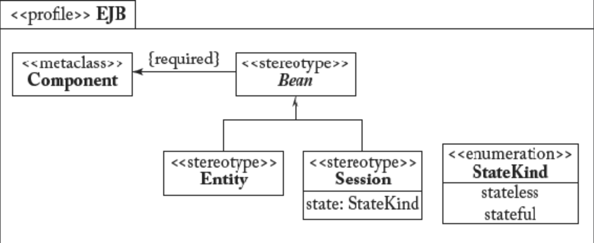

## 6.5 UML 可扩展性：GPL 与 DSL 之间的中庸之道

#### [上一节](4.md)

若开发过程中产生特殊建模需求，开发者可能会考虑转向领域特定语言（DSL）。与其选择全新 DSL，语言设计者可采取折中方案 —— 即扩展现有 GPL 以满足特定需求。为阐释此方案，我们将展示 UML 的可扩展特性。

事实上，UML 提供了丰富的扩展特性：定型 (stereotypes)、约束、标记值和配置文件 (profiles)。这些特性由 *配置文件图 (Profile diagram)* 显式提供，该图专注于语言可扩展性。它在元模型层级运作，将定型表示为类，将配置文件表示为包。扩展关系指示特定定型所扩展的元模型元素。本节旨在概述这些可扩展性选项。

### 6.5.1 定型
定型通过为元类所表示的概念定义附加语义来扩展元类。需注意同一模型元素可采用多种不同方式进行定型。定型可通过指定以下属性来定义：

- *基元元类 (Base metaclasses)* ，定义将要扩展的元素。
- *约束 (Constraints)* ，定义适用于此特化的特殊规则和语义。这正是从语义层面刻画该定型的特征。
- *标记值 (Tagged values)* ，定义定型正常运作所需的零个或多个值。
- *图标 (Icon)* ，定义图中定型元素的视觉外观。

可能产生的疑问是：为何不直接使用标准子类化替代？确实这是可行方案，但效果截然不同。子类化是 UML 的核心操作，本质上定义同一模型中两个元素间的特殊关系。而定型则允许设计者定义新的建模概念，进而用于创建模型。典型应用场景包括：(i) 需要定义标准 M1 级建模工具无法实现的额外语义约束；(ii) 需添加超出 UML 范畴的语义（如代码生成器指令的元数据）；(iii) 需定义具有特定行为或属性且在建模过程中频繁复用的全新建模概念。

### 6.5.2 谓词
改变 UML 语义的另一种方式是应用 *限制谓词 (restriction predicates)* （例如：OCL 表达式，本章末尾将详述），这些谓词可减少建模元素的语义变异性。谓词可附加于 UML 中的任意元类或定型，其表达形式可为正式或非正式。为保持与 UML 符号标准化含义的一致性，这些表达式不得与元素继承的基础语义相冲突。

### 6.5.3 标记值
*标记值 (Tagged values)* 由标签-值对构成，可作为类型化属性附加于定型。它允许设计者指定对模型实现、转换或执行有价值或必需的附加信息，例如，用于定义项目管理数据（例如：可定义标记值 “status = unit_tested”，声明组件已通过开发过程中的单元测试阶段）。

### 6.5.4 UML 配置文件
*UML 配置文件 (UML profiles)* 是通过上述技术定义的相关且一致的可扩展性元素集合。配置文件通常捕获特定领域的语言变体和使用模式。某种意义上，配置文件是对 UML 的领域特定解释，因此可视为通过扩展或限制 UML 而定义的领域特定语言。[Fig 6.10](#fig-610) 展示了描述 Enterprise Java Bean（EJB）基本概念的 UML 配置文件示例。该配置文件由一组定型和关系（其中之一为必选项）构成。

#### Fig 6.10

*Fig 6.10: 描述 Enterprise Java Bean（EJB）基本概念的 UML 配置文件示例*

虽然设计师可以定义自己的配置文件，但若干 UML 配置文件已实现标准化，并获得广泛认可与应用。以下是 OMG 中成为标准的知名配置文件示例（我们在第 [4](../ch4/0.md) 章已提及这些配置文件，但未特别强调它们属于 UML 配置文件）：

- UML 测试配置文件（UML Testing Profile, UTP）：通过扩展 UML 功能，支持测试相关工件的设计、可视化、规格说明、分析、构建及文档化。
- OMG 系统建模语言（Systems Modeling Language, SysML）。
- 面向服务架构建模语言（Service-oriented architecture Modeling Language, SoaML）。
- 片上系统 UML 配置文件（System on a Chip, SoCP）
- 可调度性、性能与时间 UML 配置文件
- 实时与嵌入式系统建模分析 UML 配置文件（Modeling and Analysis of Real-time and Embedded Systems, MARTE）

完整列表可在线查阅 OMG 官网。[8](0.md#8) *（译注：SysML 2.0 已经脱离了 UML profiles）*

#### [下一节](6.md)
