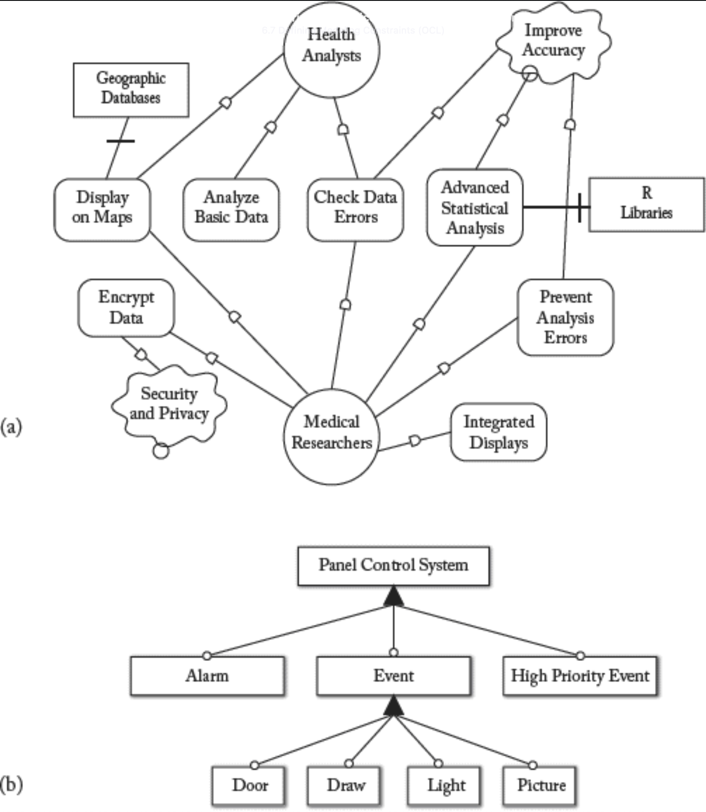
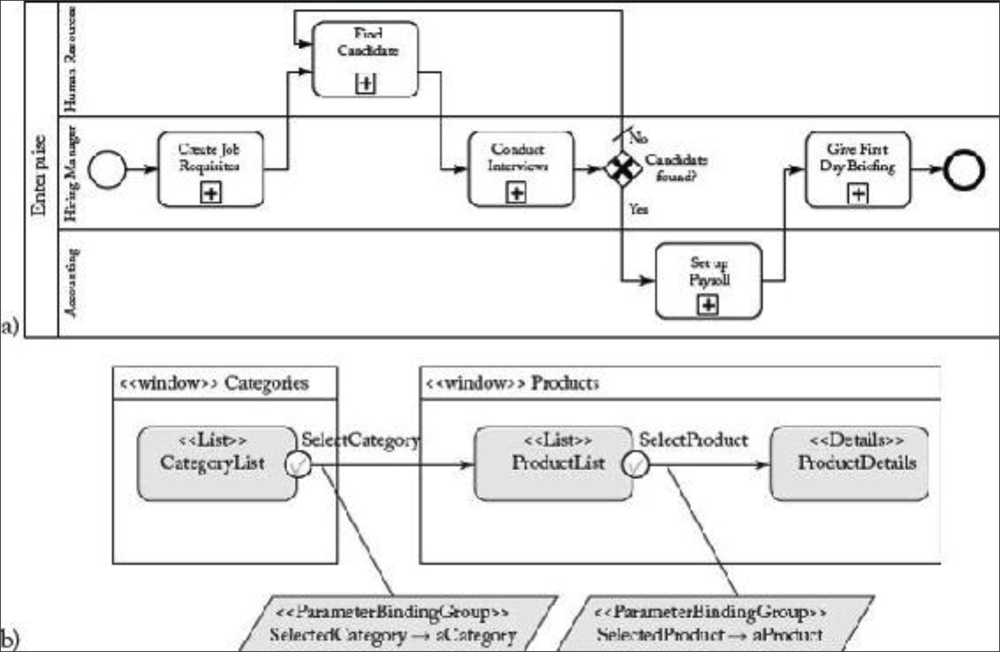

## 6.6 DSL 概述

#### ▶[上一节](5.md)

<ins>领域特定建模语言（Domain-Specific Modeling Languages, DSML），亦称领域特定语言（Domain-Specific Languages, DSL），是为满足特定应用领域需求而设计的开发语言。DSL 的独特价值在于其在表达能力和符号表示法上，均针对领域特性量身定制。</ins>

<ins>其优势在于：DSL 既避免了终端用户学习充斥着与领域完全无关概念的通用语言，又提供了更贴近领域实践的建模抽象与基本操作。</ins>

### 6.6.1 DSL 原则

DSL 在众多应用场景中不可或缺（不仅限于软件开发）。然而设计 DSL 绝非易事：既需要对应用领域的深刻理解，也需掌握语言工程实践。寻找定义 DSL 的恰当抽象概念既困难又耗时。

<ins>为确保 DSL 的实用性，应遵循以下原则：</ins>

- <ins>语言必须为开发者提供优质抽象，具备直观性，使工作更轻松而非更困难。</ins>
- <ins>语言采用与使用不应依赖个人专长，其定义需经群体共享与评估共识。</ins>
- <ins>语言必须持续进化，根据用户需求和环境变化保持更新，否则注定消亡。</ins>
- <ins>语言必须配套支持工具与方法，因为领域专家关注的是在专业领域内最大化生产力，而非耗费大量时间定义方法和工具。</ins>
- <ins>优质的 DSL 应遵循经典的 *开闭原则 (open-close principle)* ：“软件实体（类、模块、函数等）应开放扩展，但封闭修改”，即允许扩展但禁止修改。</ins>

正因如此，优秀的 DSL 绝非凭空诞生。MDSE 的最终目标并非让每位开发者都成为语言设计师，而是培养优秀的语言设计师，为合适的受众构建优质的 DSL。有时需要数年时间（辅以数十次工业实践和数千用户反馈）才能打磨出成熟的语言体系。这并非否定开发 DSL 的价值，但设计时必须审慎，因为定义新 DSL 绝非易事，若处理不当，最终可能形成存在诸多缺陷甚至弊端的语言体系，给未来使用者带来困扰 [44](../bibliography.md#44) 。因此，工具、设计接口和运行时架构也应针对领域特性量身定制，避免用户对语言产生抵触。

### DSL 分类

DSL 可从多个维度进行分类，包括焦点、风格、符号表示法 (notation)、内部性及执行。

#### 焦点

<ins>DSL 的焦点可分为垂直型与水平型。垂直 DSL 针对特定行业或领域，例如：家庭自动化系统的配置语言、生物实验建模语言、金融应用分析语言等。水平 DSL 具有更广泛适用性，其技术性和普适性使其概念能覆盖大量应用场景，典型代表包括 SQL、Flex、IFML <sup>[9](0.md#9)</sup> 、WebML <sup>[10](0.md#10)</sup> 等众多语言。</ins>

#### 风格

<ins>DSL 的风格可分为声明式与命令式。声明式 DSL 采用规格范式，表达计算逻辑而不描述控制流。换言之，该语言定义程序应完成什么，而非描述如何完成。声明式定义的典型案例是服务编排 (choreography)，其定义了 Web 服务耦合的一对一规则。命令式 DSL 则要求明确定义可执行的算法，该算法需说明为成功完成任务所需遵循的步骤和控制流。命令式定义的典型案例是服务编排协调 (orchestration)，其中定义了 Web 服务之间从开始到结束的执行流程。</ins>

#### 符号表示法

<ins>DSL 的符号体表示可分为图形化与文本化两类。图形化 DSL 意味着开发成果为可视化模型，其开发基本单元包含图形元素如模块、箭头与边、容器、符号等。文本化 DSL 则涵盖多种类型，包括基于 XML 的符号表示法、结构化文本符号表示法、文本配置文件等。</ins>


#### 内部性

<ins>根据 Martin Fowler 的定义，外部 DSL 拥有专属的自定义语法；你可以编写完整的解析器来处理它们，并利用它们编写独立的模型/程序。</ins>

<ins>内部 DSL 则通过扩展宿主语言来实现，使宿主语言具备特定领域或目标的特性。实现方式包括：将 DSL 片段嵌入宿主语言，或在其上提供抽象层、结构体或函数。通过嵌入机制，可复用宿主语言的所有工具与设施。</ins>

#### 执行

正如第 [3](../ch3/0.md) 章所述，<ins>可执行性可通过模型解释（或代码生成）实现。模型解释机制在运行时逐条读取并执行 DSL 脚本，其运作方式与编程语言解释器完全一致。而代码生成机制则在部署时应用完整的模型到文本（M2T）转换，从而生成可执行应用，其运作方式类似于编译器对编程语言的处理。</ins>

### 6.6.2 DSL 示例
为使 DSL 的讨论更具体，本文节选了若干此类语言的片段。为体现普适性，所选示例语言在适用范围和记法方面呈现出显著差异。

<ins>[Fig 6.11](#fig-611) 展示了文本语法的实例：*VHDL 语言* （VHSIC 硬件描述语言）是一种用于描述硬件电子元件的规范语言。这个简短示例展示了如何用 VHDL 定义多路复用器</ins>。<sup>[11](0.md#11)</sup>

#### Fig 6.11
```
  entity mux4_to_1 is
    port (I0,I1,I2,I3: in std_logic_vector(7 downto 0);
    SEL: in std_logic_vector (1 downto 0);
      OUT1: out std_logic_vector(7 downto 0);
  end mux4_to_1;
```
*Fig 6.11: 文本 DSL 示例：4 对 1 复用器的 VHDL 规范*

[Fig 6.12a](#fig-612) 展示了采用目标导向符号 i\* 描述的健康分析系统需求规格说明，该记法阐述了系统的目标。[Fig 6.12b](#fig-612) 展示了描述嵌入式墙面板控制系统主要特征的 *特性模型 (feature model)* 。

#### Fig 6.12


*Fig 6.12: DSL 示例：i\*模型（a）与特征模型（b）*

最后，[Fig 6.13a](#fig-613) 
展示了一个简单的 BPMN 模型（Business Process Model and Notation），描述了公司招聘流程；[Fig 6.13b](#fig-613) 则摘录了 IFML（Interaction Flow Modeling Language）模型片段，该模型描述了按类别浏览产品目录的网站用户界面。

#### Fig 6.13


*Fig 6.13: DSL 示例：BPMN 模型（a）与 IFML 模型（b）*

#### ▶[下一节](7.md)
