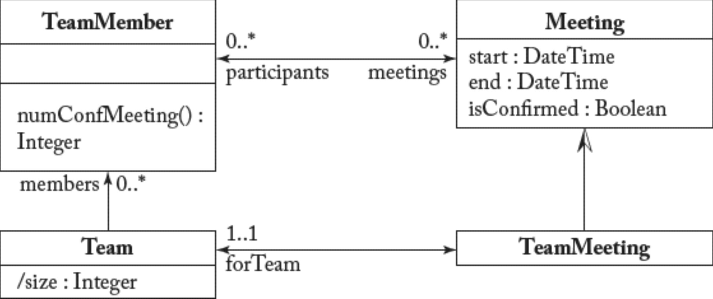

## 6.7 定义建模约束（OCL）

#### ▶[上一节](6.md)

建模语言（尤其是元建模语言）通常规模较小，仅提供有限的建模构造集用于定义新建模语言。

这虽便于实际应用（语言设计者无需掌握大量概念，学习曲线平缓），却也带来代价。<ins>元建模语言仅能表达建模语言定义所需全部相关信息的有限子集。尤其值得注意的是，元建模语言仅支持为待定义语言设定最基础的建模约束 —— 本质上是限制不同建模元素间可能关联的基数约束。</ins>

此时便需要对象约束语言（Object Constraint Language, OCL）的介入。OCL 是由 OMG 采纳为标准的通用（文本型）形式化语言 <sup>[12](0.md#12)</sup> 。<ins>OCL 是一种带型化的、声明式且无副作用的规范语言。*类型化 (typed)* 意味着每个 OCL 表达式都具有类型，评估结果为该类型值，且必须遵循该类型的规则与运算。*无副作用 (side effect-free)* 意味着 OCL 表达式可查询或约束系统状态，但不能修改状态。*声明式 (declarative)* 表示 OCL 不包含命令式结构。最后，*规范 (specification)* 指该语言定义不包含任何实现细节或实现指南</ins>。

<ins>OCL 用于通过文本规则集补充元模型，所有符合该元模型的模型都必须遵守这些规则。<sup>[13](0.md#13)</sup> 当应用于元模型时，这些建模约束也被称为良好构造 (well-formedness) 规则，因为它们定义了可用特定建模语言指定的良好构造模型集合。</ins>

OCL 中的约束以不变式 (invariants) 形式呈现，定义于特定类型的上下文中，称为约束的 *上下文类型 (context type)* 。其主体 (body)，待验证的布尔条件，必须被上下文类型的所有实例满足。<ins>标准 OCL 库预定义了可在 OCL 表达式定义中使用的原始类型、集合相关类型（及其操作）。量词（如 *for all* 和 *exists* ）及其他迭代器（ *select、reject、closure* 等）亦包含在库中。通过点表示法可访问对象属性，并（借助元模型定义的关联关系）实现从对象到相关对象集的导航</ins>。入门级 OCL 教程详见 http://modeling-languages.com/object-constraint-language-ocl-a-definitive-guide 。

下文列举若干简易 OCL 表达式示例，供读者领略该语言的特色。假设我们正在描述一个企业会议规划系统，如 [Fig 6.14](#fig-614) 所示，其中相关类包括：*Meeting* （包含描述 *start* 和 *end* 日期/时间的属性，以及指定会议是否确认的 *isConfirmed* 属性）、*Team* 和 *TeamMembers*（即团队所属人员）。

#### Fig 6.14


*Fig 6.14: 描述企业会议的 UML 类图（OCL 示例基础）*

下列不变式表达式声明：对于每个 *Meeting* 实例，*end* 属性必须大于 *start* 属性：
```
context Meeting
  inv: self.end > self.start
```
下一个表达式定义了 *Team* 中表示成员数量的派生属性 *size* ：
```
context Team::size:Integer
  derive: self.members->size()
```
下一个表达式规定：若会议属于团队会议类型，则必须为团队全体成员组织：
```
context Meeting
  inv: self.oclIsTypeOf(TeamMeeting)
  implies self.participants->includesAll(self.forTeam.members)
```
请注意，上述规则使用 *oclIsTypeOf* 检查会议类型。另一种（更合理）的选择是在 *TeamMeeting* 上直接定义规则。

最后一个示例定义了*numConfMeeting()* 方法的计算逻辑，该方法用于确定 *TeamMember* 成员已确认会议的数量。此逻辑通过后置条件运算符( *post* )实现：
```
context TeamMember::numConfMeeting():Integer
  post:
  result=meetings->select(isConfirmed)->size()
```
#### ▶[下一节](../ch7/0.md)
