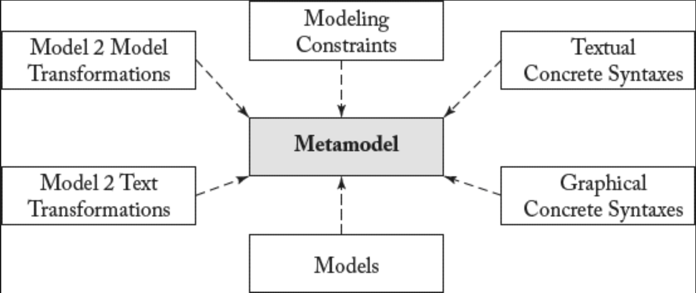

## 7.1 元模型导向的语言设计

#### ▶[上一节](0.md)

本章探讨开发新型建模语言的任务。我们将重点深入研究建模语言最核心的语法要素——即第 [6](../ch6/0.md) 章所介绍的 *抽象语法 (abstract syntax)* 与 *具体语法 (concrete syntax)* 。

首要要素是通过元模型的定义来阐释建模概念及其属性 —— 元模型的作用相当于文本语言中的语法规则 [1](0.md#1) 。语法规则定义了 *语言中所有有效的句子* [2](0.md#2) ，而元模型则定义了建模语言中 *所有有效的模型* 。元模型通过所谓的 *元建模语言 (metamodeling languages)* 定义。当前元建模语言高度依赖结构化面向对象建模语言的核心 —— 即使用 *类 (classes)* 、 *属性 (attributes)* 和 *关联 (associations)* ，这恰是 UML 类图的核心概念。“元建模语言 (metamodeling languagese)” 一词源于这类建模语言被用于建模建模语言的事实。

此处前缀 *meta* 意指用相同技术定义该技术本身 [47](../bibliography.md#47) 。该前缀的另一例证是 *元学习 (metalearning)* ，即 *学习如何学习 (learning how to learn)* 。同理，*元建模 (metamodeling)* 指的是 *建模如何建模 (modeling how to model)* 。该前缀亦可多次重复使用。例如 *元元建模 (meta-metamodeling)* 即指建模如何进行元建模。因此，用于定义如何构建元模型的语言被称为 *元元模型 (meta-metamodel)* —— 这种模型能够表示所有 *有效的元模型* 。<ins>然而，由于模型始终是抽象概念，元模型和元元模型仅定义其所代表语言的抽象语法。具体语法或语义等其他关注点目前尚未被此类模型涵盖，需通过后续将介绍的附加构件进行规范</ins>。

包含类、属性和关联的元模型定义了建模概念及其属性。但建模约束仅被部分描述（参见第 [6](../ch6/0.md) 章）。例如，正如 UML 类图所示，可为属性、关联端点及属性类型定义多重性 (multiplicity) 约束。基于这些元模型元素，可运用 *约束语言 (constraint language)* 定义更复杂的模型验证规则。正如第 [6](../ch6/0.md) 章针对 UML 类图所述，当约束超越简单多重性 (multiplicity) 与类型约束时，OCL 是首选的定义语言。因此，OCL 同样可复用于元模型以定义此类约束。需注意，元建模语言高度依赖 UML 类图，故 OCL 亦可应用于元模型。例如，*“模型元素必须具有唯一名称”* 这类建模约束，在仅基于类图的现有元建模语言中无法表达。但正如本章后文将展示的，该约束在 OCL 中可轻松实现。

元建模框架既支持通过专用编辑器定义元模型，又能基于元模型生成建模编辑器以 *定义和验证* 模型。这意味着元模型的应用包含两方面：(i) *构造性 (constructively)* 应用 —— 将元模型解释为构建模型的 *生产规则集 (set of production rules)* ；(ii) *分析性 (analytically)* 应用 —— 将元模型解释为模型必须满足的 *约束集 (set of constraints)* 以符合其元模型规范。

所有超越建模语言抽象语法的语言特性，其共同点在于均基于元模型进行定义，如 [Fig 7.1](#fig-71) 所示。因此在本章后续内容中，我们将首先展示如何定义建模语言的抽象语法，含建模约束，继而阐述如何基于抽象语法定义图形化与文本化的具体语法 [3](0.md#3)。此外，我们将详细说明基于 Eclipse 平台的现有技术，如何用于开发建模语言的语法方面。

需注意，诸如模型间转换与模型到文本转换等转换机制，同样基于建模语言的元模型。但在深入探讨 *转换工程 (transformation engineering)* 之前，本章将首先介绍其基础 —— *语言工程 (language engineering)* 。转换工程是后续两章的核心内容（参见第 [8](../ch8/0.md) 章的模型间转换与第 [9](../ch9/0.md) 章的模型到文本转换）。通过采用转换，可依据第 [6](../ch6/0.md) 章介绍的不同方法 [45](../bibliography.md#45)，实现建模语言语义的形式化：(i) 通过定义建模语言到形式语言的映射来赋予 *指称语义 (denotational sematics)* ； (ii) 通过定义模型仿真器给出 *操作语义 (operational semantics)* ；或 (iii) 通过定义代码生成器等工具给出 *转换语义 (translational semantics)* ，以生成可执行代码。前两种方法采用模型间转换，而后者通常以模型到文本转换的形式实现。

#### Fig 7.1

*Fig 7.1: 元模型导向的语言设计。

#### ▶[下一节](2.md)
