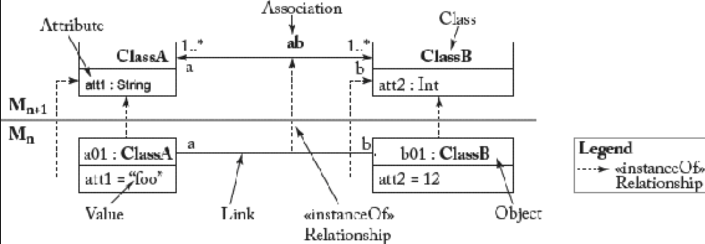

## 7.3 抽象语法开发

#### ▶[上一节](2.md)

本节阐述如何以元建模为核心技术开发建模语言。OMG 定义的标准元建模语言是 *元对象设施（Meta Object Facility, MOF）* [56](../bibliography.md#56) 。除该 OMG 标准外，近十年来已提出多种元建模语言与工具，其中最突出的是提供元建模语言 *Ecore* 的 *Eclipse Modeling Framework（EMF）*。<ins>MOF 与 Ecore 均基于 UML 类图子集描述结构特征，但 Ecore 为适配 Java 实现而进行了定制化设计</ins>。因此，为说明如何定义元模型，我们将首先采用对应于 MOF 的简化 UML 类图进行说明，随后在第 [7.3.2](#732-eclipse-中的元建模) 节中探讨 Ecore 的独特特性。

有人可能会提出疑问：为何不能直接复用 UML 进行元建模？尽管 MOF 与 UML 类图的核心结构高度相似，但它更专注于定义其他建模语言的任务。例如，MOF 舍弃了 n 元关联、关联类、接口和依赖等概念，这些都是 UML 中的概念。MOF 与 UML 的主要差异源于其应用领域。<ins>UML 的领域是面向对象建模的通用范畴，因此它是一种涵盖结构与行为建模方面、以及概念与实现导向建模的综合性建模语言</ins>。相较之下，<ins>MOF 的领域则更为聚焦 —— 它 “仅仅” 是元建模。简言之，MOF 是专用于元建模的专用 DSML，复用了 UML 核心的子集。</ins>

### 元建模的优势

通过采用元建模语言，语言设计者可定义自己建模语言的抽象语法，无论该语言是通用型还是特定领域型。无论被元建模的语言类型如何，<ins>采用符合标准化元元模型的显式元模型均能带来多重效益。</ins>

- <ins>*精确的语言定义 (precise language definition)* ：语言语法具备可由机器处理的正式定义</ins>。例如，元模型可用于验证模型是否为有效实例。
- <ins>*可访问的语言定义 (accessible language definition)* ：利用 UML 类图的核心，采用广为人知的建模语言来定义元模型</ins>。因此，掌握 UML 类图知识即可读懂元模型形式的建模语言定义。
- <ins>*可演进的语言定义 (evolvable language definition)* ：元模型如同其他模型可进行修改</ins>。例如，通过为现有元模型类添加新子类，即可扩展语言以纳入新型建模概念。可访问的语言定义进一步促进了基于元模型的建模语言的便捷适配。

<ins>此外，基于元元模型层级可开发通用 (generic) 工具，这类工具与具体元模型无关</ins>。例如，现有的元建模框架提供复杂的反射技术，用于开发适用于所有符合特定元元模型规范的元模型实例的程序。以下是若干示例：

- <ins>*交换格式 (exchange formats)* ：基于元元模型，支持将模型序列化/反序列化为 XML 文档，在支持相同元元模型的工具间数据互通。</ins>
- <ins>*模型仓库 (model repositories)* ：类似于模型交换，可基于通用存储/加载功能将模型存储至模型仓库并从中检索。</ins>
- <ins>*模型编辑器 (model editors)* ：为修改模型，可提供适用于所有模型的通用编辑器，无论使用何种建模语言。</ins>

此类通用支持的清单并非穷尽。例如，可开发简单程序计算模型指标（如模型包含多少个模型元素），也可基于元元模型层开发复杂工具支持，如模型比较与版本控制功能，详见第 [10](../ch10/0.md) 章。

### 四层元建模栈

<ins>当前元建模工具主要采用四层元建模栈结构，如第 [2](../ch2/0.md) 章所述。[Fig 7.2](#fig-72) 展示了该元建模架构的总览。图中上半部分涉及语言工程，即构建用于定义建模语言的模型；下半部分则涉及领域工程，即构建特定领域的模型。最顶层（OMG 术语中称为 M3）承载着元建模语言，规范了用于定义元模型的元建模概念</ins>。通常元建模语言是高度聚焦的语言，仅提供最小概念集。<ins>为构建有限元建模架构，这类语言多采用自反 (reflexively) 定义方式，即能够描述自身</ins>。因此，定义 M3 无需额外语言，你可以认为 M4 层与 M3 层使用相同语言。从实用角度看，M4 层采用不同语言似乎并无额外价值。它仍仅是提供类似表达能力的结构化建模语言。MOF 和 Ecore 作为自反 (reflexive) 语言设计，通常应用于 M3 层。

#### Fig 7.2


*Fig 7.2: 四层元建模栈概览（基于 [47](../bibliography.md#47) ）*

<ins>M2 层承载着元模型，通过定义建模概念来表示建模语言（如 UML 和 ER）</ins>。这些元模型可被实例化，用于在元建模栈的 M1 层构建模型。<ins>M1 层的模型表示系统</ins>，如大学管理系统（ [Fig 7.2](#fig-72) 中的 Unisystem），通常通过使用 M2 层元模型定义的语言概念，来定义领域概念。<ins>M0 层则包含领域概念的实例</ins>，这些实例代表特定时间点上的真实世界实体，例如，特定时间点的大学管理系统的 *快照*。

<ins>四层元建模栈假定 M 层模型需符合 (conforms to) M+1 层模型，此关系称为 *conformsTo* </ins>。从图结构角度理解，模型即是由节点与边构成的图，该图必须满足更高层级的约束条件。若层 M 上的每个元素（节点或边）均满足其类型元素在层 M+1 上定义的约束，该类型元素即其实例化来源，则层 M 上的模型即符合 (conform to) 其 *类型模型 (type model)* ，即层 M+1 上分配的模型。对于 M0 和 M1，领域模型的实例必须符合领域模型。对于 M1 和 M2，模型需符合其元模型。对于 M2 和 M3，元模型需符合其元元模型。最终，对于 M3，元元模型需符合自身，因为 *conformsTo* 关系具有自反性 (reflexive)。

### 7.3.1 元模型开发过程

<ins>理解元模型的一种方式是将其视为存储模型库的 schema 。因此，开发元模型类似于为具体领域开发类图：需先确定语言应支持的概念，随后使用元建模语言精确规范这些概念</ins>。一旦获得首个元模型版本，即可通过通用编辑器测试建模语言 —— 这些编辑器能解析元模型以构建示例模型。利用编辑器建模若干参考示例，可初步判断所有概念是否定义妥当，或是否需要修改元模型。<ins>简言之，元建模过程在最简形式下是三步，迭代和增量的过程。</ins>

- <ins>**第一步：建模领域分析 (Modeling domain analysis)** ：根据 [43](../bibliography.md#43) 所述，在建模语言开发的第一阶段需考虑三个方面：语言的 *目的 (purpose)* 、 *实现 (realization)* 及 *内容 (content)* 。其中最后一点最具挑战性：即建模概念及其属性的识别。为此，必须分析建模语言应支持的建模领域</ins>。一种实用方法是寻找若干参考示例 [62](../bibliography.md#62) ，这些示例应能用待开发的建模语言来表达 —— 即通过实例定义语言需求。
- <ins>**第二步：建模语言设计 (Modeling language design)** ：运用元建模语言通过语言的抽象语法建模，来形式化已识别建模概念，并采用 OCL 形式化建模约束</ins>。本步骤产出是待开发建模语言的元模型。
- <ins>**第三步：建模语言验证 (Modeling language validation)** ：通过对参考示例进行建模来实例化元模型，从而验证所开发元模型的完整性与正确性。此外还需考虑语言设计的其他通用原则，如简洁性、一致性、可扩展性及可读性</ins>。本步骤的结果为元模型开发过程的下一次迭代提供重要反馈。

<ins>需注意当前流程仅涉及语言抽象语法的开发</ins>。为获取领域专家反馈，还需制定具体语法，以便有个可访问的建模语言。因此，实际开发中，应包含语言具体语法开发的完整流程。但在探讨具体语法开发前，必须先掌握抽象语法开发的基础。<ins>本书出于教学目的将抽象语法与具体语法开发分阶段讨论，但我们强烈建议在实际应用中同步推进这两方面的语法设计工作</ins>。

为使元模型开发过程更具实操性，现以 sWML 元模型开发为例进行具体说明。

#### 第一步： 建模领域分析

<ins>可通过多种信息来源寻找合适的建模概念集。具体采用何种来源取决于待开发建模语言的用途</ins>。若需定义抽象自低级程序代码的建模语言，现有程序可作为主要信息源。例如，程序代码中反复出现的模式可抽象为建模概念。若建模语言针对特定领域定制，文档分析或专家访谈则是推导必要建模概念的合适途径。<ins>所有这些活动都应产生具体的参考示例 (reference examples)，这些参考示例有助于与领域专家沟通、测试建模语言和代码生成器等</ins>。因此，下文将展示如何运用参考示例方法来开发 sWML 语言的建模概念。

假设在研讨会期间，基于某会议管理系统的现有 Web 应用，已创建出 Web 应用模型的初步草图（参见 [Fig 7.3](#fig-73) ）。例如，该 Web 应用模型展示了会议提供的演讲和教程内容。基于此模型草图，我们将阐述 sWML 的目的、实现及内容构成。

#### Fig 7.3


*Fig 7.3: sWML 模型草图*

- **语言目的**

  sWML 应能实现 Web 应用 *内容 (content)* 层与 *超文本 (hypertext)* 层的建模。内容层定义持久化数据的 schema，这些数据由超文本层以网页形式呈现给用户。此外，超文本层定义网页间的导航机制及与内容层的交互，如从数据库查询内容。

- **语言实现**

  为支持不同类型的 sWML 用户，应定义 *图形化语法 (graphical syntax)* ，用于与领域专家讨论及推导超文本层与内容层的结构。但为实现从基于编程语言的标准开发流程向模型驱动方法的平滑过渡，还应为熟悉文本语言的开发人员提供 *文本语法 (text syntax)* 。

- **语言内容**

  sWML 模型由 *内容层 (context layer)* 与 *超文本层 (hypertext layer)* 构成，这体现了该语言前述的设计目的。

  内容模型包含数量不限的 *类 (Classes)* 。类具有唯一名称（例如 Tutorial）和多个属性（例如 Tutorial.title）。属性具有指定名称和类型。例如，允许的类型包括：*String, Integer, Float, Boolean* 和 *Email* 。每个类必须选定一个代表 (representative) 属性，具体语法中未明确标注该属性，以保持语法简洁。

  超文本模型包含不同类型的 *页面 (pages)* ，每个页面均有名称。其中只能有一页作为 Web 应用的 *主页 (homepage)* 。后续所有页面均可访问该主页（及其所有直接链接页面）。页面细分为 *静态 (static)* 页面与 *动态 (dynamic)* 页面。静态页面仅呈现 *静态内容 (static content)* ，如实用链接集合，动态页面则展示来自数据库的 *动态生成内容 (dynamically generated content)* 。因此，动态页面始终与定义显示实例类型的类存在关联关系，到所使用类的关联关系，以括号形式显示于页面名称下方。动态页面进一步细分为 *详情页 (details pages)* 与 *索引页 (index pages)* ，二者具有特定图标标识。索引页以列表形式展示某类别的所有实例（例如会议所有教程的列表），仅显示实例的代表属性；而详情页则始终展示单个实例（例如某篇教程）及其全部属性。

  *链接 (links)* 通过从源页面指向目标页面，来表示页面之间的导航。在源页面上，链接对用户可见。因此页面通常知晓其指向其他页面的链接，但无法感知指向自身的链接。链接分为两类：(i) 非上下文链接（NCLinks）是标准链接，不传递任何信息，例如指向静态页面的链接；(ii) 上下文链接（CLinks）向目标页面传递信息，如传输计算目标页面内容所需的数据，例如，选择详情页面显示的实例。

- **抽象语法的本质**

  首个版本的语言内容描述包含多种信息。<ins>主要地，通过定义建模概念的属性来引入这些概念，这是开发抽象语法所必需的输入。但有时，也会讨论建模概念的符号表示法和语义等其他方面</ins>。因此，在构建元模型的首个版本之前，必须从该描述中提炼出抽象语法的本质。最终生成概念及其属性的清单。以本例而言，[Fig 7.4](#fig-74) 所示表格总结了 sWML 最重要的概念及其属性。<ins>需特别区分，仅包含原始数据值的 *内在 (intrinsic)* 属性，与表示建模概念间关系的 *外在 (extrinsic)* 属性</ins>。

#### Fig 7.4


*Fig 7.4: sWML 建模概念表*

#### 第二步：建模语言设计

<ins>[Fig 7.4](#fig-74) 所示的建模概念表指导着 sWML 元模型的设计（如 [Fig 7.5](#fig-75) 所示）。首先将概念转换为类，内在属性转化为属性，外在属性则定义为类之间的关联。基于此初始结构，可进一步推导建模约束。属性需引入类型如 String, Integer 和 Boolean。若存在取值范围，则可为 SWMLTypes（参见 [Fig 7.5](#fig-75) ）定义枚举类型。对关联两端来说，必须合理设定多重性的上下界。</ins> *(译注：这是突破性的步骤，将前面步骤所梳理的概念和属性转化成了类图！)*

#### Fig 7.5


*Fig 7.5: sWML 的元模型*

<ins>此外，需考虑元模型的包含结构，因为模型元素常呈嵌套关系</ins>。例如：内容层包含类，而类又包含属性。在元模型中，此包含结构需通过将某些关联端声明为组合来定义。将关联端定义为组合最重要的影响是：当容器元素被删除时，所有被包含元素也将被删除。

<ins>为提升语言定义的可读性与可扩展性，引入类间继承关系以复用属性和关联（参见页面与链接的抽象类）。为此，用于优化类图结构的重构操作同样可应用于元模型</ins>。例如：将属性从子类上移至父类、从现有类中提取父类、或用显式类替换关联，以定义附加属性等操作，都是元模型中常见的重构手段。归根结底，元模型应满足面向对象建模公认的质量属性要求。

- **讨论 (Discourse)**

  <ins>在元建模语言中，定义建模概念有三种方式：将其定义为 *类 (class)* 、 *属性 (attribute)* 或 *关联 (association)* </ins>。以示例语言中的 *主页 (homepage)* 概念为例。第一种方案（使用类）将生成显式类 *HomePage* 。但若需将主页切换为普通页面，则必须删除主页、创建新页面，并为新页面设置所有特征值（采用原主页的值）。第二种方案（使用属性）将在 *Page* 类中添加布尔属性，例如命名为 *isHomepage* 。这样，我们可以动态决定每个页面其是否作为主页。当然，可能需要建模约束来确保每个 Web 应用仅存在一个主页。采用第三种方案（关联），如 [Fig 7.5](#fig-75) 中元模型所示，可在超文本层包含的所有页面集合中精确标记唯一的主页。由此可实现主页的动态变更，且无需新增语法规则。<ins>本讨论表明：在元模型中决定建模概念的表示方式时，必须权衡使用类、属性或关联的优劣。该决策将显著影响实际建模可能性，进而左右用户的建模体验</ins>。因此，通过在不同元建模模式 (metamodeling patterns) 间切换来改进建模语言时，充分考虑用户反馈至关重要。 *(译注：有三种方式表达概念，是不是还有其他方式？)*

  需注意：若需更强大的内容建模语言，可选择导入现有元模型（如 UML 元模型的类图部分），而非从头开始重新建模完整的内容建模语言。 *(译注：参考其他元模型也是一种重要的方法。)*

- **建模约束 (Modeling constraints)**

  <ins>如前所述，当前元建模语言仅凭图形元素无法定义若干约束。因此采用 OCL 定义额外约束，即所谓良好构造规则 (well-formedness rules) 。这些规则在 OCL 中作为元模型类的附加不变式 (invariants) 实现，必须对每个模型都成立。由此实现约束在元模型层面的定义与模型层面的验证。</ins>

  <ins>通过为元模型类引入 OCL 不变式，建模语言得以更精确地定义，从而生成更高质量的模型。这在模型用于代码生成时尤为重要。否则某些问题可能直至最终实现生成时才被发现，届时问题可能表现为编译时或运行时错误，最坏情况下甚至可能永远无法被检测到。</ins>

下文将通过自然语言阐述 sWML 良好构造规则的示例，并展示相应的 OCL 不变式 (invariants)。

1. *规则 1* ：*Class* 在 *Content Layer* 内必须具有唯一名称以避免命名冲突。
```
context ContentLayer inv:
  self.classes -> forAll(x,y | x <> y implies x.name <> y.name)
```
2. *规则 2* ：*Class* 的代表 (representative) *Attribute* 必须取自该 *Class* 包含的 *attributes* 集合。
```
context Class inv:
  self.attributes -> includes(self.representativeAttribute)
```
3. *规则 3* ：页面不得包含指向自身的非上下文链接，因为此类链接跳转将导致显示与跳转前完全相同的页面。
```
context Page inv:  not self.links -> select(l | l.oclIsTypeOf(NCLink))
  -> exists (l|l.target = self)
```
<ins>除良好构造规则外，还可通过 OCL 不变式定义建模指导（guidelines）与最佳实践。例如，定义命名规范：下列规则强制要求所有属性名必须以小写字母开头。</ins>
```
context Attribute inv: if self.name.size() >= 1
  then  self.name.substring(1,1).toLower() = self.name.substring(1,1)
  else  false
  endif
```
最后一个示例要求类属性数量不得超过 6 个：
```
context Class inv: self.attributes -> size() < 7
```

#### 第三步：建模语言验证
通过手工实例化元模型即可实现对抽象语法的早期验证。在此情况下，我们可立即评估所设计的元模型是否恰当地覆盖了建模领域。事实上，由于我们使用面向对象的元建模语言（如 MOF）来定义元模型，模型本质上是由对象集合构成的。因此，用 UML 对象图表示模型是常见做法（参见第 [6](../ch6/0.md) 章）。在 UML 中，对象图通过以下方式实现类图的实例化：

- 用 *对象 (objects)* 实例化 *类 (Classes)* ；
- 用 *值 (values)* 实例化 *属性 (Attributes)* ；
- 用 *链接 (links)* 实例化 *关联 (Associations)* 。

#### Fig 7.6


*Fig 7.6: 对象图作为类图的实例*

- **对象图符号表示法 (Object diagram notation)**

  对象图的符号表示法如 [Fig 7.6](#fig-76) 所示。图上半部分展示了类图，下半部分则通过对象图对其进行实例化。对象与类采用类似的矩形符号表示，区别在于第一个分隔区需同时标注对象标识符及其类型（如 [Fig 7.6](#fig-76) 中的 *a01 : ClassA* ）。当然，类型必须与元模型中类的名称对应。属性值在第二个区域的所谓属性槽中定义。链接的表示方式与对象间的关联相同。

  <ins>从元模型实例化模型时，适用与从类图实例化对象图相同的规则。首先，仅具体类可被实例化；其次，枚举等数据类型仅作为属性值的约束，不可实例化；第三，属性和引用的元特征 (meta-features)，如多重性与唯一性约束，仅作为对象图的约束存在。最后，包含引用 (containment references) 在对象图中同样仅以链接形式呈现。但若容器对象被删除，所有直接或间接包含的元素，即通过包含引用链接的对象，将自动删除</ins>。为增强可读性，下文将使用黑色菱形符号表示包含链接。

  [Fig 7.7](#fig-77) 展示了示例模型片段（参见 [Fig 7.3](#fig-73) ）的对象图。为更清晰地说明（i）元模型与模型层级之间、（ii）抽象语法与具体语法之间的关系，在具体语法中将对象标识符作为模型元素的特殊标签进行标注。如 [Fig 7.7](#fig-77) 所示，所有模型元素均以抽象语法中的对象形式呈现。

#### Fig 7.7


*Fig 7.7: 采用语言具体语法与抽象语法双重表达的 sWML 模型*

- **元模型改进的反馈**

  在测试元模型时，可能发现若干需要调整的点以准确表达和形式化语言。例如，以下简单修改很常见：标记类为具体/抽象、设置引用为包含/非包含关系、限制/扩展特征的多重性、使特征类型更具体/更抽象，或直接删除现有元素并引入新元素。不仅可能需要简单的修改，还可能需要更复杂的变更：如前面解释的，为在元建模模式 (metamodeling patterns) 间切换而进行的重构，或为引入设计模式（如组合模式等）而进行的重构，这些都可能有助于完善建模语言定义。

  需注意：当实例已存在时变更元模型，可能因破坏元模型与具体模型间的符合 (conformance) 关系而引发问题。例如，若重命名或删除元模型元素，模型可能无法再在建模编辑器中加载。此类元模型/模型协同演化问题的处理方法将在第 [10](../ch10/0.md) 章中探讨。

### 7.3.2 Eclipse 中的元建模

在概念层面阐述了元模型的定义（使用 UML 类图）与实例化（使用 UML 对象图）之后，我们将简要探讨 EMF（Eclipse Modeling Framework）如何支持这些任务 <sup>[5](0.md#5)</sup> 。 <ins>EMF 自带专属元建模语言 Ecore，并提供工具支持用于定义基于 Ecore 的元模型及其实例化</ins>。请注意，本小节仅对 EMF 及其核心功能进行简要概述。更多信息请参阅本书网站上推荐的 EMF 专项资源 <sup>[6](0.md#6)</sup> 。

[Fig 7.8](#fig-78) 展示了 Ecore 建模概念的总览。其核心概念包括：由 *EClasses* 、*EDataTypes* 和 *EEnums* 构成的 *EClassifiers* ，以及由 *EAttributes* 和 *EReferences* 构成的 *EStructuralFeatures* 。由此可见，Ecore 提供了与 MOF 相同的面向对象概念。*EClasses* 是基于 Ecore 的元模型中的首要元素。*EClass* 可拥有多个 *EReference* 和 *EAttribute* 来定义其结构特征，同时也可拥有多个超类。*EAttribute* 属于特定 *EClass*，具有下限和上限多重性。若属性为多值属性，还可指定其有序性和唯一性。 *EAttribute* 的类型可为简单 *EDataType* ，或限定可能取值范围的 *EEnum* ，*EEnum* 的字面量 (literals)（参见 *EEnumLiterals* ）。*EString、EBoolean、EInt* 和 *EFloat* 属于 Ecore 默认数据类型集。与 *EAttribute* 类似，*EReferece* 属于特定 *EClass* 的一部分，同样具有下限和上限多重性。*EReferece* 指向某个 *EClass*，并可选地指向相反方向的 *EReference* 以表达双向关联。此外，*EReferece* 可声明为有序、唯一或包含引用 —— 即当容器对象被删除时，所有被包含对象也将被删除。最后，*EPackages* 用于聚合相关的 *EClasses、EEnums、EDataTypes* 及其他 *EPackages*。

#### Fig 7.8


*Fig 7.8: Ecore 核心语言概念总揽*

<ins>在 Eclipse 中定义基于 Ecore 的元模型时，可通过不同编辑器支持多种具体语法</ins>。首先，EMF 自带基于树形的编辑器，用于以类似对象图的抽象语法建模元模型，但通过包含层次形成显式树结构。然而由于抽象语法建模难以扩展，建议使用支持 Ecore 具体语法的编辑器。针对 Ecore 存在多种图形化编辑器，例如 Ecore tool project <sup>[7](0.md#7)</sup> ，其允许使用类似 UML 类图的语法建模 Ecore 元模型。此外还有 KM3 <sup>[8](0.md#8)</sup> 和 Emfatic <sup>[9](0.md#9)</sup> 等通过文本定义 Ecore 元模型的方法。

- **Ecore 的 OCL 支持** 

  <ins>针对基于 Ecore 的元模型的 OCL 约束定义，Eclipse 提供了多个插件</ins>。Eclipse OCL <sup>[10](0.md#10)</sup> 项目正如其名，专注于在 Eclipse 环境中实现 OCL 标准。该项目中有个值得关注的子组件 OCLinEcore <sup>[11](0.md#11)</sup> ，它支持为基于 Ecore 的元模型定义不变式，并在建模编辑器中评估这些约束。另一个替代项目是 Dresden OCL Toolkit <sup>[12](0.md#12)</sup> 。Epsilon 项目的 Epsilon Validation Language <sup>[13](0.md#13)</sup> 为基于 EMF 的模型提供了定义和评估不变式的进一步支持。这些语言受 OCL 启发，但在语法外观上略有不同，更贴近 Java 风格，同时提供了适用于模型验证实际场景的语法扩展，如可定制的错误消息。 *(译注：对于不熟悉的人来说，还真不好选啊！)*

#### ▶[下一节](4.md)
