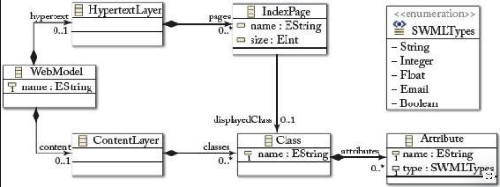

## 7.4 具体语法开发

#### ▶[上一节](3.md)

建模语言通常仅被视为图形化语言。然而，正如存在图形化编程语言一样，建模语言同样可以定义文本语法。<ins>因此，现有框架目前支持两种具体语法：*图形化具体语法（Graphical Concrete Syntaxes, GCS）* 和 *文本化具体语法（Textual Concrete Syntaxes, TCS）* </ins>。

如前所述，抽象语法开发过程由多项 OMG 标准提供支持。<ins>而针对具体语法定义，目前仅有一项 OMG 标准可供使用，即 Diagram Definition （DD）<sup>[14](0.md#14)</sup> ，该标准允许定义图形化具体语法</ins>。但在当前 UML 标准文档 [57](../bibliography.md#57) 中的 UML 元模型定义中，具体语法仅通过所谓的符号表（一列用于建模概念，一列用于其符号元素）及若干示例进行展示。UML 未提供更正式的具体语法定义。这与传统基于文本的语言工程方法形成鲜明对比，后者通常采用 EBNF 语法等形式化手段定义具体语法。

<ins>正式定义具体语法将开启运用复杂技术的大门，例如自动生成编辑器，从而实现对具体语法中构件的操作</ins>。拥有此类编辑器是模型在实践中高效应用的必要条件。若缺乏具体语法的形式化定义，其编辑器只能通过手工实现，这需要投入大量精力，导致构建 MDE 环境的成本居高不下。

值得庆幸的是，现已出现若干新兴框架，它们不仅提供专门语言来形式化描述建模语言的具体语法，还包含生成组件，能够生成用于在具体语法中可视化与操作模型的编辑器。

#### Fig 7.9
</br>
*Fig 7.9: 可视化符号表示法：引入建模概念的符号*

<ins>文本语言通过字符序列编码信息（如多数编程语言），而图形语言则利用图形（及文本）元素的空间布局编码信息 [51](../bibliography.md#51) 。因此文本表示是一维的，而多数图形语言支持二维表示</ins>。例如：在 UML 图中，每个模型元素都位于二维建模画布上。

<ins>无论具体语法如何设计，其定义是通过将元模型描述的建模概念映射至视觉表现形式 —— 换言之，可视化符号表示法 (visual notation) 为建模概念引入了符号</ins>（参见 [Fig 7.9](#fig-79) ）。<ins>本章使用 “可视化符号表示法” 一 词概括文本符号与图形符号</ins>。拥有建模概念的符号后，我们既可仅用文本，也可通过在图中排列图形元素来可视化模型。

下文将详细阐述为建模语言定义可视化符号表示法的不同方法，并演示如何为 sWML 开发 GCS 和 TCS。

### 7.4.1 图形化具体语法（GCS）
在深入探讨如何为元模型定义 GCS 之前，我们首先阐述 GCS 的构成要素。

#### 图形语言的构成要素

<ins>GCS 必须定义以下元素：</ins>
- <ins>*图形符号 (graphical symbols)* ，例如线条、区域、完整图形（如 SVG 图形），以及用于表示文本信息的标签，如可视化建模元素名称；</ins>
- <ins>*组合规则 (compositional rules)* ，用于定义这些图形符号的嵌套与组合方式，如可视化模型元素名称的标签需居中显示于代表该模型元素的矩形区域内；</ins>
- <ins>图形符号与抽象语法元素的 *映射 (mapping)* ，用于规定何种图形符号对应何种建模概念，如特定模型元素类型通过矩形可视化。</ins>

当前图形建模编辑器采用建模画布，支持在二维网格中定位模型元素。每个元素分配有 x,y 坐标，通常代表图形符号左上角的位置。模型元素主要以图 (graph) 的形式排列在建模画布中，该图称为图表 (diagram)，即模型的图形化视图。<ins>需注意并非所有模型信息都会实际显示在建模画布中，部分属性值仅在附加属性视图中可见且可编辑。此设计一方面允许访问和编辑模型元素的所有属性，另一方面避免因信息过载而影响图表的可读性。</ins>

<ins>[Fig 7.10](#fig-710) 展示了通用 GCS 元模型的局部片段。首先，该元模型规定图由节点 (node)、边 (edge)、隔间 (compartment) 和标签 (label) 四类元素构成。这些元素类型足以满足大多数建模语言需求。例如，节点与边是构成 *图 (graphs)* 的重要概念，分别通过形状 (shapes) 与线条表示。隔间通常以形状 (shapes) 表示，常用于嵌套元素，如图表是 *嵌套图 (nested graphs)* 。最后，标签用于为节点和边标注附加信息，如图表也是 *属性化图 (attributed graphs)* 。</ins>

<ins>为阐明建模概念与符号间的关联，我们建立了抽象语法与具体语法元素的映射关系</ins>。通常，抽象语法元素，如类、属性、关联，会被映射至具体语法元素 <sup>[15](-.md#15)</sup> 。对于图表本身，通常选取元模型的包含层次结构的根元素作为根节点，该节点可直接或间接容纳所有其他模型元素。其余元模型类通常映射为节点，关联则根据类型映射为：包含关联映射为隔间，非包含关联映射为边。属性映射为节点内部的标签，或位于节点/边附近的标签。某些情况下类也可映射为边。假设元模型中存在表示泛化关系的类。此时该类实例将以边的形式呈现，其类引用用于确定边的源节点与目标节点。

若重新审视 [Fig 7.7](3.md#fig-77)（第 [99](3.md#fig-77) 页）—— 该图展示了 sWML 具体语法中参考建模示例的抽象语法 —— 我们可发现建模概念与 sWML 符号间的映射关系。例如，我们立即看到 *link* 对象以边的形式呈现，而 *Page* 对象则作为节点显示，并根据类型附加特定图标。
#### Fig 7.10

*Fig 7.10: 通用 GCS 元模型*

#### GCS 开发方法论

在演示如何为 sWML开发 GCS 之前，我们先概述三种主要 GCS 开发方法。

- <ins>**映射为中心的 GCS** 。该类方法提供专用建模语言，来描述 GCS，以及从具体语法到抽象语法的映射。Graphical Modeling Framework（GMF）即采用此方法 <sup>[16](0.md#16)</sup> </ins>。语言工程师需定义：(i) `.gmfgraph` 模型，用于定义图形元素来可视化模型元素（参见 [Fig 7.10](#fig-710) 中的 *Figure* 类与 *DiagramElement* 类）； (ii) `.gmftool` 模型，用于指定工具面板 <sup>[17](0.md#17)</sup> ，特别是哪些图标对应生成哪些模型元素；最后，(iii) `.gmfmap` 模型，实际定义元模型中定义的元素与 `.gmfgraph` 模型中定义的图形元素之间的映射关系（参见 [Fig 7.10](#fig-710) 中的 *Mapping* 类）。生成器将这三类模型转换为代码，从而实现功能完整的图形化建模编辑器。<ins>需注意 GMF 也可视为具有代码生成组件的 DSML。因此，图形化建模编辑器的开发正是通过应用 MDE 技术实现的</ins>。

  此外，OMG Diagram Definition（DD）也采用此方法，利用 MOF 和 QVT 技术；最后，Sirius <sup>[18](0.md#18)</sup> 同样在抽象语法元素与具体语法元素之间建立映射关系。

- <ins>**标注为中心的 GCS** 。此类方法直接在元模型上标注 (annotate) 元素可视化方式的相关信息。该方法由 EuGENia 支持 <sup>[19](0.md#19)</sup> </ins>。 EuGENia 框架通过提供高级文本 DSML，使我们能够为基于 Ecore 的元模型标注 GCS 信息。这些标注信息由专用转换组件用于生成前述 GMF 模型。因此，EuGENia 本身采用模型驱动方法，通过复用 GMF 作为转换目标来生成图形化编辑器。EuGENia 提供的高级标注隐藏了 GMF 的复杂性，降低了创建基于 GMF 的编辑器初始版本的门槛。虽然 EuGENia 作为图形建模编辑器开发的启动器非常有用，但它的作用不仅限于此，还可一直应用到图形编辑器的最终完善版本。

- <ins>**API 为中心的 GCS** 。另有一种方法是通过专用编程框架，直接在代码层面实现图形建模编辑器。</ins>

  Graphiti 采用此方法 <sup>[20](0.md#20)</sup> ，为构建图形建模编辑器提供了强大的编程框架。语言工程师需扩展 Graphiti 提供的基类，来定义建模语言的具体语法。该框架特别提供了类集合：用于开发 *pictogram model*，描述可视化与具体语法元素层级（类似于 `.gmfgraph` 模型），以及开发 *link model*，用于建立抽象语法与具体语法元素映射关系（参见 GMF 的 `.gmfmap` 模型）。

  另一主角是 Graphical Editing Framework （GEF）<sup>[21](0.md#21)</sup>，它为图形编辑器提供底层功能支持。因此 GEF 被视为其他 GCS 的基础架构，而非直接实现图形建模编辑器的框架。尽管后者是可行的，但需投入更多开发。

  最后，GMF 还提供了强大的建模编辑器编程 API，但建议从 GMF 模型入手，仅在代码层面优化生成的编辑器。因此 GMF 被归类为映射中心的方法，尽管也可从零开始编程构建建模编辑器。

#### 用 EuGENia 为 sWML 定义 GCS

为向读者展示具体案例的 GCS 定义方法，我们采用 EuGENia 来开发 sWML 的 GCS。选择 EuGENia 是因为它能在适当抽象层级引入 GCS 方法。EuGENia 中可提供多种标注，用于为基于 Ecore 的元模型指定 GCS。下文将首先列举主要标注，随后将其应用于 sWML：

- *图表 (Diagram)* ：作为抽象语法表示模型的根元素，即（直接或间接）包含所有其他元素的元素，完美契合建模画布的表示需求。EuGENia 通过 `Diagram` 标注在元模型中标记该类。
- *节点 (Node)* ：元模型类的实例通常以节点形式呈现于图中。因此 EuGENia 允许使用 `Node` 标注标记类。该标注具备多项特性：可选定被标注类的属性作为节点标签，配置边框样式、颜色等布局信息，并支持使用外部图形（如 SVG 格式）或用 EuGENia 预定义图形（如矩形/椭圆）渲染节点。
- *链接 (Link)* ：`Link` 标注适用于类，以及应以边形式呈现于图中的非包含引用。该标注提供设置链接样式的属性，如是否为虚线，以及链接端装饰属性（如是否链接端应该以箭头形式可视化）。对于添加 `Link` 标注的类，其作为链接端点的源引用和目标引用，必须从该类可用的引用中选择。
- *隔间 (Compartment)* ：包含引用可用此标注标记。它定义该包含引用将创建一个隔间，用于容纳符合引用类型的模型元素。
- *标签 (Label)* ：属性可添加 `Label` 标注，表示这些属性将作为节点或链接名称的补充标签显示。

我们现在讨论 sWML 的 GCS 定义中的两个片段（参见 [Fig 7.11](#fig-711) 和 [Fig 7.12](#fig-712) ）。对元模型进行标注，如图上方所示，使我们能够将模型呈现为图下方所示的示意图。

第一个片段（参见 [Fig 7.11](#fig-711) ）包含三处标注。首处标注用于选定表示图的元素，因此 *WebModel* 类（sWML 的根元素）添加了 `Diagram` 标注。此外，该图需支持在画布内放置超文本层，故必须添加 `Compartment` 标注以实现对 *hypertext* 的包含引用。该标注表明可在图中添加超文本层。最后，超文本层应以矩形节点形式呈现，故为 *HypertextLayer* 类添加 `Node` 标注并设置 *figure* 属性。若未指定标签 (label)，建模元素默认采用类型名称作为标签。

第二个片段（参见 [Fig 7.12](#fig-712) ）规定 *Page* 类的实例应以矩形 <sup>[22](0.md#22)</sup> 呈现，其中 *Page* 名称作为矩形的标签显示。这是通过与 [Fig 7.11](#fig-711) 中 *HypertextLayer* 类类似的 `Node` 标注实现的。*Link* 类的实例应作为连接页面节点间的边进行可视化。因此，*Link* 类被标记为 `Link` 标注。为实现正确可视化需定义若干属性，例如链接的 *target* 应该使用哪个引用（默认链接源为其容器，本例适用此规则）以及链接的具体呈现形式。本例中，链接的目标端应以箭头形式呈现，以指示超链接的导航方向。请注意：若未定义特殊规则，GCS 对超类的定义同样适用于其子类（即 [Fig 7.12](#fig-712) 中也定义了上下文链接与非上下文链接的图形表示法）。

<center>带 EuGENia 标注的元模型</center>

#### Fig 7.11


*Fig 7.11: GCS 摘录 1：`Diagram`、`Compartment` 与 `Node` 标注*

<center>带 EuGENia 标注的元模型</center>

#### Fig 7.12


*Fig 7.12: GCS 摘录 2：`Node` 与 `Link` 标注*

### 7.4.2 文本具体语法（TCS）
在 MDE 的早期阶段，建模语言主要被视为图形化语言，这种观念深受 UML 前身的影响。<ins>然而，这种观点已发生根本性转变。首先，在用户习惯处理文本文档的领域，建模语言采用 TCS 的实用性已获得认可。其次，新兴的强大框架的出现，使得开发用户友好的文本编辑器来支持建模语言成为可能。</ins>

文本规范的基本假设是：构成文本的是一系列字符序列。当然，为定义有意义的规范，并非任意字符序列都代表有效规范。因此需要一种语法规则来规定所有有效的字符序列。正如后文将阐述的，从元模型中仅能推导出通用语法规则，该规则既能实现模型的文本化通用呈现，也能将文本解析为模型。然而在文本语言处理中，语法糖 (syntactic sugar) 具有重要价值，尤其是语言特有的关键词能显著提升文本规范的可读性。因此开发 TCS 时需要引入若干补充概念。

#### **文本语言的构成**

正如先前所见，图形语法由多种元素构成，例如各类几何图形。文本语言同样运用不同类型的元素，以下基于示例 sWML 进行说明。假设我们拥有会议模型的片段，如 [Fig 7.13](fig-713) 左侧所示。在超文本层中，我们有 `IndexPage` *TutorialList* ，其可视化呈现内容层中定义的 *Tutorial* 类的所有实例。 [Fig 7.13](fig-713) 右侧展示了该示例的文本可视化，其通过 TCS 呈现了与图形可视化完全相同的信息。

<ins>深入分析此示例，可识别出以下 TCS 元素类型，它们对所有 TCS 而言都具有核心重要性：</ins>
- <ins>*模型信息 (Model information)* ：显然，TCS 必须支持抽象语法中存储的模型信息。在本例中，我们需定义模型元素的 *name*，并对属性定义类型。这类似于图形化语言中通常使用标签来表示此类信息的方式。</ins>
- <ins>*关键字 (Keywords)* ：关键字是语言中特定含义的词 (word)，即代表特定语言构造。在本例中，关键字用于引入不同模型元素。表示关键字的术语属于保留字，不可用作模型元素的值</ins>。例如，若不使用特殊标记消除术语的关键字特性，则无法创建名为 *class* 的类。
- <ins>*作用域边界 (Scope borders)* ：在 GCS 中，图形定义模型元素的边界。而在 TCS 中，不使用图形，而是采用特殊符号，即所谓作用域边界 (scope borders) 来标记特定区段的起止点</ins>。本例中，编程语言中常见的大括号 ('{') 被用作作用域边界。在通过关键词引入元素后，需使用左大括号和右大括号定义该元素的分隔区块。因此，作用域边界对 TCS 中的嵌套元素也具有特殊重要性。
- <ins>*分隔符 (Separation characters)* ：在文本构造中，元素列表可能出现在特定位置。此时需使用特殊字符分隔列表条目</ins>。本例中，采用分号（';'）分隔类定义中引入的不同属性。
- <ins>*链接 (Links)* ：在 GCS 中，边用于连接通过非包含关系关联的元素。文本语言仅有一维空间定义元素，因此无法显式可视化非包含关系的链接。为指定链接，需为元素定义标识符，通过声明标识符值实现元素间的引用 —— 类似关系数据库中的外键概念</ins>。在本例中，页面需与内容层的某个类建立关联，因此该类必须提供标识符。类名的自然标识符是其名称，正如编程语言中将类名用作类型名称的做法。

#### Fig 7.13


*Fig 7.13: sWML 模型片段中的 GCS 与 TCS*

#### **TCS 开发方法论** 

除模型信息外，元模型不提供其他 TCS 元素类型的信息。若想要定义此类 TCS 特定性信息，<ins>当前 MDE 中存在两种方法：(i) 采用通用 TCS；(ii) 采用语言特定的 TCS。</ins>

- **通用 TCS** 

  <ins>例如对于 XML，也可以为模型定义一种通用 TCS。这意味着，类似于使用对象图以通用方式图形化呈现模型，可以应用一种适用于所有类型模型的通用文本语法。可将此文本语法视为指定对象图的文本格式。其优势在于元模型足以推导出 TCS，即无需额外制定具体语法规范。缺点则是无法针对特定建模语言的特性开发定制化语法</ins>。

  该方法已被用于定义 XMI 语法，用于将模型序列化为 XML 文档，以及 Human Usable Textual Notation（HUTN），二者均由 OMG 标准化。Epsilon HUTN 项目为 EMF 提供了 HUTN 标准的实现方案 <sup>[23](0.md#23)</sup>。第 [10](../ch10/0.md) 章将阐述模型如何被通用地序列化为 XML 文档。

- **语言特定性 TCS** 

  为消除通用 TCS 的局限性，提出了针对建模语言定义特定 TCS 的方法。从语言工程方法论角度，可区分两种路径：

  - <ins>*元模型优先法* 。开发建模语言语法时可采用元模型优先法，首先通过元模型定义抽象语法。其次，基于元模型定义文本语法</ins>。元模型优先方法基于元模型代表核心语言构件的假设（参见 [Fig 7.1](1.md#fig-71) ，第 [87](1.md#fig-71) 页），因此具体语法应建立在抽象语法之上。前述 GCS 方法也采用此方法。<ins>定义 TCS 时，可为每个元模型类定义文本生成规则，将模型元素转换为文本表示。生成规则由左侧（规则名称）和右侧（有效终结（terminal）符号与非终结符号序列）构成，本节后续将通过具体示例进行说明。</ins>

    Textual Concrete Syntax（TCS）项目遵循此方法 <sup>[24](0.md#24)</sup>，允许基于类似 EBNF 的文本生成规则定义文本语法，同时针对模型特性进行特定扩展，如模型的图形特质。TCS 既能将文本解析为模型，也能将模型美观地转换为文本。EMFText <sup>[25](0.md#25)</sup> 是为 EMF 模型使用元模型优先方法的另一代表。

  - <ins>*语法优先* 。此类方法与元模型优先方法目标一致，但采用不同实现路径。受 EBNF 启发，这类方法通过开发语法启动语言定义，可同时定义抽象语法和具体语法作为单一规范。语言的语法定义同样基于文本生成规则，与元模型优先方法一致。后续步骤中，通过专用元模型推导规则从语法自动推导出元模型。</ins>

    例如，Xtext <sup>[26](0.md#26)</sup> 最初采用此方法为 EMF <sup>[27](0.md#27)</sup> 开发基于 TCS 的语言。Monticore <sup>[28](0.md#28)</sup> 同样遵循语法优先方法，在 Eclipse 中开发文本 DSL，但该项目不基于 EMF 且采用自有模型格式。

<ins>归根结底，两种语言特定性 TCS 开发方法论最终产出相同成果：(i) 抽象语法元模型；(ii) 模型对应的TCS。因此，选择何种方法主要取决于开发者对不同方法的熟悉程度</ins>。通用 TCS 方法虽不适用于生成特定 TCS，但模型的文本序列化具备低成本优势。然而在实际场景中，处理 HUTN 展示的大型模型过于复杂。不过该方法可视为引导 (bootstrapping) 技术，用于从元模型推导初始语法版本，后续再通过人工扩展完善。例如，EMFText 可自动从 Ecore 元模型推导出基于 HUTN/Java 的 TCS。Xtext 同样支持从元模型生成默认 TCS，既能加速语法开发，又能简化元模型与语法间的同步。

#### **在 Xtext 中为 sWML 定义 TCS** 

<ins>我们选择 Xtext 来演示 TCS 的开发，是因为它在 Eclipse 中拥有成熟的工具支持。Xtext 提供了一种类似 EBNF 的语法定义语言，但具备额外特性，使其能达到与 Ecore 等元建模语言相媲美的表达能力</ins>。这一扩展至关重要，因为从语法规则中自动生成的元模型，应充分利用元建模语言的所有可能性，从而产出高质量的元模型。当建模语言具备元模型、语法规则、模型转文本序列化器及文本转模型解析器时，即可实现文本与模型间的无缝转换。因此，用 Xtext 定义的语言，能充分利用基于 EMF 模型提供的所有工具支持，如模型转换、代码生成等。

<ins>除基于文本的与基于模型的表示之间的互操作性外，从语法定义还能自动生成基于文本的编辑器</ins>。该生成的编辑器支持语法检查与高亮显示、代码补全，并提供良好定义的扩展点，可通过 Java 编程进一步增强编辑功能。上下文敏感约束采用一种名为 Check 的类似 OCL 的语言描述，该语言基于自动生成的元模型进行定义。

文本生成规则构成 Xtext 语法的核心，其中区分三类规则：

- *类型规则 (Type rules)* ：对应元模型中的类，用于定义建模概念。当从基于 Xtext 的语法规则生成元模型时，将生成元模型中对应的类，规则名称对应类名。类型规则包含：(i) *terminal* ，其表示语言的关键字、作用域边界和分隔符，以及 (ii) *non-terminal* ，其可进一步细分为：*assignment* ，其映射至属性或包含引用，以及 *cross references* ，其在语法生成元模型时被映射为非包含引用。简言之，non-terminal 体现了类型规则的特性。因此对每个 non-terminal，都会在相应元模型类中生成一个特征。对于赋值 (assignments) 定义，可通过多种运算符设置特征的多重性 (multiplicities)。
- *终结规则 (Terminal rules)* ：此类规则类似于 EBNF 规则，仅用于返回值，如字符序列。与 EBNF 规则不同，终结规则可指定返回类型，如 String 或 Integer。
- *枚举规则 (Enum rules)* ：这些规则用于定义值枚举，因此，在相应元模型中直接转换为 EEnum 类型。

下面，通过为 sWML 定义 TCS 片段（参见 [List 7.1](#list-71) ），演示 *类型规则* 、*终结规则* 和 *枚举规则* 的应用，该片段足以渲染 [Fig 7.13](#fig-713) 所示的示例模型。

#### List 7.1
```
grammar book.SWML with org.eclipse.xtext.common.Terminals
generate sWML "http://book.SWML"
import "http://www.eclipse.org/emf/2002/Ecore" as ecore
WebModel :
  'webapp' name=ID '{'
    hypertext=HypertextLayer
    content=ContentLayer
  '}' ;

HypertextLayer :
  'hypertext {'
    pages+=IndexPage+
  '}' ;

IndexPage :
  'index' name=ID 'shows' displayedClass=[Class] '[' resultsPerPage ']' '{' ... '}' ;

terminal resultsPerPage returns ecore::EInt :('10' | '20' | '30') ;

ContentLayer :
  'content {'
    classes+=Class+
  '}' ;

Class :
  'class' name=ID '{' attributes+=Attribute+ '}' ;

Attribute :
  'att' name=ID ':' type=SWMLTypes ';' ;

enum SWMLTypes :
  String | Integer | Float | Email | Boolean ;
```
*List 7.1：sWML 的 Xtext 语法片段*

当我们将结果语法与 [Fig 7.5](3.md#fig-75) 所示的 sWML 元模型进行比较时，可见用于定义建模概念 *name* 属性的赋值，被定义为 ID 而非 String。这对于在文本规范中实现交叉引用至关重要。例如，类型规则 *IndexPage* 就需要此类交叉引用，来定义对 *Class* 的引用（参见 *displayedClass=\[Class\]* ）。该赋值规则规定：在关键词 "shows" 之后，必须定义一个等同于类名的值。所有其他表示引用的赋值，均定义为包含引用，例如 *hypertext=Hypertext* 。此外，还为配置每页显示最大结果数量的值，定义了一个终结规则。这意味着在引用呈现类之后，每页可视化实例数量将用方括号括起。请注意该功能也可通过普通整数属性结合 OCL 约束实现，将值限制为 10、20 或 30。表示属性和交叉引用的赋值，均定义为单值赋值（没有为多重性使用额外的运算符），而表示包含关系的赋值，则全部定义为多值赋值（除 = 运算符外还使用了 + 运算符）。

[Fig 7.14](#fig-714) 展示了 [List 7.1](#list-71) 中的 Xtext 语法自动派生的元模型。请注意所有特征的下限多重性均自动设为零。此外，在自动派生过程中，Xtext 语法的 ID 属性被转换为元模型中的 String 属性，这与手工开发的 sWML 元模型相对应。最后，终结规则在派生的元模型中未被显式表示。

#### Fig 7.14


*Fig 7.14: 从 Xtext 语法自动派生的元模型*

#### ▶[下一节](5.md)
